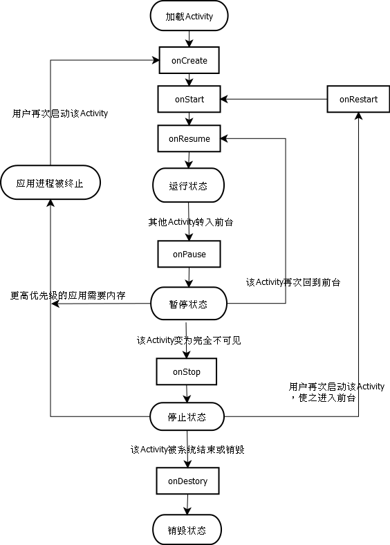

## Activity相关知识点介绍 ###
**Activity常用配置属性介绍：**
android:exported="true/false" ： 指定该Activity是否允许被其他应用调用。true表示可以被其他应用调用。设置了IntentFilter之后，exported就默认被设置为true了。
android:launchMode="singleTask" : 指定Activity的启动模式（加载模式），支持standard(默认)、singleTop、singleTask、singleInstance。

android:taskAffinity="taskname" ： 属性值为字符串，且中间必须含有包名分隔符“.”。
>与singleTask启动模式配合使用时，表示指定此Activity实例所在的Task栈。如果taskname的名字同包名，则相当于没有设置taskAffinity属性(因为启动Activity默认task名称就是包名)；如果taskname指定的Task栈不存在则会新创建一个Task栈；如果taskname指定的Task栈存在，则复用此Task栈。

>taskAffinity也可以跟singleInstance模式配合使用，用于指定该模式启动的Activity所在的Task栈的名字。

>另外taskAffinity属性还可以跟android:allowTaskReparenting属性配合使用。效果为：当应用A启动了应用B的某个Activity后，如果这个Activity的allowTaskReparenting属性为true，那么当应用B被启动后，此Activity会直接从应用A的Task栈转移到应用B的Task栈中。

`<intent-filter></intent-filter>` ： 指定该Activity可响应的Intent

----
**启动Activity的两种方法：**
startActivity(Intent intent)： 通过intent指定要启动的Activity。
startActivityForResult(Intent intent, int requestCode) ： 以指定的请求码启动Activity，requestCode用于标识请求来源。并且当前Activity将会获取到新启动Activity返回的结果(通过重写onActivityResult(int requestCode, int resultCode, Intent data)来获取)

**关闭Activity：**
finish()： 关闭当前Activity
finishActivity(int requestCode)： 结束以startActivityForResult方法启动的Activity。

----
**通过Intent + Bundle在Activity之间交换数据**
Intent作为Activity之间传递数据的媒介，数据则是封装到Bundle中。通过将Bundle绑定到Intent，实现Activity之间的数据交互。
在Activity中可以通过getIntent方法获取启动时传入的intent对象，从而可以获取intent中携带的数据。

Intent提供大量put、get方法存取数据，这些方法都是通过将数据保存到Intent中Bundle类型的mExtras变量中实现的。

	putExtra(String name, Xxx value) ： Xxx可以表示基本数据类型、String、Parcelable等类型
	putExtra(String name, Xxx[] value)
	putExtra(String name, Bundle value)
	putExtra(String name, Serializable value)
	putExtras(Bundle extras)
	putStringArrayListExtra(String name, ArrayList<String> value)
	putIntegerArrayListExtra(String name, ArrayList<Integer> value)
	
	getXxxExtra(String name, Xxx defaultValue) ： Parcelable类型没有默认值参数
	getXxxArrayExtra(String name)
	getBundleExtra(String name)
	getStringArrayListExtra(String name)
	getIntegerArrayListExtra(String name)

**startActivityForResult启动其他Activity并返回结果**
之所以存在startActivityForResult这个方法，从其他Activity中返回数据到当前Activity。是因为存在如下情形：用户在当前界面需要从某个列表中获取数据，而这个列表比较复杂，不适合在当前界面显示，于是可以另外启动一个界面用户显示列表，但是在这个列表界面选择的数据是需要交给之前用户所在的界面处理的，所以提供了startActivityForResult方法实现启动其他界面获取数据并返回数据到当前界面的功能。其他界面返回数据通过setResult方法实现。而当前界面是不知道其他界面什么时候返回数据的，所以就需要一个监听回调方法来捕获数据：onActivityResult。

`startActivityForResult(Intent intent, int requestCode)`： 参数intent用于指定启动哪个activity，requestCode传给onActivityResult，用于区分当前Activity是启动的哪个Activity。因为当前Activity可能会多次调startActivityForResult启动不同的界面，所以这个requestCode就用于区分每次启动其他界面的请求，从而在onActivityResult中判断是哪个界面返回了数据。
`setResult(int resultCode, Intent data)`： 通过startActivityForResult被启动的其他Activity通过setResult方法返回数据。参数resultCode传给onActivityResult做形参，用于确定匹配resultCode的这次onActivityResult方法的回调，就是携带了返回结果数据的回调。
data中保存了返回的结果数据。data参数在其他Activity中一般可通过getIntent方法，直接取用startActivityForResult传过来的intent对象表示，向此intent中存入结果数据。
`setResult(int resultCode)` ： 当不需要返回结果数据时，可用此方法。
`onActivityResult(int requestCode, int resultCode, Intent data)` ： 当通过startActivityForResult方法启动的其他界面退出时，会回调此方法。requestCode用于判断是哪个界面返回了数据；resultCode用于判断此次方法回调是否携带了返回结果。data用于携带返回结果。

----
## Activity的生命周期

##### 一、 正常情况下Activity会经历的生命周期

onCreate
- 表示Activity正在被创建，这是生命周期的第一个方法。在这个方法中可以做一些初始化工作，比如调setContentView加载界面布局资源，初始化Activity所需数据等。

onRestart
- 表示Activity正在重新启动。一般情况下，当Activity从不可见变为可见状态时，onRestart会被调用。这种情况一般是用户行为导致的，如按Home键切换到桌面或打开一个新的Activity，那么这个当前Activity就会被停止，即执行了onPause和onStop方法，之后如果再次回到这个Activity，那么onRestart方法就会被调用。

onStart
- 表示Activity正在被启动，此时Activity已经可见，但没有出现在前台，无法和用户交互。

onResume
- 表示Activity已经可见，并出现在前台，能和用户进行交互。

onPause
- 表示Activity即将暂停，退出前台，不能和用户进行交互，但还处于可见状态。正常情况下，紧接着onStop就会被调用。此时可以做一些存储数据、停止动画等工作，**但不能太耗时，因为这会影响到Activity的显示，onPause必须先执行完，新Activity的onResume才会被执行。** Android官方文档对onPause的解释有这么一句：不能在onPause中做重量级的操作，因为必须onPause执行完成后，新Activity才能Resume。虽然onStop中也不能进行太耗时的操作，但由于onPause还会影响新Activity的状态，所以与onPause相比，尽量在onStop中做那些较耗时的操作。

onStop
- 表示Activity即将停止，处于不可见状态。可以在此做一些稍微重量级的回收工作，但同样不能太耗时。

onDestory
- 表示Activity即将被销毁，这是Activity生命周期最后的一个回调。在这里，可以做一些回收工作和最终的资源释放。

几种具体情况下Activity生命周期方法的回调
1. 针对一个特定的Activity，第一次启动，回调如下：onCreate -> onStart -> onResume
2. 在当前Activity界面下，用户打开一个新的Activity或者切换回桌面时，当前Activity的回调如下： onPause -> onStop。此时，存在一种特殊情况，如果新的Activity采用了透明主题，或者此Activity非全屏时，那么当前Activity不会回调onStop
3. 当用户再次回到原Activity时，回调如下： onRestart -> onStart -> onResume
4. 当用户按back按键回退时，回调如下： onPause -> onStop -> onDestory

##### 二、 异常情况下Activity的生命周期分析

**1. 资源相关的系统配置发生改变导致Activity被杀死并重新创建**
当应用程序启动时，系统会根据当前设备的情况去res目录下匹配相应设备的资源文件夹中加载合适的Resource资源。比如横屏手机和竖屏手机会拿到两张不同的图片（设定了landscape或portrait状态下的图片）。
如果当前Activity处于竖屏状态，此时旋转屏幕，由于系统配置发生了改变，默认情况下，Activity会被销毁并且重新创建（可以给Activity指定configChanges属性，阻止系统重新创建Activity）。Activity被销毁并且重新创建的生命周期如上图所示。

- 当系统配置发生改变，Activity被销毁，回调onPause -> onStop -> onDestory方法。
- 同时系统调用onSaveInstanceState来保存当前Activity的状态。onSaveInstanceState方法在onStop之前调用，与onPause无时序关系。
- onSaveInstanceState方法只会出现在Activity被异常终止的情况下，正常情况下系统不会回调这个方法。另外系统只会在Activity即将被销毁并且有机会重新显示的情况下才会去调用onSaveInstanceState方法。
- 当Activity被重新创建后，系统会调用onRestoreInstanceState方法，并把Activity销毁时通过onSaveInstanceState方法保存的Bundle对象作为参数同时传递给onRestoreInstanceState和onCreate方法。
- onRestoreInstanceState的调用时机在onStart之后。
- onRestoreInstanceState一旦被调用，其参数Bundle savedInstanceState一定是有值的。但是对于onCreate，如果是正常启动的情况，其 参数Bundle savedInstanceState为null。

在onSaveInstanceState和onRestoreInstanceState方法中，系统自动为我们做了一些恢复工作。比如当Activity在异常情况下需要重新创建时，系统会默认保存当前Activity的视图结构，并在Activity重启后恢复这些View相关的数据。如文本框中用户输入的数据，ListView滚动的位置等。

每个View也都有onSaveInstanceState和onRestoreInstanceState方法，查看它们的具体实现，就能知道系统会自动为每个View恢复哪些数据。

关于保存和恢复View层次结构，系统的工作流程：
- 首先Activity被意外终止时，Activity会调用onSaveInstanceState保存数据，然后Activity会委托Window去保存数据，接着Window再委托它上面的顶级容器去保存数据。顶层容器是一个ViewGroup，一般来说它很可能是DecorView。最后顶层容器再去一一通知它的子元素来保存数据。

上述流程是一种典型的委托思想，上层委托下层，父容器委托子元素去处理事件。这种思想在Android中有很多应用，如View的绘制过程，事件分发等。

**2. 资源内存不足导致低优先级的Activity被杀死**
Activity按照优先级从高到低，可以分为三种：
- 前台Activity —— 正在和用户交互的Activity，优先级最高。
- 可见但非前台Activity —— 比如Activity中弹出一个对话框，导致Activity可见，但是位于后台无法和用户直接交互。
- 后台Activity —— 已经被暂停的Activity，比如执行了onStop，优先级最低。

当系统内存不足时，系统会按照上述优先级去杀死目标Activity所在的进程，并在后续通过onSaveInstanceState和onRestoreInstanceState来存储和恢复数据。

如果一个进程中没有四大组件在执行，那么这个进程将很快被系统杀死。因此，一些后台工作不适合脱离四大组件而独立运行在后台中。比较好的方法是将后台工作放到Service中，从而保证进程有一定的优先级，这样就不会轻易被系统杀死。

**3. 通过configChanges属性，阻止系统重新创建Activity**
当系统配置发生改变时，Activity会被重新创建。如果不想Activity因为某项系统配置改变而重新创建，可以通过给Activity指定configChanges属性实现。

| 属性值项目 | 含义 |
|--|--|
| mcc | mcc代码发生了改变。（mcc是指SIM卡唯一标识IMSI中的国家代码，中国为460）|
| mnc | mnc代码发生改变。（mnc是指SIM唯一标识IMSI中的运营商代码，移动TD为00，联通01，电信03） |
| locale | 设备的本地位置发生了改变，一般指切换了系统语言 |
| keyboard | 键盘类型发生了改变，比如用户使用了外插键盘 |
| keyboardHidden | 键盘的可访问性发生了改变，比如用户调出了键盘 |
| screenLayout | 屏幕布局发生了改变，很可能是用户激活了另外一个显示设备 |
| fontScale | 系统字体缩放比例发生了改变，比如用户选择了一个新字号 |
| uiMode | 用户界面模式发生了改变，比如是否开启了夜间模式（API8新添加） |
| orientation | 屏幕方向发生了改变，比如旋转了手机屏幕 |
| screenSize | 屏幕尺寸信息发生了改变。当旋转屏幕时，屏幕尺寸会发生改变。当编译选项中的minSdkVersion和targetSdkVerison均低于13时，此选项不会导致Activity重启，否则会导致Activity重启（API13新添加） |
| smallestScreenSize | 设备物理屏幕尺寸发生了改变。此项目和屏幕方向无关，仅仅表示在实际的物理屏幕尺寸改变时发生，比如用户切换了外部的显示设备。当minSdkVersion和targetSDKVersion均低于13时不会导致Activity重启，否则会。（API 13新添加） |

上表是configChanges属性的部分属性值及其含义。如果没有在Activity的configChanges属性中指定某个配置项目时，那么当该配置项目发生改变后就会导致Activity销毁并重新创建，执行onSaveInstanceState和onRestoreInstanceState方法。如果在configChanges属性中指定了某个配置项目，则当该配置项目发生改变时，会另外调用Activity的onConfigurationChanged方法，并且Activity也不会被销毁并重新创建。

configChanges属性在AndroidManifest.xml中为Activity指定。如`android：configChanges="orientation|screenSize"`。使用"|"可以同时指定多个值。

----
## Activity的四种启动模式(加载模式)
- Android采用Task来管理多个Activity，可以把Task理解成Activity栈，Task以栈的形式（Task栈，又称任务栈）来管理Activity。一个Task栈中可以添加多个Activity。Task栈可以分为前台Task栈、后台Task栈。后台Task栈中的Activity处于停止状态，用户可以通过切换将后台Task栈再次调到前台（比如启动一个后台Task栈中的Activity实例）。
- 开发者可以通过调Activity的getTaskId()方法来获取该Activity所在的Task栈的ID号。
- 当我们启动一个应用时，Android就会为应用创建一个Task(以该应用的包名命名)，启动应用的Activity后，该Activity默认情况下就是被放进此应用中以包名命名的Task栈中(还可以为Activity指定要放入的栈)。在Task栈中，先启动的Activity实例被放在栈底，后启动的Activity被放在Task栈顶(后进先出的栈结构)。
- Activity的启动模式就是用来管理实例化、加载Activity的方式，控制Activity与Task之间的加载关系。

**一、 standard模式（标准模式）**
- 通过这种模式启动Activity时，Android总会为Activity创建一个新的实例，并将该Activity实例添加到当前栈中。这种模式不会创建新的Task栈，谁启动了这个Activity，那么这个Activity实例就放在启动它的那个Activity所在的Task栈中。(如果是在Service或Broadcast中启动Activity，因为Service、Broadcast是非Activity类型的Context，没有用于管理Activity的Task栈，所以在启动Activity时，需要通过Intent为Activity设置Flag标记为FLAG_ACTIVITY_NEW_TASK，告诉系统新创建一个Task栈用于存放在Service或Broadcast中启动的Activity)
- AndroidMenifest.xml配置Activity没有指定android:launchMode时，默认采用standard模式。
- 由standard模式的特性可知，多次采用该模式启动同一个Activity，在当前应用的Task栈中会存在多个Activity的实例。

**二、 singleTop模式（栈顶复用模式）**
- 当将要启动的Activity已经位于Task栈顶时，系统不会重新创建Activity实例，而是直接复用已有的Activity实例。此时，所复用的Activity实例的onNewIntent方法会被回调，通过此方法可以取出当前请求的数据信息。需要指出的是，这个被复用的Activity实例的onCreate、onStart方法并不会被再次调用到，因为它并没有发生改变。
- 如果将要启动的Activity没有位于栈顶，此时系统会重新创建Activity实例，并将它加载到Task栈顶。

**三、 singleTask模式（栈内复用模式）**
- 采用这种加载模式的Activity，在同一个Task栈内只有一个实例，当系统采用singleTask模式启动Activity时，在启动该Activity所需的Task栈存在的条件下，有如下三种情况：
	1. 将要启动的Activity在Task栈内不存在实例时，系统将会创建Activity实例，并将它放入Task栈顶。
	2. 将要启动的Activity在Task栈内已经存在Activity实例，并且位于栈顶，则系统会复用此实例，并调用它的onNewIntent方法。
	3. 将要启动的Activity在Task栈内已经存在Activity实例，但是不在栈顶，则系统会把在Task栈内位于该Activity实例上面的所有Activity实例全部移出Task栈，从而使该目标Activity实例转到栈顶，并调用它的onNewIntent方法。

- 上面说的Activity所需的Task栈，默认情况下是以应用包名命名的Task栈。如果配置Activity时指定了android:taskAffinity属性，并赋值为不同于包名的其他名称taskname，则当该taskname表示的Task栈不存在时，系统会先创建一个名为taskname的Task栈，然后再把activity实例添加到栈顶。
- 当Activity所需的Task栈存在时，但是此Task栈是一个后台Task栈，那么启动这个Activity时，会先把它所需的Task栈调到前台，然后再根据上述的三种情况将该Activity添加到此Task栈中。

**四、 singleInstance模式（单实例模式）**
- 在这种启动模式下，系统保证无论从哪个Task启动目标Activity，只会创建一个目标Activity实例，并且会用一个全新的Task栈来加载该Activity实例（如果没有使用taskAffinity配置Task栈名，则此Task栈名同包名，但是taskID是不同的，所以跟同包名的原Task栈不是同一个）。
- 需要指出的是，如果某个Task栈包含一个以singleInstance模式启动的Activity实例，那么这个Task栈一定是只存在这么一个Activity实例，所以该Activity实例总是位于Task栈顶。
- 当系统采用singleInstance模式启动Activity时，有如下两种情况：
	1. 如果将要启动的Activity在目前已有的Task栈中不存在，那么系统会先创建一个新的Task栈，然后再创建Activity实例，并将该Activity实例加入新的Task栈中。（这个Task栈将只包含该Activity实例）
	2. 如果将要启动的Activity已有一个Activity实例存在于某个Task栈中，那么无论这个已存在的Activity实例是在哪个应用中启动的，也不管这个Activity实例在哪个Task栈中，系统都会把该Activity所在的Task栈转到前台，从而使该Activity实例显示出来。

## Activity的Flag介绍 ###
1. FLAG_ACTIVITY_NEW_TASK
	- 在新的task中启动activity。如果此新task已存在，并且要启动的activity已经运行于此task中,则此task将调入前台,最后保存的状态也将恢复,activity将在onNewIntent()中接收到这个新intent。这个过程与"singleTask"launchMode模式值相同,只不过singleTask启动模式另外还具有FLAG_ACTIVITY_CLEAR_TOP的效果。
	- 上述中的新task，如果没有给activity指定taskAffinity属性，则新task就是指应用中默认的以包名命名的task。如果指定了不同于包名的taskAffinity属性值，则新task就是以taskAffinity属性值命名的task。

2. FLAG_ACTIVITY_CLEAR_TOP
具有此标记位的Activity，当它启动时，如果task栈中已存在此Activity实例，那么在task中，所有位于此Activity实例上面的Activity都要出栈。
	- singleTask启动模式默认具有此标记位效果。
	- 如果被启动的Activity是standard模式之外的其他三种模式，或者Activity设置了FLAG_ACTIVITY_SINGLE_TOP标记位，那么当被启动的Activity实例在task中已存在，则系统不会创建新的Activity实例，而是调用已存在Activity实例的onNewIntent方法。
	- 如果被启动的Activity是standard模式启动，那么连同task中已存在的Activity实例以及之上的其他Activity都要出栈，系统会创建新的Activity实例并放入栈顶。

3. FLAG_ACTIVITY_SINGLE_TOP
当task中存在目标Activity实例并且位于栈的顶端时，不再创建一个新的，直接利用这个实例。与Activity启动模式中的singleTop效果相同。

4. FLAG_ACTIVITY_EXCLUDE_FROM_RECENTS
具有这个标记的Activity不会出现在历史Activity列表中，当某些情况下我们不希望用户通过历史列表回到我们的Activity时，这个标记比较有用。它等同于在XML中指定Activity的属性android:excludeFromRecents="true"

5. FLAG_ACTIVITY_CLEAR_WHEN_TASK_RESET
如果一个Intent中包含此属性，则它转向的那个Activity以及在那个Activity其上的所有Activity都会在task重置时被清除出task（前提：FLAG_ACTIVITY_RESET_TASK_IF_NEEDED）。当我们将一个后台的task重新回到前台时，系统会在特定情况下为这个动作附带一个FLAG_ACTIVITY_RESET_TASK_IF_NEEDED标记，意味着必要时重置task，这时FLAG_ACTIVITY_CLEAR_WHEN_TASK_RESET就会生效。
这个标记对于应用存在分割点的情况会非常有用。比如我们在应用主界面要选择一个图片，然后我们启动了图片浏览界面，但是把这个应用从后台恢复到前台时，为了避免让用户感到困惑，我们希望用户仍然看到主界面，而不是图片浏览界面，这个时候我们就要在转到图片浏览界面时的Intent中加入此标记。

6. FLAG_ACTIVITY_RESET_TASK_IF_NEEDED

----
## IntentFilter的匹配规则 ###

#### 启动Activity的两种方式 ####
1. 显示调用： 需要明确指定被启动对象的组件信息，包括包名和类名
2. 隐式调用：需要Intent能够匹配目标组件的IntentFilter中设置的过滤信息。如果不匹配则无法启动目标Activity。

- 原则上一个Intent不应该既是显示调用又是隐式调用，如果二者共存的话，以显示调用为主。

#### 匹配IntentFilter中的过滤信息 ####
- 一个Activity可以有多个intent-filter过滤列表，一个Intent只要能匹配任何一组intent-filter即可成功启动对应的Activity。
- IntentFilter中的过滤信息有action、category、data三种。
- 一个过滤列表中的action、category和data可以有一个或多个，其中data可以不定义。要想Action接收到隐式Intent，则action至少定义一个，category也至少定义一个，并且此category必须定义为"android.intent.category.DEFAULT"。因为系统在调用startActivity或startActivityForResult时会默认为Intent加上DEFAULT的category，根据category的匹配规则，为了让activity能够接收隐式调用，就必须在intent-filter过滤列表中指定DEFAULT的category。

#### action的匹配规则 ####
- action是一个字符串，区分大小写。
- 系统预定义了一些action可以使用，如`Intent.ACTION_MAIN="android.intent.action.MAIN"`， `Intent.ACTION_VIEW="android.intent.action.VIEW"`。另外我们也可以自己定义action。
- action的匹配规则要求Intent中的action存在且必须和过滤规则中的其中一个action匹配。匹配是指Intent中的action和Activity的某个intent-filter过滤列表中的某个action的字符串值完全一样。

#### category的匹配规则 ####
- category是一个字符串。系统预定义了一些category，如`Intent.CATEGORY_LAUNCHER="android.intent.category.LAUNCHER"`,`Intent.CATEGORY_DEFAULT = "android.intent.category.DEFAULT"`。 另外我们也可以自定义category。
- category的匹配规则要求我们可以不给Intent设置category，不过一旦我们设置了category，不管设置了几个，每个都要能和过滤规则中的任意一个category相同。
- 即使我们不在Intent中设置category，Intent中也至少会有一个DEFAULT的category。因为系统在调用startActivity或startActivityForResult时会默认为Intent加上DEFAULT的category。所以为了让activity能够接收隐式调用，就必须在intent-filter过滤列表中指定DEFAULT的category，否则Intent中DEFAULT的category就会匹配失败。

#### data的匹配规则 ####
过滤规则中data的定义：

	<data android:scheme="string"
        android:host="string"
        android:port="string"
        android:path="string"
        android:pathPattern="string"
        android:pathPrefix="string"
        android:mimeType="string"/>

data由两部分组成：mimeType和URI
1. URI的结构：`<scheme>://<host>:<port>/[<path>|<pathPrefix>|<pathPattern>]`,其中
	- scheme： URI的模式，如http、file、content等。如果URI中没有指定scheme,则URI无效。
	- host： URI的主机名。如果host没指定，则URI无效。
	- port： URI中的端口号。仅当URI中指定了scheme和host时，port参数才有意义。
	- path： 表示完整的路径信息
	- pathPattern： 包含通配符 `*` 的完整路径信息。`*` 表示0个或多个任意字符。
	- pathPrefix： 表示路径的前缀信息。

2. mimeType指媒体类型，如image/jpeg、text/plain、video/*等，可以表示图片、文本、音视频等媒体格式。

data的匹配规则
- 过滤规则中可以不指定data，此时Intent不需要设置data；如果过滤规则中定义了data，那么Intent必须设置匹配的data。
- 在过滤规则中定义data时，可以不指定URI，此时默认为content和file。所以Intent中URI部分的scheme必须设置为content或file才能匹配成功。
- 对Intent，可以调setType设置mimeType，调setData设置URI，但setType会把URI置位null，setData会把mimeType置位null。所以为Intent指定完整的data时，必须调setDataAndType方法。

----

IntentFilter的匹配规则对于Service和BroadcastReceiver也是同样的道理。系统对于Service的建议是尽量使用显示调用的方式来启动服务。

可以通过PackageManager提供的resolveActivity或Intent的resolveActivity判断是否存在Activity能够匹配隐式Intent。如果不存在匹配的Activity，则resolveActivity返回null。
- PackageManager另外还提供了queryIntentActivities用于返回所有成功匹配的Activity信息。resolveActivity返回的最佳匹配的Activity信息。
- 在调PackageManager的resolveActivity或queryIntentActivities方法时，给形参flags设置PackageManager.MATCH_DEFAULT_ONLY可以过滤掉在intent-filter过滤列表中没有定义DEFAULT这个category的Activity，避免匹配失败。因为过滤规则中不含DEFAULT这个category的Activity是无法接受隐式Intent的。

	

