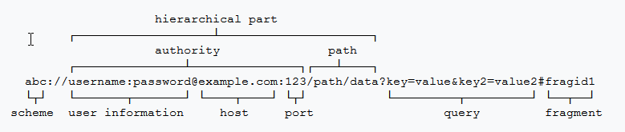

## ContentProvider简介 ##
通常，Android中的应用程序都各自运行在一个独立的进程中，每个进程都有自己独立的内存空间，所以进程之间
不能直接进行数据交换。
当我们需要在两个不同的应用程序之间进行数据交换时（如获取联系人应用中的联系人号码等数据），那么就可以
考虑使用Android提供的ContentProvider进行不同应用间的数据交换。

ContentProvider是一个抽象类，使用ContentProvider时，应该自定义一个类继承自ContentProvider，并
重写ContentProvider提供的如下方法：

	public abstract boolean onCreate();
		//当其他应用通过ContentResolver第一次访问该ContentProvider时，onCreate()方法将会被回调，	并且onCreate()方法只会被调用一次。
		//可以重写onCreate方法，创建SQLiteOpenHelper实例。

	public abstract @Nullable Cursor query(@NonNull Uri uri, 
			@Nullable String[] projection,
            @Nullable String selection, @Nullable String[] selectionArgs,
            @Nullable String sortOrder);

	public abstract @Nullable String getType(@NonNull Uri uri);
		//返回MIME类型，没有则返回null。
			如果该Uri对应的数据可能包括多条记录，那么MIME类型字符串应该以 vnd.android.cursor.dir/
			开头；如果该Uri对应的数据只包含一条记录，那么MIME类型字符串应该以
			vnd.android.cursor.item/开头

	public abstract @Nullable Uri insert(@NonNull Uri uri, 
			@Nullable ContentValues values);
		//返回新插入的记录的Uri

	public abstract int delete(@NonNull Uri uri, @Nullable String selection,
            @Nullable String[] selectionArgs);
		//返回被删除的记录条数

	public abstract int update(@NonNull Uri uri, @Nullable ContentValues values,
            @Nullable String selection, @Nullable String[] selectionArgs);
		//返回被更新的记录条数

	public void shutdown() {
        Log.w(TAG, "implement ContentProvider shutdown() to make sure all database " +
                "connections are gracefully shutdown");
    }

query方法表示从ContentProvider查询数据
inset方法表示向ContentProvider插入数据
delete表示删除ContentProvider中指定的数据
update表示更新ContentProvider中指定的数据

通常ContentProvider需要和ContentResolver结合使用，一个应用程序使用ContentProvider暴露自己的数据，
而另一个应用程序则通过ContentResolver来访问数据。

ContentProvider所操作的数据可以来自于SQLite数据库，也可以来自于文件，XML或网络等其他存储方式中的。

## 创建 ContentProvider ##
创建一个ContentProvider的步骤如下：
step1.  自定义类，继承自ContentProvider抽象类。

	public class MyContentProvider extends ContentProvider {
		...
	}

step2. 在AndroidManifest.xml中注册自定义的ContentProvider子类

	<application
        android:allowBackup="true"
        android:icon="@drawable/ic_launcher"
        android:label="@string/app_name" >

		<!-- 注册一个ContentProvider -->
		<provider
			android:exported="true"
			android:name=".MyContentProvider"
			android:authorities="org.crazyit.providers.firstprovider">
		</provider>

	</application>

其中属性android:exported="true"表示该ContentProvider允许其他应用访问，false则不允许。
属性android:authorities用于指定访问该ContentProvider子类所使用的Uri的authority部分。
（URI的scheme部分在ContentProvider中默认为content://，path部分随访问的数据不同而不同）

**ContentProvider的生命周期方法 onCreate**
ContentProvider不像Activity存在复杂的生命周期，ContentProvider只有一个onCreate()生命周期方法。
当其他应用通过ContentResolver第一次访问该ContentProvider时，onCreate()方法将会被回调，并且
onCreate()方法只会被调用一次。

ContentProvider提供的query、insert、update、delete方法则由其他应用通过ContentResolver调用

## URI ##

如上是Uri的一般格式。
ContentProvider的Uri格式举例如下：
	
	content://authority/path/id
由scheme、authority、path三部分组成（id当作是path部分中的内容）。
其中ContentProvider的scheme部分固定是content:// ； authority部分在AndroidMinfest.xml中注册
时通过属性android:authorities指定，path部分在访问具体的资源数据时指定。

访问的数据不同时，Uri的path部分表示的意思也所有不同，举例如下：
	
	.../words  

	.../word/2

	.../word/2/word

	.../word/detail 

Android提供了一个Uri工具类用于实现将一个字符串转成Uri对象，获取一份File文件的Uri地址，获取Uri中的
组成部分等操作：

	public static Uri parse(String uriString)

	public static Uri fromFile(File file)

	public abstract String getScheme();

	public abstract String getAuthority();

	public abstract String getPath();

## 使用 UriMatcher 管理ContentProvider的Uri ##
通过ContentResolver来访问某个ContentProvider对外提供的数据时，需要通过一个Uri来标识这个被
访问的ContentProvider。
所以在创建ContentProvider时，需要定义好此ContentProvider所能匹配的Uri。

Android提供UriMatcher类来管理ContentProvider中定义的Uri。UriMatcher相关方法如下：

	public static final int NO_MATCH = -1;

	public UriMatcher(int code) //参数code设为UriMatcher.NO_MATCH即可

	public void addURI(String authority, String path, int code) 
		//authority和path组合成一个Uri（这个Uri的scheme固定是content://）。参数code是这个
			被组合成的Uri的唯一标识。Uri不同，code值的定义也要不同，但code值必须大于0

	public int match(Uri uri)
		//将参数Uri和在UriMatcher中添加了的Uri进行匹配，如果匹配成功，则返回添加此Uri时设置的
			code标识码，如果匹配失败，则返回-1。

**ContentProvider 中定义Uri的标准方式**

	//Words.java  Word类定义了ContentProvider的Uri中的authority部分，
	
	//Words.Word  此内部类继承了BaseColumns，用于声明此ContentProvider可操作的数据表中的字段名，
					并且将声明的authority和不同的字段名，组合成不同的Uri用于访问不同的数据。

	import android.net.Uri;
	import android.provider.BaseColumns;
	public final class Words {

		// 定义该ContentProvider的Authorities
		public static final String AUTHORITY = "org.crazyit.providers.dictprovider";

		// 定义一个静态内部类，定义该ContentProvider所包含的数据列的列名
		public static final class Word implements BaseColumns {

			// 定义Content所允许操作的三个数据列
			public final static String _ID = "_id";
			public final static String WORD = "word";
			public final static String DETAIL = "detail";

			// 定义该Content提供服务的两个Uri
			public final static Uri DICT_CONTENT_URI = Uri
				.parse("content://" + AUTHORITY + "/words");

			public final static Uri WORD_CONTENT_URI = Uri
				.parse("content://"	+ AUTHORITY + "/word");
		}
	}

	--------------------------------
	//MyContentProvider.java
	public class MyContentProvider extends ContentProvider {
		
		private static UriMatcher matcher = new UriMatcher(UriMatcher.NO_MATCH);
		private static final int WORDS = 1;
		private static final int WORD = 2;

		static {
			// 为UriMatcher注册两个Uri
			matcher.addURI(Words.AUTHORITY, "words", WORDS);
			matcher.addURI(Words.AUTHORITY, "word/#", WORD);
		}

		private MyDatabaseHelper dbOpenHelper;

		@Override
		public boolean onCreate() {
			dbOpenHelper = new MyDatabaseHelper(this.getContext(), "myDict.db3", 1);
			return true;
		}

		@Override
		public String getType(Uri uri) {

			switch (matcher.match(uri)) {
				// 如果操作的数据是多项记录
				case WORDS:
					return "vnd.android.cursor.dir/org.crazyit.dict";
				// 如果操作的数据是单项记录
				case WORD:
					return "vnd.android.cursor.item/org.crazyit.dict";
				default:
					throw new IllegalArgumentException("未知Uri:" + uri);
			}
		}
		
		@Override
		public Uri insert(Uri uri, ContentValues values) {
			SQLiteDatabase db = dbOpenHelper.getReadableDatabase();
			switch (matcher.match(uri)) {
				case WORDS:
					// 插入数据，返回插入记录的ID，此ID标记插入记录的行号
					long rowId = db.insert("dict", Words.Word._ID, values);

					// 如果插入成功返回uri
					if (rowId > 0) {

						// 在已有的 Uri的后面追加ID
						Uri wordUri = ContentUris.withAppendedId(uri, rowId);

						// 通知数据已经改变
						getContext().getContentResolver().notifyChange(wordUri, null);

						return wordUri;
					}
					break;
				default :
					throw new IllegalArgumentException("未知Uri:" + uri);
			}
			return null;
		}

		@Override
		public int update(Uri uri, ContentValues values, 
			String where, String[] whereArgs) {

			SQLiteDatabase db = dbOpenHelper.getWritableDatabase();

			// 记录所修改的记录数
			int num = 0;

			switch (matcher.match(uri)) {
				// 如果Uri参数代表操作全部数据项
				case WORDS:
					num = db.update("dict", values, where, whereArgs);
					break;
				// 如果Uri参数代表操作指定数据项
				case WORD:
					// 解析出想修改的记录ID
					long id = ContentUris.parseId(uri);

					String whereClause = Words.Word._ID + "=" + id;

					// 如果原来的where子句存在，拼接where子句
					if (where != null && !where.equals("")) {
						whereClause = whereClause + " and " + where;
					}
					num = db.update("dict", values, whereClause, whereArgs);
					break;
				default:
					throw new IllegalArgumentException("未知Uri:" + uri);
			}
			// 通知数据已经改变
			getContext().getContentResolver().notifyChange(uri, null);
			return num;
		}
	} 

上面定义的Words类通常会暴露给其他应用，用于公开ContentProvider的Uri、数据表的字段名等信息。

**使用 ContentUris 解析 Uri**

	content://authority/path/id

当ContentProvider提供的数据是来自SQLite数据库时，Uri中的path部分通常表示数据库中的一张表；
id部分通常表示path表中的一条记录，此id一般就是insert方法返回的这条记录的行号标记（通常行号标记
跟"_id"主键字段在这条记录中的值相同）

ContentUris提供如下方法在一个Uri上添加id，或从一个Uri中解析出id

	public static long parseId(Uri contentUri)
		//当Uri由content://authority/path/id组成时，返回id表示的某条记录在path数据表中的行号标记
		//如果Uri的最后一个路径分隔符"/"后面不是数值id，那么会抛出异常

	public static Uri withAppendedId(Uri contentUri, long id)
		//在Uri最后添加id，返回一个添加了id的Uri。
		//通常参数contentUri应该是content://authority/path 这种不带数值id的形式。

## 使用 ContentResolver 访问数据 ##
ContentProvider用于暴露一个应用程序中的数据，而ContentResolver则用于访问一个应用程序中通过
ContentProvider所暴露的数据。

通过Context可以获取ContentResolver对象

	ContentResolver contentResolver = context.getContentResolver();

获取到ContentResolver对象后，就可以通过ContentResolver提供的如下API来访问Uri指定的
ContentProvider暴露的数据了：

	public final @Nullable Uri insert(@RequiresPermission.Write @NonNull Uri url,
            @Nullable ContentValues values)

	public final int delete(@RequiresPermission.Write @NonNull Uri url, 
			@Nullable String where,  @Nullable String[] selectionArgs)

	public final int update(@RequiresPermission.Write @NonNull Uri uri,
            @Nullable ContentValues values, 
			@Nullable String where, @Nullable String[] selectionArgs)

	public final @Nullable Cursor query(@RequiresPermission.Read @NonNull Uri uri,
            @Nullable String[] projection, 
			@Nullable String selection, @Nullable String[] selectionArgs, 
			@Nullable String sortOrder)

	public final @Nullable String getType(@NonNull Uri url)

一般来说，ContentProvider是单实例模式的，当多个应用程序通过ContentResolver来操作同一个
ContentProvider提供的数据时，ContentResolver调用的数据操作将会委托给同一个ContentProvider实例
处理。

## 操作系统的ContentProvider ##
Android系统本身提供了大量的ContentProvider，如联系人信息、系统的多媒体信息等。
通过ContentResolver调用系统ContentProvider提供的query、insert、update、delete方法，即可操作
系统对外暴露的数据。

通过查阅Android官方文档或源码即可获取到系统ContentProvider对应的Uri和ContentProvider所操作的
数据库中的数据表名和对应的字段名

**访问联系人数据的ContentProvider**
如下是操作联系人数据的ContentProvider对应的几个Uri：

	ContactsContacts.Contacts.CONTENT_URI  管理联系人的名字和Id的Uri

	ContactsContacts.CommonDataKinds.Phone.CONTENT_URI  管理联系人的电话号码的Uri

	ContactsContacts.CommonDataKinds.Email.CONTENT_URI  管理联系人的E-mail的Uri

**访问多媒体内容的ContentProvider**

## ContentObserver —— 监听ContentProvider的数据变化 ##
前面我们已经知道了ContentProvider是用于对外提供数据的，ContentResolver是用于主动访问
ContentProvider对外提供的数据的。
而这里将要介绍的ContentObserver则是用来监听ContentProvider中数据的实时改变情况的。

在重写ContentProvider的query、insert、update、delete方法时，当数据发生变化时，可以调用
ContentResolver提供的notifyChange方法通知在ContentResolver中注册了的监听器ContentObserver。

当ContentObserver监听器监听到ContentProvider中的数据发生变化时，会回调onChange方法。

**创建 ContentObserver**
ContentObserver是一个抽象类，自定义类继承ContentObserver时需要重写onChange方法。
ContentObserver提供的构造方法带有一个Handler类型的参数，如果参数Handler为null，那么onChange方法
会在Binder线程池中执行，如果Handler参数不为null，那么onChange方法会在处理Handler消息的线程中执行。

	public ContentObserver(Handler handler) {
        mHandler = handler;
    }

	public void onChange(boolean selfChange, Uri uri) {
        onChange(selfChange);
    }

	public void onChange(boolean selfChange) {
        // Do nothing.  Subclass should override.
    }

**在ContentResolver中注册ContentObserver**
ContentResolver提供如下方法注册一个ContentObserver监听器

	public final void registerContentObserver(@NonNull Uri uri, 
			boolean notifyForDescendants,
            @NonNull ContentObserver observer)
		//参数uri指定监听器observer所监听的ContentProvider的Uri
		//参数notifyForDescendants如果设为true，那么假如监听的Uri为content://abc，则
			"content://abc/xyz"，"content://abc/xyz/foo"等表示的Uri也会被监听；
			如果notifyForDescendants设为false，那么就只监听参数uri。

	public final void unregisterContentObserver(@NonNull ContentObserver observer)

ContentResolver提供如下方法，在ContentProvider中发起数据改变的通知

	public void notifyChange(@NonNull Uri uri, @Nullable ContentObserver observer)
		//此方法一般在ContentProvider中的query、insert、update、delete方法内操作完数据后调用，
			参数observer设为null，表示所有在ContentResolver中注册的监听器ContentObserver
			都会监听到。

	public void notifyChange(@NonNull Uri uri, @Nullable ContentObserver observer,
            @NotifyFlags int flags)

**通过ContentObserver监听用户发出的短信**
需要权限`<uses-permission android:name="android.permission.READ_SMS" />`

	@Override
	public void onCreate(Bundle savedInstanceState) {
		super.onCreate(savedInstanceState);
		setContentView(R.layout.main);

		// 为content://sms的数据改变注册监听器
		getContentResolver().registerContentObserver(
			Uri.parse("content://sms"), 
			true,
			new SmsObserver(new Handler()));
	}

	private final class SmsObserver extends ContentObserver {

		public SmsObserver(Handler handler) {
			super(handler);
		}

		public void onChange(boolean selfChange) {
			// 查询发送箱中的短信（处于正在发送状态的短信放在发送箱）
			Cursor cursor = getContentResolver().query(
				Uri.parse("content://sms/outbox")
				, null, null, null, null);
			// 遍历查询得到的结果集，即可获取用户正在发送的短信
			while (cursor.moveToNext()) {
				StringBuilder sb = new StringBuilder();
				// 获取短信的发送地址
				sb.append("address=").append(cursor
					.getString(cursor.getColumnIndex("address")));
				// 获取短信的标题
				sb.append(";subject=").append(cursor
					.getString(cursor.getColumnIndex("subject")));
				// 获取短信的内容
				sb.append(";body=").append(cursor
					.getString(cursor.getColumnIndex("body")));
				// 获取短信的发送时间
				sb.append(";time=").append(cursor
					.getLong(cursor.getColumnIndex("date")));
				System.out.println("发送短信：" + sb.toString());
			}
		}
	}

	