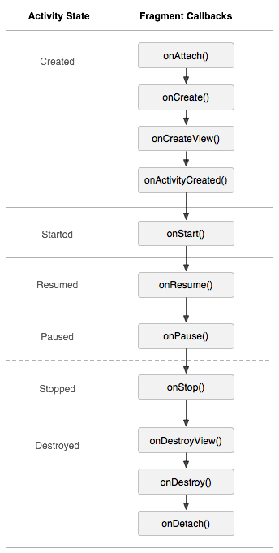

## 向Activity中添加Fragment片段 ##
有如下两种方式将一个Fragment片段，作为Activity的视图层次结构的一部分，嵌入到Activity中：

### 方式一： 在Activity的布局文件中通过`<fragment>`标签声明片段 ###

	<?xml version="1.0" encoding="utf-8"?>
	<LinearLayout xmlns:android="http://schemas.android.com/apk/res/android"
	    android:orientation="horizontal"
	    android:layout_width="match_parent"
	    android:layout_height="match_parent">

	    <fragment android:name="com.example.news.ArticleListFragment"
	            android:id="@+id/list"
	            android:layout_weight="1"
	            android:layout_width="0dp"
	            android:layout_height="match_parent" />

	    <fragment android:name="com.example.news.ArticleReaderFragment"
	            android:id="@+id/viewer"
	            android:layout_weight="2"
	            android:layout_width="0dp"
	            android:layout_height="match_parent" />
	</LinearLayout>

当系统创建此Activity布局时，会实例化`<fragment>`标签指定的Fragment片段，并调用Fragment片段的
onCreateView方法，返回Fragment片段的布局根视图View，然后系统会使用Fragment的根视图View代替
Activity布局文件中的`<fragment>`标签元素。

**Fragment片段的唯一标识**
每个片段都需要一个唯一的标识符，我们可以通过此标识符来获取对应的Fragment片段，以执行某些事务，如将
Fragment片段移除。另外重启Activity时，系统也可以使用Fragment的标识符来恢复此Fragment。

**为Fragment指定唯一标识的三种方式**
1. 为android:id属性提供唯一ID。
2. 为android:tag属性提供唯一字符串。
3. 如果为使用上述两个属性提供唯一标识，那么系统会使用容器视图的ID。

### 方式二： 在Java程序中创建Fragment实例并添加到某个现有的ViewGroup容器视图中 ###
在Activity运行期间，可以随时将Fragment片段添加到Activity布局中，此时只需要指定将Fragment片段放入
哪个ViewGroup即可。

通过FragmentTransaction类在Activity中执行Fragment片段事务（即在Activity布局中添加、移除或替换
Fragment片段）：

	FragmentManager fragmentManager = getFragmentManager();
	FragmentTransaction fragmentTransaction = fragmentManager.beginTransaction();

	ExampleFragment fragment = new ExampleFragment();

	将fragment片段插入到资源id指定的视图容器中。
	fragmentTransaction.add(R.id.fragment_container, fragment);

	//通过FragmentTransaction事务做出的更改，要调用commit方法才能生效
	fragmentTransaction.commit();

如上代码片段在Activity中调用，如果需要兼容低版本，则要继承v4包中的FragmentActivity，调用
getSupportFragmentManager方法获取FragmentManager对象。

**向Activity中添加不没有布局UI的Fragment片段**
将Fragment添加到Activity中，一般是作为Activity视图结构中的一部分，此时需要重写Fragment的
onCreateView方法返回一个Fragment的布局视图，并添加到Activity布局中的一个ViewGroup容器内。
此场景可以通过FragmentTransaction的`add(int containerViewId, Fragment fragment)`方法实现。

另外，我们也可以向Activity中添加一个没有布局的Fragment，这种没有布局的Fragment通常只为Activity提供
后台行为。通过FragmentTransaction的`add(Fragment fragment, String tag)`方法可以向Activity中
添加一个不需要提供布局UI的Fragment，此方法添加的Fragment，它的onCreateView方法并不会被调用，所以
无需实现该方法。

## 通过FragmentManager 和 FragmentTransaction 管理Fragment片段 ##
可以通过Activity的getFragmentManager方法获取到FragmentManager对象。
（对于继承自FragmentActivity的Activity,调用getSupportFragmentManager()）

通过FragmentManager提供的`Fragment findFragmentById(int id)`或
`Fragment findFragmentByTag(String tag)`方法，可以获取到已经通过FragmentTransaction的add方法
添加到Activity中的Fragment片段。id或tag参数就是添加Fragment时对应的此Fragment的标识符。

FragmentManager还提供了如下方法：

	public abstract void popBackStack(); //将片段从返回栈中弹出（模拟用户发出的返回命令）

	public abstract void addOnBackStackChangedListener(	 //监听返回栈的变化
			OnBackStackChangedListener listener);

**FragmentTransaction —— 执行片段事务**
在Activity中使用Fragment片段的一大优点就是可以根据用户行为动态的向Activity中添加、移除或替换
Fragment片段。在Activity中完成对Fragment的更改的操作称为事务。一次事务过程中，可以执行多次添加、
移除、替换的操作。

通过FragmentTransaction类执行Fragment的事务：

	FragmentManager fragmentManager = getFragmentManager();
	FragmentTransaction fragmentTransaction = fragmentManager.beginTransaction();

如上，通过FragmentManager的beginTransaction()方法开始一次事务的执行，开始执行事务后，
可以调用FragmentTransaction的add、remove、replace方法向Activity中添加Fragment，或从Activity中
删除Fragment、或替换Activity中的Fragment。事务执行完成后，必须调用FragmentTransaction的commit
方法才能将事务中执行的操作应用到Activity中。

	Fragment newFragment = new ExampleFragment();
	FragmentTransaction transaction = getFragmentManager().beginTransaction();
	
	transaction.replace(R.id.fragment_container, newFragment);

	transaction.addToBackStack(null);
	
	transaction.commit();

**事务返回栈**
如上，FragmentTransaction提供addToBackStack方法，将本次事务添加到Fragment的事务返回栈中，这个
事务返回栈由Activity管理。当用户按返回按钮时会返回到执行此事务之前的状态。
事务返回栈是以一次事务过程为单元进行管理的，即如果把一次事务从返回栈中移除，那么这次事务中对Fragment
执行的所有操作都会被移除。

如果在执行从Activity中删除Fragment片段的事务时，没有调用addToBackStack方法，那么事务提交后，这个被
删除的Fragment片段就会被销毁，用户无法再回退到该片段；如果调用了addToBackStack方法，那么系统只是
停止了此片段，当用户回退时，删除Fragment的事务会从返回栈中移除，也就是说恢复到删除Fragment之前的状态，
即被删除的Fragment又恢复了。

**在每个事务之间添加过渡动画**
可以在调用commit方法提交事务前，执行FragmentTransaction提供的如下方法，为Fragment事务设置过渡动画：

	public abstract FragmentTransaction setTransition(@Transit int transit);
		//设置事务的过渡动画，参数transit的值可以是：TRANSIT_NONE|TRANSIT_FRAGMENT_OPEN
			|TRANSIT_FRAGMENT_CLOSE|TRANSIT_FRAGMENT_FADE

**提交事务**
FragmentTransaction提供的commit()方法用于提交事务，但调用commit方法不会立即执行，而是在UI线程中可以
执行该方法时再执行。如果需要立即执行，在UI线程中调用FragmentManager提供的
executePendingTransactions()方法，以立即执行commit()方法提交的事务。

调用commit()方法提交事务时，要保证Activity是在运行状态，如果在用户离开Activity之后，或者在Activity
因为意外情况被销毁，然后重新创建的过程中，当Activity执行完onSaveInstanceState保存了状态之后，调用commit方法，则会产生异常。因为当需要回复Activity时，提交后的状态可能会丢失。
特别的，如果不需要关心提交丢失的情况，则可以使用commitAllowingStateLoss()方法来提交事务，此方法在遇到
上面的情况时不会产生异常，但事务提交同样会丢失。

	

