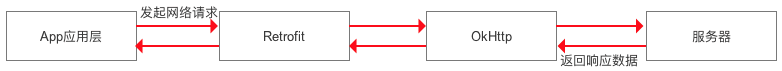

## Retrofit 简介 ##
Retrofit 是一个 基于 OkHttp 的 后台数据遵循 RESTful 设计风格 的 HTTP 网络请求框架的封装。
网络请求的工作本质上是 OkHttp 完成，而 Retrofit 仅负责网络请求接口的封装

如上，App应用程序通过 Retrofit 请求网络，实际上是使用 Retrofit 接口层封装请求参数、Header、Url 
等信息，之后由 OkHttp 完成后续的请求操作；
在服务端返回数据之后，OkHttp 将原始的结果交给 Retrofit，Retrofit根据用户的需求对结果进行解析

**应用场景**
任何网络请求的需求场景都应该优先选择。特别是后台API遵循 Restful API设计风格，
并且项目中使用到了RxJava

## Retrofit 使用步骤 ##

### step1. 添加 Retrofit 依赖库 ###
Retrofit 依赖于 OkHttp，所以同时还需添加 OkHttp 的依赖库

	dependencies {
		compile 'com.squareup.retrofit2:retrofit:2.3.0'
		compile 'com.squareup.okhttp3:okhttp:3.11.0'
	}	

Androd中访问网络时，还需要添加网络访问权限

	<uses-permission android:name="android.permission.INTERNET"/>

### step2. 创建 接收后台返回数据的类 ###
根据返回数据的格式，和数据解析方式（Json、xml等）定义类

	public class DataModel {
		...省略属性名，和setter/getter方法....
	}

### step3. 创建 描述网络请求的接口类 ###
Retrofit将Http请求抽象成Java接口，在网络请求接口类中采用注解描述网络请求参数和配置网络请求参数 

	public interface GetRequest_Interface {

		//省略修饰方法的注解
		Call<DataModel> getCall(...省略修饰参数的注解，和参数);
	
	}

如上就是创建了一个网络请求接口类，类中的方法存在参数时，参数会被注解修饰，用来配置网络请求的参数
Call类是Retrofit中定义的类`retrofit2.Call<T>`

**Retrofit中网络请求地址URL的配置**
Retrofit把网络请求地址分为了两个部分：
- 第一部分： 通过Retrofit.Builder.baseUrl(String url)配置，记为baseUrl，
通常baseUrl指的是完整url中的scheme和authority部分

- 第二部分： 通过网络请求方法类注解配置，记为extUrl。
 如 @GET、@POST等注解类中都定义了一个String类型的value变量用于配置extUrl。
通常extUrl指的是完整的url中的path和query部分

一个完整的网络请求 url = baseUrl + extUrl。

特别的，baseUrl和extUrl的结合规则如下：

	如果extUrl就是一个完整的url，如"http://authority/path/query"，那么baseUrl不应该再设置

	如果extUrl是一个绝对路径"/pathExt/queryExt"，
	且baseUrl为文件形式"http://authority/path/query"，
		那么完整url则是"http://authority/pathExt/queryExt"

	如果extUrl是一个相对路径"pathExt/queryExt"，
	且baseUrl为目录形式"http://authority/path/query/"
		那么完整url则是"http://authority/path/query/pathExt/queryExt"

	如果extUrl是一个相对路径"pathExt/queryExt"，
	且baseUrl为文件形式"http://authority/path/query"，
		那么完整url则是"http://authority/path/pathExt/queryExt"

建议baseUrl采用目录形式（即以"/"结尾），且只包含完整url中的scheme和authority部分；
建议extUrl采用相对路径（即不以"/"开头），且只包含完整url中的path和query部分。

**Retrofit中的注解类型**
Retrofit中定义了多种注解类型，用于描述网络请求参数和配置网络请求参数。

Retrofit中的注解分为三大类：网络请求方法类注解、标记类注解、网络请求参数类注解

**网络请求方法类注解：**
此类注解用于修饰 网络请求接口类 中的方法

	@GET

	@POST

	@PUT

	@DELETE
	
	@PATH

	@HEAD

	@OPTIONS

	@HTTP  
		用于替换以上7个注解。
		注解类HTTP包含三个成员变量：
			  String method(); //指定网络请求方法，如"GET"、"POST"等
			  String path() default "";  //指定extUrl
			  boolean hasBody() default false;  
					//是否包含请求体，对于GET应该为false，POST则应该为true
		举例：

			public interface GetRequest_Interface {

				@HTTP(method = "GET", path = "blog/{id}", hasBody = false)
				Call<DataModel> getCall(@Path("id") int id);
			
				//其中@Path注解用于动态配置extUrl，{id}是一个占位符，用getCall方法的参数id替换
			}
		

除@HTTP以外的其他6个注解类中都有一个String类型的变量value，用于配置extUrl

**标记类注解：**
此类注解用于修饰 网络请求接口类 中的方法

	@FormUrlEncoded
				
				标记注解，表示请求体是一个普通的Form表单
						（请求头中的Content-Type 为 "application/x-www-form-urlencoded"）

				此时可通过@Field注解修饰网络请求接口类中的方法的参数，作为上传的表单数据
				举例：

					public interface GetRequest_Interface {

						@POST("/form") 
						@FormUrlEncoded 
						Call<DataModel> getCall(@Field("username") String name, 
												  @Field("age") int age);

					}
			
					----
					GetRequest_Interface service = retrofit.create(
							GetRequest_Interface.class);

					Call<DataModel> call = service.getCall("Carson", 24);
						//上传的表单数据为 username=Carson&age=24
					

	@Multipart

				标记注解，表示请求体是一个支持文件上传的Form表单
						（请求头中的 Content-Type 一般为"multipart/form-data"）

				此时可通过@Part注解修饰网络请求接口类中的方法的参数，作为上传的表单数据
				举例：

					public interface GetRequest_Interface {

						@POST("/form") 
						@Multipart 
						Call<DataModel> getCall(@Part("name") RequestBody name, 
												  @Part("age") RequestBody age, 
												  @Part MultipartBody.Part file);
					}

					-----
					GetRequest_Interface service = retrofit.create(
							GetRequest_Interface.class);

					MediaType textType = MediaType.parse("text/plain");
					RequestBody name = RequestBody.create(textType, "Carson");
        			RequestBody age = RequestBody.create(textType, "24");

					MultipartBody.Part filePart = MultipartBody.Part
							.createFormData("file", "test.txt", file); 
						//最后一个参数file是File对象，表示要上传的文件

					Call<DataModel> call = service.getCall(name, age, filePart);

				

	@Streaming

				标记注解，表示后台响应的数据，以流的形式返回。适用于返回数据量较大的场景。
					如果没有使用该注解，默认把返回的数据全部载入内存，之后获取数据也是从内存中读取

**网络请求参数类注解：**

	@Header  修饰网络接口类的方法参数，用于添加一个请求头。
				请求头的key由Header注解类的value变量指定，请求头的value由修饰的方法参数指定

			 举例：

				@GET("user")
				Call<DataModel> getCall(@Header("Authorization") String authorization)
	
	@Headers  修饰网络接口类的方法，用于添加多个请求头的键值对形式。Headers注解类的value变量是
				字符串类型的数组，数组中的一个字符串元素表示一个请求头的键值对形式

			 举例：

				@Headers("Authorization:authorization")
				@GET("user")
				Call<DataModel> getCall()

	@Body  标记注解，修饰方法参数。用于上传自定义数据类型的数据。
			此注解修饰的参数类型应该是一个自定义数据类型，此自定义类可以解析为Json格式的数据字符串，
			上传的数据就是由自定义类解析处的Json数据

			举例：
			
				public class Data {
					private String key;
					
					public Data (String value) {
						key = value
					}
				}
				------
				public interface GetRequest_Interface {

					@POST("path")
					Call<DataModel> getCall(@Body Data data);
				}
				
				-----
				GetRequest_Interface service = retrofit.create(
							GetRequest_Interface.class);

				Call<DataModel> call = service.getCall(new Data(value));

	@Field  修饰方法参数，与@FormUrlEncoded注解配合使用，
			用于指定上传的普通表单中的一条键值对数据。
			注解类Field的成员变量value表示 表单中的一条键值对数据内的key值
			@Field修饰的方法参数 表示表单中的一条键值对数据内的value值

			举例：
			
				@POST("/form") 
				@FormUrlEncoded 
				Call<DataModel> getCall(@Field("username") String name, 
										  @Field("age") int age);

	@FieldMap   修饰方法参数，与@FormUrlEncoded注解配合使用，
				用于指定上传的普通表单中的多条键值对数据
				@FieldMap修饰的参数一般是Map类型，Map中的key即表单中键值对数据内的key；
				Map中的value即表单中键值对数据内的value；

			举例：
				public interface GetRequest_Interface {
					@POST("/form")
			        @FormUrlEncoded
			        Call<DataModel> getCall(@FieldMap Map<String, Object> map);
				}
				
				-----
				GetRequest_Interface service = retrofit.create(
							GetRequest_Interface.class);

				Map<String, Object> map = new HashMap<>(); 
				map.put("username", "Carson"); 
				map.put("age", 24); 
				Call<DataModel> call = service.getCall(map);

	@Part  修饰方法参数，与@Multipart注解配合使用
			用于上传支持文件的表单数据。
			@Part可修饰的参数类型有： okhttp3.RequestBody，okhttp3.MultipartBody.Part，或
				其他合适的类型（如String类型等等）。
			注解类Part的成员变量value用于指定要上传的表单字段。特别的，当@Part修饰
			okhttp3.MultipartBody.Part类型的参数时，不需要指定Part注解类的value变量值，因为
			创建okhttp3.MultipartBody.Part对象时，已经包含了表单字段。

			举例：

				public interface GetRequest_Interface {
					@POST("/form")
			        @Multipart
			        Call<DataModel> getCall(@Part("name") RequestBody name, 
											  @Part("age") RequestBody age, 
											  @Part MultipartBody.Part file);
				}
			
				-------
				GetRequest_Interface service = retrofit.create(
							GetRequest_Interface.class);

				MediaType textType = MediaType.parse("text/plain");
		        RequestBody nameBody = RequestBody.create(textType, "Carson");
		        RequestBody ageBody = RequestBody.create(textType, "24");

				File file = new File(Environment.getExternalStorageDirectory(),
									 "photo.png");
	
				RequestBody fileBody = RequestBody.create(MediaType.parse("image/png")
										, file);
				MultipartBody.part filePart = MultipartBody.part.createFormData("file", 
									"photo.png", fileBody);

				Call<DataModel> call = service.getCall(nameBody, ageBody, filePart);

	@PartMap   修饰方法参数，与@Multipart注解配合使用
				用于上传支持文件的表单数据。
				@PartMap修饰的方法参数是Map集合类型，通常为Map<String, RequestBody>，Map集合
				中的key表示表单字段，RequestBody表示字段数据。特别的，当RequestBody表示文件数据
				时，因为没有通过请求头"Content-Disposition"指定文件名，所以Map中的RequestBody
				即使包含文件数据，也不会被当成文件。
				所以，当要上传文件时，只能通过MultipartBody.Part类型的参数表示。

				举例：

					public interface GetRequest_Interface {
						@POST("/form")
				        @Multipart
				        Call<DataModel> getCall(@PartMap Map<String, RequestBody> map, 
												  @Part MultipartBody.Part file);
					}

					---------
					GetRequest_Interface service = retrofit.create(
							GetRequest_Interface.class);

					
					MediaType textType = MediaType.parse("text/plain");
			        RequestBody nameBody = RequestBody.create(textType, "Carson");
			        RequestBody ageBody = RequestBody.create(textType, "24");

					Map<String, RequestBody> map = new HashMap<>();
					map.put("name", nameBody);
					map.put("age", nameBody);

					File file = new File(Environment.getExternalStorageDirectory(),
										 "photo.png");
		
					RequestBody fileBody = RequestBody.create(MediaType.parse("image/png")
											, file);

					MultipartBody.part filePart = MultipartBody.part.createFormData("file", 
										"photo.png", fileBody);
	
					Call<DataModel> call = service.getCall(map, filePart);

	@Path    修饰方法参数，用于动态配置url中的path部分
			 使用@Path时，网络请求方法注解类配置的extUrl中的path部分会包含占位符 {placeholder}，
			 当注解类Path的成员变量value用于指定预替换的占位符，@Path修饰的参数用于替换此@Path
			 指定的占位符。

			 举例：
	
				public interface GetRequest_Interface {
					@GET("{placehodler}/getIpInfo.php?ip=59.108.54.73")
			        Call<DataModel> getCall(@Path("placehodler") String path);
				}
				
				------
				Call<DataModel> call = service.getCall("service");
				//请求地址url为 scheme://authority/service/getIpInfo.php?ip=59.108.54.73

	@Query   修饰方法参数，与@GET配合使用，
			 表示采用GET请求方式时，完整url的query部分的数据
				（url = scheme://authority/path?query 
					其中query组成形式为： key1=valu1&key2=value2&...&keyN=valueN）
			 注解类Query中的成员变量value指定一条查询键值对中的key值；
			 @Query修饰的参数指定查询键值对中的value值

			 举例：

				@GET("path")
				Call<DataModel> getCall(@Query("key") String arg)

				-----
				Call<DataModel> call = service.getCall("value");
					//请求地址url为 .../path?key=value

	@QueryMap   修饰方法参数，与@GET配合使用，
				表示采用GET请求方式时，完整url的query部分的数据
				@QueryMap修饰的参数类型一般为Map<String, String>，Map集合中键值对即代表查询参数
				中的键值对

				举例：
			
					@GET("path")
					Call<DataModel> getCall(@QueryMap Map<String, String> map);

					-----
					Map<String, String> map = new HashMap<>();
					map.put("key1", "value1");
					map.put("key2", "value2");
					Call<DataModel> call = service.getCall(map);
						////请求地址url为 .../path?key1=value1&key2=value2

	@URL  标记注解，修饰方法参数，用于指定被修饰的参数作为extUrl。
		  当使用了@URL时，@GET|@POST 等网络请求方法注解不需要再配置extUrl。
		  当没有在 @GET|@POST 等中配置extUrl时，则必须使用@Url配置一个extUrl

	

### step4. 创建 Retrofit 实例 ###

	Retrofit retrofit = new Retrofit.Builder()
			.baseUrl("http://fanyi.youdao.com/") 
				// 设置网络请求的Url地址（通常只需包含Url中的scheme部分和authority部分，
					url中的其他部分（如path、query部分）通过网络请求方法注解配置）

			.addConverterFactory(GsonConverterFactory.create()) 
				// 设置数据解析器（Converter），此处设置为采用Gson解析数据

			.addCallAdapterFactory(RxJavaCallAdapterFactory.create()) 
				// 设置网络请求适配器（CallAdapter），此处设置为支持RxJava平台
				//此设置项为可选项

			.build();

**数据解析器 Converter**
Retrofit支持多种数据解析方式， 使用时需要在Gradle添加依赖库

	Gson 		com.squareup.retrofit2:converter-gson:2.3.0
	Jackson 	com.squareup.retrofit2:converter-jackson:2.3.0
	Simple XML 	com.squareup.retrofit2:converter-simplexml:2.3.0
	Protobuf 	com.squareup.retrofit2:converter-protobuf:2.3.0
	Moshi 		com.squareup.retrofit2:converter-moshi:2.3.0
	Wire 		com.squareup.retrofit2:converter-wire:2.3.0
	Scalars 	com.squareup.retrofit2:converter-scalars:2.3.0

**网络请求适配器 CallAdapter**
Retrofit支持多种网络请求适配器方式：guava、Java8和rxjava 
当采用Android默认的网络请求适配器（CallAdapter）时，则不需要调用addCallAdapterFactory方法设置，

当需要指定Retrofit支持的网络请求适配器（CallAdapter）时，则除了调用addCallAdapterFactory方法
指定网络请求适配器（CallAdapter）外，还需要在build.gradle中添加对应网络请求适配器（CallAdapter）
的依赖库

	guava 	com.squareup.retrofit2:adapter-guava:2.3.0
	Java8 	com.squareup.retrofit2:adapter-java8:2.3.0
	rxjava 	com.squareup.retrofit2:adapter-rxjava:2.3.0

### step5. 创建 步骤2中定义的网络请求接口的实例，并配置网络请求参数 ###

	//创建网络请求接口类的实例
	GetRequest_Interface service = retrofit.create(
							GetRequest_Interface.class);

	//开始配置网络请求参数				
	MediaType textType = MediaType.parse("text/plain");
	RequestBody nameBody = RequestBody.create(textType, "Carson");
	RequestBody ageBody = RequestBody.create(textType, "24");
	
	Map<String, RequestBody> map = new HashMap<>();
	map.put("name", nameBody);
	map.put("age", nameBody);
	
	File file = new File(Environment.getExternalStorageDirectory(),
						 "photo.png");
	
	RequestBody fileBody = RequestBody.create(MediaType.parse("image/png")
							, file);
	
	MultipartBody.part filePart = MultipartBody.part.createFormData("file", 
						"photo.png", fileBody);
	
	//将网络请求参数封装成一个 retrofit2.Call<T> 实例
	Call<DataModel> call = service.getCall(map, filePart);

### step6. 发送网络请求（同步/异步） ###
Retrofit中封装了 数据转换、线程切换的操作

通过步骤5得到的retrofit2.Call<T>对象call的execute()方法发送同步请求，
通过call的enqueue(Callback<T> callback)方法发送异步请求。

	//发送网络请求(异步)
    call.enqueue(new Callback<DataModel>() {

        @Override
        public void onResponse(Call<DataModel> call, Response<DataModel> response) {
            
        }

        @Override
        public void onFailure(Call<DataModel> call, Throwable throwable) {
            
        }
    });

	--------
	// 发送网络请求（同步）
	Response<DataModel> response = call.execute();

### step7. 处理后台返回的数据 ###
当步骤6中成功获取到后台返回的数据时，数据就封装在 retrofit2.Response<T> 类型的对象中，泛型T 就是
步骤2中定义的用于解析后台数据的类。

    call.enqueue(new Callback<DataModel>() {
        @Override
        public void onResponse(Call<DataModel> call, Response<DataModel> response) {

            // 对返回数据进行处理
            DataModel data = response.body();
			...
        }

        @Override
        public void onFailure(Call<DataModel> call, Throwable throwable) {
            System.out.println("连接失败");
        }
    });

