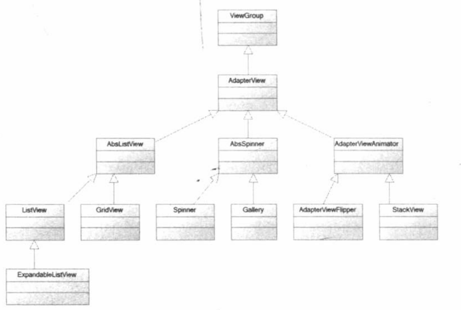
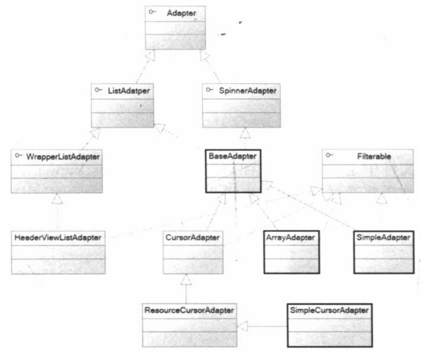
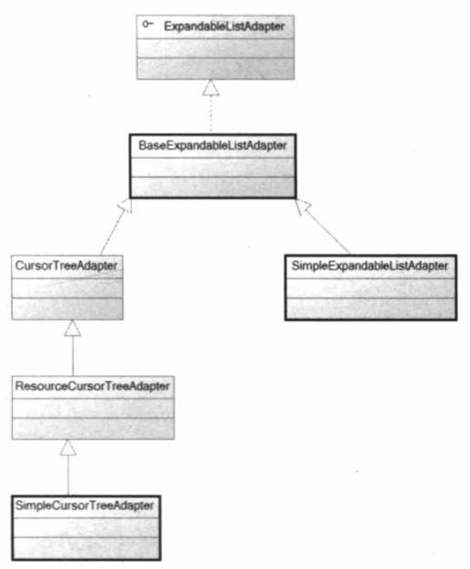
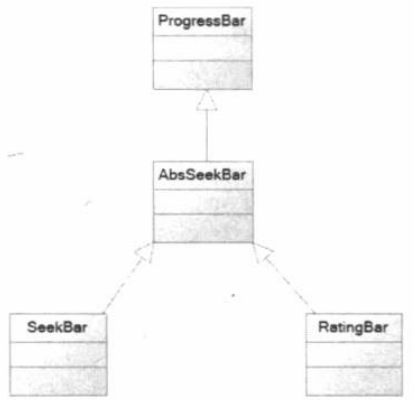
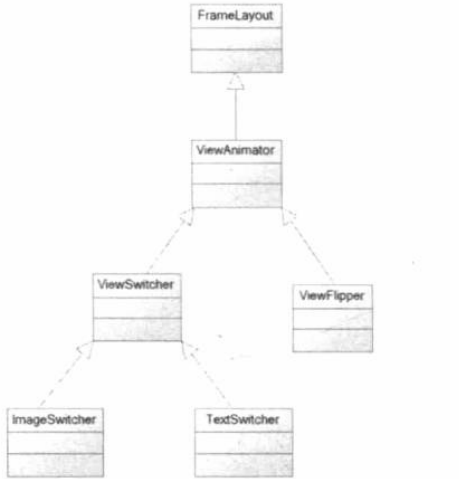
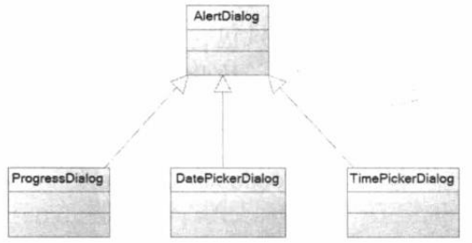
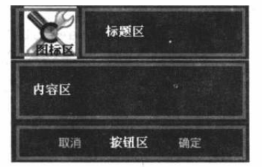
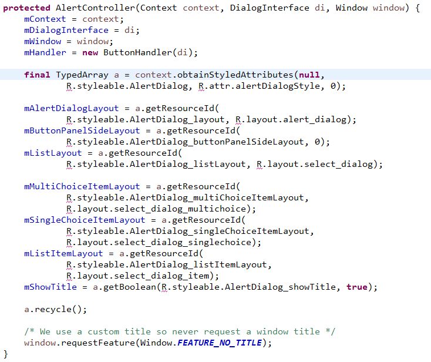
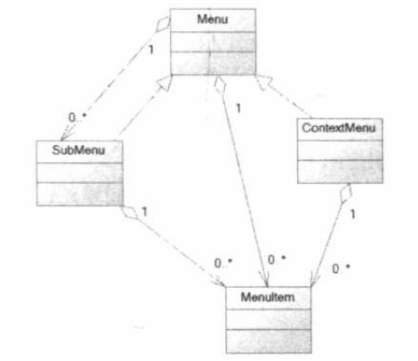

# AdapterView 及其子类 #

如上，Gallery已过时，Android推荐使用HorizontalScrollView代替它。

AdapterView只是容器，而Adapter负责提供每个"列表项"组件,AdapterView则负责采用合适的方式显示这些"列表项"。

## AdapterView的特征 ##
AdapterView继承ViewGroup，是一个容器。
AdapterView可以包含多个"列表项"，并将多个"列表项"以合适的形式显示出来。
adapterView显示的多个"列表项"由Adapter提供。调AdapterView.setAdapter(Adapter)方法设置Adapter即可

## Adapter 接口及实现类 ##

ListAdapter为AbsListView提供列表项

SpinnerAdapter为AbsSpinner提供列表项

BaseAdapter及其子类可以同时为AbsListView、AbsSpinner提供列表项

ArrayAdapter： 通常用于将数组或List集合的元素包装成列表项

SimpleAdapter： 可用于将List集合的对象元素包装成列表项

SimpleCursorAdapter： 跟SimpleAdapter类似，只是用于包装Cursor提供的数据

BaseAdapter： 通常用于被扩展。扩展BaseAdapter可对列表项进行最大限度的定制

## AbsListView 常用XML属性 ##

	android:listSelector 指定被选中的列表项上绘制的Drawable

	android:drawSelectorOnTop 设置为true时表示选中的列表项将会显示在上面

	android:stackFromBottom

	android:scrollingCache

	android:textFilterEnabled

	android:transcriptMode

	android:cacheColorHint

	android:fastScrollEnabled 设置为true，将会显示滚动图标，并允许用户拖动该滚动图标快速滚动

	android:smoothScrollbar 设置为false，则不再header view之后绘制分隔条

	android:choiceMode

## 通过Filter对列表项内容进行过滤 ##
AbsListView提供setFilterText(filterText)方法，对包含filterText文本内容的列表项进行过滤刷选，
首先要通过setTextFilterEnabled方法（或xml属性）将AbsListView设置为支持过滤刷选。

然后AbsListView绑定的Adapter要继承Filterable接口，通过重写getFilter()方法，提供出一个Filter过滤器给AbsListView使用，AbsListView调用Filter.filter(CharSequence, FilterListener)方法即可开始过滤，如果设置了FilterListener监听器，当过滤完成时，会回调onFilterComplete(int count)方法。

## ListView 和ListActivity ##

### ListView常用的XML属性 ###

	android:entries  指定一个字符串数组作为列表项内容显示，设置了entries属性后，会为ListView设置
					 一个ArrayAdapter

			setAdapter(new ArrayAdapter<>(context, 
							R.layout.simple_list_item_1, entries));	
		
	android:divider  设置列表项的分隔条。可以指定一个@drawable，也可以指定16进制的颜色值"#f00"
					当指定为@null时，相当于分割线变成透明的了。

	android:dividerHeight 设置分隔条的高度

	android:headerDividersEnabled  设置为false则不在header view之后绘制分隔条
	android:footerDividersEnabled  设置为false则不在footer view之前绘制分隔条

### 基于android:entries指定数组实现的ListView ###
在layout.xml文件中为ListView指定android:entries属性，设置一个字符串数组后，就可以将此数组元素作为列表项内容显示出来。

	<ListView 
		android:layout_width="match_parent"
		android:layout_height="wrap_content"
		android:entries="@arrays/books"/>

在ListView的构造方法中会判断enries属性是否指定了一个数组，如果指定了数组，就会调setAdapter方法设置此ListView的列表项：

	setAdapter(new ArrayAdapter<>(context,  R.layout.simple_list_item_1, entries));	

所以，在设置了entries属性后，不再需要另外调setAdapter属性为ListView配置列表项了。

此方式实现的ListView非常简单，不能对ListView的外观，行为进行定制。

### 基于ArrayAdapter实现的ListView ###
通过ArrayAdapter提供的构造方法，就可以对列表项进行配置

	public ArrayAdapter(Context context, int resource, T[] objects)

	public ArrayAdapter(Context context, int resource,
            int textViewResourceId, T[] objects)

	public ArrayAdapter(Context context, int resource, List<T> objects)

	public ArrayAdapter(Context context, int resource,
            int textViewResourceId, List<T> objects)

其中参数resource指定一个layout.xml布局文件；

参数textViewResourceId指定TextView在layout.xml中的id；
如果构造方法不指定textViewResourceId，则layout.xml的根布局控件就是TextView；
如果构造方法指定了textViewResourceId，则layout.xml中只要包含组件id为textViewResourceId的TextView就行。

objects表示的数组或集合中的数据元素类型为T，调TextView.setText(T.toString())方法给列表项设置内容。

### ListActivity ###
如果当前Activity仅仅用来显示一个列表，则可以让我们的Activity继承ListActivity。

ListActivity的子类不用再调setContentView方法设置Activity的布局界面。

	public class ListActivity extends Activity {
		...
		public void setListAdapter(ListAdapter adapter) {
	        synchronized (this) {
	            ensureList();
	            mAdapter = adapter;
	            mList.setAdapter(adapter);
	        }
	    }
		...
		private void ensureList() {
	        if (mList != null) {
	            return;
	        }
	        setContentView(com.android.internal.R.layout.list_content_simple);
	    }
		...
		@Override
	    public void onContentChanged() {
	        super.onContentChanged();
	        View emptyView = findViewById(com.android.internal.R.id.empty);
	        mList = (ListView)findViewById(com.android.internal.R.id.list);
	        if (mList == null) {
	            throw new RuntimeException(
	                    "Your content must have a ListView whose id attribute is " +
	                    "'android.R.id.list'");
	        }
	        if (emptyView != null) {
	            mList.setEmptyView(emptyView);
	        }
	        mList.setOnItemClickListener(mOnClickListener);
	        if (mFinishedStart) {
	            setListAdapter(mAdapter);
	        }
	        mHandler.post(mRequestFocus);
	        mFinishedStart = true;
	    }
		...
		protected void onListItemClick(ListView l, View v, int position, long id) {}
		...
		private AdapterView.OnItemClickListener mOnClickListener = 
			new AdapterView.OnItemClickListener() {

	        public void onItemClick(AdapterView<?> parent, View v, 
				int position, long id) {

	            onListItemClick((ListView)parent, v, position, id);
	        }
		};
	}

如上，从ListActivity的源码可知，我们只需在onCreate中调用setListAdapter(ListAdapter)方法传入一个ListAdapter对象即可实现ListView的显示；
如果想处理ListView的列表项的点击事件，重写onListItemClick方法即可。

### 基于SimpleAdapter实现的ListView ###

	public SimpleAdapter(Context context, List<? extends Map<String, ?>> data,
            @LayoutRes int resource, String[] from, @IdRes int[] to)

参数resource： 表示列表项的layout.xml布局文件

参数to： 布局文件中控件id组成的数组，控件id指定的控件可以是TextView、ImageView、或实现了Checkable的控件（如CompoundButton的子类：CheckBox、RadioButton、Switch、ToggleButton）

参数data： 表示一个数据集合，该集合中元素的个数就是ListView的列表项的个数，每个列表项显示的数据内容由Map<String,?>类型的元素指定。

	当对应于数组参数to中的控件元素是Checkable的实现类时，类型？是Boolean类型。
	如果此控件元素既实现了Checkable又继承了TextView，那么类型？可以是Boolean类型，也可以是其他类型。
	当类型？是Boolean类型时，作为控件元素的setChecked方法的参数，
	当类型？是其他类型时，类型？的toString返回结果作为控件元素的setText方法的参数。

	当控件元素是TextView时，？类型的toString的返回结果为此TextView的显示内容；

	当控件元素是ImageView时，类型？可以是Integer，此时Integer对象表示ImageView的图片资源ID；
	当类型？为其他类型时，那么其他类型的toString的返回结果要能转化成一个表示图片资源ID的Integer对象。

参数from： 表示集合data中每个元素类型 Map<String, ?> 中的索引String字符串

SimpleAdapter对列表项布局内容的处理方式就是：在处理每一个列表项时，遍历数组to得到需要处理的每个控件，然后把数组from中相同索引位置的字符串作为key值，去获取当前列表项对应的Map<String,?>集合中的？类型的数据对象，最后用此数据对象处理当前遍历到的控件。

#### SimpleAdater.ViewBinder的作用 ####
以上可知，SimpleAdapter本身只能绑定处理列表项布局文件中的TextView、ImageView和实现了Checkable的控件。如果想要处理列表项布局文件中的其他控件，或者要改变SimpleAdapter对支持控件的处理方式，可以实现SimpleAdapter.ViewBinder接口。

	public static interface ViewBinder {
        boolean setViewValue(View view, Object data, String textRepresentation);
    }

如上，重写setViewValue方法，在方法体中处理当前遍历到的控件view。返回true则SimpleAdapter不再对当前控件view进行默认处理，返回false则表示继续使用SimpleAdapter默认的方式处理此view控件。
setViewValue方法的参数data对应指定Map<String,?>中的？类型对象，参数textRepresentation是data的toString方法返回结果

### 自定义BaseAdapter实现的ListView ###
BaseAdapter直接继承自ListAdapter和SpinnerAdapter，间接继承了Adapter。
BaseAdapter是一个抽象类，这是因为BaseAdapter并没有重写父接口Adapter提供的如下4个方法：

	int getCount();  //返回值控制该Adapter将会包含多少个列表项

	Object getItem(int position);  //返回值决定第position处的列表项的内容数据

	long getItemId(int position);  //返回值决定第position处的列表项的ID

	View getView(int position, View convertView, ViewGroup parent);  //返回值决定第position处的列表项的根控件。

所以自定义BaseAdapter时，需要重写上述的4个方法。ArrayAdapter和SimpleAdapter都继承BaseAdapter，并重写了上面的4个方法。

## GridView 网格视图 ##
GridView与ListView的区别是：GridView支持多列显示。
GridView和ListView都继承自AbsListView，所以GridView和ListView具有很高的相似性。

### GridView常用XML属性 ###

	android:horizontalSpacing  设置各元素之间水平间距

	android:verticalSpacing  设置各元素之间的垂直间距

	android:stretchMode  设置元素的拉伸模式，使元素整体布局尽可能符合空间大小

	android:columnWidth  设置列的宽度

	android:numColumns  设置列数，该属性默认值为1，一般应指定大于1的值，
							否则GridView就变成了ListView

	android:gravity  设置水平对齐方式，默认是Gravity.LEFT

## ExpandableListView 可展开的列表组件 ##
ExpandableListView是ListView的子类，通过分组的方式把不同的列表分成不同的组，从而每组中都包含多个列表项组成的列表。

ExpandableListView的显示方式为：

	组列表项
	...
	该组包含的多个子列表项
	...
	组列表项
	...
	该组包含的多个子列表项
	...

	...

	组列表项
	...
	该组包含的多个子列表项
	...

### ExpandableListView的XML属性 ###

	android:groupIndicator  显示在组列表旁边的Drawable对象
	android:indicatorLeft
	android:indicatorRight
	android:childIndicator  显示在子列表项旁边的Drawable对象
	android:childIndicatorLeft
	android:childIndicatorRight
	android:childDivider  指定各组内各子列表项之间的分隔条
	android:indicatorStart
	android:indicatorEnd
	android:childIndicatorStart
	android:childIndicatorEnd

### ExpandableListAdapter ###

ExpandableListView显示的组和组中的多个列表项由ExpandableListAdapter提供，ExpandableListAdapter
是一个接口，继承关系如下图：

实现ExpandableListAdapter有如下三种常用的方式：

	自定义BaseExpandableListAdapter子类实现ExpandableListAdapter

	使用SimpleExpandableListAdapter将2个集合包装成ExpandableListAdapter

	使用SimpleCuTreeAdapter将Cursor中的数据包装成SimpCursorTreeAdapter

### 自定义BaseExpandableListAdapter子类实现ExpandableListAdapter ###
此方式需要重写如下几个方法：

	int getGroupCount();  //返回组列表项的个数

	int getChildrenCount(int groupPosition); //返回groupPosition表示的组中的子列表项的个数

	Object getGroup(int groupPosition); //返回第groupPosition处组列表项布局要显示的内容数据

	Object getChild(int groupPosition, int childPosition); //返回groupPosition、childPosition指定的子列表项的布局要显示的内容数据

	long getGroupId(int groupPosition); //返回第groupPosition处组列表项的ID

	long getChildId(int groupPosition, int childPosition);//返回groupPosition、childPosition指定的子列表项的ID

	View getGroupView(int groupPosition, boolean isExpanded, View convertView,
			ViewGroup parent);  //返回第groupPosition处组列表项的根布局控件

	View getChildView(int groupPosition, int childPosition, boolean isLastChild,
			View convertView, ViewGroup parent);  //返回groupPosition、childPosition指定的子列表项的根布局控件

	boolean isChildSelectable(int groupPosition, int childPosition); //重写时可返回true

	boolean hasStableIds(); //重写时可返回true

可以参考SimpleExpandableListAdapter的实现方式

### 使用SimpleExpandableListAdapter ###
SimpleExpandableListAdapter提供如下三个构造方法用于创建一个配置组列表项和各组中子列表项的ExpandableListAdapter对象供ExpandableListView使用

	public SimpleExpandableListAdapter(Context context,
            List<? extends Map<String, ?>> groupData, int groupLayout,
            String[] groupFrom, int[] groupTo,
            List<? extends List<? extends Map<String, ?>>> childData,
            int childLayout, String[] childFrom, int[] childTo)

	public SimpleExpandableListAdapter(Context context,
            List<? extends Map<String, ?>> groupData, int expandedGroupLayout,
            int collapsedGroupLayout, String[] groupFrom, int[] groupTo,
            List<? extends List<? extends Map<String, ?>>> childData,
            int childLayout, String[] childFrom, int[] childTo)

	public SimpleExpandableListAdapter(Context context,
            List<? extends Map<String, ?>> groupData, int expandedGroupLayout,
            int collapsedGroupLayout, String[] groupFrom, int[] groupTo,
            List<? extends List<? extends Map<String, ?>>> childData,
            int childLayout, int lastChildLayout, String[] childFrom,
            int[] childTo)

## 下拉列表 Spinner ##
Spinner继承自AbsSpinner，AbsSpinner继承自AdapterView，所以Spinner具有AdapterView的特征：只要为AdapteView提供Adapter即可显示数据。

### Spinner常用的XML属性 ###
	
	android:entries
	
	android:dropDownWidth
	
	android:prompt
	
	android:popupBackground

## AdapterViewFlipper ##

## StackView ##

# ProgressBar及其子类 #

## ProgressBar的用法 ##
Android支持多种风格的进度条，通过style属性可以为ProgressBar指定风格，如：

	<ProgressBar
		...
		style="@android:style/Widget.ProgressBar.Horizontal"/>

style属性支持的属性值：

	@android:style/Widget.ProgressBar.Horizontal  水平进度条
	@android:style/Widget.ProgressBar.Inverse  普通大小的环形进度条
	@android:style/Widget.ProgressBar.Large  大环形进度条
	@android:style/Widget.ProgressBar.Large.Inverse  大环形进度条
	@android:style/Widget.ProgressBar.Small  小环形进度条
	@android:style/Widget.ProgressBar.Horizontal  小环形进度条

ProgressBar的XML属性

	android:animationResolution    
	android:indeterminate  设置为true，则进度条不精确显示进度        
	android:indeterminateBehavior  
	android:indeterminateDrawable  设置绘制不显示进度的进度条的Drawable对象
	android:indeterminateDuration  设置不精确显示进度的持续时间
	android:indeterminateOnly     
	android:interpolator           
	android:min                    
	android:max 设置进度条的最大值                   
	android:maxHeight              
	android:maxWidth               
	android:minHeight              
	android:minWidth               
	android:mirrorForRtl           
	android:progress  设置进度条已完成的进度             
	android:progressDrawable  设置进度条的轨道对应的Drawable对象     
	android:secondaryProgress  

android:progressDrawable属性可以指定为一个LayerDrawable对象(在XML中通过layer-list标签配置) 

## 拖动条 SeekBar ##
SeekBar继承自AbsSeekBar，AbsSeekBar继承自ProgressBar。所以ProgressBar的XML属性和方法都能使用
SeekBar增加了一个滑块，通过滑块的位置标识进度。
通过android:thumb属性可以改变滑块图标。  

## 星级评分条 RatingBar ##
RatingBar同SeekBar都是继承自AbsSeekBar，不过RatingBar是通过星星来表示进度

常用XML属性

	android:numStars  设置星级评分条总共有多少个星级
	android:rating  设置星级评分条默认的星级   
	android:stepSize  设置每次最少需要改变多少个星级，可以是小数，如0.5
	android:isIndicator  设置星级评分条是否允许用户改变，true为不允许。

通过setOnRatingBarChangeListener(OnRatingBarChangeListener listener)监听星级变化。

# ViewAnimator及其子类 #

ViewAnimator继承自FrameLayout，实际项目常使用ViewAnimator的几个子类。
ViewAnimator可以增加子View之间的切换动画效果

ViewAnimator的XML属性

	android:animateFirstView  显示第一个子View时是否使用动画

	android:inAnimation  设置显示子View时使用的动画

	android:outAnimation 设置隐藏子View时使用的动画

## ViewSwitcher ##
ViewSwitcher继承自ViewAnimator，可以用来为子View提供切换效果

android8.0源码中最多只能加入2个子view，子view可以是ViewGroup的子类，如GridView

ViewSwitcher的子view可以通过setFactory方法添加。

ViewSwitcher中view的切换效果通过setInAnimation和setOutAnimation方法实现；

在切换到下一个子view之前，调getNextView方法得到下一个子view，此时可以更新下一个子view显示的内容。
于是就可以通过2个子view实现切换显示不同内容的效果。

## ImageSwitcher 图片切换器 ##
ImageSwitcher继承自ViewSwitcher，所以最多也只能加入2个子view；
ImageSwitcher要求子View必须是ImageView

ImageSwitcher可以在图片切换时添加动画效果。

通过ImageSwitcher提供的setImageResource、setImageURI或setImageDrawable方法可实现图片切换。
	

## TextSwitcher 文本切换器 ##
TextSwitcher继承自ViewSwitcher，与ImageSwitcher相似，
只不顾TextSwitcher是用来切换文本的，并在切换时添加动画效果

TextSwitcher的2个子view必须是TextView对象。

通过TextSwitcher的setText方法可切换下一个要显示的文本内容，setCurrentText修改当前显示的文本。

## ViewFlipper ##
ViewFlipper继承自ViewAnimator，可以添加多个子View，为多个子View之间切换提供动画效果

ViewFlipper跟AdapterViewFlipper类似，都可以控制多个子View之间的切换效果。区别是：
ViewFlipper通过addView方法添加子View，而AdapterViewFlipper通过Adapter添加子View。

常用XML属性：

	android:flipInterval  切换间隔

	android:autoStart  是否自动开始切换

通过调startFlipping()方法可以手动开始切换

# 杂项组件 #

## Toast 提示框 ##
Toast用于临时性地显示一个提示信息，一段时间后会自动消失。
Toast提示信息不会获得焦点

Toast可以通过makeText方法创建，只不过makeText创建的Toast默认布局中只有一个TextView用于显示文字；
如果想要修改Toast的布局显示，可以通过setView方法实现。setView方法要在show()方法执行之前调用

另外Toast还提供了一些方法用于修改Toast的显示位置

## AutoCompleteTextView 自动完成文本框 ##
自动完成文本框AutoCompleteTextView是EditText的子类，相比EditText，多了一个功能：当用户输入一定字符之后，自动显示一个下拉菜单，用户可以从下拉菜单中选择预填入的列表项内容。
提示内容列表项通过一个Adapter提供给AutoCompleteTextView

	public class AutoCompleteTextView extends EditText implements Filter.FilterListener

	private final ListPopupWindow mPopup;

	public <T extends ListAdapter & Filterable> void setAdapter(T adapter) {
		...
		mPopup.setAdapter(mAdapter);
	}

		

ListPopupWindow

	public class ListPopupWindow implements ShowableListMenu

	private DropDownListView mDropDownList;  //DropDownListView extends ListView

	public void setAdapter(@Nullable ListAdapter adapter) {
		...
		mDropDownList.setAdapter(mAdapter);
	}

android.R.styleable#AutoCompleteTextView_completionHint  设置下拉菜单的提示标题
android.R.styleable#AutoCompleteTextView_completionThreshold  显示下拉菜单的至少输入字符数
android.R.styleable#AutoCompleteTextView_completionHintView  下拉菜单的提示标题的视图
android.R.styleable#AutoCompleteTextView_dropDownSelector
android.R.styleable#AutoCompleteTextView_dropDownAnchor 下拉菜单的定位组件，默认是TextView本省
android.R.styleable#AutoCompleteTextView_dropDownWidth 下拉菜单的宽度
android.R.styleable#AutoCompleteTextView_dropDownHeight 下拉菜单的高度

android.R.styleable#ListPopupWindow_dropDownVerticalOffset  下拉菜单与文本框的水平偏移，默认左对齐
android.R.styleable#ListPopupWindow_dropDownHorizontalOffset 下拉菜单与文本框的垂直偏移，默认紧跟文本框

android.R.styleable#PopupWindow_popupBackground 下拉菜单的背景

## 日历视图 CalendarView ##

## 日期选择器 DatePicker ##

## 时间选择器 TimePicker ##

## 数值选择器 NumberPicker ##
NumberPicker既可以让用户通过键盘输入数值，也可以通过拖动来选择数值，

通过setMinValue、setMaxValue、setValue来设置最小值，最大值，当前初始化值

通过setOnValueChangedListener监听数值变化

## SearchView 搜索框 ##

	android:iconifiedByDefault  是否自动缩小为图标，true表示缩小为图标
	android:imeOptions
	android:inputType
	android:maxWidth
	android:queryHint  默认显示的提示文本
	

## TabHost 选项卡 ##
布局文件中，TabHost必须包含一个id为com.android.internal.R.id.tabs（@android:id/tabs）的TabWidget，
和一个id为com.android.internal.R.id.tabcontent(@android:id/tabcontent)的FrameLayout。
通常，可以使用一个LinearLayout将TabWidget和FrameLayout布局成上下结构或左右结构

如果使用TabActivity，那么TabHost的id必须是com.android.internal.R.id.tabhost(@android:id/tabhost)。

并且，如果我们继承自TabActivity，我们可以调setContentView使用一个自定义的布局文件，布局文件要满足上述要求。也可以不设置布局文件，此时在调getTabHost方法时，TabActivity会使用系统自带的布局文件。

使用TabActivity，调用getTabHost()方法，即可完成TabHost，TabWidget，以及作为tabcontent的FrameLayout的初始化。

现在，Android系统已经不建议我们使用TabActivity。

如果不在TabActivity中使用TobHost，那么在其他地方使用时（如Fragment中），需要对TabHost进行初始化：
	
	step1. 在调findViewByid获取到TabHost后，调TabHost.setup()方法，完成TabWidget和FrameLayout（tabcontent）的初始化。
			此步骤对应TabActivity中的getTabHost方法。

初始化之后，需要给TabHost配置选项卡TabSpec，一个选项卡有一个指示器视图IndicatorView和一个内容视图
ContentView组成，
调TabHost.newTabSpec得到一个选项卡TabSpec对象，
调TabSpec.setIndicator设置指示器视图，
调TabSpec.setContent设置内容视图。

通过TabHost.setOnTabChangedListener可以监听选项卡改变的事件

## ScrollView 和 HorizontalScrollView 滚动条 ##
ScrollView继承自FrameLayout，并且ScrollView中只能有一个子View，这个子View通常是一个ViewGroup容器。
ScrollView的作用就是为这个子View容器添加滚动条。

ScrollView通常只是给View容器添加垂直滚动条，如果要给View容器添加水平滚动条，可以使用HorizontalScrollView

## Notification 通知 ##
Notification通知可以通过Notification.Build来构建，
一个构建好的Notification对象，可以通过NotificationManager.notify方法进行发送

## RemoteViews ##

# Dialog 对话框 #

AlertDialog的使用范围很广，不仅提供了一些自带的对话框风格，还允许开发者自定义对话框视图

## AlertDialog 创建对话框 ##

AlertDialog默认的对话结构如上图所示。

AlertDialog是在AlertController中定义对话框的布局风格的，对话框的样式风格跟主题有关系，在
AlertController的构造方法中，如果当前主题设置alertDialogStyle属性，则通过alertDialogStyle指定的
风格构建对话框视图，如果对话框的样式属性在alertDialogStyle指定的风格中没有定义，则采用默认值进行布局

AlertDialog的显示流程是：通过调Dialog.show()方法，执行到onCreate方法中，AlertDialog重写了onCreate方法，并调用AlertController.installContent()方法，在installContent方法中执行
Window.setContentView方法，将视图添加到Window上进行显示。

创建AlertDialog对象的步骤如下：

	创建AlertDialog.Builder对象builder
	调用buidler.setTitle或setCustomTitle方法设置标题
	调用buidler.setIcon方法设置图标
	调用builder的相关方法设置对话框内容（可以设置为简单的文本内容个，简单的列表内容，单选列表内容，
		多选列表内容，ListView内容，还可以是一个自定义的View视图）
	调用buidler.setPositiveButton，setNegativeButton，setNeutralButton方法添加按钮
	调用builder.create方法创建AlertDialog，或直接调builder.show方法显示AlertDialog。

设置对话框内容是，AlertDialog.Builder提供如下方法设置对话框内容：

	setMessage  简单文本内容
	setItems  简单列表项
	setSingleChoiceItems 单选列表项
	setMultiChoiceItems多选列表项
	setAdapter 自定义ListView列表项
	setView  自定义View作为对话框内容

## ProgressDialog 进度对话框 ##
ProgressDialog继承自AlertDialog，只不过是调用AlertDialog.setView方法，把对话框内容替换成一个自定义的布局，并且这个布局文件中包含一个ProgressBar。

# 菜单 Menu #

	
Android系统的菜单支持主要由上图的4个接口实现。

Menu接口有SubMenu和ContextMenu这两个子接口：

	SubMenu： 代表一个子菜单，可以包含1-N个MenuItem，从而形成菜单项
	ContextMenu： 代表上下文菜单，也可以包含1-N个MenuItem，从而形成菜单项

Android中有如下几种菜单：

	选项菜单 Option Menu ： 不支持勾选标记，只显示菜单的"condensed 浓缩"标题

	子菜单 SubMenu ： 不支持菜单项图标，不支持嵌套子菜单

	上下文菜单 ContextMenu ： 不支持菜单快捷键和图标

对于选项菜单，在旧的手机平台上，是通过menu物理按键触发显示的。可是后来有的手机并没有提供menu按键了，
于是Android系统允许将选项菜单作为ActionBar（Android 3.0的新特性）中的Action Item显示出来。
	
## 创建选项菜单 ##
重写Activity的onCreateOptionsMenu(Menu menu)方法，在方法中调用Menu的add方法或addSubMenu方法，添加菜单项或子菜单

重写Activity的onOptionsItemSelected(MenuItem mi)方法，可以响应菜单项的单击事件

## 创建上下文菜单 ContextMenu ##
上下文菜单ContextMenu的显示是通过View的长按事件触发的：

	当长按View时，如果onLongClick返回false，那么会执行View.showContentMenu方法，
	然后调到DecorView.showContextMenuForChild方法，接着执行到ContextMenuBuilder.showPopup或
	showDialog方法，
	然后通过执行View.createContextMenu创建要显示的Menu菜单，在createContextMenu中会调
	OnCreateContextMenuListener.onCreateContextMenu(ContextMenu menu, View v,
	 ContextMenuInfo menuInfo)方法，而onCreateContextMenu方法中就是我们真正要创建菜单的地方。

Activity实现了View.OnCreateContextMenuListener接口，所以Activity提供一个onCreateContextMenu方法，因此当我们要在此Activity中创建上下文菜单时，重写onCreateContextMenu方法即可。
重写onCreateContextMenu方法后，还要将Activity作为监听器绑定到触发显示菜单的View上，
调用View.setOnCreateContextMenuListener方法即可实现。

综上，开发上下文菜单的步骤如下：

	step1. 重写Activity的onCreateContextMenu(ContextMenu,View,ContextMenuInfo)方法，创建菜单

	step2. 调用View的setOnCreateContextMenuListener方法绑定step1中的Activity。另外还可以调
			Activity.registerForContextMenu(View)方法进行绑定

## MenuItem 菜单项 ##

调MenuItem.setCheckable设置菜单项是否可以被勾选，只有设置为true的菜单项才能通过setChecked方法设置勾选状态

通过调MenuItem.setIntent方法可以将菜单项关联到一个Activity，实现点击菜单项跳转界面的功能。

通过MenuItem.setOnMenuItemClickListener可以监听菜单项的点击事件

## XML文件创建菜单 ##
在res/menu目录下创建一个xml文件，文件中描述一个选项菜单或上下文菜单中的菜单项

<menu>作为根标签时表示整个选项菜单或上下文菜单，
<item>子标签定义菜单项，<item>标签可以包含<menu>标签，此时<menu>表示子菜单(SubMenu)
<group>子标签定义菜单组，可以包含多个<item>标签

创建好的菜单文件(如mymenu.xml)，在onCreateOptionsMenu(Menu)或onCreateContextMenu(ContextMenu,
View,ContextMenuInfo)方法中，通过ManeInflater.inflate(R.menu.mymen, Menu)引用，在执行inflate
方法后，xml文件中描述的子菜单和菜单项就会被加载到Menu对象中。

<group>标签属性如下：

	android:id： 指定菜单组id

	android:checkableBehavior： 指定菜单组的选择行为，可选值有：none不可选，all多选，single单选

	android:menuCategory： 对菜单组进行分类，指定菜单组的优先级，
			可选值有container、system、secondary、alternative

	android:orderInCategory： 指定菜单组的优先级， integer类型属性

	android:visible： 指定菜单组是否可见

	android:enable： 指定菜单组是否可用

<item>标签属性如下：

	android:id： 指定菜单项的ID

	android:title： 指定菜单项的标题

	android:icon： 指定菜单项的图标

	android:checkable： 指定菜单项是否可选

	android:checked： 指定菜单项是否被选中

	android:orderInCategory  指定菜单项的优先级

	visible： 指定菜单项是否可以

	android:enable： 指定菜单项是否可用

	android:alphabeticShortcut 指定菜单项的字符快捷键

	android:numericShortcut  指定菜单项的数组快捷键

<menu>标签除了作为根标签时需要指定命令空间（如xmlns:android,xmlns:app,xmlns:tools）外，作为
<item>的子标签时不需要指定属性

## PopupMenu 弹出式菜单 ##
PopupMenu可以在指定的控件上弹出一个菜单，

PopupMenu的显示过程中涉及的类有MenuPopupHelper、ListPopupWindow、PopupWindow，最终显示到Window
上是通过PopupWindow实现的。

PopupMenu创建菜单的步骤：

	使用PopupMenu的构造方法创建一个PopupMenu，并指定一个依赖的控件

	调用PopupMenu.inflate方法将菜单资源文件中的菜单项添加到PopupMenu中

	调用PopupMenu的show()方法显示PopupMenu

通过构造方法PopupMenu(Context context, View anchor, int gravity, int popupStyleAttr,
 int popupStyleRes)创建PopupWindow时，可以指定popupStyleRes为一个style.xml中自定义的风格，
参考ListPopupWindow和PopupWindow的构造方法中对样式属性的处理。

# ActionBar 活动条 #
ActionBar是Android3.0（API 11， HoneyComb）的重要更新之一。

ActionBar位于传统标题栏的位置，即屏幕的顶部。

ActionBar的作用：

	显示应用的图标，和Activity的标题title

	对于没有提供MENU物理按键，无法打开选项菜单的手机，可以通过ActionBar，
	将选项菜单作为ActionBar中的Action Item显示

	使用程序图标作为返回Home主屏或向上的导航操作

	提供交互式View作为Action View

	提供基于Tab的导航方式，可用于切换多个Fragment

	提供基于下拉的导航方式

## 使用 appcompat-v7 库做向下兼容 ##
为了兼容Android 3.0之前的版本，可以使用v7包中的ActionBar，此时我们的Activity应该继承自
AppCompatActivity，获取ActionBar的方式由Activity中的getActionBar()替换为getSupportActionBar()。
其他ActionBar相关的API在v7包中的调用方式基本上是一样的。

使用v7包中的ActionBar时，需要依赖appcompat-v7库，build.gradle中配置如下：
	
	com.android.support:appcompat-v7:26.1.0  //版本视当前的API Level而定 

## 打开、关闭 ActionBar ##
在AndroidManifest.xml中配置目标版本targetSdkVersion高于11，则默认使用的主题中会打开ActionBar，

如果想关闭ActionBar，可设置主题为Xxx.NoActionBar的风格即可。设置了此类风格之后，无法在Activity中
通过requestFeature(FEATURE_ACTION_BAR)再次打开ActionBar

如果给Activity设置的主题中没有打开ActionBar，如android:theme="@android:style/Theme"，那么可以
在Activity中通过调Window.requestFeature(FEATURE_ACTION_BAR)方法来打开ActionBar，requestFeature方法要在setContentView之前执行。
另外还可以通过设置android.R.styleable#Theme_windowActionBar属性为true来打开ActionBar

通过Activity.getActionBar()可以获取ActionBar实例，但如果ActionBar是关闭的，则返回null。

通过ActionBar的show()或hide()方法，可以显示和隐藏ActionBar。

## 菜单项在ActionBar上的显示方式 ##
从Android3.0（API 11）开始，MenuItem增加了setShowAsAction(int actionEnum)方法，此方法可以设置
菜单项在ActionBar上的显示方式：是作为一个Action Item显示在ActionBar上，还是另外显示在Overflow
Menu上。

	MenuItem.SHOW_AS_ACTION_ALWAYS 不管ActionBar上的布局空间是否充足，
				都放在ActionBar上显示(当ActionBar上空间不够时，后面的菜单项无法显示)

	MenuItem.SHOW_AS_ACTION_NEVER  从不放在ActionBar上显示，而是放在Overflow Menu上显示

	MenuItem.SHOW_AS_ACTION_IF_ROOM 如果ActionBar上有空间可以放置此菜单项，则放在ActionBar上；
				否则放在Overflow Menu上

	MenuItem.SHOW_AS_ACTION_WITH_TEXT

	MenuItem.SHOW_AS_ACTION_COLLAPSE_ACTION_VIEW

在xml文件中<item>提供了android:showAsAction属性用于设置菜单项的显示方式

默认是SHOW_AS_ACTION_NEVER，即菜单项显示在Overflow Menu上。

## ActionBar相关源码 ##
在PhoneWindow的generateLayout(DecorView decor)方法中，向decorView中加载Activity的整体布局文件
时，除了加载id为com.android.internal.R.id.content的ViewGroup用于添加setContentView传递进来的
Activity内容界面外，还会加载ActionBar相关的View，如id为com.android.internal.R.id.action_bar的
ActionBarView

如果没有使用ToolBar代替ActionBar，那么ActionBar的实现类是WindowDecorActionBar，
WindowDecorActionBar只是用来管理ActionBar的显示，WindowDecorActionBar通过decorView获取ActionBar相关的View。

WindowDecorActionBar中有一个mDecorToolbar，是一个DecorToolbar对象，根据当前主题对应的布局文件，
其实就是一个ActionBarView实例。

ActionBarView就是ActionBar的显示主体

## ActionBar中的导航图标，应用图标和应用标题 ##
ActionBar的显示主体的ActionBarView，在ActionBarView中把导航图标，应用图标，应用标题放在一个ViewGroup对象mUpGoerFive中，通过ActionBar的如下方法可以设置导航图标，应用图标，应用标题

	setDisplayShowHomeEnabled(boolean showHome)  设置应用图标是否可见

	setDisplayHomeAsUpEnabled(boolean showHomeAsUp);  设置导航图标是否可见

	setHomeButtonEnabled(boolean enabled)  设置mUpGoerFive这个整体是否可用（有的主题只有在为
			true的情况下，mUpGoerFive才能点击）

	setIcon(@DrawableRes int resId) 改变应用图标

	setTitle(CharSequence title) 改变应用标题

	setHomeAsUpIndicator(Drawable indicator)  改变导航图标

ActionBarView中只为导航图标，应用图标和应用标题构成的整体mUpGoerFive设置了点击事件，点击
mUpGoerFive时调用onMenuItemSelected(int featureId, MenuItem item)方法，把一个MenuItem对象
mLogoNavItem传递进去，这个mLogoNavItem的id为android.R.id.home，
于是在重写Activity的onOptionsItemSelected(MenuItem item)方法时，处理android.R.id.home
这个MenuItem的点击事件，就相当于处理了ActionBar的导航图标的点击事件

在不同的主题中，导航图标，应用图标和应用标题这三个View的布局有一点差别，点击效果也有些差别。

setDisplayHomeAsUpEnabled(true)相当于setDisplayOptions(ActionBar.DISPLAY_HOME_AS_UP)
相当于setDisplayOptions(ActionBar.DISPLAY_HOME_AS_UP, ActionBar.DISPLAY_HOME_AS_UP);

setDisplayHomeAsUpEnabled(false)相当于setDisplayOptions(0, ActionBar.DISPLAY_HOME_AS_UP);

## 为ActionBar添加custom view ##
调用ActionBar.setCustomView可以为ActionBarView添加自定义View视图，需要设置ActionBar.
setDisplayShowCustomEnabled(true)才能显示自定义view。

## 为ActionBar上的MenuItem添加Action View ##
对于显示在ActionBar上的菜单项MenuItem（showAsAction=always），可以调用MenuItem.setActionView方法
设置一个自定义的View，作为Action View显示。于是在ActionBar上的MenuItem就会作为一个自定义的View视图
显示出来，

还可以在menu的xml文件中指定自定义的View视图（以下方式二选一）

	android:actionViewClass  指定Action View的View视图实现类

	android：actionLayout 指定视图资源

## ActionBar的Tab导航 ##
ActionBar的Tab导航通常可以结合Fragment使用，
通过ActionBar.addTab方法可以创建多个Tab标签，
调用Tab.setTabListener方法监听Tab标签的点击事件，
当某个Tab标签被点击时，回调onTabSelected方法，
在onTabSelected中我们可以创建一个Fragment替换调Activity布局中的一个容器组件(如FragmentLayout)或者
对于ViewPager+Fragment的界面调用ViewPager.setCurrentItem显示不同的Fragment界面。

在使用Tab导航之前，需要设置ActionBar的导航模式为Tab导航

	ActionBar.setNavigationMode(ActionBar.NAVIGATION_MODE_TABS);

## ActionBar的下拉式导航 ##
同Tab导航类型，下拉式导航通常也是结合Fragment使用。

在使用下拉式导航之前，也需要设置相应的导航模式：

	ActionBar.setNavigationMode(ActionBar.NAVIGATION_MODE_LIST);

然后调用ActionBar.setListNavigationCallbacks(SpinnerAdapter, OnNavigationListener)方法，
使用SpinnerAdapter为ActionBar添加导航列表项，
通过实现OnNavigationListener接口监听导航列表项的点击事件，
当某个导航列表项被点击时，回调onNavigationItemSelected(int itemPosition, long itemId)方法，在
此方法中通过Fragment实现当前界面内容的切换。

# SurfaceView #
View通过刷新来重绘视图，Android系统通过发出VSYNC信号来进行屏幕的重绘。
刷新的间隔时间为16ms。如果在16ms内View执行完成了所有操作，那么用户在视觉上就不会产生卡顿的感觉。
如果执行的操作逻辑太多，特别是在需要频繁刷新的界面上（如游戏界面），那么就会不断阻塞主线程，从而
导致画面卡顿。

如下警告的Log信息，大部分情况下是在绘制过程中，处理逻辑太多造成的

	"Skipped 47 frames!The application may be doing too much work on its main thread"

Android系统提供SurfaceView控件来解决这个问题。

## SurfaceView 和 View 的区别 ##
View主要适用于主动更新的情况下，SurfaceView主要适用于被动更新的情况（如频繁地刷新）

View在主线程中对画面进行刷新，SurfaceView通过一个子线程来进行画面的刷新

View在绘图时没有使用双缓冲机制，SurfaceView在底层实现机制中采用了双缓冲机制

当自定义View时需要频繁刷新，或者刷新时数据处理量比较大，那么就可以考虑使用SurfaceView来代替View。

## SurfaceView的使用步骤 ##
创建自定义的SurfaceView继承自SurfaceView，并实现两个接口——SurfaceHolder.Callback和Runnable

	public class MySurfaceView extends SurfaceView 
				implements SurfaceHolder.Callback, Runnable

重写接口类提供的方法

	@Override
	public void surfaceCreated(SurfaceHolder holder){}
		//可以在此方法中开启子线程进行绘制

	@Override
	public void surfaceChanged(SurfaceHolder holder, int format, int widht, int height){}

	@Override
	public void surfaceDestroyed(SurfaceHolder holder){}

	@Override
	public void run(){}
		//子线程执行体方法，在此方法中通过while(mIsDrawing)循环不停地绘制

定义三个成员变量:

	SurfaceHolder类型的mHolder
	Canvas类型的mCanvas
	boolean类型的标志位mIsDrawing  用来控制子线程

在自定义SurfaceView的构造方法中对SurfaceView进行初始化

	mHodler = getHolder();
	mHolder.addCallback(this);

在线程执行体run()方法中绘制图形

	绘制图形之前，可通过SurfaceHolder提供的lockCanvas()方法获得当前的Canvas绘图画布对象。
	绘图后，通过unlockCanvasAndPost(mCanvas)方法对画布中绘制的图形进行提交。
	如果run()方法多次执行，mHodler.lockCanvas()返回的Canvas对象还是同一个，也就是说之前在Canvas
		对象上绘制的图形会被保留下，如果需要擦除，可调Canvas.drawColor()方法通过重绘背景颜色的方式
		进行清屏操作。

	mHolder.unlockCanvasAndPost(mCanvas)方法可以放到finally代码块中保证每次都能将绘制图形提交

模板代码如下：

	public class SurfaceViewTemplate extends SurfaceView
	        implements SurfaceHolder.Callback, Runnable {
	
	    // SurfaceHolder
	    private SurfaceHolder mHolder;
	    // 用于绘图的Canvas
	    private Canvas mCanvas;
	    // 子线程标志位
	    private boolean mIsDrawing;
	
	    public SurfaceViewTemplate(Context context) {
	        super(context);
	        initView();
	    }
	
	    public SurfaceViewTemplate(Context context, AttributeSet attrs) {
	        super(context, attrs);
	        initView();
	    }
	
	    public SurfaceViewTemplate(Context context, AttributeSet attrs, int defStyle) {
	        super(context, attrs, defStyle);
	        initView();
	    }
	
	    private void initView() {
	        mHolder = getHolder();
	        mHolder.addCallback(this);
	        setFocusable(true);
	        setFocusableInTouchMode(true);
	        this.setKeepScreenOn(true);
	        //mHolder.setFormat(PixelFormat.OPAQUE);
	    }
	
	    @Override
	    public void surfaceCreated(SurfaceHolder holder) {
	        mIsDrawing = true;
	        new Thread(this).start();
	    }
	
	    @Override
	    public void surfaceChanged(SurfaceHolder holder, 
						int format, int width, int height) {}
	
	    @Override
	    public void surfaceDestroyed(SurfaceHolder holder) {
	        mIsDrawing = false;
	    }
	
	    @Override
	    public void run() {
	        while (mIsDrawing) {
	            draw();
	        }
	    }
	
	    private void draw() {
	        try {
	            mCanvas = mHolder.lockCanvas();
	            // draw sth
	        } catch (Exception e) {
	        } finally {
	            if (mCanvas != null)
	                mHolder.unlockCanvasAndPost(mCanvas);
	        }
	    }
	}

## SurfaceView举例 ##
参考 疯狂Android讲义 7.7

# Android 5.X 新特性 #
## Toolbar ##
Toolbar的出现就是为了取代ActionBar的，相比于ActionBar，Toolbar更加自由、可控。因为Toolbar本身就是
一个ViewGroup容器，在定义Activity的布局文件时可以随处放置。

ActionBar的布局位置在把Activity的content容器控件加载进DecorView的时候，就已经一起被固定放置在
Activity的窗口顶部了，无法改变。

并且ActionBar对象本身并不是一个View控件，调用ActionBar的API改变ActionBar的布局风格，最终都是通过调用
其他ActionBar相关控件的API实现的。如ActionBarView、ActionBarContainer等控件。

Toolbar类本身就是一个ViewGroup容器，在定义Activity的布局文件时，除了放在布局的最上方外，还可以放在其他
位置。
通过调用Activity.setActionBar(Toolbar)方法可以将一个Toolbar容器组件包装成一个ActionBar，于是，我们
还可以像之前设置ActionBar那样，通过调用ActionBar的API来改变Toolbar的显示风格。

需要注意的是，如果想调Activity.setActionBar方法，将Toolbar包装成一个ActionBar的话，那么Activity之前
不能有ActionBar存在，就是说主题要设置成Xxx.NoActionBar，并且也不能调Window.requestFeature(
FEATURE_ACTION_BAR)来打开ActionBar

### 使用 appcompat-v7 库做向下兼容 ###
类似ActionBar那样，因为Toolbar是Android 5.0 （API 21）之后才有的，所以为了向下兼容早期版本，我们需要
使用v7包中的Toolbar，此时我们的Activity也要继承自AppCompatActivity，并通过setSupportActionBar方法
来使用Toolbar替换ActionBar，获取Toolbar包装成的ActionBar时，跟原来获取ActionBar一样，通过
getSupportActionBar()实现。

### Toolbar 相关API ###
Toolbar作为ViewGroup子类，具有如下XML属性：

	android:buttonGravity
	android:collapseContentDescription
	android:collapseIcon
	android:contentInsetEnd
	android:contentInsetLeft
	android:contentInsetRight
	android:contentInsetStart
	android:contentInsetStartWithNavigation
	android:contentInsetEndWithActions
	android:gravity
	android:logo
	android:logoDescription
	android:maxButtonHeight
	android:navigationContentDescription
	android:navigationIcon
	android:popupTheme
	android:subtitle
	android:subtitleTextAppearance
	android:subtitleTextColor
	android:title
	android:titleMargin
	android:titleMarginBottom
	android:titleMarginEnd
	android:titleMarginStart
	android:titleMarginTop
	android:titleTextAppearance
	android:titleTextColor

## 使用 Palette 提取Bitmap图片的色调 ##
使用Palette可以提取到App背景图片的色调，再将此色调颜色值转成一个Drawable对象，使用此Drawable替换调
ActionBar和StatusBar的背景图片，从而可以实现整个App颜色基调的和谐统一

Palette提供了如下几种色调种类：

	Vibrant         充满活力的
	Vibrant dark    充满活力的黑
	Vibrant light   充满活力的亮

	Muted			柔和的
	Muted dark      柔和的黑
	Muted light     柔和的亮

Palette不一定能从Bitmap中提取出上面所有种类的色调，所以返回的色调样品Swatch可能为null。

Palette在v7包中，使用时build.gradle需要配置如下依赖库：

	implementation 'com.android.support:palette-v7:26.1.0'  //版本跟appcompat-v7库保持一致

Palette从Bitmap中获取色调颜色值，并应用到ActionBar和StatusBar的背景中的代码如下：

	Bitmap bitmap = BitmapFactory.decodeResource(getResources(), R.drawable.test);

	Palette.Builder builder = Palette.from(bitmap);

	builder.generate(new Palette.PaletteAsyncListener() {
		
		@Override
		public void onGenerate(Palette palette) {
			Palette.Swatch vibrantSwatch = palette.getDarkVibrantSwatch();
			int color = vibrantSwatch.getRgb();
			getActionBar().setBackgroundDrawable(new ColorDrawable(color));
			getWindow.setStatusBarColor(color);
		}
	});

另外Palette.Builder还提供同步的generate()方法获取Palette对象

# Window和WindowManager #

