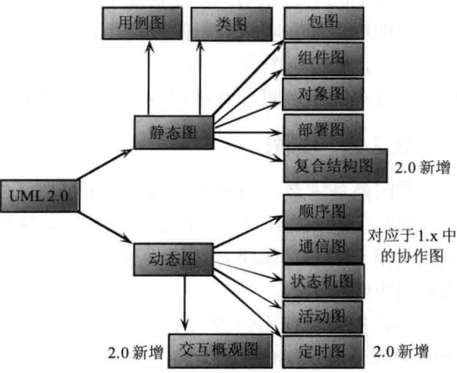
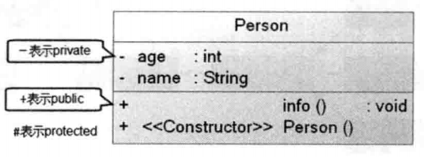
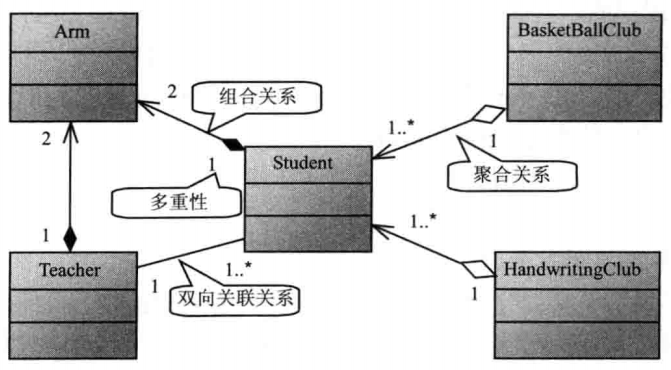
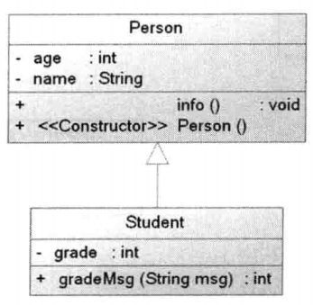
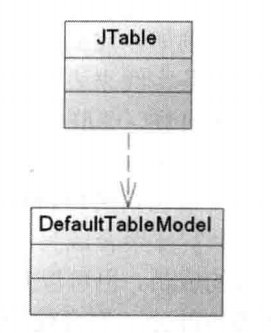

## UML——统一建模语言 概述 ##
面向对象软件开发需要经过OOA（面向对象分析）、OOD（面向对象设计）、OOP（面向对象编程）三个阶段。

OOA和OOD的分析、设计结果需要统一的符号来描述、交流并记录，UML就是这种用于描述、记录OOA 和 OOD结果的
符号表示法。

UML是一种定义良好、易于表达、功能强大且普遍适用的建模语言。

UML图大致可分为静态图和动态图，如下所示：

如上，UML2.0 版本一共包括13种正式图形：

	活动图 activity diagram
	类图  class diagram
	通信图  communication diagram
	组件图  component diagram
	复合结构图  composite structure diagram
	部署图  deployment diagram
	交互概观图  interactive overview diagram
	对象图 object diagram
	包图  package diagram
	顺序图（时序图）  sequence diagram
	状态机图  state machine diagram
	定时图  timing diagram
	用例图 use case diagram

其中类图、顺序图（时序图）较为常用。

## 类图 ##
类图用于表示系统中应该包含哪些实体、各实体之间如何关联。它显示了系统的静态结构。

类图中类的表示方法如下图：

在类图中一个类可以用三个矩形部分表示：
最上面的部分显示类名；中间部分描述类的属性（成员变量）；最下面部分描述类的方法（包括构造方法）

类图除了可以描述一个实体类的内部结构外，还可以描述实体类之间的相互关系。
类之间有三种基本关系：

	关联（包括聚合、组合）
	泛化（就是继承）
	依赖

**关联**
关联具有方向性：如果仅能从一个类单方向地访问另一个类，则被称为单向关联；如果两个类可以相互访问，则被称为
双向关联。

一个对象能访问关联对象的数目被称为多重性。

关联使用一条实现表示，带箭头的实线表示单向关联。

关联关系中有两种特例：聚合、组合。这两种特例表示部分和整体的关系，通常认为组合比聚合更加严格。
聚合使用带空心菱形框的实线表示；组合使用带实心菱形框的实线表示。举例如下：

（1...*表示一个或多个）
如上图，其中的类都没有表现出属性、方法等特性。这是因为上图的重点在于表现类之间的关系。实际的类图中可能
会为类添加属性、方法等细节。

**泛化（继承类、实现接口）**
泛化与继承是同一个概念，另外，类实现接口可视为一种特殊的继承。
类之间的继承关系使用带空心三角形的实线表示；类实现接口使用带空心三角形的虚线表示。

（上图只是类与类之间的继承关系）

**依赖**
如果一个类的改动会导致另一个类的改动，则称这两个类之间存在依赖关系。通常依赖是单向的，当数据表现和数据
模型分开设计时，数据表现依赖于数据模型（数据模型被数据表现依赖）。
依赖关系使用带箭头的虚线表示，箭头指向被依赖的实体（数据模型）。

依赖常见的场景：改动的类将消息发给另一个类；改动的类以另一个类作为数据部分；改动的类以另一个类作为操作
参数。

