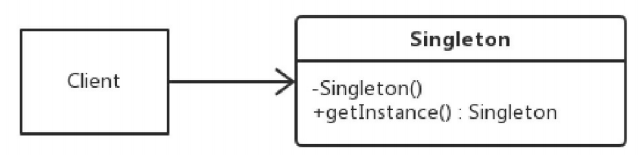

# 面向对象的六大原则 #
## 单一职责原则 —— 优化代码的第一步 ##
单一职责原则（Single Responsibility Principle， SRP）就是指：
对于一个类，应该仅有一个引起它变化的原因。

一个类应该是一组相关性很高的函数、数据的封装。两个完全不一样的功能不应该放在一个类中。

如何划分一个类、一个函数的职责，视个人经验，以及具体的业务逻辑而定。
工程师应该不断地审视自己的代码，根据具体的业务、功能对类进行相应的拆分，这就是代码优化的第一步。

## 开闭原则 —— 让程序更稳定、更灵活 ##
开闭原则（Open Close Principle， OCP）就是指：
软件中的对象（类、模块、函数等）应该对于扩展是开放的。但是，对于修改是封闭的。

在软件的生命周期内，因为变化、升级和维护等原因，需要对软件原有代码进行修改时，可能会将错误引入原本已经
经过测试的旧代码中，破坏原有系统。因此，当软件需要变化时，应该尽量通过扩展的方式来实现变化，而不是通过
修改已有的代码来实现。

扩展的方式涵盖了抽象和继承，即对于一个已存在的类，应该将可能变化的功能，以提供接口方法的形式暴露出来，
当需要对这个类的功能做变化时，无须修改此类，而是通过继承这个类，在新建的子类中重写父类的接口方法实现变
化。

OCP原则并不是说绝对不可以修改原始类。当我们嗅到原来的代码的“腐化气味”时，应该尽早重构，以便代码恢复到
正常的“进化”过程，而不是通过继承等方式添加新的实现，这样只会导致类型的膨胀以及历史遗留代码的冗余。

在开发过程中需要结合具体情况进行考量，是通过修改旧代码还是通过继承，才能使得软件系统更稳定、灵活。

## 里氏替换原则 —— 构建扩展性更好的系统 ##
里氏替换原则（Liskov Substitution Principle， LSP）可以定义为：
如果对每一个类型为Sub的对象O1，都有类型为Base的对象O2，使得以Base定义的所有程序Program中，当所有的
对象O1都代换成O2时，程序Program的行为没有发生变化，那么类型Sub就是类型Base的子类型。
即所有引用基类的地方必须能透明地使用其子类的对象。

里氏替换原则其实就是利用继承、多态这两大特性，实现了抽象。

里氏替换原则说明了，只要父类能出现的地方，子类就可以出现，而且替换为子类也不会产生任何错误或异常。
但是，反过来却不行：有子类出现的地方，父类未必就能适应。

里氏替换原则的核心原来就是抽象。抽象依赖于继承这个特性。在OOP当中，继承的优缺点如下：
1. 继承的优点：
	- 代码重用，减少创建类的成本，每个子类都拥有父类的方法和属性；
	- 子类与父类基本类似，但又区别于父类；
	- 提高代码的可扩展性

2. 继承的缺点：
	- 继承是侵入性的，只要继承就必须拥有父类的属性和方法
	- 可能造成子类代码的冗余、灵活性降低，这是因为子类必须拥有父类的属性和方法。

**里氏替换原则和开闭原则的关系**
开闭原则和里氏替换原则往往是生死相依、不离不弃的。通过里氏替换来达到对扩展开放，对修改关闭的效果。
这两个原则都强调了OOP的一个重要特性 —— 抽象。因此，在开发过程中，运用抽象是走向代码优化的重要一步。

## 依赖倒置原则 —— 让项目拥有变化的能力 ##
依赖倒置原则（Dependence Inversion Principle， DIP）指代一种特定的解耦形式，使得高层次的模块不依赖
于低层次的模块的实现细节。

依赖倒置原则有以下几个关键点：
- 高层模块不应该依赖底层模块，两者都应该依赖其抽象。
- 抽象不应该依赖细节
- 细节应该依赖抽象

Java中，抽象就是指接口或抽象类；细节是指实现接口或继承抽象类的实现类。
依赖倒置原则在Java中的表现就是： 模块间的依赖通过抽象发生，实现类之间不发生直接的依赖关系，其依赖关系
是通过接口或抽象类产生的。也就是说依赖倒置原则就是指描写接口编程，或面向抽象编程。

## 接口隔离原则 —— 系统有更高的灵活性 ##
接口隔离原则（Interface Segregation Principle， ISP）是指：
客户端不应该依赖它不需要的接口。即类之间的依赖关系应该建立在最小的接口上。

接口隔离原则将非常庞大、臃肿的接口拆分成更小的、更具体的接口，这样客户只需要知道他们感兴趣的接口方法
即可。

## 迪米特原则 —— 更好的可扩展性 ##
迪米特原则（Law of Demeter， LOD）也称最少知识原则（Least Knowledge Principle， LKP）。指的是
一个软件实体应该尽可能少地与其他软件实体发生相互作用。
一个类内部如何实现与调用者或依赖着没有关系，调用者或依赖者只需要知道这个类提供的方法即可。

如果两个对象之间不必彼此直接通信，那么这两个对象就不应该发生任何直接的相互作用，当其中一个对象需要调用
另一个对象的方法时，应该通过引入一个合适的第三者来降低这两个对象之间的耦合。

迪米特原则要求我们：
- 在类的划分上，应当尽量创建松耦合的类。类之间的耦合度降低，就越有利于复用。一个处在松耦合中的类一旦被
修改，则不会对关联的类造成太大的波及。

- 在类的结构上，每个类都应当尽量降低成员变量和成员方法的访问权限

- 在对其他类的引用上，一个对象对其他对象的引用应当降到最低。

# 设计模式分类 #
GoF提出的设计模式总共有23种，根据目的准则分为三大类：
1. 创建型设计模式，共5种：
	1. 单例模式
	2. 工厂方法模式
	3. 抽象工厂模式
	4. 建造者模式
	5. 原型模式

2. 结构型设计模式，共7种：
	1. 适配器模式
	2. 装饰模式
	3. 代理模式
	4. 外观模式
	5. 桥接模式
	6. 组合模式
	7. 享元模式

3. 行为型设计模式，共11种：
	1. 策略模式
	2. 模板方法模式
	3. 观察者模式
	4. 迭代器模式
	5. 责任链模式
	6. 命令模式
	7. 备忘录模式
	8. 状态模式
	9. 访问者模式
	10. 中介者模式
	11. 解释器模式

## 单例模式 ##
定义： 保证一个类仅有一个实例，并提供一个访问此实例的方法。

**实现一个单例类的关键点**
1. 构造方法不对外开放，通过private访问修饰符修饰
2. 通过静态方法或枚举返回单例类对象
3. 确保单例类的对象有且只有一个，尤其在多线程环境下
4. 确保单例类对象在反序列化时不会重新构建对象

单例模式的使用场景：
- 整个项目需要一个共享访问点或共享数据
- 创建一个对象需要耗费的资源过多，如访问I/O或者数据库等资源
- 工具类对象

单例模式的缺点：
- 单例对象如果持有Context，那么容器引发内存泄漏，此时需要注意传递给单例对象的Context最好是
Application Context

单例模式有6中写法：

**饿汉式**
饿汉式就是声明并初始化一个单例类类型的静态成员变量，并用final修饰，表示不能再赋值。
然后在静态方法getInstance中直接返回此单例类类型的类变量。

	public class Singleton {
	
		private static final Singleton sInstance = new Singleton();
                                                                 
		private Singleton(){};

		public static Singleton getInstance(){
			return sInstance;
		}		
	}

此方式在类加载时完成初始化，所以类加载较慢，但获取对象的速度快。
因为此方式基于类加载机制，所以避免了多线程的同步问题。
但是，如果从始至终都没有使用过这个实例时，则会造成内存的浪费。

**懒汉式（线程不安全）**
懒汉模式就是只声明一个单例类类型的类变量，但不做初始化。当调用静态方法getInstance时再为此类变量做
初始化，然后再返回此类变量

	public class Singleton {
	
		private static Singleton sInstance;

		private Singleton(){};

		public static Singleton getInstance(){
			if (sInstance == null) {
				sInstance = new Singleton();
			}
			return sInstance;
		}		
	}

此懒汉式中，声明了一个静态对象，在用户第一次调用时初始化。虽然节约了资源，但第一次加载时需要实例化，所
以反应稍慢。另外，因为是线程不安全的，所以在多线程时不能正常工作。

**懒汉式（线程安全）**

	public class Singleton {
	
		private static Singleton sInstance;

		private Singleton(){};

		public static synchronized Singleton getInstance(){
			if (sInstance == null) {
				sInstance = new Singleton();
			}
			return sInstance;
		}		
	}

这种写法保证了线程安全，但每次调用getInstance时，都需要进行同步，这回造成不必要的同步开销，而且大部分
情况下是用不到同步的，所以，不建议用这种方式。

**双重检查式（Double Check Lock， DCL）**

	public class Singleton {
	
		private static Singleton sInstance;

		private Singleton(){};

		public static Singleton getInstance(){
			if (sInstance == null) {
				synchronized (Singleton.class) {
					if (sInstance == null) {
						sInstance = new Singleton();
					}
				}
			}
			return sInstance;
		}		
	}

如上，getInstance方法中对mInstance进行了两次判空：
第一次判空是为了避免不必要的同步；第二次判空则是为了在null的情况下创建实例。

如上的DCL方式可能会由于JVM在运行时指令重排序产生一些问题，此时，需要使用到volatile关键字：

	public class Singleton {
	
		private volatile static Singleton sInstance;

		private Singleton(){};

		public static Singleton getInstance(){
			if (sInstance == null) {
				synchronized (Singleton.class) {
					if (sInstance == null) {
						sInstance = new Singleton();
					}
				}
			}
			return sInstance;
		}		
	}

DCL的优点是资源利用率高。缺点是第一次加载稍慢，且在高并发环境下也有一定的缺陷。
建议采用如下的静态内部类方式代替DCL方式

**静态内部类方式（holder方式）—— 推荐使用 **
	
	public class Singleton {

		private Singleton(){};

		public static Singleton getInstance(){
			
			return SingletonHolder.sInstance;
		}	

		private static class SingletonHolder {
			private static final Singleton sInstance = new Singleton();
		}	
	}

如上，第一次加载Singleton类时并不会初始化sInstance，只有第一次调用getInstance方法时，JVM才会加载
SingletonHolder并初始化sInstance。这样不仅能确保线程安全，也能保证Singleton类的唯一性。

**枚举方式**

	public enum Singleton {
		INSTANCE;
	}

枚举单例的优点就是简单。

----
对于以上讲的几种单例模式的实现方式，存在一种情况会重新创建对象，那就是反序列化。
此时可以通过重写readResolve()方法控制对象的反序列化，返回之前创建的实例对象。