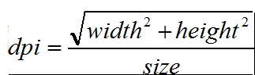
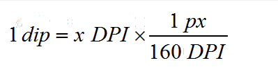
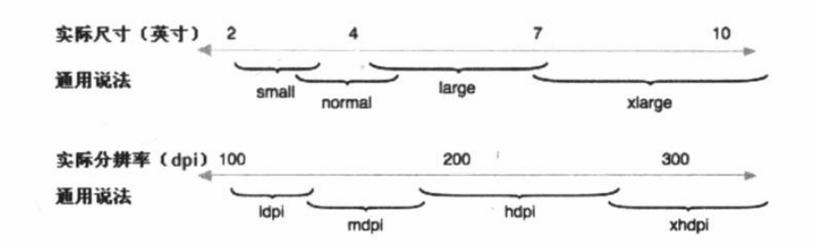

# 屏幕的尺寸信息 #
首先介绍下相关的长度单位

	英寸（inch，缩写in） ： 1 英寸 = 2.54 厘米

	英尺（foot） ：  1 英尺 = 12 英寸

	密耳（mil） ：  1 密耳 = 1/1000  英寸

## 屏幕参数 ##
### 屏幕大小（屏幕尺寸） ###

	指屏幕对角线的长度，通常使用 英寸 来度量，
	如4.7英寸手机，5.5英寸手机 （有时也直接把英寸简称为寸，不同于中国市制的寸）

### 屏幕分辨率 ###

	分辨率指手机屏幕的像素点个数，
	如 720x1280 就是指屏幕分辨率，
	其中720表示宽有720个像素点；1280表示高有1280个像素点

### 屏幕像素密度（屏幕密度） DPI （Dots Per Inch） ###
在Android系统中我们使用 DPI （Dots Per Inch，每英寸的点数）来描述屏幕密度。
屏幕密度DPI和屏幕大小size，以及屏幕分辨率 with dp x height dp，满足如下公式：
由屏幕对角线的像素点数除以屏幕大小得到，即对于屏幕大小为4.7英寸，分辨率为720dpx1280dp的手机，DPI为：

所以对于屏幕大小为4.7英寸，分辨率为720dpx1280dp的手机，屏幕密度约为312dpi
	
另外还有一个PPI（Pixels Per Inch）的概念，它和DPI的区别如下：

	PPI 可以理解为图片的像素密度，即一张图片中，每英寸长度范围内包含了多少个像素点

	DPI 可以理解为屏幕的像素密度，即一块屏幕上，每英寸长度范围内能显示多少个像素点，

因为对于屏幕尺寸相同，屏幕分辨率不同的两块屏幕，分辨率高的屏幕DPI大。
而DPI越大，说明每英寸长度范围内能显示的像素点数越多，也就是说显示像素点个数相同的图片，在DPI大的屏幕中占的位置范围比在DPI小的屏幕中所占用的少。
所以，在不拉伸图片的情况下，将同一张图片放在这两块屏幕中显示，DPI大的屏幕所显示出来的图片比DPI小的屏幕所
显示出来的图片更小。

### 独立像素密度 dip （长度单位） ###
对于如上情况，为了能让同一张图片在DPI不同的两块屏幕中以相同的大小来显示（暂时不考虑清晰度），我们就需要规
定一个长度单位来指定图片在DPI不同的屏幕中的相同显示大小。
如果长度单位定义为px像素点，由于DPI不同的屏幕每英寸长度内像素点个数不同，那么相同px单位长度的图片
在不同DPI屏幕中的显示大小还是不同的，不能满足要求。

要想在不同DPI屏幕中实现相同大小的显示，那么长度单位必须跟DPI相关，所在Android中重新定义了一个长度
单位：
	
	dip （Density Independent Pixels，独立像素密度，还可以写为dp）

虽然名称看起来跟像素无关，其实dp长度单位就是用来描述在不同的DPI屏幕密度的屏幕上，为了显示出相同大小
的图片，需要换算出的px像素点个数。
	
	在Android中，规定屏幕像素密度为 160DPI 时， 1dip = 1px，
	并且DPI越大，1dip 能换算到的 px 像素点越多

于是，对于任意屏幕像素密度 x DPI，dip和px之间有如下换算公式：

### Android 屏幕参数相关的API ###
通过DisplayMetrics类可以获取到屏幕的分辨率（宽的像素长度，高的像素长度）、屏幕像素密度DPI、
不同DPI下dx和px的换算比例等屏参信息：

	DisplayMetrics dm = context.getResources().getDisplayMetrics();

	float density = dm.density;  //不同DPI下，dp和px之间的换算比例。如480DPI下：density=3

	float scaledDensity = dm.scaledDensity // sp和px之间的换算比例，用于文字长度。通常等于density

	int densityDpi = dm.densityDpi; //屏幕像素密度DPI，如 densityDpi=480

	int widthPixels = dm.widthPixels; //宽的px像素长度

	int heightPixels = dm.heightPixels; //高的px像素长度

另外通过TypedValue类的applyDimension方法，可以把dp单位或sp单位的数值转换成单位是px的数值：

	DisplayMetrics dm = context.getResources().getDisplayMetrics();

	float pxValue = TypedValue.applyDimension(TypedValue.COMPLEX_UNIT_DIP, dpValue, dm);

	float pxValue = TypedValue.applyDimension(TypedValue.COMPLEX_UNIT_SP, spValue, dm);
	
## 使用res/drawable-mdpi|drawable-hdpi等目录存放不同尺寸的图片 ##
根据dip和px之间在不同DPI下的换算公式，不同DPI屏幕中 dip 和 px 的对应关系（换算比例）如下：

	120 dpi ：  1dp = 0.75px

	160 dpi ：  1dp = 1px

	240 dpi ：  1dp = 1.5px

	320 dpi ：  1dp = 2px
		
	480 dpi ：  1dp = 3px

	640 dpi ：  1dp = 4px

如上，在DPI不同的屏幕上以相同的大小显示同一张图片时，我们只需要在代码中为此图片设置同样的dp单位的长度即
可。但是，DPI越大，1dp长度能换算到的px像素长度就越多，也就是说，同一张图片在DPI越大的屏幕上被拉伸的越多
，此时，图片的失真程度就越严重。
为了避免图片在不同DPI屏幕上的失真，我们就需要为不同DPI屏幕的手机提供不同尺寸的图片。那么这些图片放在
Android应用中的什么位置？怎么来区分多大的DPI屏幕应该使用多大尺寸的图片呢？
Android系统规定如下：

	res/drawable-mdpi    中放置适配屏幕密度 ≤160dpi 的图片

	res/drawable-hdpi    中放置适配屏幕密度 ≤240dpi 的图片

	res/drawable-xhdpi   中放置适配屏幕密度 ≤320dpi 的图片

	res/drawable-xxhdpi  中放置适配屏幕密度 ≤480dpi 的图片

	res/drawable-xxxhdpi 中放置适配屏幕密度 ≤640dpi 的图片 

因为DPI越大，1dp对应的像素越多。所以，DPI越大的屏幕，需要提供的图片尺寸就越大，
图片尺寸在不同DPI屏幕中放大的倍数由dp和px在不同DPI下的对应比例决定，如：
	
	如果mdpi屏幕中用到的图片尺寸为 48x48，那么hdpi中的图片尺寸为 48*1.5x48*1.5 = 72x72，
	xhdpi中的图片尺寸为 48*2x48*2 = 96x96 ， ...

# 屏幕适配 #
屏幕适配时，需要考虑几个方面：

	屏幕尺寸：  屏幕尺寸可分为  small  小屏幕
							 normal 中等屏幕
							 large  大屏幕
							 xlarge 超大屏幕

	屏幕分辨率： 屏幕分辨率可分为   ldpi  低分辨率
								mdpi   中等分辨率
								hdpi   高分辨率
								xhdpi  超高分辨率
								xxhdpi  超超高分辨率

不同屏幕尺寸、不同分辨率对应的通用说法如下图：

上面的4种屏幕尺寸需要满足一个最低分辨率（以dp为单位）：

	small 屏幕尺寸至少需要 320dp*426dp

	normal 屏幕尺寸至少需要  320dp*470dp

	large 屏幕尺寸至少需要  480dp*640dp

	xlarge 屏幕尺寸至少需要 720dp*960dp

为了做到屏幕适配，最简单的做法就是为不同屏幕尺寸、不同屏幕分辨率的手机提供不同的资源目录，用于放置对应的布局资源文件、
Drawable资源文件：

	针对不同屏幕分辩率，可以为 drawable目录增加后缀 -ldpi、-mdpi、-hdpi、xhdpi。
		分别放置不同屏幕分辨率下的图片文件。

	针对不同屏幕尺寸，可以为layout、values等目录增加后缀 -small、-normal、-large、-xlarge。
		分别放置不同屏幕尺寸下的布局文件和dimens.xml等资源文件

	另外还可以针对不同的屏幕方向，为layout、values等目录增加后缀 -land、-port。
		分别放置横屏、竖屏下的布局文件和dimens.xml等资源文件。

从Android 3.2 (API 13) 开始，Android建议直接使用真实的屏幕尺寸来定制drawable、layout、values等
资源目录，并放置对应的资源文件：
	
	在drawable、layout、values等目录后添加：
			-sw<N>dp 表示屏幕尺寸至少宽度为 Ndp 时才能使用该目录下的资源；
			-w<N>dp  表示屏幕尺寸可用宽度为 Ndp 时才能使用该目录下的资源。

	如layout-sw600dp 表示当设备屏幕的宽度 ≥ 600dp 时使用该目录下的布局文件。

思考：存在layout-normal和layout-large两个文件夹，对于分辨率为768x1280，屏幕密度320dpi的手机A，和
		分辨率为720x1280，屏幕密度为240dpi的手机B，分别应该选择哪个layout目录下的资源文件？

根据公式 ： 

手机A的屏幕尺寸约为4.39英寸（normal），手机B的屏幕尺寸约为6.12英寸（large），
所以尽管手机B的分辨率较低于手机A，但手机B的屏幕密度比手机A的更小，所以手机B的像素点分布的更散，即屏幕尺寸更大。

	