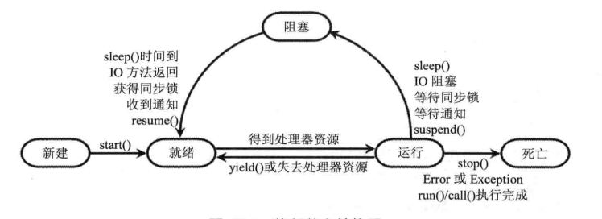

几乎所有的操作系统都支持同时运行多个任务，一个任务通常就是一个程序，
每个运行中的程序就是一个进程（Process）。
当一个程序运行时，内部可能包含了多个顺序执行流，每个顺序执行流就是一个线程

## 进程 ##
几乎所有的操作系统都支持进程的概念。
当一个程序进入内存运行时，即变成了一个进程。所以进程就是处于运行状态下的程序。
并且进程具有一定的独立功能，即进程是系统进程资源分配和调度的一个独立单位。

一般而言，进程有如下三个特征：

	独立性：进程可以拥有自己独立的资源，每个进程都拥有自己私有的地址空间。
			在没有经过进程本身允许的情况下，一个用户进程不能直接访问其他进程的地址空间

	动态性：进程与程序的区别在于，程序只有一个静态的指令集合。而进程是一个正在系统中活动的指令集合。
			进程中加入了时间的概念，一个进程具有自己的生命周期和各种不同的状态，这些是程序不具备的。

	并发性： 多个进程可以在同一个处理器上并发执行。多个进程之间不会相互影响

并发性（concurrency）不同于并行性（parallel），
并行是指在同一时刻，有多条指令在多个处理器上同时执行
并发是指在同一时刻，只有一条指令在一个处理器上执行，但是不同时刻，这个处理器会快速轮换执行多条指令，而
多条指令可以来自于多个进程。
所以，并发性可以在宏观上让一个处理器具有使多个进程同时执行的效果

## 线程 ##
线程是进程的组成部分，一个进程可以有多个线程，一个线程也必须存在于一个进程中。
线程是进程的执行单元，当进程被初始化后，该进程的主线程就被创建了。
多线程的使用可以在一个进程中并发处理多个任务

就像进程在操作系统的中的地位一样，线程在程序中是独立的，并发的的执行流。
线程是独立运行的，它不知道进程中是否还有其他线程存在；
线程的执行是抢占式的，即当前运行的线程在任何时候都可能被挂起，以便另一个线程可以运行。

类似于同一时刻，一个处理器中只能有一个进程中的指令在执行那样，同一时刻一个执行的进程中，也只能有一个
线程在执行。类似于不同时刻，一个处理器会快速轮换执行多个进程中的不同指令那样，任何时刻，一个进程中当前
正在执行的线程也会被挂起，切换执行另外一个线程。

线程可以拥有自己的堆栈，自己的程序计数器和自己的局部变量，但线程不能拥有直属于进程的资源，它只能跟其他
线程一起共享直属于进程的资源。
所以，在编程时，一定要确保一个线程对直属于进程的资源的操作，不会对需要访问此资源的其他线程产生影响。

**进程和线程的概要**
操作系统可以同时执行多个任务，每个任务就是一个进程。进程中也可以同时执行多个任务，每个任务就是一个线程

## 抢占式调度策略 ##
CPU在处理多线程的并发执行时，线程调度的细节取决于底层平台所采用的策略。
对于采用抢占式策略的系统，系统会给每个可执行的线程分配一个小时间段来执行线程任务，当该时间段用完后，
系统就会剥夺该线程所占用的资源，让其他线程获取执行的机会。在选择下一个线程时，系统会考虑线程的优先级。

对于采用协作式调度策略的系统，只有当一个线程调用了它的sleep()或yield()方法后，才会放弃所占用的资源。
也就是说必须由该线程主动放弃所占用的资源。

## 多线程优势 ##
进程在执行过程中拥有独立的内存单元，而进程中的多个线程可以共享进程的内存，从而极大地提高程序的运行效率

进程之间不能共享内存，但一个进程中的多条线程可以共享此进程的虚拟空间。
线程共享的进程资源包括：进程代码段，进程公有数据等。通过共享这些资源，线程很容器实现相互之间的通信

当操作系统创建一个进程时，必须为该进程分配独立的内存空间，和大量的相关资源。
但创建一个线程则简单很多。所以使用多线程实现任务的并发执行，比使用多进程实现并发的性能要高得多

另外Java语言内置了多线程功能支持，而不是单纯地作为底层操作系统的调度方式，从而简化了Java的多线程编程

## 多线程的应用 ##
浏览器同时下载多个图片；
Web服务器同时响应多个用户请求；
Java虚拟机本身在后台提供的进行垃圾回收的超级线程；
图形界面（GUI）应用中启动单独的线程收集用户界面事件
...

## Java提供的线程 API ##
Thread.run()方法称为线程执行体，Thread.start()方法用于启动线程

Java程序运行时默认的主线程的执行体就是main()方法。

默认情况下Thread.getName()获取到的主线程名为main，其他子线程n的名字为Thread-n

使用继承Thread类的方法来创建线程类时，多个线程之间无法共享线程类的非静态成员变量。
因为通过new 来创建线程类对象时，每个线程中的线程类对象都不同

通过自定义一个继承自Runnable接口的子类MyRunnable，实现run方法。通过Thread(Runnable)构造方法来
创建多线程，参数Runnable使用同一个MyRunnable对象。这样，对于MyRunnable中定义的非静态成员变量，在
不同的多个线程中通过访问同一个MyRunnable对象进行共享。

调用start()方法执行使用Thread(Runnable target)构造方法创建的线程时，虽然把Runnable对象的run()方法
作为线程执行体，但在此run()方法中，Thread.currentThread()返回的当前线程对象仍然是Thread实例，而
不是Runnable实例。
这是因为线程执行时最开始调用的还是Thread.run()方法，只不过在Thread.run方法中把Runnable对象target的
run方法包装成了线程执行体而已。

	@Override
    public void run() {
        if (target != null) {
            target.run();
        }
    }

### 使用Callable和Future创建线程 ###
不管是直接继承Thread类创建线程，还是实现Runnable接口创建线程，线程执行体都是`void run()`方法，
run方法作为线程执行体存在两个缺点：

	一是不能在run方法体中通过throw关键字抛出异常，
	二是run方法没有线程执行结束后的返回值

于是从Java 5开始，Java提供了Callable<V>接口，该接口提供方法`V call() throws Exception`作为线程
执行体，从call方法的定义中可以看到它既有返回值，又能在方法体中抛出异常。

开启一个线程是通过Thread.start()方法实现的，所以我们不能直接调用Callable.call方法获取返回值，
因此必须还要在其他类中定义方法来获取call方法的返回值。Java为我们提供了这样的一个接口 Future<V>。
在Future类中除了提供get方法获取Callable.call的返回值外，还提供了cancel方法用于取消线程任务，
提供isDone方法判断线程任务是否完成，isCancelled方法判断是否取消了任务

像Runnable.run方法那样，只有在Thread.run方法中调用了它，才能成为线程执行体。所以也要想办法在
Thread.run方法中调用Callable.call方法才行，即使是间接调用call方法也可以。
而Thread提供的构造方法中只接受实现了Runnable接口的对象作为target。

综上必须定义一个类，使它既实现了Future接口，又实现了Runnable接口，这样才能把Callable.call方法作为
线程执行体，并且获取到call方法的返回值。
Java提供了FutureTask<V>类来满足我们的要求，它的构造方法中需要接受一个实现了Callable接口的对象，
这样，我们就把Callable对象的call方法作为了线程执行体，并通过get方法返回call方法的返回值。

FutureTask<V>类的部分实现方式如下：

	public class FutureTask<V> implements RunnableFuture<V>

	private Callable<V> callable;

	private Object outcome;

	public FutureTask(Callable<V> callable) {
        if (callable == null)
            throw new NullPointerException();
        this.callable = callable;
        this.state = NEW;       // ensure visibility of callable
    }

	public void run() {
        ...
        try {
            Callable<V> c = callable;
            if (c != null && state == NEW) {
                V result;
                boolean ran;
                try {
                    result = c.call();
                    ran = true;
                } catch (Throwable ex) {
                    result = null;
                    ran = false;
                    setException(ex);
                }
                if (ran)
                    set(result);
            }
        } 
		...
    }

	protected void set(V v) {
        ...
            outcome = v;
            ...
            finishCompletion();
        ...
    }

	public boolean cancel(boolean mayInterruptIfRunning) {
        ...
        try {    // in case call to interrupt throws exception
            if (mayInterruptIfRunning) {
                try {
                    Thread t = runner;
                    if (t != null)
                        t.interrupt();
                } finally { // final state
                    U.putOrderedInt(this, STATE, INTERRUPTED);
                }
            }
        } finally {
            finishCompletion();
        }
        ...
    }

	private void finishCompletion() {
        ...
        done();
		...
    }

	protected void done() { }

如上，我们可以自定义FutureTask<V>，重写done()方法，在方法中处理线程结束后的逻辑

### 创建多线程的优选方式 ###
通常，推荐采用实现Runnable接口，或Callable接口的方式（FutureTask）来创建多线程。原因如下：

线程类只是实现了Runnable接口或Callable接口，还可以继承其他类。
通过new Thread(Runnable target)方法创建多线程，可以让多个线程共享同一个target对象。非常适合
多线程访问共享数据的情况。此方式将CPU、代码和数据分开，形成清晰的模式，较好地体现了面向对象的思想。

其实实现Callable接口的方式也还是利用了Runnable接口，只不过是改变了线程执行体方法。

## 线程的生命周期 ##
从new Thread创建一条线程开始，这条线程经过的生命周期状态如下：
	
	新建（New）  使用new关键字创建线程之后，该线程就处于新建状态，此状态下的线程仅仅是由Java虚拟机
					为其分配了内存，并初始化了成员变量的值。

	就绪（Runnable）  调用线程对象的start()方法后，该线程立即进入就绪状态。
						就绪状态相当于"等待执行"，但该线程还未进入运行状态，因为CPU并不会在此线程
						对象调用start()方法后，就马上将当前正在执行的其他线程挂起，切换到此线程来
						执行。CPU可能会在很小的一段时间内继续执行当前线程，然后再切换到此线程来执行
						如果希望在调用子线程的start方法后立即开始执行此子线程，可在调start方法后，
						再使用Thread.sleep(1)来让当前运行的线程睡眠1ms。因为CPU是不会空闲的，所以
						在只存在当前线程和此子线程的情况下，当前线程睡眠后，CPU就立即切换到此子线程
						执行了。
						
	运行（Running）  运行状态就是在就绪状态中的线程获得了CPU，并开始执行Thread.run()方法。

	阻塞（Blocked）  运行状态中的线程被中断，则进入阻塞状态。
						当前正在执行的线程被阻塞之后，其他线程就可以获得执行的机会。
						被阻塞的线程会在合适的时候重新进入就绪状态，等待线程调度器再次调度此线程。
						只有此线程被调度并使用CPU执行时，才会进入运行状态。

	死亡（Dead）		线程结束后，就处于死亡状态。通过isAlive方法可判断线程是否死亡
					结束线程由三种方式：
						run()或call方法执行完成，线程正常结束；
						线程抛出一个未捕获的Exception或Error
						直接调用该线程的stop方法结束该线程。stop方法容易导致死锁，不建议使用。

只能对处于新建状态的线程调用start方法，否则引发IllegalThreadStateException。即一个线程对象只能启动
一次线程。

因为当线程启动以后，不可能一直占用着CPU运行，CPU会在多条线程之间切换多次，所以线程状态也会多次在运行、
阻塞之间切换。

**线程在运行状态和阻塞状态之间切换的情形**

	线程由运行状态切换到阻塞状态的情况            线程由阻塞状态切换到就绪状态的情况

	线程调用sleep方法主动放弃占用的CPU资源        调用sleep方法的线程经过了指定时间

	线程调用了一个阻塞式IO方法，       			  线程调用的阻塞式IO方法已经返回
	在该方法返回之前，该线程被阻塞

	线程试图获取一个同步监视器，但该同步			  线程成功获得了试图取得的同步监视器
	监视器正在被其他线程所持有

	线程在等待某个通知（notify）				  其他线程发出了这个通知

	调用线程的suspend方法将该线程挂起			  处于挂起状态的线程被调用了resume方法恢复
	此方法容易导致死锁，不建议使用				  

## 控制线程的API ##

### thread.join() ###
join()方法用于让一个线程等待另一个线程执行结束。

在当前线程中，调用另一个线程的join()方法后，会让当前线程进入阻塞状态，
直到另一个线程执行结束或者经过join方法参数指定的时间，当前线程才会重新进入就绪状态

### 后台线程（守护线程） thread.setDaemon(true) ###
后台线程又称守护线程，或精灵线程。它的任务就是为其他线程提供服务。

JVM的垃圾回收线程就是典型的后台线程。

后台线程的特征：如果所有的前台线程都死亡，那么后台线程会自动死亡。
前台线程死亡后，JVM会通知后台线程死亡，但从它接收指令到做出响应，需要一定时间。

调用Thread的setDaemon(true)，可以将线程设置为后台线程。
要将某个线程设置为后台线程，必须在调start()方法启动线程之前设置，
否则引发IllegalThreadStateException

主线程默认是前台线程。但不是所有的线程都默认是前台线程。
前台线程创建的子线程默认是前台线程；后台线程创建的子线程默认是后台线程。

通过Thread的isDaemon()方法可以判断线程是否为后台线程。

### 线程睡眠 Thread.sleep(long) ###
当线程调用sleep方法进入阻塞状态后，在睡眠时间内，该线程不会获取执行的机会，
即使系统中没有其他执行的线程，处于sleep中的线程也不会执行。

sleep方法常用来暂停线程的执行。

# 线程池 #
系统启动一个新线程的成本是比较高的，因为它涉及与操作系统的交互。
使用线程池可以很好地提高性能，尤其当程序中需要创建大量生存期很短暂的线程时，更应该考虑使用线程池。
使用线程池可以有效地控制系统中并发线程的数量，当系统中包含大量并发线程时，会导致系统性能剧烈下降，
甚至导致JVM崩溃，而为线程池设置的最大线程数参数可以控制系统中并发线程数不超过此参数值。

从Java 5开始，Java内建支持线程池，通过Executors工厂类来产生线程池，该工厂类提供如下静态方法创建线程
池：

	public static ExecutorService newCachedThreadPool()

	public static ExecutorService newFixedThreadPool(int nThreads)

	public static ExecutorService newSingleThreadExecutor()

	public static ScheduledExecutorService newScheduledThreadPool(int corePoolSize)

	public static ScheduledExecutorService newSingleThreadScheduledExecutor()

ExecutorService代表一个线程池，它可以执行Runnable对象或Callable对象所代表的线程；
ScheduledExecutorService线程池是ExecutorService的子类，它可以在指定延迟时间后执行线程任务。

ExecutorService代表尽快执行线程的线程池，即只要线程池中有空闲线程，就立即执行线程任务。程序只要将一个
Runnable对象或Callable对象提交给该线程池，该线程池就会尽快执行线程任务。ExecutorService相关API如下：

	<T> Future<T> submit(Callable<T> task);
		//将一个Callable对象提交给线程池，线程池将在有空闲线程时执行Callable对象代表的线程任务。
			Future代表Callable对象里call()方法的返回值。

	Future<?> submit(Runnable task);
		//将一个Runnable对象表示的线程任务提交给线程池。线程池将在有空闲线程时执行Runnable对象代表
			的线程任务。
		//Future代表Runnable任务的返回值，但run()方法是没有返回值的，所以Future对象将在run方法执行
			结束后返回null，但可以调用Future的isDone(), isCancelled方法获取Runnable对象的执行状态

	<T> Future<T> submit(Runnable task, T result);
		//将一个Runnable对象表示的线程任务提交给线程池。线程池将在有空闲线程时执行Runnable对象代表
			的线程任务。
		//参数result显示指定线程执行结束后的返回值，所以Future对象将在run()方法执行结束后返回result

ScheduledExecutorService代表可在指定延迟时间后，或周期性地执行线程任务的线程池，它提供的相关API如下：

	public ScheduledFuture<?> schedule(Runnable command,
                                       long delay, TimeUnit unit);
		//指定command任务将在delay延迟后执行

	public <V> ScheduledFuture<V> schedule(Callable<V> callable,
                                           long delay, TimeUnit unit);
		//指定callable任务将在delay延迟后执行

	public ScheduledFuture<?> scheduleAtFixedRate(Runnable command,
                                                  long initialDelay,
                                                  long period,
                                                  TimeUnit unit);
		//指定command任务将在initialDelay延迟后执行，并且以设定频率重复执行，即在initialDelay
			后开始执行，之后依次在initialDelay+period、initialDelay+2*period、... 处重复执行

	public ScheduledFuture<?> scheduleWithFixedDelay(Runnable command,
                                                     long initialDelay,
                                                     long delay,
                                                     TimeUnit unit);
		//指定command任务将在initialDelay延迟后执行，随后在每一次执行终止后，间隔delay时间再开始
			下一次执行。如果任务在某次执行时遇到异常，后续将取消执行，否则，只能手动取消或终止任务。

线程池不需要再使用时，应该调用该线程池的shutdown()方法，该方法将启动线程池的关闭序列。
调用了shutdown()方法后的线程池不再接收新的线程任务，但会将之前已提交的任务执行完成。当线程池中的所有
任务都执行完成后，线程池中的所有线程都会死亡。
另外，可以调用线程池的shutdownNow()方法来关闭线程池，该方法视图停止所有正在执行的活动任务，暂停处理
处理正在等待的任务，并返回等待执行的任务列表。

**使用线程池执行线程任务的步骤**
1. 调用Executors类的静态工厂方法创建一个ExecutorService对象，该对象代表一个线程池。
2. 创建Runnable实现类或Callable实现类的实例，作为线程执行任务
3. 调用ExecutorService对象的submit方法来提交线程任务对象Runnable或Callable实例
4. 当不需要在提交任何任务时，调用ExecutorService对象的shutdown方法来关闭线程池。

		ExecutorService pool = Executors.newFixedThreadPool(6);
	
		Runnble target = new Runnble(){
			public void run(){
				//线程任务执行体
			}
		};
	
		//提交两个相同的线程任务，将会在两个不同的线程中执行。
		pool.submit(target);
		pool.submit(target);
		
		...
		pool.shutdown();

**execute和submit提交任务的区别**
处理使用submit方法提交线程任务外，还可以使用线程池的基类接口Executor提供的方法
`void execute(Runnable command);`来提交任务到线程池中。查看AbstractExecutorService类的源码可知，
submit方法最后都是通过execute方法来提交的。如果线程任务不需要返回结果，可以使用execute方法提交任务给
线程池。

## 线程池的实现类 ThreadPoolExecutor 和 ScheduledThreadPoolExecutor ##
通过线程工厂类Executors的静态方法创建的线程池，都直接或间接的用到了ThreadPoolExecutor类，

	public interface ExecutorService extends Executor

	public abstract class AbstractExecutorService implements ExecutorService

	public class ThreadPoolExecutor extends AbstractExecutorService

如上继承关系，ThreadPoolExecutor其实就是一个线程池的实现类。它的一个较常用的构造方法如下：

	public ThreadPoolExecutor(int corePoolSize,
                              int maximumPoolSize,
                              long keepAliveTime,
                              TimeUnit unit,
                              BlockingQueue<Runnable> workQueue,
                              ThreadFactory threadFactory)

- 参数corePoolSize表示核心线程数。默认情况下，核心线程会在线程池中一直存活，即使它们处于空闲状态。但是
如果调用了ThreadPoolExecutor.allowCoreThreadTimeOut(true)方法后，那么空闲的核心线程也会受超时
策略的影响，此时，核心线程的空闲时间也是由参数keepAliveTime决定，超时后，核心线程就会终止。

- 参数maximumPoolSize表示线程池所能容纳的最大线程数（包括核心线程数和非核心线程数），当线程池中的
活动线程数达到这个数值后，后续提交的线程任务就会被阻塞。

- 参数keepAliveTime表示非核心线程的空闲超时时长，超时后，非核心线程就会被回收。
调用了ThreadPoolExecutor.allowCoreThreadTimeOut(true)方法后，此超时时长同样会作用于核心线程

- 参数unit指定超时时长的时间单位，可以是TimeUnit.MILLISECONDS|SECONDS|MINUTES

- 参数workQueue表示线程池中的任务队列，通过线程池的execute方法提交的Runnable对象会存储在这个
任务队列中。

- 参数threadFactory表示线程工厂，为线程池提供创建线程Thread对象的功能。ThreadFactory是一个接口，
只有一个方法：Thread newThread(Runnable r)。默认采用Executors.defaultThreadFactory()。

ThreadPoolExecutor执行任务时大致遵循如下规则：
- 如果线程池中的线程数量未达到核心线程数，那么会直接启动一个核心线程来执行任务。
- 如果线程池中的线程数量已经达到或超过核心线程数，那么任务会被插入到任务队列中排队，等待执行。
- 如果发生了任务无法插入到任务队列中的情况，那么往往是任务队列已满了。此时，如果线程数量未达到线程池
规定的最大值，那么会立刻启动一个非核心线程来执行任务。
- 如果线程数量已经达到了线程池规定的最大值，那么就拒绝执行此任务。此时，ThreadPoolExecutor会调用
RejectedExecutionHandler的rejectedExecution方法来通知调用者。

**ScheduledThreadPoolExecutor**
对于ScheduledExecutorService线程池，它的实现类是ScheduledThreadPoolExecutor。

	public class ScheduledThreadPoolExecutor extends ThreadPoolExecutor
        implements ScheduledExecutorService

## 常用的线程池 ##
针对Executors线程工厂类中提供的几个用于创建线程池的静态方法，我们可以把线程池分为如下几类：

**FixedThreadPool**

	public static ExecutorService newFixedThreadPool(int nThreads) {
        return new ThreadPoolExecutor(nThreads, nThreads,
                                      0L, TimeUnit.MILLISECONDS,
                                      new LinkedBlockingQueue<Runnable>());
    }

如上，FixedThreadPool中核心线程数等于线程池可容纳的最大线程数，这意味着FixedThreadPool中只存在核心
线程，并且核心线程处于空闲状态也不会被终止。这表示FixedThreadPool线程池能快速地响应外界的任务请求。
当所有核心线程都处于活动状态时，后续提交的任务就会进入LinkedBlockingQueue队列中，此队列默认的容量
是Integer.MAX_VALUE，即可理解为无限制。

**CacheThreadPool**

	public static ExecutorService newCachedThreadPool() {
        return new ThreadPoolExecutor(0, Integer.MAX_VALUE,
                                      60L, TimeUnit.SECONDS,
                                      new SynchronousQueue<Runnable>());
    }

如上，CacheThreadPool线程池不存在核心线程，但是它可容纳的非核心线程数可看作是无限制的，又因为
SynchronousQueue队列通常是无法存储元素的，这就表示，当提交了一个线程任务时，因为没有核心线程存在，并且
也无法插入到SynchronousQueue队列中排队等外，所以就会使用一个非核心线程来执行这个任务。因为设置了60s
的空闲时长，所以被用来执行任务的非核心线程会先考虑处于空闲状态的非核心线程，如果没有空闲的线程，就会
创建新线程来执行任务。
当任务都执行完成后，并且超过了空闲时长，那么线程就会被回收，当没有提交任务，并且所有空闲线程都被回收后，
CacheThreadPool是不会占用系统资源的。
从CacheThreadPool的特性来看，可以用它来执行大量的耗时较少的任务（下载列表中的图片）。

**SingleThreadExecutor**

	public static ExecutorService newSingleThreadExecutor() {
        return new FinalizableDelegatedExecutorService
            (new ThreadPoolExecutor(1, 1,
                                    0L, TimeUnit.MILLISECONDS,
                                    new LinkedBlockingQueue<Runnable>()));
    }

如上，SingleThreadExecutor线程池中只存在一个核心线程，并且任务队列LinkedBlockingQueue的容量是
无限制的。这意味着使用该线程池执行线程任务，同一时间只有一个线程任务在执行，在执行中的任务没有完成之前，
后续到来的线程任务都会进入LinkedBlockingQueue队列中排队等待。
SingleThreadExecutor线程池使用同一个线程按任务提交顺序执行多个线程任务，使得这些任务之间不需要处理
线程同步的问题。

**ScheduledThreadPool**

	//Executors.java
	public static ScheduledExecutorService newScheduledThreadPool(int corePoolSize) {
        return new ScheduledThreadPoolExecutor(corePoolSize);
    }

	//ScheduledThreadPoolExecutor.java

	private static final long DEFAULT_KEEPALIVE_MILLIS = 10L;
	
	public ScheduledThreadPoolExecutor(int corePoolSize) {
        super(corePoolSize, Integer.MAX_VALUE,
              DEFAULT_KEEPALIVE_MILLIS, MILLISECONDS,
              new DelayedWorkQueue());
    }

ScheduledThreadPool线程池主要用于执行延时任务，或重复执行某个任务。线程任务通过
ScheduledExecutorService类的 schedule|scheduleAtFixedRate|scheduleWithFixedDelay
方法提交到线程池中。

# ThreadLocal #
ThreadLocal是 Thread Local Variable（线程局部变量）的意思。ThreadLocal对象用于存储一个线程独有
的数据对象。但是这个被存储的数据对象不能是被多个线程共享的数据对象，因为只要其他线程能够访问到这个被存储的共享数据对象，那么这个被存储的共享数据对象还是会被其他线程修改。所以，ThreadLocal对象存储的数据要
保证不会被其他线程访问到。

创建ThreadLocal类型的变量的方式如下：
	
	ThreadLocal<String> threadLocal = new ThreadLocal<String>();

如上创建的threadLocal变量，表示该变量中只能存储String类型的数据，在threadLocal变量中存储数据的方式
如下：

	String str = "hello";
	threadLocal.set(str);

从threadLocal变量中获取数据的方式如下：

	String str1 = threadLocal.get();

从threadLocal变量中删除数据的方式如下：

	threadLocal.remove();

从ThreadLocal的set方法中可以知道，ThreadLocal对象将数据value放置在当前线程中的一个ThreadLocalMap
类型的集合中，即Thread线程对象中的实例变量threadLocals表示的集合。当在不同线程中调用set方法将数据
存储在ThreadLocal对象中时，就相当于把数据存储在了不同线程对象中的threadLocals集合中。

从ThreadLocal的get方法中可以知道，从一个ThreadLocal对象中取出数据，其实就是在当前线程对象的
threadLocals实例变量表示的集合中获取数据。如果之前没有在这个当前线程对象的threadLocals集合中
存储过数据的话，那么就会返回null。

于是得出结论，只有在调用了ThreadLocal对象的set方法存储过数据的线程中，才能从线程对象的threadLocals
集合中取出数据，如果在此线程中，没有调用过ThreadLocal的set方法存储过数据，那么从此线程对象的
threadLocals集合中就取不到数据。
在一个线程中通过ThreadLocal对象的set方法存储的数据，在另一个线程中通过同一个ThreadLocal对象的get方法
是获取不到的。
如果在不同的线程中调用同一个ThreadLocal对象的set方法存储了不同的数据对象，那么在不同的线程中调用同一个
ThreadLocal对象的get方法取出来的数据对象也是不同的。

ThreadLocal并不能代替同步机制。同步机制是为了同步多个线程对同一份资源的并发访问。而ThreadLocal则是
用来为每个线程各自保存一份非共享的副本资源，也就是说使用了ThreadLocal就不再需要访问共享资源了。

所以，当多个线程之间需要通过共享同一份资源来实现线程之间的数据交互时，要采用同步机制。当多个线程之间
不需要进行数据交互时，则可以创建一份共享资源的副本，并使用ThreadLocal来保存此副本资源。
