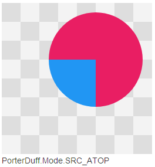

# Bitmap #
Bitmap表示位图，位图又称点阵图

Bitmap类提供了一些静态方法用于创建新的Bitmap对象：

	public static Bitmap createBitmap(@NonNull Bitmap src)

	public static Bitmap createBitmap(@NonNull Bitmap source, 
			int x, int y, int width, int height) //从源位图source指定的坐标点（x,y）开始，从中
				//挖取宽width，高height的一块图片用于创建新的Bitmap对象

	public static Bitmap createBitmap(@NonNull Bitmap source, 
			int x, int y, int width, int height, @Nullable Matrix m, boolean filter)
				//从源位图source指定的坐标点（x,y）开始，从中挖取宽width，高height的一块图片用于创建
				//新的Bitmap对象，并按Matrix指定的规则进行变换

	public static Bitmap createScaledBitmap(@NonNull Bitmap src, 
			int dstWidth, int dstHeight, boolean filter)
				//对源位图src进行缩放，缩放成宽dstWidth，高dstHeight的新位图

	public static Bitmap createBitmap(int width, int height, @NonNull Config config)
			//创建一个宽width，高height的新位图。返回一个mutable的Bitmap对象

Android提供BitmapFactory工具类，它提供大量方法用于从不同的数据来源解析，创建Bitmap对象：

	public static Bitmap decodeFile(String pathName)

	public static Bitmap decodeResource(Resources res, int id)
	
	public static Bitmap decodeStream(InputStream is)

	public static Bitmap decodeByteArray(byte[] data, int offset, int length)

	public static Bitmap decodeFileDescriptor(FileDescriptor fd)

图片格式的文件、表示图片的InputStream输入流在Android中都转成Bitmap对象表示的位图。

另外在Canvas画布上绘制的图形也可以转成一个Bitmap对象（调Canvas.setBitmap方法
或在Canvas构造方法传入一个Bitmap对象，都能将画布上的图形输出此Bitmap对象中）。

如果需要把Canvas中的图形输出到一个Bitmap对象中，那么此Bitmap对象的isMutable()返回值必须是true，
表示可改变的Bitmap对象，即只有当Bitmap对象可变时，才能被重新绘制。

Bitmap图片要想在屏幕上显示出来，需要画到Canvas画布上才能被看到，
而Android中把能画到Canvas上的图片称为Drawable可绘制对象，
所以Bitmap要转成一个Drawable才能画到Canvas上显示在屏幕中。

Android通过Drawable的子类BitmapDrawable可以将一个Bitmap对象转成Drawable对象

	BitmapDrawable(Resources res, Bitmap bitmap)  //将Bitmap转成Drawable

	BitmapDrawable(Resources res, String filepath) //先将filepath表示的图片文件调用	
			//BitmapFactory.decodeFile方法转成Bitmap对象后，再将Bitmap对象转成Drawable

	BitmapDrawable(Resources res, java.io.InputStream is) //先将输入流调用
			//BitmapFactory.decodeStream转成Bitmap对象后，再将Bitmap对象转成Drawable

在ImageView中调用setImageBitmap将Bitmap图片显示在ImageView控件上时，也是先将Bitmap转成
BitmapDrawable实例后，再通过Drawable.draw方法绘制到Canvas画布显示在屏幕中的。
	
## 回收Bitmap ##
如果系统不停地解析、创建Bitmap对象，可能由于前面创建的Bitmap所占用的内容还没有回收，而导致程序运行时
引发OutOfMemory异常。
所以当Bitmap对象没有被引用时，需要及时回收

Android为Bitmap提供如下方法判断Bitmap对象是否已回收，以及强制Bitmap回收自己

	boolean isRecycled()  判断Bitmap对象是否被回收。已回收的Bitmap对象不能再绘制到Canvas中

	void recycle()  强制一个Bitmap对象回收自己。一般情况下不需要主动调用，因为当一个Bitmap对象没有
					被引用后，GC回收机制会自动回收无用的Bitmap对象。
					但是，当一个Bitmap对象仍被引用时，即使主动调recycle方法，也无法被真正地回收掉。
					所以，当一个Bitmap对象不需要使用时，我们要保证此Bitmap对象没有被其他类对象所引用
					
					另外被回收了的Bitmap对象，无法绘制到Canvas中。调用Bitmap.setPixels和getPixles
					方法也会抛出异常

# Drawable #
Drawable是可绘制的意思，在Android中Drawable对象表示一种可以在Canvas画布上绘制的图片。

一个Bitmap对象可以转成一个Drawable对象（BitmapDrawable），所以图片格式的位图文件也可以间接转成一个Drawable对象

一种颜色值也可以转成Drawable对象（ColorDrawable）

另外在res/drawable目录下定义的xml格式的图片资源文件都能根据根标签转成对应的Drawable对象

Drawable图片要绘制在Canvas对象上才能显示，所以我们需要为Drawable的绘制提供一个Canvas对象。

在Android中，我们会把一个Drawable对象作为View控件的背景或前景图片，这样在执行到View.draw(canvas)时，
我们就能通过传递下来的canvas对象来绘制Drawable图片了。

通常我们可以通过Drawable.getIntrinsicWidth()或getIntrinsicHeight() 方法来获取Drawable图片的固有
宽高信息，
但对于由颜色值转成的ColorDrawable图片，并不存在宽高的概念。
对于一张图片文件转成的BitmapDrawable图片，固有宽高就是图片的尺寸
对于大部分由xml文件定义的Drawable图片，需要指定width和height对应的XML属性，才能获取到固有宽高

另外就算一个Drawable图片能够获取到固有宽高，但固有宽高并不决定Drawable在View控件中的大小。通常当
Drawable作为View控件的背景时，Drawable图片会被拉伸至View控件的大小。

### BitmapDrawable ###
BitmapDrawable用于把Bitmap位图对象转成Drawable对象
可以通过BitmapDrawable的构造方法传入一个Bitmap对象，
还可以在XML文件中引入一个图片格式的文件，再将此XML文件转成一个BitmapDrawable对象。

在XML文件中引入图片文件时，根标签使用`<bitmap>`

`<bitmap>`标签提供如下属性，在把图片文件转成Drawable图片时设置一些效果：

	android:src   res/drawable(-xxx)目录下图片文件的资源ID

	android:antialias  是否开启抗锯齿功能。开启时，图片旋转后的边缘会变得比较平滑，
						但会对图片清晰度有些许影响。
						默认false不开启。不过建议开启

	android:filter  是否开启过滤效果。开始时，当图片被压缩或拉伸后，可以得到比较好的显示效果。
						默认开启，也应该开启

	android:dither  是否开启抖动效果。开启时，当图片的像素配置和手机屏幕的像素配置不一致时，可以让
						高质量的图片在低质量的屏幕上保持较好的显示效果。比如色彩模式为ARGB_8888
						的图片显示在色彩模式为RGB_555的屏幕上时，图片不会过于失真。
						默认开启，也应该开启

	android:gravity  当图片尺寸小于容器尺寸时，设置此选项可以定位图片位置。默认值为fill

						top     将图片放在容器顶部，不改变图片大小
						bottom  将图片放在容器底部，不改变图片大小
						left    将图片放在容器左边，不改变图片大小
						right   将图片放在容器右边，不改变图片大小

						center_vertical   图片竖直居中，不改变图片大小
						fill_vertical     图片竖直方向填充容器
						center_horizonal  图片水平居中，不改变图片大小
						fill_horizonal    图片水平方向填充容器

						center  水平方向，竖直方向都居中，不改变图片大小
						fill    水平方向，竖直方向都填充容器，这是默认值

						clip_vertical   竖直方向的裁剪，较少使用
						clip_horizontal 水平方向的裁剪，较少使用

	android:mipMap  是否采用纹理映射处理图片，默认false不使用。

	android:tileMode  当图片尺寸小于容器时，设置图片在容器中的平铺模式。
						设置了平铺模式后，android:gravity属性被忽略
			
						disabled  禁用屏幕模式。这是默认值
						repeat  在水平，竖直方向使用图片铺满容器
						mirror  分别使用在水平和竖直方向的镜面投影铺满容器
						clamp   将图片边缘的颜色扩散到整个容器

	android:tileModeX  只处理水平方向的平铺效果
	android:tileModeY  只处理竖直方向的平铺效果

### NinePatchDrawable `<nine-patch>` ###

### ClipDrawable `<clip>` ###
ClipDrawable用于包装一个Drawable图片，对它进行裁剪。
Drawable图片可以是一个图片文件或XML文件表示的Drawable图片

`<clip>`根标签提供如下属性对Drawable图片进行裁剪

	androd:drawable  引入一个要才将Drawable图片

	android:clipOrientation	裁剪方向，horizontal|vertical分别表示水平裁剪和竖直裁剪

	android:gravity  Drawable图片在容器中的位置。并结合clipOrientation属性，确定具体的裁剪方式
						top     
						bottom
						left
						right
						center_vertical
						fill_vertival
						center_horizontal
						fill_horizontal
						center
						fill
						clip_vertical
						clip_horizontal

ClipDrawable根据Drawable.getLevel()确定裁剪的范围，
level取值0-10000，0表示完全裁剪掉，即图片不可见；10000表示不裁剪。（参考ClipDrawable.draw方法）

调Drawable.setLevel方法可以设置ClipDrawable的裁剪范围，
因为setLevel方法中回调了onLevelChange方法，通常如果Drawable需要在level改变后重新绘制的话，
需要重写onLevelChange方法，返回true，表示需要重绘。

ClipDrawable会重写Drawable的onLevelChange方法，在onLevelChange方法被回调时会执行Drawable所在View
控件的invalidateDrawable(Drawable)方法，invalidateDrawable方法跟View.invalid方法类似，都会触发
ViewRootImpl.performTraversals()方法的执行，执行一遍ViewTree的绘制流程，最终触发Drawable.draw
(Canvas)方法的执行，对Drawable图片进行重绘。
	
### ScaleDrawable `<scale>` ###

### InsetDrawable `<inset>` ###

### ShapeDrawable （GradientDrawable） `<shape>` ###
ShapeDrawable用于定义一个基本的几何图形（如矩形，圆形，线条等）。
ShapeDrawable通过颜色来构造图形，既可以是纯色的图形，也可以是具有渐变效果的图形。

在XML文件使用`<shape>`根标签来描述ShapeDrawable资源，但`<shape>`标签定义的Drawable对象其实是一个
GradientDrawable类。

GradientDrawable解析一个`<shape>`标签表示的Drawable图片时，会用到如下XML属性：

	<shape>标签的属性
	android.R.styleable#GradientDrawable_visible
	android.R.styleable#GradientDrawable_shape
	android.R.styleable#GradientDrawable_innerRadiusRatio
	android.R.styleable#GradientDrawable_innerRadius
	android.R.styleable#GradientDrawable_thicknessRatio
	android.R.styleable#GradientDrawable_thickness
	android.R.styleable#GradientDrawable_useLevel

	<size>标签的属性
	android.R.styleable#GradientDrawableSize_width
	android.R.styleable#GradientDrawableSize_height

	<gradient>标签的属性
	android.R.styleable#GradientDrawableGradient_startColor
	android.R.styleable#GradientDrawableGradient_centerColor
	android.R.styleable#GradientDrawableGradient_endColor
	android.R.styleable#GradientDrawableGradient_useLevel
	android.R.styleable#GradientDrawableGradient_angle
	android.R.styleable#GradientDrawableGradient_type
	android.R.styleable#GradientDrawableGradient_centerX
	android.R.styleable#GradientDrawableGradient_centerY
	android.R.styleable#GradientDrawableGradient_gradientRadius

	<solid>标签的属性
	android.R.styleable#GradientDrawableSolid_color

	<stroke>标签的属性
	android.R.styleable#GradientDrawableStroke_width
	android.R.styleable#GradientDrawableStroke_color
	android.R.styleable#GradientDrawableStroke_dashWidth
	android.R.styleable#GradientDrawableStroke_dashGap

	<padding>标签的属性
	android.R.styleable#GradientDrawablePadding_left
	android.R.styleable#GradientDrawablePadding_top
	android.R.styleable#GradientDrawablePadding_right
	android.R.styleable#GradientDrawablePadding_bottom

	<corners>标签的属性
	android.R.styleable#DrawableCorners_radius
	android.R.styleable#DrawableCorners_topLeftRadius
	android.R.styleable#DrawableCorners_topRightRadius
	android.R.styleable#DrawableCorners_bottomLeftRadius
	android.R.styleable#DrawableCorners_bottomRightRadius

下面具体介绍定义ShapeDrawable资源的XML文件中的几个标签及标签的XML属性：
#### `<shape>`根标签： ####
`<shape>`标签用于定义图片的形状，XML属性如下：

	android:shape  可以是rectangle|oval|line|ring，分别表示矩形，椭圆形，线形，圆环形图片。

	android:innerRadius  shape属性指定为圆环形ring时起作用，表示圆环的内半径

	android:innerRadiusRatio  shape属性指定为圆环形ring时起作用，表示圆环的内半径在整个Drawable
								宽度中所占的比例，默认为9。
								内半径 = 宽度 / 比例。 即比例值越大，内半径越小
								
								innerRadiusRatio和innerRadius指定一个即可，
								同时存在时以innerRadius为准

	android:thickness  shape属性指定为圆环形ring时起作用，表示圆环的厚度，即thickness=外半径-内半径

	android:thicknessRatio   shape属性指定为圆环形ring时起作用，表示圆环的厚度在整个Drawable宽度中
								所占的比例，默认为3。 
								厚度 = 宽度 / 比例。即比例越大，圆环厚度越小

								thicknessRatio和thickness指定一个即可，
								同时存在时以thickness为准

	android:useLevel  boolean值的属性。判断当shape为圆环时，是否对圆环进行缩放。true表示缩放，false
						表示不缩放。useLevel只是用于判断是否对圆环进行缩放，决定圆环的缩放比例是根据
						Drawable.getLevel()的返回值。
						当shape为其他形状时，无作用。
						一般设置为false即可。

#### `<corners>`子标签 ####
当<shape>根标签的android:shape属性指定为rectangle时（即shape表示矩形），`<corners>`标签才起作用，
用来指定矩形的四个顶角的角度。当某个顶角角度为0时，是直角；≥0时是圆角。

`<corners>`标签提供如下属性设置矩形的四个顶角的角度大小：

	android:radius  同时设置四个顶角的角度。某个顶角的角度，会被专门设置该顶角的属性覆盖

	android:topLeftRadius  设置左上角的角度
	
	android:topRightRadius  设置右上角的角度

	android:bottomLeftRadius  设置左下角的角度

	android:bottomRightRadius  设置右下角的角度

#### `<gradient>` 子标签 ####
`<gradient>`子标签为当前shape图形填充渐变效果的颜色。
因为`<solid>`子标签是为shape图形填充纯种颜色，所以这两个子标签不能同时存在。

下面介绍`<gradient>`标签为了实现渐变效果所提供的几个XML属性：

	android:type  渐变的类型，有 linear|radial|sweep，分别表示线性渐变、径向渐变、扫描渐变
					线性渐变是指以angle属性指定的方向，渐变动作从图形的一边开始，横跨中心点到图形的另
						外一边结束。
					径向渐变是指以中心点为圆心，渐变动作从内向外扩散，直到半径达到gradientRadius设置
						的数值，或覆盖整个shape图形为止。
					扫描渐变是指以中心点为旋转点，渐变动作逆时针旋转一周，扫描覆盖整个shape图形。

	android:centerX  渐变中心点的横坐标
	android:centerY  渐变中心点的纵坐标

	android:startColor 渐变开始的颜色
	android:centerColor 渐变中间的颜色
	android:endColor  渐变结束的颜色

	android:angle  渐变类型为线性渐变linear时起作用，表示渐变的方向角度，默认为0。
					0表示从左往右；90表示从下往上。必须是45的倍数。

	android:gradientRadius  渐变类型为径向渐变radial时起作用，表示渐变的半径。

	android:useLevel  boolean属性。为true时表示使用Drawable.getLevel()返回值对渐变范围进行缩放。
						默认为false，不对渐变范围进行缩放。
						当对渐变范围进行缩放时，根据渐变类型，缩放的方式不同：
							linear线性渐变时根据Drawable.level确定渐变结束的坐标位置
							radial径向渐变时根据Drawable.level确定渐变扩散的半径
							sweep扫描渐变时根据Drawable.level确定渐变扫描的角度

#### `<solid>`子标签 ####
`<solid>`子标签为当前shape图形填充纯种颜色。
如上面介绍，`<solid>`标签和`<gradient>`标签不能同时存在。

`<solid>`标签通过属性 android:color 为shape图形指定纯种颜色值

#### `<stroke>`子标签 ####
`<stroke>`子标签指定shape图形的边界线的属性，如线宽，线的颜色，是否使用虚线等。

`<stroke>`标签使用如下XML属性定义shape图形的边界线：

	android:width  指定边界线的宽度。宽度越大，线越粗

	android:color  指定边界线的颜色

	android:dashWidth 指定组成虚线的线段长度。如果为0，则边界线不能处理成虚线
	
	android:dashGap 指定组成虚线的线段之间的间隔长度。如果为0，则边界线不能处理成虚线

#### `<padding>`子标签 ####
`<padding>`子标签表示shape图形对外的边距。即由shape图形决定的View控件和图形之间的间距。（View控件
和shape图形之间实际的间距，还应该加上View控件的padding属性指定的内边距）

`<padding>`子标签的XML属性有

	android:left

	android:right

	android:top

	android:bottom

#### `<size>`子标签 ####
`<size>`子标签指定shape图形的固有宽高

`<size>`标签的XML属性如下：

	android:width  指定shape图形的固有宽度，通过Drawable.getIntrinsicWidth()获取
	android:height  指定shape图形的固有高度，通过Drawable.getIntrinsicHeight()获取

`<size>`标签所指定的图形的固有宽高，是把`<padding>`标签设置的图形对外边距包含在内了的。

如果没有指定shape图形的固有宽高，那么由XML文件解析出的Drawable对象的getIntrinsicWidth和
getIntrinsicHeight就会返回-1。

另外，对于图片文件而言，它转成Drawable对象时，Drawable.getIntrinsicWidth()和
Drawable.getIntrinsicHeight()返回的就是图片的尺寸大小。即图片文件的固有宽高就是图片的尺寸。

### StateListDrawable `<selector>` ###
StateListDrawable表示Drawable的集合，每个Drawable都对应着View的一种状态。
当使用StateListDrawable作为View的背景或前景图片时，系统会根据当前View的状态来选择StateListDrawable
集合中指定了对应状态的Drawable图片。

StateListDrawable在XMl中通过`<selector>`根标签来定义，`<selector>`下的每个`<item>`标签代表一种状态下的
Drawable图片

`<selector>`标签的XML属性有：

	android:variablePadding  true表示StateListDrawable的padding随着当前状态下选择的Drawable
							 	的padding的改变而改变；
							 false表示StateListDrawable的padding固定为所有Drawable的padding中的
								最大值。
							 默认为false。

	android:constantSize  false表示StateListDrawable的大小随着当前状态下选择的Drawable的大小的改
							 变而改变；
						  true表示StateListDrawable的大小固定为所有Drawable的大小中的最大值
						  默认为false。

	android:dither  是否开启抖动效果，开启此选项可以让图片在低质量的屏幕上获得较好的显示效果。
					默认true，表示开启。

`<item>`标签的XML属性有：

	android:drawable  当前Drawable使用的图片资源
	android:state_focused  true表示View状态为获取焦点时，显示此<item>标签表示的Drawable图片
	android:state_window_focused
	android:state_enabled  true表示View状态为可用时，显示此Drawable图片
	android:state_checkable  true表示View状态为可勾选时，显示此图片
	android:state_checked  true表示View状态为已勾选时，显示此图片（Checkable.setChecked）
	android:state_selected  true表示View状态为被选中时，显示此图片（View.setSelected）
	android:state_activated  true表示View状态为已激活时，显示此图片
	android:state_active
	android:state_single
	android:state_first
	android:state_middle
	android:state_last
	android:state_pressed  true表示View状态为按下，仍没有松开时，显示此图片

系统根据View状态在StateListDrawable集合中查找对应状态的Drawable图片时，按照XML文件中`<item>`定义的
顺序，从上往下查找匹配View状态的Drawable图片所在的`<item>`标签，直到找到第一个匹配View状态的`<item>`标签
为止，如果没有找到配置状态的`<item>`标签，通常需要给系统提供一个默认的`<item>`标签。
这个默认的`<item>`标签不需要指定任何状态，并且根据上面说明的系统查找规则，需要将默认`<item>`标签放在最后定义。

### LayerDrawable `<layer-list>` ###
LayerDrawable表示一种层次化的Drawable集合，在XML定义文件中，系统会把LayerDrawable集合中的所有
Drawable图片按照定义的顺序进行叠加，最后定义的Drawable被放在最上面。LayerDrawable展示的就是一张所有
Drawable图片元素叠加后显示的效果图片。

在XML文件中，使用`<layer-list>`根标签表示LayerDrawable集合，子元素Drawable图片用`<item>`标签表示。

`<item>`标签的XML属性有：

	android:left  Drawable图片与View控件左侧的距离（dp）
	android:top  Drawable图片与View控件顶部的距离（dp）
	android:right  Drawable图片与View控件右侧的距离（dp）
	android:bottom  Drawable图片与View控件底部的距离（dp）
	android:start
	android:end
	android:width  Drawable图片在View控件中的宽度，默认是图片的固有宽度
	android:height  Drawable图片在View控件中的高度，默认是图片的固有高度
	android:gravity  Drawable图片在View控件中显示的重心（center|left|right|top|bottom|...）
	android:drawable  当前<item>表示的Drawable对象所引用的图片资源
	android:id  当前<item>表示的Drawable图片的id

`<item>`标签除了通过指定属性android:drawable提供图片资源外，`<item>`标签还可以通过包含其他表示Drawable图
片的标签，来为`<item>`标签自定义一张Drawable图片。如包含`<shape>`标题，表示自定义ShapeDrawable图片；包含
`<bitmap>`图片，表示自定义BitmapDrawable图片。

	<?xml version="1.0" encoding="utf-8"?>
	<layer-list xmlns:android="http://schemas.android.com/apk/res/android">
		<item>
			<bitmap android:src="@drawable/ic_launcher"
				android:gravity="center" />
		</item>
		<item android:top="25dp" android:left="25dp">
			<bitmap android:src="@drawable/ic_launcher"
				android:gravity="center" />
		</item>
		<item android:top="50dp" android:left="50dp">
			<bitmap android:src="@drawable/ic_launcher"
				android:gravity="center" />
		</item>
	</layer-list>

#### 使用LayerDrawable定义ProgressBar的进度条 ####
ProgressBar可以看成是由三层图片叠加而成的，底层是背景，中间层是总进度条颜色，上层是当前进度条颜色，
所以我们可以在LayerDrawable中定义三个`<item>`分别表示ProgressBar的三层图片，
在ProgressBar源码中通过`<item>`的android:id属性来区分这三张图片：

	android:id="@android:id/background"  指定ProgressBar的背景图片
	android:id="@android:id/progress"  指定ProgressBar的当前进条颜色的图片
	android:id="@android:id/secondaryProgress"  指定ProgressBar的总进度条颜色的图片

### LevelListDrawable `<level-list>` ###

### TransitionDrawable `<transition>` ###

# 绘图 #
Android绘图时一般是继承View控件，并重写View.onDraw(Canvas)方法。
在onDraw方法中完成View控件内容的绘制，包括View的背景或前景Drawable图片的绘制

绘图坐标系的坐标原点默认位于屏幕左上角，向下为Y轴正方向，向右为X轴正方向。
绘图的难点就在于对坐标系的计算。

Android系统不允许直接修改原图，类型Photoshop中的锁定。
必须通过Bitmap.createBitmap方法创建一个跟原图同样大小的Bitmap，并将原图绘制到该Bitmap中，以副本
的形式来修改图像。

绘图中涉及几个重要的API，如Canvas、Paint、Path、Matrix等

## Canvas ##
Canvas表示一张画布，提供如下方法绘制各种图形：

使用颜色填充整个画布（可以用于绘制图片的背景颜色）：

	public void drawColor(@ColorInt int color)

	public void drawColor(@ColorInt int color, @NonNull PorterDuff.Mode mode)

在Canvas上绘制Bitmap图片：

	public void drawBitmap(@NonNull Bitmap bitmap,   
			float left, float top, @Nullable Paint paint) 
		//在Canvas中left、top参数指定的位置，将源图bitmap用指定的画笔paint绘制到Canvas中

	public void drawBitmap(@NonNull Bitmap bitmap, 
			@Nullable Rect src, @NonNull RectF dst, @Nullable Paint paint)

	public void drawBitmap(@NonNull Bitmap bitmap, 
			@Nullable Rect src, @NonNull Rect dst, @Nullable Paint paint)
		//从源图biamp中挖取src范围的图片，用指定的画笔paint绘制在Canvas指定的dst范围中。

	public void drawBitmap(@NonNull Bitmap bitmap, 
			@NonNull Matrix matrix, @Nullable Paint paint)

在Canvas上绘制弧形（此方法也可绘制椭圆形）

	public void drawArc(@NonNull RectF oval, float startAngle, float sweepAngle, 
			boolean useCenter, @NonNull Paint paint)
		//绘制的弧线是矩形内切椭圆oval的部分边线，以3点钟方向为0度角，顺时针绘制，起始点为startAngle
		//指定的椭圆上的某点，结束点为sweepAngle指定的椭圆上的某点。
		//startAngle为负数或大于等于360时，取startAngele%360
		//sweepAngle为负数时，取sweepAngle%360；大于等于360时，表示绘制整个椭圆

	public void drawArc(float left, float top, float right, float bottom, 
			float startAngle, float sweepAngle, boolean useCenter, @NonNull Paint paint)
		//left、top、right、bottom参数确定Canvas上的四个顶点，以这四个顶点做矩形的内切椭圆

在Canvas上绘制椭圆形（参数的意思跟drawArc一样）

	public void drawOval(@NonNull RectF oval, @NonNull Paint paint)

	public void drawOval(float left, float top, float right, float bottom, 
			@NonNull Paint paint)

在Canvas上绘制圆形

	public void drawCircle(float cx, float cy, float radius, @NonNull Paint paint)
		//cx，cy指定圆心在Canvas上的坐标（cx,cy），radius表示半径

在Canvas上绘制直线

	public void drawLine(float startX, float startY, float stopX, float stopY,
            @NonNull Paint paint)
		//以Canvas内坐标（startX,startY）为起点，坐标（stopX,stopY）为终点，
		//使用画笔paint绘制一条直线

	public void drawLines(@Size(multiple = 4) @NonNull float[] pts, int offset, int count,
            @NonNull Paint paint)
		//按照索引顺序，pts数组中每4个元素作为起点和终点坐标绘制一条直线，需要绘制的直线数量为count/4
		//offset表示数组中绘制第一条直线的起始x坐标，count表示一共有多少个数组元素参与绘制直线
		//如果count数量不足4个，那么一条直线也绘制不出来；如果count数量不是4的整数倍，那么能绘制的
		//直线数量就是 count>>2（即count/4），即使有剩余的数组元素，也绘制不出直线

	public void drawLines(@Size(multiple = 4) @NonNull float[] pts, 
			@NonNull Paint paint)
		//pts数组中的元素表示 [startx0,starty0,endx0,endy0,startx1,starty1,endx1,endy1,...]

在Canvas上绘制点

	public void drawPoint(float x, float y, @NonNull Paint paint)
		//以Canvas内的坐标(x,y)绘制一个点

	public void drawPoints(@Size(multiple = 2) float[] pts, int offset, int count,
            @NonNull Paint paint)
		//参数意思跟drawLines类似，只不过drawPoints是通过pts数组确定多个坐标，来绘制多个点

	public void drawPoints(@Size(multiple = 2) @NonNull float[] pts, 
			@NonNull Paint paint)

在Canvas上绘制矩形或圆角矩形

	public void drawRect(@NonNull RectF rect, @NonNull Paint paint)
		//以RectF确定的要绘制的直角矩形范围，根据Paint对象确定是只画矩形边框，还是用颜色填充矩形

	public void drawRect(@NonNull Rect r, @NonNull Paint paint)
		//以Rect确定的要绘制的直角矩形范围

	public void drawRect(float left, float top, float right, float bottom, 
			@NonNull Paint paint)
		//以left|top|right|bottom 确定的要绘制的直角矩形范围

	public void drawRoundRect(@NonNull RectF rect, float rx, float ry,
			@NonNull Paint paint)
		//绘制圆角矩形，RectF确定矩形范围，
		//rx,ry分别表示圆角在x轴和y轴上的半径。rx,ry不相等时可绘制椭圆圆角

	public void drawRoundRect(float left, float top, float right, float bottom, 
			float rx, float ry, @NonNull Paint paint)

在Canvas上绘制Path对象指定的图形

	public void drawPath(@NonNull Path path, @NonNull Paint paint)
		//沿着Path指定的形状进行绘制

在Canvas上绘制字符串（可以在某个坐标点开始绘制，也可以沿着Path对象指定的图形路径绘制）

	public void drawText(@NonNull char[] text, int index, int count, 
			float x, float y, @NonNull Paint paint)
		//根据index，count从char[]数组中取出要绘制的字符串
		//坐标(x,y)表示由Paint对象的对齐方式决定的绘制字符串的起始位置

	public void drawText(@NonNull String text, 
			float x, float y, @NonNull Paint paint)

	public void drawText(@NonNull String text, int start, int end, 
			float x, float y, @NonNull Paint paint)
		//根据start，end从String对象text中取出要绘制的字符串

	public void drawText(@NonNull CharSequence text, int start, int end, 
			float x, float y, @NonNull Paint paint)
		//根据start，end从CharSequence对象text中取出要绘制的字符串

	public void drawTextOnPath(@NonNull char[] text, int index, int count, 
		@NonNull Path path, float hOffset, float vOffset, @NonNull Paint paint)
		//沿着Path指定的图形的路径绘制字符串
		//hOffset 表示在水平方向上，偏移图形路径起始位置的hOffset处放置字符串
		//vOffset 表示在竖直方向上，偏移图形路径的vOffset处放置字符串。
		//负值表示向上偏移，正值表示向下偏移

	public void drawTextOnPath(@NonNull String text, 
		@NonNull Path path, float hOffset, float vOffset, @NonNull Paint paint)

在Canvas中裁剪区域

	public boolean clipRect(@NonNull RectF rect)   //将Canvas中RectF矩形区域裁剪掉
	public boolean clipOutRect(@NonNull RectF rect) //将Canvas中RectF矩形之外的区域裁剪掉

	public boolean clipRect(@NonNull Rect rect)
	public boolean clipOutRect(@NonNull Rect rect)

	public boolean clipRect(float left, float top, float right, float bottom)
	public boolean clipOutRect(float left, float top, float right, float bottom)

	public boolean clipRect(int left, int top, int right, int bottom)
	public boolean clipOutRect(int left, int top, int right, int bottom)

在Canvas中进行坐标变换（平移，旋转，缩放，倾斜）

	public void translate(float dx, float dy) 
		//移动Canvas。dx为正表示向右移动，为负向左移动；dy为正向下移动，为负向上移动

	public void scale(float sx, float sy)
	public final void scale(float sx, float sy, float px, float py) {
        if (sx == 1.0f && sy == 1.0f) return;
        translate(px, py);
        scale(sx, sy);
        translate(-px, -py);
    }
		//以轴点（px,py）对Canvas执行缩放变换

	public void rotate(float degrees)
	public final void rotate(float degrees, float px, float py) {
        if (degrees == 0.0f) return;
        translate(px, py);
        rotate(degrees);
        translate(-px, -py);
    }
		//以轴点（px,py）对Canvas执行旋转变换

	public void skew(float sx, float sy) //对Canvas执行倾斜变换

### 结合坐标系和图层的概念理解Canvas ###
Canvas.sava()方法就是保存画布，它的作用就是将之前所有已绘制的图形保存在一个图层上，让后续的绘制操作
在一个新的图层上进行。跟Photoshop中的图层概念基本一致。

Canvas.restore()方法的作用就用合并图层的操作。将sava()之前保存在一个图层上的图形和sava()之后绘制在
另一个图层上的图形进行合并。

Canvas.translate方法和rotate方法则可以理解为是在对坐标系的平移和翻转。
如在调用translate(x,y)方法后，原来位于屏幕左上角的坐标原点的坐标(0,0)会移动到(x,y)点上。即调
translate(x,y)之后的绘图操作都将以(x,y)点作为坐标原点。
rotate方法跟translate同理。

使用rotate和translate对坐标系进行旋转或平移，在某些场合可以避免进行负载的三角函数运算，相当于是一种
相对论式的变换。（如绘制时钟）

Canvas提供saveLayer、saveLayerAlpha方法将一个图层入栈，使用restore、restoreToCount方法将一个图层
出栈。
图层入栈后，后面所有的绘制操作都在此图层上进行；
图层出栈后，则会把图像绘制到上层Canvas上。

## Paint ##
Paint表示Canvas上画笔。Paint类主要用于设置绘制风格，如画笔颜色，画笔笔触粗细，填充风格等。

	public void setAlpha(int a)  //设置画笔颜色的透明度，取值范围[0,255]

	public void setAntiAlias(boolean aa) 
		//是否开启抗锯齿功能。开启后，图形的边界会比较平滑，对图形内部无影响

	public void setColor(@ColorInt int color) //设置画笔颜色

	public void setARGB(int a, int r, int g, int b) { //设置画笔颜色
        setColor((a << 24) | (r << 16) | (g << 8) | b);
    }

	public PathEffect setPathEffect(PathEffect effect) 
		//设置绘制路径时的路径效果。如果参数为null，表示清除之前的路径效果
		//直接返回参数对象

	public Shader setShader(Shader shader) 
		//设置画笔的填充效果，Shader表示着色器，填充效果就是指用什么颜色来填充
		//如果参数为null，表示清除之前的着色器

	public void setShadowLayer(float radius, float dx, float dy, int shadowColor)
		//在main layer下绘制一个阴影图层

	public void clearShadowLayer() {
        setShadowLayer(0, 0, 0, 0);
    }

	public void setStrokeWidth(float width) //设置画笔笔触的宽度，
		//Pass 0 to stroke in hairline mode
		//Hairlines always draws a single pixel independent of the canva's matrix

	public void setStrokeJoin(Paint.Join join) 
		//在一次绘制过程中，设置画笔笔触转弯处的连接风格
		//如drawRect算一次绘制，drawLine算另一次绘制。
		//如果调两次drawLine绘制两条首位相接的直接，则转弯处不会使用此连接风格处理

	public void setStyle(Paint.Style style) //设置画笔的填充风格，
		//填充风格包括只将图形内部区域用颜色填充，还是只将图形边界用颜色描边，
		//还是图形内部区域和图形边界都进行颜色填充
		//默认是Styly.FILL 只将图形内部区域用颜色填充

	public void setTextAlign(Align align) 
		//设置drawText绘制字符串时，字符串在绘制起点处的对齐方式
		//默认是Align.LEFT，即向左靠着绘制起点进行绘制，向左靠着起点就是说字符串在起点位置的右边

	public void setTextSize(float textSize)  //设置绘制字符串的大小，以px为单位，必须大于0

## Path ##
Path表示任意多条直线连接而成的任意图形。
当Canvas调用drawPath(Path,Pain)进行绘制时，能在画布上绘制出Path表示的任意图形。

通常可以使用Path绘制曲线。

可以通过Paint.setPathEffect(PathEffect)为Path对象中的图形路径设置一种显示效果。
PathEffect通过不同的子类实例提供不同的路径显示效果：

CornerPathEffect

	public CornerPathEffect(float radius)
		//如果Path对象中的图形路径中存在尖锐的顶角，绘制时会用半径为radius的圆角替换掉这个尖锐的顶角
		//默认情况下，两直线段相交处都为尖锐的顶角
		//此PathEffect对象可用于绘制平滑的曲线

DiscretePathEffect

	public DiscretePathEffect(float segmentLength, float deviation)
		//对于Path对象中的图形路径，将其分割成segmentLength长度的多条线段，每条线段以deviation指定
			的偏差，偏移原图形路径方向进行绘制
		//当线段足够短时，配合适宜的偏移量，就能得到一条“带刺”的图形路径，
		//可用于绘制一条有干扰信号的曲线

DashPathEffect

	public DashPathEffect(float intervals[], float phase)
		//将原Path对象中连续的图形路径，用虚线绘制出来。（虚线就是有间隔的破折线）
		//虚线是由破折线、空白间隔、破折线、空白间隔、...组成。每个破折线和空白间隔的长度都可设置，
			于是数组参数intervals的作用是：按照索引顺序，偶数索引元素定义破折线长度，奇数索引元素
				定义空白间隔长度。
			并且数组的长度要≥2，并且是2的整数倍。如果是长度＞2但为奇数的话，最后一个元素虽然是定义
				破折线长度的，但不会被绘制出来。
		//绘制虚线路径时，将intervals数组看作一组虚线，重复绘制
		//phase表示绘制的起始偏移量，偏移量可以无限增大，但由于每组虚线是重复出现的，所以当偏移量
			达到一组虚线的总长度时（总长度就是intervals数组元素之和），显示效果上偏移量又回到了0。
		//在onDraw方法中调用invalid()方法重复绘制时，不断改变phase偏移量，则Path图形路径会产生
			动态显示的效果。
		//当paint's style 为STROKE或STROKE_AND_FILL时DashPathEffect才起作用

PathDashPathEffect

	public PathDashPathEffect(Path shape, float advance, float phase, Style style)
		//使用Path对象shape绘制的图形作为stamp印记代替破折线显示，
			advance表示两个stamp印记之间的间隔，advance的值必须大于印记图形shape的宽度
			才能显示出间隔，其实 空白间隔 = advance - shape.width

ComposePathEffect

	public ComposePathEffect(PathEffect outerpe, PathEffect innerpe)
		//通过两个不同的PathEffect对象，构造出一个新的PathEffect对象
		//以inner PathEffect的效果为基础，然后再包装上out PathEffect的效果进行显示
		// outer(inner(path))

SumPathEffect

	public SumPathEffect(PathEffect first, PathEffect second)
		//通过将两个不同的PathEffect对象的显示效果依次叠加，形成一个新的PathEffect对象
		//first(path) + second(path)

## 双缓冲实现画图板 ##
当程序需要在指定View上进行绘制时，程序并不直接绘制到该View组件上。而是先绘制到内存中的一个Bitmap对象
中（此Bitmap对象就相当于是一个缓冲区），等到内存中的Bitmap绘制好之后，再一次性地将Bitmap绘制到View
组件上。

## ColorMatrix 颜色矩阵和色彩特效处理 ##
4x5的颜色系数 矩阵M 可用如下一维数组表示：

	[ a, b, c, d, e,
	  f, g, h, i, j,
	  k, l, m, n, o,
	  p, q, r, s, t ]

结合当前的颜色分量矩阵 X

	[R, 
	 G, 
	 B, 
	 A]

作乘法，可得目标颜色分量矩阵 Y = M * X

	[R',
	 G',
 	 B',
 	 A']

各元素为：

	R' = a*R + b*G + c*B + d*A + e;
    G' = f*R + g*G + h*B + i*A + j;
    B' = k*R + l*G + m*B + n*A + o;
    A' = p*R + q*G + r*B + s*A + t;

将满足 R'=R，G'=G，B'=B，A'=B 的矩阵称为初始矩阵

	[ 1, 0, 0, 0, 0,
	  0, 1, 0, 0, 0,
	  0, 0, 1, 0, 0,
	  0, 0, 0, 1, 0 ]

即初始颜色系数矩阵不会对原有颜色分量矩阵做任何改变，所以使用初始颜色系数矩阵来改变某像素点的ARGB颜色值
时，像素点的颜色并不会发生变化
	
**改变图像的色调、饱和度、亮度**
ColorMatrix.java

	public void setRotate(int axis, float degrees)
		//改变色调
		//axis有三种取值： axis=0|1|2 分别对应Red、Green、Blue
		//degrees表示对axis颜色处理的值

	public void setSaturation(float sat)
		//改变饱和度，饱和度为0，图像变成灰度图像

	public void setScale(float rScale, float gScale, float bScale, float aScale)
		//改变亮度。当三原色以相同比例进行混合时，显示出白色。系统根据此原理改变图像的亮度。
		//前三个参数值都为0时，图像变为全黑。

	public void setConcat(ColorMatrix matA, ColorMatrix matB)

	public void preConcat(ColorMatrix prematrix) {
        setConcat(this, prematrix);
    }

    public void postConcat(ColorMatrix postmatrix) {
        setConcat(postmatrix, this);
    }

postConcat和preConcat都调用了setConcat实现，通过两个矩阵的乘法运算，将两个矩阵的效果混合

ColorMatrix颜色矩阵的使用：

	通过ColorMatrixColorFilter类的构造方法将ColorMatrix包装在ColorFilter对象中，

	调用Paint.setColorFilter(ColorFilter)将包装了颜色矩阵的ColorFilter对象用于设置Paint画笔

**常用图像颜色矩阵处理效果**
常用的颜色处理效果的颜色矩阵有：
灰度效果
	
	0.33f, 0.59f, 0.11f, 0, 0,
	0.33f, 0.59f, 0.11f, 0, 0,
	0.33f, 0.59f, 0.11f, 0, 0,
		0, 	   0, 	  0, 1, 0,

图像反转

	-1,  0,  0, 1, 1,
	 0, -1,  0, 1, 1,
	 0,  0, -1, 1, 1,
	 0,  0,  0, 1, 0,

怀旧效果

	0.393f, 0.769f, 0.189f, 0, 0,
	0.349f, 0.686f, 0.168f, 0, 0,
	0.272f, 0.534f, 0.131f, 0, 0,
		 0, 	 0, 	 0, 1, 0,
去色效果

	1.5f, 1.5f, 1.5f, 0, -1,
	1.5f, 1.5f, 1.5f, 0, -1,
	1.5f, 1.5f, 1.5f, 0, -1,
	   0, 	 0,    0, 1,  0,

高饱和度

	 1.438f, -0.122f, -0.016f, 0, -0.03f,
	-0.062f,  1.378f, -0.016f, 0,  0.05f,
	-0.062f, -0.122f,  1.483f, 0,  -0.02,
		  0, 	   0, 	    0, 1,      0,

## 提取Bitmap图片的像素点 ##
通过Bitmap的getPixels方法可将Bitmap图像的所有像素点保存到一个数组中：

	public void getPixels(@ColorInt int[] pixels, int offset, int stride,
                          int x, int y, int width, int height)

		pixels  接受位图颜色值的数组
		offset  写入到pixels数组中的第一个像素索引值
		stride  pixels数组中的行间距
		x  从位图中读取第一个像素的x坐标值
		y  从位图中读取第一个像素的y坐标值
		width  从每一行读取的像素宽度
		height 读取的行数

	获取Bitmap的所有像素点数组可这样写： 
		bitmap.getPixels(pixels, width, 0, 0, width, height);

	其中pixels数组的length=width*height，
	width=srcBitmap.getWidth()，height=srcBitmap.getHeight()

通过Color类提供的如下方法可以获取每个像素点颜色的具体ARGB值：

	color = pixels[i];
	int r = Color.red(color);
	int g = Color.green(color);
	int b = Color.blue(color);
	int a = Color.alpha(color);

根据上面像素点i的ARGB值，可通过之前提供颜色效果系数矩阵，得到目标效果所对应的此像素点的ARGB值
	
	R' = a*R + b*G + c*B + d*A + e;
    G' = f*R + g*G + h*B + i*A + j;
    B' = k*R + l*G + m*B + n*A + o;
    A' = p*R + q*G + r*B + s*A + t;
	
	怀旧效果
	0.393f, 0.769f, 0.189f, 0, 0,
	0.349f, 0.686f, 0.168f, 0, 0,
	0.272f, 0.534f, 0.131f, 0, 0,
		 0, 	 0, 	 0, 1, 0,

	将上面的怀旧效果的颜色系数矩阵，带入上面的公式可得

	R' = (int)(0.393f * r + 0.769f * g + 0.189f * b + 0 * a + 0);
    G' = (int)(0.349f * r + 0.686f * g + 0.168f * b + 0 * a + 0);
    B' = (int)(0.272f * r + 0.534f * g + 0.131f * b + 0 * a + 0);
    A' = (int)(0 * r + 0 * g + 0 * b + 1 * a + 0);

根据上面的得到的ARGB值，可将像素点i的颜色值改为：

	newPixels[i] = Color.argb(A', R', G', B');

再调用Bitmap.setPixels方法将所有像素点的颜色值按照上面的方法处理后，进行重新设置

	bitmap.setPixels(newPixels, 0, width, 0, 0, width, height);

## Matrix 坐标矩阵和图形特效处理 ##
二维坐标点系数矩阵是一个3x3的矩阵M

	[a,b,c,
	 d,e,f,
	 g,h,i]

当前二维坐标点分量矩阵P

	[X,
	 Y,
	 1]

则目标二维坐标点分量矩阵P'= M * P

	[X',
	 Y',
	 1]

	X' = a*X + b*Y + c
	Y' = d*X + e*Y + f
	1  = g*X + h*Y + i

对于二维坐标点系数矩阵，要满足 1=g*X + h*Y + i*1 恒成立，则g=0, h=0, i=1，于是二维坐标点系数矩阵为

	[a,b,c,
	 d,e,f,
	 0,0,1]

为满足 X'=X, Y=Y，即当前坐标点经过系数矩阵变换后仍不变，则二维坐标点系数矩阵的初始矩阵为

	[1,0,0,
	 0,1,0,
	 0,0,1]

**translate 平移变换对应的坐标点系数矩阵**
对于当前坐标点(X, Y)经过平移变换后，x轴方向的偏移量为dx，y轴方向的偏移量为dy，
于是目标坐标点(X',Y')可表示为：

	X' = X + dx
	Y' = Y + dy

结合上面的坐标点系数矩阵和坐标点分量矩阵相乘的公式，可以看出满足平移变换的坐标点系数矩阵为：

	[1,0,dx,
	 0,1,dy,
	 0,0,1]

**rotate 旋转变换对应的坐标点系数矩阵**
旋转变换即指一个坐标点P(X,Y) 围绕着一个中心点O(X0,Y0) 旋转α角度 得到一个新的坐标点P'(X',Y')
一般地，P(X,Y)的坐标为：

	X' = (X-X0)*cosα - (Y-Y0)*sinα + X0 = X*cosα - Y*sinα + X0 - X0*cosα + Ysinα
	Y' = (X-X0)*sinα + (Y-Y0)*cosα + Y0 = X*sinα + Y*cosα + Y0 - X0*sinα - Ysinα

	[cosα,-sinα,X0 - X0*cosα + Ysinα,
	 sinα, cosα,Y0 - X0*sinα - Ysinα,
	    0,    0,                   1,]
	

特别地，如果中心点O是坐标原点(0,0)，则

	X' = X*cosα - Y*sinα
	Y' = X*sinα + Y*cosα 

	[cosα,-sinα,0,
	 sinα, cosα,0,
	    0,    0,1,]

其实，以任意中心点O为旋转中心来进行旋转变换，可以看成是：

	先将坐标原点平移到中心点O
	以平移后的坐标原点为中心旋转
	最后将坐标原点还原

**scale 缩放变换对应的坐标点系数矩阵**
一个像素点是不存在缩放的概念的，只有由很多像素点组成的图片才存在缩放，即将图片中的每个像素点的坐标都
进行相同比例的缩放，最终由这些像素点组成的图片就会产生缩放的效果

缩放前的某点坐标为(X,Y)， x轴方向的缩放比例为Kx，y轴方向的缩放比例为Ky，缩放后的坐标点(X',Y')为：

	X' = Kx * X
	Y' = Ky * y

	系数矩阵为：

	[Kx, 0,0,
	  0,Ky,0,
	  0, 0,1]

**skew 错切变换对应的坐标点系数矩阵**
错切变换通常包括水平错切和垂直错切

水平错切则是纵坐标y保持不变，横坐标x按比例进行平移变换，平移距离跟该点y轴方向上的距离成正比

	坐标点(X',Y') 经原坐标点(X,Y) 按水平错切比例Kx 进行水平错切，则有：

	X' = X + Kx * y
	Y' = Y

	[1,Kx,0,
	 0, 1,0,
	 0, 0,1]

垂直错切的效果就是让所有点的横坐标x保持不变，而纵坐标y按比例进行平移变换，且纵坐标y平移的大小和该点x轴方向上的距离成正比

	坐标点(X',Y') 经原坐标点(X,Y) 按垂直错切比例Ky 进行垂直错切，则有：
	
	X' = X
	Y' = Ky * X + Y 

	[1,0,0,
	Ky,1,0,
	 0,0,1]

即包含水平错切，又包含垂直错切的变换有：

	X' = X + Kx * y
	Y' = Ky * X + Y 

	[1,Kx,0,
	Ky, 1,0,
	 0, 0,1]

其实3x3坐标点系数矩阵可表示为

	[Scale_X, Skew_X,Trans_X,
	  Skew_Y,Scale_Y,Trans_Y,
		   0,      0,      1]

其中元素Scale_X，Skew_X，Skew_Y，Scale_Y又共同控制旋转变换

Matrix类提供setValues(float[] values)方法，为Matrix对象设置一个一维数组表示的3x3矩阵。

另外对于矩阵的平移，旋转，缩放，错切变换，Matrix提供setXxx，preXxx，postXxx这几类方法封装相应的
变换，通过这些方法，就不必每次都去设置矩阵的每个元素值。
其中，preXxx表示矩阵的前乘运算；postXxx表示矩阵的后乘运算。

## 使用Canvas.drawBitmapMesh控制图像像素块进行图形变换 ##
drawBitmapMesh方法定义了一张网，将一个Bitmap图片分成若干个网格小块，通过控制每个网格中的图像块来
修改整个图像。

	public void drawBitmapMesh(@NonNull Bitmap bitmap, 
								int meshWidth, int meshHeight,
					            @NonNull float[] verts, int vertOffset, 
								@Nullable int[] colors, int colorOffset, 
								@Nullable Paint paint)

	
	//meshWidth表示网的列数，meshHeight表示网的行数，行列数都为1表示这张网只有一个网格。行列数有一个
		为0，就表示网不存在，即drawBitmapMesh无作用。
	//verts表示网上所有点的坐标，verts.length = (meshWidth+1) * (meshHeight+1) * 2

## 画笔特效 —— PorterDuff.Mode ##
PorterDuff.Mode是一个枚举类，它定义了用于将两张图片进行混合显示的模式类型。

PorterDuff.Mode中包含了两个不同种类的混合模式：alpha compositing modes 和 blending modes。

	//alpha compositing modes

	CLEAR       (0),

	SRC         (1),
	DST         (2),

	SRC_OVER    (3),
	DST_OVER    (4),

	SRC_IN      (5),
	DST_IN      (6),

	SRC_OUT     (7),
	DST_OUT     (8),

	SRC_ATOP    (9),
	DST_ATOP    (10),

	XOR         (11),

	//blending modes

	DARKEN      (16),
	LIGHTEN     (17),
	MULTIPLY    (13),
	SCREEN      (14),
	ADD         (12),
	OVERLAY     (15);

下面分别介绍不同种类下的混合模式中的每个模式类型：

现有如下两张Bitmap位图图片，一张作为目标图片destinationImage，一张作为源图片sourceImage，
目标图片destinationImage 
源图片sourceImage 

通过PorterDuff.Mode提供的枚举元素mode，使用如下API可以对上面两张图片进行混合处理：

	Paint paint = new Paint();
	canvas.drawBitmap(destinationImage, 0, 0, paint);
	
	PorterDuff.Mode mode = //choose a mode
	paint.setXfermode(new PorterDuffXfermode(mode));

	canvas.drawBitmap(sourceImage, 0, 0, paint);

下面结合canvas上的显示效果，介绍不同混合类型mode

### alpha compositing modes ###

 

### blending modes ###

### PorterDuff.Mode的常用场景 ###
通常我们是通过Paint.setXfermode(Xfermode)方法，传入一个Xfermode的子类PorterDuffXfermode对象，在
创建PorterDuffXfermode实例时传入指定的PorterDuff.Mode枚举元素指定两张图片的混合类型。

PorterDuffXfermode设置的是两个图层交集区域的显示方式，
dst图形是先画在Canvas上的，src图形是后画在Canvas上的

用的最多的是，使用一张图片A作为另一张图片B的遮罩层，通过控制遮罩层的图形，来控制下面被遮罩图形B的显示
效果。
常用的混合类型是PortDuff.Mode.DST_IN和PortDuff.Mode.SRC_IN模式来实现将一个矩形图片变成圆角图片或
圆形图片的效果。
使用PorterDuffXfermode还可以实现刮刮卡的效果。

## 画笔特效 —— Shader ##
Shader 又被称为着色器，渲染器。用来实现一系列的渐变、渲染效果。
Android中的Shader类有如下几种子类：

	BitmapShader
	
	LinearGradient

	RadialGradient

	SweepGradient

	ComposeShader

通过Paint.setShader(Shader)方法可以为画笔设置一个着色器

LinearGradient、RadialGradient、SweepGradient都是实现了渐变、渲染的效果

BitmapShader的作用是通过Paint对画布使用指定Bitmap图形进行填充。根据Shader.TileMode不同Bitmap图形
在画布上的填充效果不同。

上面哪些实现了渐变渲染效果的Shader着色器通常不会单独使用。我们可以把渐变效果作为一个遮罩层，结合
PoterDuffXfermode，获得一张具有渐变效果的图像。

# 逐帧（Frame）动画 —— AnimationDrawable #
帧动画要求开发者把动画过程的每张静态图片都收集起来，再由Android系统来控制依次显示这些静态图片。
利用人眼的视觉滞留原理，给用户造成“动画”的错觉。

帧动画的动画原理跟放电影的原理是一样的。

创建帧动画的方式

方式一：
在res/anim/目录下定义一个xml文件，文件根标签为`<animation-list>`，在根标签下添加子标签`<item>`
表示一张图片，此图片就是帧动画的其中一帧。

	<?xml version="1.0" encoding="utf-8"?>
	<animation-list xmlns:android="http://schemas.android.com/apk/res/android"
		android:oneshot="true" >
		<item android:drawable="@drawable/bom_f01" android:duration="80" />
		...
	</animation-list>

其中android:onshot属性表示该帧动画是否循环播放，true为不循环，false表示循环。如果为true，那么帧
动画播放完后，显示的将会是最后一帧的图片

android:duration表示每帧动画展示的时间（单位ms）

方式二：
定义帧动画的xml文件会被解析成一个AnimationDrawable对象。所以我们可以直接new一个AnimationDrawable
对象，调用相关API创建一个帧动画
	
	public AnimationDrawable()

	addFrame(@NonNull Drawable frame, int duration)

	setOneShot(boolean oneShot)

AnimationDrawable实现了Animatable接口，所以提供了start()，stop()方法来开始和结束动画。

另外AnimationDrawable间接继承自Drawable，重写了Drawable的setVisible方法，当不可见时会停止动画。
Drawable对象的setVisible方法，通常会被所在的View控件的setVisible方法调用到。

# 补间（Tween）动画 #
补间动画就是指开发者只需要指定动画开始、动画结束等“关键帧”，而动画变化的“中间帧”由系统计算并补齐。
这就是“补间”的含义

动画就是图片在一段时间内的一系列变化过程。所以在定义补间动画时，需要给关键帧（如开始帧、结束帧）指定
变化开始的状态，变化结束的状态，以及变化持续的时间等动画属性。

Android提供了Animation类代表补间动画的基类，根据补间动画的变化效果，可以分为平移动画、旋转动画、
缩放动画，以及透明度动画。代表这4种动画的Java类分别是：

	TranslateAnimation  `<translate>`
	
	RotateAnimation  `<rotate>`

	ScaleAnimation  `<scale>`

	AlphaAnimation  `<alpha>`

**使用xml文件创建补间动画**
虽然我们可以直接通过new一个Animation对象来创建补间动画，但通常会采用在res/anim/目录下定义xml文件的
方式来实现补间动画：

	<?xml version="1.0" encoding="UTF-8"?>
	<set xmlns:android="http://schemas.android.com/apk/res/android"
		android:interpolator="@[package:]anim/linear_interpolator"
		android:shareInterpolator=["true"|"false"]
		android:duration="持续时间">

		<alpha 
			android:fromAlpha="float"
			android:toAlpha="float"/>

		<scale 
			android:fromXScale="float"
			android:toXScale="float
			android:fromYScale="float"
			android:toYScale="float"
			android:pivotX="float"
			android:pivotY="float" />

		<translate 
			android:fromXDelta="float"
			android:toXDelta="float"
			android:fromYDelta="float"
			android:toYDelta="float" />

		<rotate 
			android:fromDegrees="float"
			android:toDegrees="float"
			android:pivotX="float"
			android:pivotY="float" />
	</set>
	
如上，xml文件的根标签是`<set>`，此标签会被解析成一个AnimationSet对象，AnimationSet类表示补间动画的
集合，它可以包含多个补间动画元素，并且还可以嵌套其他`<set>`标签表示的动画集合

使用xml文件创建的补间动画，可以通过如下方法引用：
	
	Animation anim = AnimationUtils.loadAnimation(context, R.anim.file_name);

**开始和结束动画**
通过View控件的startAnimation和clearAnimation方法可以开始动画和结束动画

在给补间动画的关键帧指定的变化状态信息后，Android系统就会根据动画的开始帧，结束帧，动画持续时间计算出
需要在中间“补入”多少帧，并计算所有补入帧的图形，所以补帧动画在用户看来依然是“逐帧动画”

## Interpolator 插值器 ##
为了控制在动画期间需要动态“补入”多少帧，具体在动画运行的哪些时刻补入帧，需要借助于Interpolator。

Interpolator根据特定算法计算出整个动画所需要动态插入帧的密度和位置。也就是说，Interpolator负责控制
动画的变化速度，这就使得基本的动画效果（Alpha、Translate、Scale、Rotate）能以匀速、加速、减速、
抛物线速度（先加速后减速，或先减后加）等各种变化速度进行变化。

Android为开发者提供了如下几个Interpolator插值器，它们都实现了Interpolator接口，重写了
getInterpolation(float input)方法，根据返回结果随参数input的变化情况，实现不同的动画变化速度

	LinearInterpolator  动画匀速变化

	AccelerateInterpolator  动画开始时变化速度慢，之后不断加速变化

	DecelerateInterpolator  动画开始时变化速度快，之后不断减速变化

	AccelerateDecelerateInterpolator  动画开始阶段变化速度慢，中间段过程不断加速变化，
										结束阶段时减速变化

	CycleInterpolator  动画的变化速度，在变化过程中随正弦曲线的切线斜率的变化速率而改变

### Interpolator插值器的创建和使用 ###
我们可以通过如上几个Interpolator接口的实现类的构造方法来创建插值器Interpolator对象，
通过Animation.setInterpolator(Interpolator)方法应用在补间动画上

另外还可以在res/anim/目录下定义xml文件，创建Interpolator插值器，不同的插值器对应不同的根标签

	LinearInterpolator  <linearInterpolator />

	AccelerateInterpolator  <accelerateInterpolator />

	DecelerateInterpolator  <decelerateInterpolator />

	AccelerateDecelerateInterpolator  <accelerateDecelerateInterpolator />

	CycleInterpolator  <cycleInterpolator />

通常xml文件定义插值器时，直接写一个根标签即可，因为它们的属性简单，并且都有默认值。
对于上面的插值器，Android系统都为我们提供了对应的xml文件，通常我们直接引用即可

	Animation.setInterpolator(context, R.anim.linear_interpolator)

	Animation.setInterpolator(context, R.anim.accelerate_interpolator)

	Animation.setInterpolator(context, R.anim.decelerate_interpolator)

	Animation.setInterpolator(context, R.anim.accelerate_decelerate_interpolator)

	Animation.setInterpolator(context, R.anim.cycle_interpolator)

在xml文件中可以通过android:interpolator属性引用

	android:interpolator="@android:anim/linear_interpolator"

	

## 补间动画的源码实现 和 Interpolator的工作方式 ##
通过View.startAnimation方法启动补间动画后，startAnimation方法中最后会调用invalide(true)方法对
View进行重绘，在动画的持续时间内，如果没有调View.clearAnimation或Animation.cancel方法取消动画，
那么会一遍又一遍地对View进行重绘，并且每次重绘时，在动画的进行时间不断改变以及Interpolator插值器的
影响下，会从一个Transformation对象中得到不断被改变的Matrix对象或alpha属性等对绘图有影响的因素，
这些因素在View重绘中对Canvas画布起作用，从而绘制出下一帧动画图片，产生动画效果。

	
View.java

	public void draw(Canvas canvas) {
		// Step 4, draw the children
            dispatchDraw(canvas);
	}

	//return True if an invalidate() was issued
	boolean draw(Canvas canvas, ViewGroup parent, long drawingTime) {
		boolean more = false;

		final Animation a = getAnimation();
        if (a != null) {

            more = applyLegacyAnimation(parent, drawingTime, a, scalingRequired);

			//动画对象是否会改变矩阵，translate、scale、rotate动画为true；alpha动画为false
            concatMatrix = a.willChangeTransformationMatrix();
            ...
            transformToApply = parent.getChildTransformation();
        }

			if (transformToApply != null) {
                if (concatMatrix) {
					...
                    canvas.translate(-transX, -transY);
                    canvas.concat(transformToApply.getMatrix());
                    canvas.translate(transX, transY);
					...
                }

                float transformAlpha = transformToApply.getAlpha();
                if (transformAlpha < 1) {
                    alpha *= transformAlpha;	
					...
                }
            }

		...

		return more;
	}

	//返回true表示动画仍在进行，并且调用了invalid方法开始进入下一帧动画图片的绘制
	private boolean applyLegacyAnimation(ViewGroup parent, long drawingTime,
            Animation a, boolean scalingRequired) {

		Transformation invalidationTransform;

        final int flags = parent.mGroupFlags;

        final boolean initialized = a.isInitialized();
        if (!initialized) {

			//调用Animation的initialize方法初始化动画
            a.initialize(mRight - mLeft, mBottom - mTop, 
					parent.getWidth(), parent.getHeight());

            a.initializeInvalidateRegion(0, 0, mRight - mLeft, mBottom - mTop);

            if (mAttachInfo != null) a.setListenerHandler(mAttachInfo.mHandler);

            onAnimationStart();
        }

        final Transformation t = parent.getChildTransformation();

		//此处的Transformation对象t跟draw(Canvas,ViewGoup,long)方法中的transformToApply
			是同一个对象
		//将对象t作为参数传入Animation的getTransormation方法中，对t对象中的matrix、alpha等
			属性进行修改，以控制下一帧动画图片的显示效果
        boolean more = a.getTransformation(drawingTime, t, 1f);

        ...

		if (more) {//more为true表示动画没有结束
            if (!a.willChangeBounds()) {//动画不会改变View视图的边界范围，如alpha动画
				...
                parent.mPrivateFlags |= PFLAG_DRAW_ANIMATION;

				//重绘View，进入下一帧动画
                parent.invalidate(mLeft, mTop, mRight, mBottom);

            } else {//动画会改变View视图的边界范围，如translate、scale、rotate动画
                ...
                final RectF region = parent.mInvalidateRegion;

                a.getInvalidateRegion(0, 0, mRight - mLeft, mBottom - mTop, region,
                        invalidationTransform);

                parent.mPrivateFlags |= PFLAG_DRAW_ANIMATION;

                final int left = mLeft + (int) region.left;
                final int top = mTop + (int) region.top;

				重绘View，进入下一帧动画
                parent.invalidate(left, top, left + (int) (region.width() + .5f),
                        top + (int) (region.height() + .5f));
            }
        }
        return more;
	}

ViewGroup.java

	protected void dispatchDraw(Canvas canvas) {

		mPrivateFlags &= ~PFLAG_DRAW_ANIMATION;

		more |= drawChild(canvas, child, drawingTime);

	}

	protected boolean drawChild(Canvas canvas, View child, long drawingTime) {
		//return True if an invalidate() was issued
        return child.draw(canvas, this, drawingTime);
    }

Animation.java
	
	//返回true表示动画仍在进行
	public boolean getTransformation(long currentTime, Transformation outTransformation,
            float scale) {
        mScaleFactor = scale;
        return getTransformation(currentTime, outTransformation);
    }

	//返回true表示动画仍在进行
	public boolean getTransformation(long currentTime, Transformation outTransformation) {
		if (mStartTime == -1) {
            mStartTime = currentTime;
        }

        final long startOffset = getStartOffset();
        final long duration = mDuration;
        float normalizedTime;
        if (duration != 0) {
            normalizedTime = ((float) (currentTime - (mStartTime + startOffset))) /
                    (float) duration;
        }
		...
		final boolean expired = normalizedTime >= 1.0f || isCanceled();
        mMore = !expired;
		...
		if ((normalizedTime >= 0.0f || mFillBefore) 
				&& (normalizedTime <= 1.0f || mFillAfter)) {
            ...
            if (mCycleFlip) {
				//如果动画重复播放的模式是Reverse倒序的，则需要在[0,1]范围内反转normalizedTime
                normalizedTime = 1.0f - normalizedTime;
            }

			//normalizedTime其实就是每一帧动画图片播放的时刻，
				通过插值器，我们可以对当前播放时刻normalizedTime进行修改，从而让图片不随时间均匀地
				改变
			//applyTransformation方法将此时刻应该播放出的这一帧图片的变化状态信息，封装在
				outTransformation对象的matrix、alpha等属性中。不同的动画效果，如translate、
				scale、rotate、alpha等补间动画对applyTransformation方法的实现过程不同

            final float interpolatedTime = mInterpolator.getInterpolation(normalizedTime);
            applyTransformation(interpolatedTime, outTransformation);
        }

		//expired为true表示一次动画播放过程已经结束，此时需要判断是否要对动画进行重复播放
		if (expired) {
            if (mRepeatCount == mRepeated || isCanceled()) {
				//已完成重复播放的次数，或者取消了动画播放。不需要再重绘View进入下一帧动画图片
                if (!mEnded) {
                    mEnded = true;
                    guard.close();
                    fireAnimationEnd();
                }
            } else {
				//一次动画播放结束，并且需要再播放一次动画

				//如果mRepeatCount大于0，说明限制了重复播放动画的次数，
					则进入下一次动画播放之前，更新播放次数计数器。
                if (mRepeatCount > 0) {
                    mRepeated++;
                }

				//在进入下一次动画播放之前，如果动画重复播放的模式是倒序的，需要进行必要的设置。
                if (mRepeatMode == REVERSE) {
                    mCycleFlip = !mCycleFlip;
                }

				//重新开始一次动画播放的过程。所以，动画并没有结束
                mStartTime = -1;
                mMore = true;

                fireAnimationRepeat();
            }
        }
		...
		return mMore;
	}

	//此方法会在Animation的构造方法中调用，如果此时还没有为补间动画的播放过程指定
		Interpolator插值器，则会采用一个默认的插值器。
	//因为在getTransformation方法中可以看出，动画下一帧图片变化状态的计算必须要用到插值器
	protected void ensureInterpolator() {
        if (mInterpolator == null) {
            mInterpolator = new AccelerateDecelerateInterpolator();
        }
    }

## 自定义补间动画 ##
通过上面对补间动画的源码分析，我们可以看出，不同变化效果的补间动画都是在
applyTransformation(float interpolatedTime, Transformation t)方法中实现的，在此方法中根据
每一帧动画图片的interpolatedTime不同，计算出特定变化效果的变化状态偏移量，并将变化偏移量保存在
Transformation对象t中即可。
另外还需要实现initialize方法对自定义动画进行初始化。

如果动画的变化效果不会改变Transformation对象中的矩阵Matrix那么应该重写Animation的
willChangeTransformationMatrix方法，返回false即可；
如果动画的变化效果不会改变View的视图边界，那么还要重写willChangeBounds方法，返回false即可。
（参考AlphaAnimation）

### 使用android.graphics.Camera实现三维空间的动画效果 ###
android.graphics.Camera并非代码摄像头，它只是一个空间变换工具。

android.graphics.Camera常用的API如下

	public void getMatrix(Matrix matrix)

	public void applyToCanvas(Canvas canvas)

	public native void translate(float x, float y, float z);

	public native void rotateX(float deg);
	public native void rotateY(float deg);
	public native void rotateZ(float deg);
	public native void rotate(float x, float y, float z);

	public native void save();
	public native void restore();

# 属性动画 #
帧动画和补间动画可以理解成是在动画的持续时间内，不断地改变View控件中的Drawable图片在Canvas画布上的
显示效果。对于帧动画，它的显示效果就是不断替换Drawable图片进行显示；对于补间动画，它的显示效果就是
不断改变Drawable图片在Canvas画布坐标系上的坐标点或者是此Drawable图片的alpha透明度。

而对于属性动画，在动画的持续时间内，它并不是针对View控件中的Drawable图片做改动。而是针对一个类的
“属性”做改动，这里的“属性”是跟一个类中所定义的setXxx或getXxx方法有关，可以将“xxx”理解成这里所谓的
"属性"。因为属性动画是针对属性xxx做改动，所以此属性xxx必定要对应有一个setter方法（setXxx）。

也就是说属性动画其实就是在动画的持续时间内，不断地在执行某个对象的setXxx方法，改变属性xxx的属性值。

属性动画的默认持续时间是300ms，默认帧率是10ms/帧（即一帧图片显示10ms的时间）
属性动画在Android 3.0（API 13）之后才有的，为了兼容低版本，可采用开源库nienoldandroids。

Android提供Animator作为属性动画的基类，它的实现类有ValueAnimator、ObjectAnimator、AnimatorSet。

	ValueAnimator： 属性动画主要的时间引擎，它负责计算各个帧的属性值。此类定义了属性动画绝大部分核心
						功能，包括计算各帧的相关属性值，负责处理更新事件，按属性值的类型控制计算
						规则。

	ObjectAnimator： 是ValueAnimator的子类，可以传入一个对象，并对此对象的属性执行属性动画。
						通常使用ObjectAnimator实现某个对象的属性动画。只有在某些特别情况下，才会
						使用扩展性更强的ValueAnimator

	AnimatorSet： 是Animator的子类，用于集合多个Animator，并设置集合中多个Animator的播放方式，如
					是按索引顺序播放，还是同时播放

其实属性动画可以分成两个部分：
- 第一部分是在动画的持续时间内，计算各个帧的相关属性值。此时只需要知道属性值的类型，并不必知道应该为哪个
对象中的哪个属性赋予这个属性值。
- 第二部分就是指定一个对象和此对象中的一个属性，将第一部分中各个帧计算出的相关属性值设置给这个指定的对象
中的属性。

ValueAnimator对象其实就只负责第一部分的工作内容。所以如果我们要通过ValueAnimator来实现属性动画的话，
还需要监听ValueAnimator在动画持续时间内，各个帧的相关属性值的变化更新情况，并将更新的相关属性值设置
给特定的对象中的某个属性。

	实现ValueAnimator.AnimatorUpdateListener接口，重写onAnimationUpdate(ValueAnimator)方法，
	调用ValueAnimator.addUpdateListener(AnimatorUpdateListener)即可监听每一帧的更新状态

## 属性动画的创建和使用方式 ##
**通过xml文件创建属性动画**
可以在res/animator/目录下创建xml文件来实现属性动画

	<?xml version="1.0" encoding="UTF-8"?>
	<set xmlns:android="http://schemas.android.com/apk/res/android"
		android:ordering=["together"|"sequentially"]>

		<objectAnimator 
			android:propertyName="string"
			android:duration="int"
			android:valueFrom="float|integer|color"
			android:valueTo="float|integer|color"
			android:startOffset="int"
			android:interpolator="@[package:]anim/file_name"
			android:repeatCount="infinite|integer"
			android:repeatMode=["reverse"|"repeat"]
			android:valueType=["intType"|"floatType"]/>

		<animator 
			android:duration="int"
			android:valueFrom="float|integer|color"
			android:valueTo="float|integer|color"
			android:startOffset="int"
			android:interpolator="@[package:]anim/file_name"
			android:repeatCount="infinite|integer"
			android:repeatMode=["reverse"|"repeat"]
			android:valueType=["intType"|"floatType"]/>
	</set>

如上，根标签`<set>`被解析为AnimatorSet对象，标签`<objectAnimator>`被解析为ObjectAnimator对象，
标签`<animator>`被解析为ValueAnimator对象。
另外还直接以`<objectAnimator>`作为根标签，或`<animator>`作为根标签。

如上，android:propertyName属性的属性值就是指某个对象中定义的setXxx方法所表示的"xxx"属性名称

通过AnimatorInflater类的loadAnimator方法将一个属性动画的xml文件，根据根标签不同解析成不同的
Animator对象：

	Animator animator = AnimatorInflater.loadAnimator(context, R.animator.file_name)

	animator.setTarget(Object obj);
	
	animator.start();

如上，在代码中通过xml文件创建了一个Animator对象后，如果此Animator对象是AnimatorSet实例或
ObjectAnimator实例，还需要调Animator.setTarget方法为属性动画设置一个作用对象。
另外，还需要调用Animator.start()方法开启属性动画

**直接在Java代码中创建属性动画**
在实际开发中建议采用代码来实现属性动画。
有时在xml文件中为android:valueFrom属性设置的起始值无法提前确定，因此无法在xml文件中定义属性动画。在
这种情况下就必须通过代码来动态地创建属性动画。

使用ValueAnimator创建动画的步骤：

	调用ValueAnimator的ofInt、ofFloat、或ofObject这些静态方法来创建ValueAnimator实例

	调用ValueAnimator的setDuration、setEvaluator、setInterpolator、setRepeatCount、
		setRepeatMode等方法设置动画的持续时间、插值方式、重复次数和重复模式等。

	调用valueAnimator的start()方法启动动画

	调用ValueAnimator的addUpdateListener方法注册AnimatorUpdateListener监听器，在监听器中监听
		ValueAnimator计算出来的值的改变，并通过getAnimatedValue()方法将更新后的值应用到指定对象的
		属性中。

使用ObjectAnimator创建动画：
- ObjectAnimator继承自ValueAnimator，它可以直接将ValueAnimator在动画过程中计算出来的值应用到指定对象
的指定属性上。因此，使用ObjectAnimator创建属性动画，不需要注册AnimatorUpdateListener来实现将更新后
的属性值手动的设置给某个对象的某个属性。
- ObjectAnimator重载了ofInt、ofFloat、ofArgb、ofObject方法，通过参数指定对象和指定对象中的属性。

使用ObjectAnimator创建动画时的注意事项：
- 因为ObjectAnimator需要将计算出的属性值设置给指定对象中的某个属性"xxx"，所以要保证此对象中的属性
"xxx"定义了setter方法（即setXxx），否则会报错。
- 调用ObjectAnimator的ofInt、ofFloat等静态方法时如果values...数组参数只包含了一个元素，那么该元素
值被当做结束值。此时会通过指定对象的getXxx方法获取开始值，因此，要保证对象具有getXxx方法，否则报错。
- 如果属性动画的作用对象是View，并且是通过View对象的setXxx方法来改变显示效果，那么要注意setXxx方法中
是否调用了invalid方法来刷新屏幕，如果没有调用的话，还需要设置AnimatorUpdateListener监听器，并在
onAnimationUpdate方法中调用View的invalid方法刷新屏幕。

## 属性动画相关的监听器 ##
**监听动画变化过程中的某些特定状态**
在Animator类中提供了AnimatorListener和AnimatorPauseListener来监听属性动画变化过程的某些状态，如
AnimatorListener负责监听动画的开始状态、结束状态、重复状态、取消状态；
AnimatorPauseListener负责监听继续状态、暂停状态。
调用Animator.addListener(AnimatorListener)或addPauseListener(AnimatorPauseListener)可以为
Animator对象添加监听器。
Android系统为了方便开发者，避免重写所有接口方法。提供了AnimatorListenerAdapter接口，此接口继承了
AnimatorListener和AnimatorPauseListener，通过继承AnimatorListenerAdapter，我们可以只重写需要
监听的状态所对应的方法。

	Animator.addListener(AnimatorListener)
	addPauseListener(AnimatorPauseListener)

	AnimatorListener：
	void onAnimationStart(Animator animation);
    void onAnimationEnd(Animator animation);
    void onAnimationCancel(Animator animation);
    void onAnimationRepeat(Animator animation);

	AnimatorPauseListener：
	void onAnimationPause(Animator animation);
	void onAnimationResume(Animator animation);

	AnimatorListenerAdapter implements AnimatorListener, AnimatorPauseListener

**监听动画过程中的每一帧的变化**
ValueAnimator提供了AnimatorUpdateListener监听器，通过重写回调方法
onAnimationUpdate(ValueAnimator)，我们可以监听动画过程的每一帧的更新。此方法可以用来获取各个帧的
属性值，将其设置给指定对象的指定属性；还可以用来通知View控件，根据改变的属性值调用invalid方法重绘视图

## Interpolator插值器和Evaluator估值器 ##
Interpolator插值器的作用可以理解为，根据当前动画播放时间在一次动画播放过程的总时间中所占的比例（比例
范围[0,1]），计算出当前时间的帧的相关属性值在属性值变化范围内所占的比例。即根据当前时间所占总时间
的百分比，计算当前属性值所占属性值变化范围内的百分比

在补间动画中，将Interpolator插值器计算出的属性值所占百分比，传入各类型补间动画类的
applyTransformation(interpolatedTime, Transformation)方法中（interpolatedTime就是属性值
在不同时间的所占属性值变化范围的百分比）。
applyTransformation方法的作用就是根据属性值所占百分比interpolatedTime，
计算出各个帧的相关属性值（如平移属性值，缩放比例属性值，透明度属性值，旋转角度属性
值）。然后再将更新后的属性值应用到Transformation对象t中，在View的绘制过程中从对象t中取出更新后的属性
值用于View视图的绘制。

以上是在补间动画中Interpolator插值器的作用。但是在属性动画中，并没有定义一个applyTransformation方法
来实现对插值器返回的属性百分比的应用，也就是说目前还不知道怎么跟属性百分比来计算出帧的属性值。
于是，对于属性动画，Android提供了一个TypeEvaluator接口，此接口定义了一个方法
`T evaluate(float fraction, T startValue, T endValue)`。实现这个方法，就可以根据属性百分比计算
出帧对应的属性值。其中fraction参数就是代步属性百分比，startValue和endValue规定了属性值的变化范围。
通过根据公式`startValue + fraction * (endValue-startValue)`就可以计算出帧对应的属性值。

TypeEvaluator<T>是一个泛型接口，这是因为属性值对应有一个类型，如int、float等类型的属性值。所以
Android为我们提供几个可以返回不同类型的属性值的Evaluator估值器。如IntEvaluator，FloatEvaluator、
ArgbEvaluator等。

通过ValueAnimator对象的setEvaluator(TypeEvaluator)方法设置一个估值器。
另外对对于ValueAnimator对象的ofInt、ofFloat静态方法，通常会默认设置一个IntEvaluator或
FloatEvaluator估值器，所以ofInt、ofFloat没有提供设置估值器的参数。但是对于ofObject方法，因为此
方法表示属性值的类型应该是Object类型的，即ValueAnimator对象不知道属性的具体类型，所以提供了一个
TypeEvaluator类型的参数，给开发者手动传入一个合适的估值器。

ValueAnimator对象知道了通过Evaluator估值器的evaluator方法，去根据Interpolator插值器返回的属性百分
比计算出帧对应的属性值。于是就可以在AnimatorUpdateListener监听器的onAnimationUpdate方法中通过
getAnimatedValue方法获取到当前帧对应的属性值；或者在ObjectAnimator实例中将计算出的属性值设置给
指定对象的指定属性。

## 使用属性动画改变View控件的显示效果时的注意事项 ##
属性动画ObjectAnimator其实就是在动画持续时间内不断调用指定对象的setXxx方法，如果要通过属性动画来改
变View控件的显示效果，那么View控件对象的setXxx方法必须要对View视图的绘制产生影响，并且最好setXxx方
法中还调用了View的invalid方法，这样就不需要在设置AnimatorUpdateListener监听器，在监听回调方法
onAnimationUpdate中手动调用View的invalid方法进行重绘了。

如果View对象没有提供setXxx方法来设置视图相关的属性（如View没有提供setWidth方法来改变View的宽度
width），但我们又想通过属性动画来对View的宽度属性做动画效果，那么有如下两种方案实现：

方案一：
自定义一个类来包装此View类，定义setWidth方法来改变View的宽度，如下：

	public class ViewWrapper {
		private View mTarget;

		public ViewWrapper (View target){
			mTarget = target;			
		}	

		public void setWidht(int width) {
			mTarget.getLayoutParams().width = width;
			mTarget.requestLayout();
		}

		public int getWidht() {
			return mTarget.getLayoutParams().width;
		}
	}	

	public void performAnimator(){
		ViewWrapper wrapper = new ViewWrapper(mView);
		ObjectAnimator.ofInt(wrapper, "width", 500)
					  .setDuration(5000)
					  .start();
	}

通过这种方案，我们实现对View控件的任意属性做动画，即使这个属性是我们自己臆想出来的也行。只要我们在包装
类中定义了setXxx方法，就可以对这个臆想出来的xxx属性做属性动画。
我们可以这样理解ObjectAnimator的作用：在一段时间内，不断调用某个对象的setXxx方法，设置变化的参数值。

方案二：
采用ValueAnimator实现。
上面已经说过，属性动画可以分为两个部分，ValueAnimator只是实现了第一部分的工作：即在动画持续时间内，
根据时间变化的百分比计算出属性值变化的百分比（插值器Interpolator的工作），再根据属性值变化的百分比计算
出当前帧对应的属性值（估值器Evaluator的工作）。
也就是说ValueAnimator并没有要求它所计算出的属性值必须要设置给某个对象的setXxx方法。所以，我们可以利用
计算出的属性值做任何操作，包括改变View对象的显示效果。
通过实现监听器AnimatorUpdateListener的onAnimationUpdate(ValueAnimator)方法，即可在方法体中编写
对当前帧所对应属性值的任意操作，属性值可以通过方法参数ValueAnimator对象的getAnimatedValue方法获得，
另外通过getAnimatedFraction方法还可获得当前帧对应的属性值变化百分比。

# Animation 补间动画的特殊使用场景 #
## LayoutAnimation —— 子View的出场动画 ##
LayoutAnimation 表示ViewGroup绘制子View时，使用补间动画添加子View的入场效果

通过LayoutAnimationController类可以实现为ViewGroup的子View添加入场动画效果

有两种使用方式：通过xml文件创建并使用LayoutAnimation；直接通过LayoutAnimationController的API实现

**通过xml文件实现LayoutAnimation**
在res/anim/目录下，使用根标签`<layoutAnimation>`定义xml文件，此标签通过AnimationUtils.
loadLayoutAnimation方法被解析成LayoutAnimationController对象

	<?xml version="1.0" encoding="UTF-8"?>
	<layoutAnimation xmlns:android="http://schemas.android.com/apk/res/android"
		android:delay="float|fraction"
		android:animationOrder=["normal"|"reverse"|"random"]
		android:animation="@[package:]anim/file_name"
		android:interpolator="@[package:]anim/file_name"/>

- 属性android:animationOrder表示子View动画的顺序。normal表示按子View在ViewGroup中的索引顺序开始，
一个子View接一个子View地播放出场动画；reverse表示按索引倒序，一个接一个子View的播放出场动画；
random表示按随机的索引顺序，一个接一个子View的播放出场动画。
- 属性android:delay表示子View开始播放动画的时间延迟。fraction类型值表示占一次动画播放总时间的百分比。
如果一次动画播放总时间为300，fraction为0.5，则延迟150ms开始播放动画，因为ViewGroup的所有子View
的动画是一个接一个View的播放的，所以如果第一个子View播放动画延迟了150ms，那么后播放的子View动画同样会
延迟。
- 属性android:animation指定给子View设置的出场动画的xml文件，此动画是一个补间动画。

上面是使用xml文件定义一个LayoutAnimation，之后还要将这个xml文件设置到ViewGroup上才能使用，通过
ViewGroup提供的XML属性 android:layoutAnimation即可引用上面的LayoutAnimation资源文件

	android:layoutAnimation="@[package:]anim/layoutanimation_filename"

或者通过AnimationUtils.loadLayoutAnimation将xml文件解析成一个LayoutAnimationController对象，
再通过ViewGroup的setLayoutAnimation方法将此动画设置给ViewGroup

	LayoutAnimationController lac = AnimationUtils.loadLayoutAnimation(context, 
		R.anim.layoutanimation_filename);

	viewGroup.setLayoutAnimation(lac);

**通过LayoutAnimationController类来使用LayoutAnimation**

	Animation anim = AnimationUtils.loadAnimation(context, R.anim.animation_file);

	LayoutAnimationController lac = new LayoutAnimationController(anim);
	lac.setDelay(0.5);
	lac.setOrder(LayoutAnimationController.ORDER_NORMAL);
	
	viewGroup.setLayoutAnimation(lac);

因为LayoutAnimation动画只是在ViewGroup绘制子View的过程中起作用的，即LayoutAnimation动画是只在
子View入场的时候才播放一次的动画，所以如果在Java代码中创建LayoutAnimation动画，那么子View肯定是
过了入场时间了。所以，建议使用xml文件创建LayoutAnimation动画，并通过ViewGroup的XML属性
android:layoutAnimation来引用此LayoutAnimation动画的xml文件。

## 实现Activity的切换效果 ##
Activity有默认的切换效果，但这个效果可以自定义。通过Activity的overridePendingTransition即可实现。

	public void overridePendingTransition(int enterAnim, int exitAnim)

如上，enterAnim表示入场动画的资源id，exitAnim表示出场动画的资源id。只能使用Animation补间动画。
设为0表示不使用动画。
作为入场动画时，要在startActivity之后调用，
作为出场动画时，要在finish()之后调用。

通过FragmentTransaction类的setCustomAnimations方法可以为Fragment添加切换动画

	setCustomAnimations(@AnimatorRes @AnimRes int enter, @AnimatorRes @AnimRes int exit);

	
