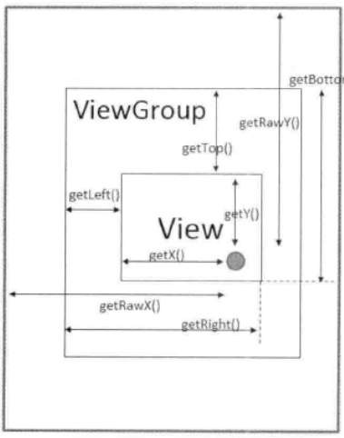

## 滑动效果 ##
滑动一个View其实就是移动一个View，跟补间动画类似，是通过不断改变View的坐标来实现的。

滑动是用户的主动行为，所以需要监听用户的触摸事件，根据触摸点的坐标变化，不断地改变View的坐标，从而
实现View跟随用户触摸位置的滑动而滑动。

## Android坐标系和视图坐标系 ##
**Android坐标系**
在Android中，Android坐标系就是以屏幕最左上角的顶点作为坐标原点的坐标系，并且坐标原点向右为X轴正方向，
向下为Y轴正方向。
可以通过View.getLacationOnScreen(int[])方法获取某个View对象在Android坐标系中的坐标；
另外也可以通过MotionEvent.getRawX()和getRawY()，来获取当前触摸事件下某个View在Android坐标系中的实
时坐标点。

**视图坐标系**
视图坐标系用来描述子View相对于父View的位置关系，所以视图坐标系的坐标原点就是父View的左上角顶点。坐标轴
的正方向跟Android坐标系中的定义一样。
可以通过MotionEvent.getX()和getY()来获取某个View在视图坐标系中的坐标点。

在Android坐标系上的坐标又称为绝对坐标，在视图坐标系上的坐标又称为相对坐标

## 触摸事件 —— MotionEvent ##
**触摸事件的类型**

	public static final int ACTION_DOWN             = 0;

	public static final int ACTION_UP               = 1;

	public static final int ACTION_MOVE             = 2;

    public static final int ACTION_CANCEL           = 3;

    public static final int ACTION_OUTSIDE          = 4;  //触摸动作超出边界

    public static final int ACTION_POINTER_DOWN     = 5;  //多点触摸按下

    public static final int ACTION_POINTER_UP       = 6;  //多点触摸抬起

通过MotionEvent.getAction()方法，返回当前触摸事件的动作类型。通常每执行一次
onTouchEvent(MotionEvent)方法，就是一次触摸事件，并且本次触摸事件的动作类型通过参数MotionEvent获取

## 获取坐标位置的API ##
View类和MotionEvent类提供了大量的方法，用于获取一个View控件在Android坐标系或视图坐标系中的位置
如下图:

**View.java**

	public final int getLeft()  
	public final int getRight()
	public final int getTop()
	public final int getBottom()

	public float getX() {
        return mLeft + getTranslationX();
    }

	public float getY() {
        return mTop + getTranslationY();
    }

	public float getTranslationX() {
        return mRenderNode.getTranslationX();
    }

	public float getTranslationY() {
        return mRenderNode.getTranslationY();
    }

- left、right、top、bottom是View控件相对于父控件的原始位置信息，即没有对View添加动画效果时的位置信
息。可以把left、top看成是View控件左上角顶点在视图坐标系中的原始坐标位置；top、bottom看成是View控件右
下角顶点在视图坐标系中的原始坐标位置
- translationX、translationY则可以看成是对View做了平移动画后，View控件在x轴和y轴方向上的偏移量。
x、y则是加上了平移偏移量的，在视图坐标系上的，View控件的左上角顶点的坐标位置。

在没有对View控件做平移动画时，坐标点(left, top)和坐标点（x, y）是同一个点

left、right、top、bottom和x、y、translationX、translationY都是View控件在视图坐标系上的位置信息

**MotionEvent.java**

	public final float getX()
	public final float getY()

	public final float getRawX()
	public final float getRawY()

- rawX，rawY是触摸点在Android坐标系上的坐标位置；
- x, y是触摸点在视图坐标系上的坐标

## 计算滑动偏移量 ##
**dx,dy是相对于上一次触摸到的坐标点的滑动偏移量**
	float mLastX = 0；
	float mLastY = 0;

	public boolean onTouchEvent(MotionEvent event){
		float x = event.getX();
		float y = event.getY();

		int action = event.getAction();		

		switch(action){
			case MotionEvent.ACTION_DOWN:
				break;
			case MotionEvent.ACTION_MOVE:
				
				float dx = x - mLastX;
				float dy = y - mLastY;

				break;
			case MotionEvent.ACTION_UP:
				break;
		}

		mLastX = x;
		mLastY = y;
		
		return true; 
	}

**dx,dy是相对于按下的坐标点的滑动偏移量**

	float mLastX = 0；
	float mLastY = 0;

	public boolean onTouchEvent(MotionEvent event){
		float x = event.getX();
		float y = event.getY();

		int action = event.getAction();		

		switch(action){
			case MotionEvent.ACTION_DOWN:

				mLastX = x;
				mLastY = y;

				break;
			case MotionEvent.ACTION_MOVE:
				
				float dx = x - mLastX;
				float dy = y - mLastY;

				break;
			case MotionEvent.ACTION_UP:
				break;
		}
		return true; 
	}
## View的滑动 ##
### View的scrollTo方法和scrollBy方法 ###

	public void scrollTo(int x, int y) {
        if (mScrollX != x || mScrollY != y) {
            int oldX = mScrollX;
            int oldY = mScrollY;
            mScrollX = x;
            mScrollY = y;
            invalidateParentCaches();
            onScrollChanged(mScrollX, mScrollY, oldX, oldY);
            if (!awakenScrollBars()) {
                postInvalidateOnAnimation();
            }
        }
    }

    public void scrollBy(int x, int y) {
        scrollTo(mScrollX + x, mScrollY + y);
    }

scrollTo方法的参数表示移动到一个目标坐标点(x, y)；
scrollBy方法的参数表示相对于当前所在坐标点移动的偏移量

scrollTo和scrollBy方法移动的并不是View本身的布局框架，而是View所包含的内容。
对于ViewGroup，它包含的内容是子View；对于View，它包含的内容则通常是View控件在Canvas画布上绘制的图形

从上面所说的scrollTo和scrollBy移动的目标内容可知：
-  如果要使用scrollTo或scrollBy来移动一个View控件，那么调用scrollTo或scrollBy方法的View对象应该是
被移动的View控件的父控件（ViewGroup）；
- 如果要使用scrollTo或scrollBy来移动View控件在Canvas画布上绘制的图形，那么调用scrollTo或scrollBy方
法的View对象就是该View控件

因为调用scrollTo和scrollBy方法的并不是要移动的目标内容，而是包含此移动内容的容器。
根据相对运动，当内容向左移动时，容器相对于内容是向右移动的；当内容向上移动时，容器相对于内容是向下移动
的，即内容移动的方向跟容器相对于内容移动的方向相反；
又因为scrollTo和scrollBy方法的参数所表示位置信息是给容器设置的；
所以，当我们调用容器的scrollTo和scrollBy方法，来移动其内容时，表示位置信息的参数值应该按照内容移动的
反方向来设置。

View的mStartX属性表示View控件左边界和View控件内容左边界之间的距离，mStartX有正负值，
- 为正则表示View控件相对于内容向右移动（即内容向左移动）
- 为负则表示View控件相对于内容向左移动（即内容向右移动）
- 为0则表示还没有在X轴方向（水平方向）移动过View控件的内容

View的mStartY属性表示View控件上边界和View控件内容上边界之间的距离，mStartY有正负值，
- 为正则表示View控件相对于内容向下移动（即内容向上移动）
- 为负则表示View控件相对于内容向上移动（即内容向下移动）
- 为0则表示还没有在Y轴方向（竖直方向）移动过View控件的内容

### 使用Scroller实现弹性滑动 ###
通过View控件的scrollTo或scrollBy对其内容实现的滑动，是瞬间完成的，滑动效果比较生硬、突兀。
于是我们可以通过Scroller来实现弹性滑动。
所谓弹性滑动就是渐进式的滑动，也就是将本来只需要通过调用一次scrollTo或scrollBy方法就要滑动的一段较大的
距离，分割成若干段很小的滑动距离，并且每次调用scrollTo或scrollBy方法都只滑动一段很小的距离，在规定时间
内，通过不断地调用scrollTo或scrollBy方法，完成这一段较大距离的滑动。

通过上面对弹性滑动的描述，我们需要做如下几件事情来才能实现弹性滑动：
1. 首先要确定一段滑动距离，并规定完成滑动所需要的时间。
2. 根据滑动时间，计算出每次调用scrollTo或scrollBy方法需要滑动的小段距离，
3. 调用View的invalid方法，实现View控件内容的每一小段滑动。
4. 当上一次的小段滑动结束后，再开始下一段的小段滑动，直到完成总的滑动距离

Android提供了Scroller类来帮助我们完成弹性滑动，通过Scroller的startScroller方法，我们可以初始化要
滑动的总距离，和滑动需要的时间。通过Scroller的computeScrollOffset方法计算出每次滑动的小段距离，并
通过getCurX()和getCurY()来获取滑动小段距离后所在的坐标点。

要想将每段滑动的效果显示出来，还需要调用View的invalid方法。其实每次调用View的scrollTo或scrollBy
进行滑动，都需要走一遍View的绘制流程，在View的draw方法中会调用到View的computeScroll()方法，通过
实现这个方法，我们就可以开始下一段小距离的滑动了，直到Scroller的computeScrollOffset返回false才
表示滑动结束

	Scroller mScroller = new Scroller(context);

	private void smoothScrollTo(int x, int y){
		int oldScrollX = getScrollX();
		int dx = x - oldScrollX;

		mScroller.startScroll(scrollX, 0, dx, 0, 1000); //只在水平方向滑动，滑动时间是1s
		invalidate(); //刷新View，开始滑动
	}

	@Override
	public void computeScroll(){
		if (mScroller.computerScrollOffset()){
			scrollTo(mScroller.getCurX(), mScroller.getCurY());
			postInvalidate();
		}
	}

### 其他方式实现弹性滑动 ###
除了使用Scroller + scrollTo方法实现弹性滑动外，还有如下方法实现弹性滑动：
- ValueAnimation + scrollTo实现弹性滑动。监听每帧对应属性值的变化，在onAnimationUpdate方法中实现
每小段距离的滑动
- Handler + scrollTo实现弹性滑动。可以通过Handler不断发送延迟消息，每次处理消息时滑动小段距离

### 对View进行滑动的方式 ###
除了通过View的scrollTo和scrollBy实现滑动外，还可以通过ObjectAnimation实现对View的滑动；或通过
设置View的LayoutParams，对View进行重新布局，从而实现View的滑动

**通过属性动画对View进行滑动**

	ObjectAnimation.ofFloat(targetView, "translationX", 0, offsetX)
				   setDuration(1000)
				   .start();

除了属性动画外，还可以使用补间动画中的平移动画实现对View的滑动。
使用补间动画时只是改变View在Canvas画布上的图形的位置，并不是对View本身框架的平移滑动。
使用属性动画则相当于是不断地调用View的setTranslationX方法来设置改变此View的布局框架位置。

**通过LayoutParams对View进行滑动**
通过改变LayoutParams对View进行滑动，通常就是改变这个View的Margin属性

	ViewGroup.MarginLayoutParams layoutParams = 
			(ViewGroup.MarginLayoutParams) view.getLayoutParams();

	layoutParams.leftMargin = view.getLeft() + offsetX;
	layoutParams.topMargin = view.getTop() + offsetY;
	view.setLayoutParams(layoutParams);

需要注意的是，调用View控件的scrollTo和scrollBy进行滑动，滑动的目标对象是此View控件的内容；
通过属性动画对View控件进行滑动，需要通过nineoldandroids库来兼容API 11以下的版本。
通过设置View的LayoutParams就是对View本身的布局框架的移动。

### 全屏滑动的实现方式 ###
全屏滑动无法通过scrollTo方法实现，可以通过属性动画来实现，为了兼容低版本，使用nineoldandroids库中的
ViewHelper.setTranslationX，getTranslationX。

## 最小滑动距离 —— TouchSlop ##
TouchSlop 指的是系统所能识别的最小滑动距离。即如果两次滑动之间（连续的两次ACTION_MOVE事件）的距离小于
这个TouchSlop值，则系统不认为进行了滑动操作。

TouchSlop是一个常量值，和具体的手机设备有关。通过ViewConfiguration类来获取TouchSlop的常量值

	int touchSlop = ViewConfiguration.get(context).getScaleTouchSlop();

这个常量值是在Android系统的config.xml文件中定义的

	<!-- Base "touch slop" value used by ViewConfiguration as a
         movement threshold where scrolling should begin. -->
    <dimen name="config_viewConfigurationTouchSlop">8dp</dimen>

## 速度追踪器 —— VelocityTracker ##
VelocityTracker用于追踪手指在滑动过程中的速度，包括水平速度和竖直速度。

VelocityTracker的使用方式如下：

	private VelocityTracker mVelocityTracker;		

	public boolean onTouchEvent(MotionEvent ev) {

        if (mVelocityTracker == null) {
            mVelocityTracker = VelocityTracker.obtain();
        }

        mVelocityTracker.addMovement(ev);

		switch (action & MotionEvent.ACTION_MASK) {
			...
			mVelocityTracker.computeCurrentVelocity(1000);
			float xVelocity = mVelocityTracker.getXVelocity();
			float yVelocity = mVelocityTracker.getYVelocity();
			...
		
			mVelocityTracker.clear();
			...
			mVelocityTracker.recycle();
		}
	}

在调用getXVelocity或getYVelocity获取速度值之前，要先调用computCurrentVelocity方法设置计算速度时
采用的单元时间间隔。
VelocityTracker使用完之后，要清除重置并回收资源

返回的速度值是有正负之分的，以getXVelocity()的返回值为例：
- 返回值为正，表示从左向右滑。返回值为负，表示从右向左滑。 

## 手势检测器 —— GestureDetector ##
GestureDetector用于辅助检测用户触摸事件过程中的单击、滑动、长按、双击等行为。

GestureDetector的使用方式如下：

	private GestureDetector mGestureDetector;

	public boolean onTouchEvent(MotionEvent ev) {

        if (mGestureDetector == null) {
            mGestureDetector = new GestureDetector(context, listener);
			
			//解决长按屏幕无法拖动的现象
			mGestureDetector.setIsLongpressEnabled(false);
        }

        mGestureDetector.onTouchEvent(ev);

		switch (action & MotionEvent.ACTION_MASK) {
			...
		}
	}

	private SimpleOnGestureListener listener = new SimpleOnGestureListener(){
        
		//OnGestureListener
        public boolean onDown(MotionEvent e) {...}

		public void onShowPress(MotionEvent e) {...}

		public boolean onSingleTapUp(MotionEvent e) {...}

		public boolean onScroll(MotionEvent e1, MotionEvent e2,
                float distanceX, float distanceY) {...}

		public void onLongPress(MotionEvent e) {...}

		public boolean onFling(MotionEvent e1, MotionEvent e2, float velocityX,
                float velocityY) {...}

		//OnDoubleTapListener
		public boolean onSingleTapConfirmed(MotionEvent e) {...}

        public boolean onDoubleTap(MotionEvent e) {...}

        public boolean onDoubleTapEvent(MotionEvent e) {...}
		
		//OnContextClickListener
        public boolean onContextClick(MotionEvent e) {...}
	}

GestureDetector中定义了OnGestureListener、OnDoubleTapListener、OnContextClickListener这三类
监听器接口用于监听用户的行为。SimpleOnGestureListener类实现了这三类监听器接口，但并没有实现具体回调
方法，所以只需要重写SimpleOnGestureListener中需要监听的相关行为的回调方法即可。

通过GestureDetector.onTouchEvent(MotionEvent)方法，用于指定一个需要监听的用户触摸事件对象

GestureDetector中监听器的相关回调方法如下：

	public boolean onDown(MotionEvent e)

	public void onShowPress(MotionEvent e)

	public boolean onSingleTapUp(MotionEvent e)  //单击行为，可能时双击行为中的一次单击

	public boolean onScroll(MotionEvent e1, MotionEvent e2,
                float distanceX, float distanceY)  //拖动滑动

	public void onLongPress(MotionEvent e)

	public boolean onFling(MotionEvent e1, MotionEvent e2, float velocityX,
                float velocityY)  //惯性滑动

	public boolean onSingleTapConfirmed(MotionEvent e) //单击行为，不可能再出现双击行为

	public boolean onDoubleTap(MotionEvent e) //双击行为

	public boolean onDoubleTapEvent(MotionEvent e) 

GestrueDetected只是为开发者提供了一种便捷的方式去监听触摸事件过程中的特定行为。实际开发中不是必须要
使用GestureDetected，因为GestureDetected中的监听回调程序，也可以由开发者自己在onTouchEvent方法中
实现。
建议当监听双击行为时，可以使用GestureDetected。

# View的事件分发机制 #
事件分发机制包含了传递事件和处理事件这两部分的内容，
- 事件的传递是由上往下的（即从父控件逐层传递事件发生区域内的子控件，如果子控件还是ViewGroup，
则再接着传下去，直到子控件是View，或者是没有子View的ViewGroup）；
- 而事件的处理是由下往上的，并且只有接收了传递过来的事件，才能处理这个事件。另外，如果View处理了事件
后，还把事件给消费掉了，那么事件就不会再被上层的父控件处理了。

在Android提供的API中，事件指的就是MotionEvent对象。事件分发机制的流程主要涉及到
dispatchTouchEvent(MotionEvent ev)、onInterceptTouchEvent(MotionEvent ev)、
onTouchEvent(MotionEvent event)这三个方法。

# View的滑动冲突 #
## 常见的滑动冲突的场景 ##
场景一： 父控件滑动方向和子控件滑动方向不一致；
场景二： 父控件滑动方向和子控件滑动方向一致；
场景三： 上面两个场景嵌套

## 场景一 ##
ViewPager + Fragment组成的页面滑动效果。
因为ViewPager内部处理滑动冲突，所以开发者不需要再关注；
如果是ScrollView + Fragment组成的页面，那么就需要开发者手动处理滑动冲突

处理规则是，当用户左右滑动时，外部控件拦截处理；当用户上下滑动时，外部控件不拦截，让内部控件拦截处理

根据滑动过程中两点之间的坐标可以判断是水平滑动还是竖直滑动。，判断依据有如下几种：
- 滑动路径和水平方向的夹角
- 水平方向和竖直方向的距离差
- 水平方向和竖直方向的速度差

## 场景二 ##
SlideMenu侧滑菜单 + ViewPager

场景二的处理办法比较特殊，需要根据业务逻辑状态来确定

## 场景三 ##
最外层是SlideMenu侧滑菜单，内层有一个ViewPager，这是场景二；并且在ViewPager中，有Fragment，
这是场景一。

## 解决滑动冲突的方式 ##
方式有外部拦截法和内部拦截法两种。

**外部拦截法**
外部拦截法是指由父控件决定是否对事件进行拦截，如果由父控件处理事件，则拦截；由子控件处理事件，则父控件
不拦截。是否拦截的逻辑代码通过重写父控件的onInterceptTouchEvent(MotionEvent)方法实现。

	@Override
	public void interceptTouchEvent(MotionEvent event){
		boolean intercept = false;

		int x = (int) event.getX();
		int y = (int) event.getY();

		int action = event.getAction();
		switch(action){
			case ACTION_DOWN:
				intercept = false; //设为true，则子控件收不到任何事件动作。
			break;
			case ACTION_MOVE = false;
				if(父控件处理){
					intercept = true;	
				} else {
					intercept = false;
				}
			break;
			case ACTION_UP:
				intercept = false; //设为true，则子控件收不到up事件动作，子控件的点击事件无作用
			break;
		}
		mLastX = x;
		mLastY = y;
		return intercept;
	}

**内部拦截法**
在介绍内部拦截法之前需要明确几点：
- 在ViewGroup的dispatchTouchEvent源码中，存在两个方面的因素来判断是否拦截事件。一方面是通过设置标记
位FLAG_DISALLOW_INTERCEPT；另一方面是看onInterceptTouchEvent的返回值。如果父控件设置了标记为
FLAG_DISALLOW_INTERCEPT，则表示不拦截事件，此时不再需要参考另一方面的因素（onInterceptTouchEvent
的返回值）。如果父控件没有设置FLAG_DISALLOW_INTERCEPT标记为，则再根据onInterceptTouchEvent的返回
值来判断是否拦截事件。

- 通过在子控件中调用父控件的requestDisallowInterceptTouchEvent(true)方法设置标记位
FLAG_DISALLOW_INTERCEPT，向父控件申请不拦截事件动作，这个不拦截的事件动作指的是下一次传递的事件动作。
所以对于ACTION_DOWN事件动作，因为它是触摸事件过程中的第一个动作，所以此时不可能由子控件来设置
FLAG_DISALLOW_INTERCEPT标记位，通过源码查看，即使通过其他方式设置了此标记为，在ACTION_DOWN动作到来
时，此标记位也会被清除。

内部拦截法是通过由子控件调mParent.requestDisallowInterceptTouchEvent(boolean)方法为父控件设置
或清除标记位FLAG_DISALLOW_INTERCEPT实现的。

	public boolean disptachTouchEvent(MotionEvent event) {
		switch(event.getAction()) {
			case MotionEvent.ACTION_DOWN:
			break;

			case MotionEvent.ACTION_MOVE:
				if(下一次事件动作需要由父控件处理) {
					getParent().requestDisallowInterceptTouchEvent(false);
				}else {
					getParent().requestDisallowInterceptTouchEvent(true);
				}	
			break;
			case MotionEvent.ACTION_UP:
			break;
		}
		return super.dispatchTouchEvent(event);
	}

父控件中还需要重写onInterceptTouchEvent(MotionEvent)方法来配合子控件的逻辑：

	public boolean onInterceptTouchEvent(MotionEvent event){
		boolean intercept = false;
		switch(event.getAction()){
			case MotionEvent.ACTION_DOWN:
				intercept = false;
			break;
			default:
				intercept = true; //如果子控件设置了标记位，onInterceptTouchEvent方法并不会调用到
			break;
		}
		return intercept;
	}

内部拦截法较复杂，不建议使用内部拦截法

# View的测量、布局、绘制流程 #
## MeasureSpec ##
MeasureSpec用于定义一种测量规格，MeasureSpec是一个32位的int值，高2位表示SpecMode，测量模式；
低30位表示SpecSize，指在某种测量模式下的尺寸大小。

通过MeasureSpec.makeMeasureSpec(int size, int mode)方法返回一个32位的int值，
表示一个MeasureSpec测量规格。
通过MeasureSpec.getMode(int measurSpec)方法，从一个测量规格measureSpec中提取int值表示的测量模式；
通过MeasureSpec.getSize(int measureSpec)方法，从一个测量规格measureSpec中提取int值表示的尺寸大小。

SpecMode有三类：
- MeasureSpec.UNSPECIFIED： 父控件不对
- MeasureSpec.EXACTLY
- MeasureSpec.AT_MOST

## View 的测量流程 ##
在测量过程中，系统将View的LayoutParams根据父控件所施加的规则转换成对应的MeasureSpec，然后再根据
MeasureSpec测量出View的宽高，测量出的宽高不一定等于View最终的实际宽高

measure方法被final修饰，自定义View时，重写onMeasure方法实现View的测量过程。

某些情况下，系统可能会多次measure才能确定最终的测量尺寸，此时，在onMeasure中通过getMeasuredWidth|
getMeasuredHeight获取的测量尺寸，即使大于0，也并不一定是最终的测量尺寸。
在onLayout方法中获取的测量尺寸才是最终测量的尺寸，因为执行完measure过程，才会去执行layout过程。

在Activity的onCreate、onStart、onResume方法中都不能正确获取到View的测量尺寸，因为这些回调方法执行
时，View的测量过程可能并没有结束，甚至还没有开始。

## View的布局流程 ##
调用View.layout(int left, int top, int right, int bottom)对View进行布局，在layout中通过
View.setFrame(int left, int top, int right, int bottom)对View本身进行布局，对View本身进行布局，
是指在以父容器左上角顶点为坐标原点的视图坐标系中对该View控件元素进行布局，布局就是指设置该View控件
元素的左上角顶点坐标（mLeft=left, mTop=top），和右上角顶点坐标（mRight=right, mBottom=bottom）。

在layout方法中调用onLayout(boolean changed, int left, int top, int right, int bottom)方法对
该View控件的子元素控件进行布局。当然前提是此View控价要存在子元素（即此View控件也是一个容器）。在对
该View控件的子元素进行布局时，是在以该View控件自身的左上角顶点为坐标原点的视图坐标系中对子元素进行布局
的，并且坐标原点的坐标是（mLeft=left, mTop=top）

### View的测量尺寸和View的实际尺寸的区别 ###
View的实际尺寸是指getWidth|getHeight返回的宽高值；View的测量尺寸是指getMeasuredWidth|
getMeasureHeight返回的宽高值。
通常View的最终测量尺寸和View的实际尺寸是一样大小的，参考View的布局流程可知，View在布局时只是有可能
改变View在容器规定的视图坐标系中的左上角顶点的坐标位置，通常并不会改变View的宽高大小，而View的宽高
大小一开始就是设置为View的测量宽高大小的

# 自定义View时需要用到的一些回调方法的介绍 #

**View.onFinishInflate()**

	protected void onFinishInflate() {
    }

onFinishInflate方法是在加载完布局文件之后调用的，执行到此方法时，可以通过findViewById获取到指定的
View对象；也可以通过getChildCount()获取容器控件在布局文件中添加了多少个子View

onFinishInflate被调用到的时候并没有开始View的测量、布局、绘制流程，所以此时无法获取View的实际宽高。

**View.onSizeChanged(int w, int h, int oldw, int oldh)**

	protected void onSizeChanged(int w, int h, int oldw, int oldh) {
    }

onSizeChanged在View本身的布局位置确定之后会被调用，此时可以通过getWidth|getHeigth来获取View的
宽高值，通常getWidth|getHeigth获取的宽高值和此时调用getMeasuredWidth|getMeasuredHeigth获取的
测量宽高值是一样大小的。

