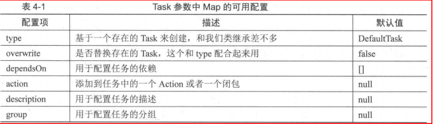
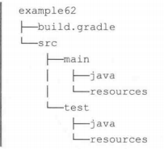
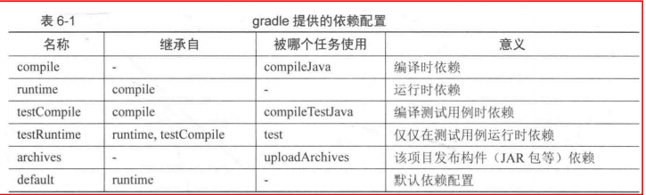
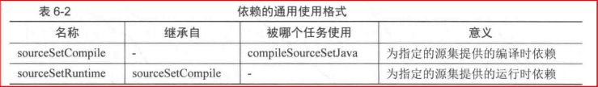
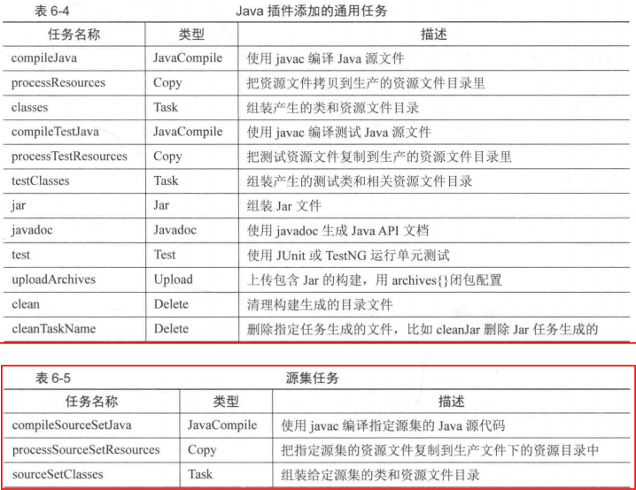
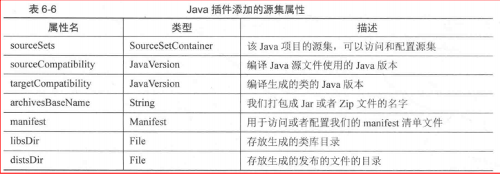

Gradle version : 2.14.1 
Android Gradle Plugin : 2.2.3

build.gradle 是Gradle默认的构建脚本文件，执行gradle命令，会默认加载当前目录下的build.gradle文件。

## Groovy基本知识 ##
Groovy是基于JVM虚拟机的一种动态语言，Groovy完全兼容Java，又在此基础上增加了很多动态类型和灵活的特性，如支持闭包，支持DSL。可以说它是一门灵活的动态脚本语言。

每个Gradle的build.gradle脚本文件都是一个Groovy脚本文件，可以在里面写任何符合Groovy语法的代码，比如定义类，声明函数，定义变量等。

Groovy中方法的调用可以省略中括号，以一个空格分开。
Groovy中分号不是必需的
Groovy中，单引号和双引号的内容都是字符串。不同的是单引号标记纯粹的字符串常量，不能在字符串中做表达式运算，但双引号可以。如"双引号变量计算：${name}"，其中${name}表达式，当{}中只有一个变量可以写成$name。

#### Groovy中的集合： ####
1. List
def numList = [1,2,3]  ，其中numList是一个ArrayList类型（numList.getClass().name）
可以通过下标索引访问集合元素，索引支持负数，表示从右边开始。numList[2] == numList[-1]，
还支持范围索引，如numList[0..2]

Groovy为List提供了非常方便的迭代操作：each方法。此方法接受一个闭包作为参数
	numList.each {
		println it //it是闭包中的变量，表示正在迭代的元素
	}

2. Map
def map = ['width':1024, 'height':768]
通过map[key]或map.key的方式访问指定key的value值

map也通过each方法迭代，不过被迭代的元素是一个Map.Entry对象

	map.each {
		println "Key:${it.key}, Value:${it.value}" //it是一个Map.Entry对象
	}

#### Groovy中的方法： ####
1. 方法调用时括号可以省略， 如method(1, 2) 可写为 method 1,2
2. return可以不写， 当定义有返回值的方法时，不写return，则方法体最后一句代码作为返回值。
3. 代码块可以作为参数传递。代码块就是一段花括号包含的代码，也称为闭包。
4. Groovy规定，如果方法的最后一个参数是闭包，可以放到方法外面。

	numList.each({println it})
	numList.each(){println it}
	numList.each {println it}

#### Groovy中的JavaBean： ####
1. Groovy中可直接通过属性名访问属性（属性就是定义了getter/setter方法的私有成员变量），以及给属性设置值，不用像Java那样通过getter/setter才能实现。
2. 在Groovy中，并不是一定要定义成员变量后，才能作为类的属性访问。直接定义getter/setter方法后，getXxx或setXxx中的xxx也一样可以当做属性访问，如果只定义getter方法，则只能访问属性的值；如果只定义setter方法，则只能给属性设置值。

#### Groovy中的闭包： ####
闭包是Groovy一个非常重要的特性，可以说它是DSL的基础
闭包其实就是一段代码块，
闭包实际上是groovy.lang.Closure类型，泛型版本Closure<V>的泛型V表示闭包的返回类型

	//定义一个方法，接收闭包类型的参数，closure(i)表示调用闭包，i为传递给闭包的参数。
	//如果定义为 def method(closure)，则形参closure为Object类型
	def method(Closure closure){ 
		for(int i in 1..10){
			closure(i)
		}
	}

	//调用method方法，定义一个闭包，并作为method方法的实参。
	//闭包中的it变量就是在method方法定义中调用闭包时，传递给闭包的参数。
	task callMethod << {
		method {
			println it
		}
	}

当传递给闭包的参数有多个时，就不能在定义闭包时使用it变量了。此时，需要在闭包定义时列出传递给闭包的参数

	//此处closure作为闭包调用时，传入2个参数
	def method(closure){
		def map = ["name":"zhangsan", "age":18]
		map.each {
			closure(it.key, it.value)
		}
	}

	//k、v、->的作用是把闭包的参数和主体区分开来。
	//此处变量k,v没有明确指出类型，默认为Object。另外还可以指出具体类型,如 int k, int v ->
	task callMethod << {
		method {k, v ->
			println "${k} is $v"
		}
	}
 
#### Groovy中的闭包委托： ####
Groovy的闭包Closure有三个属性：thisObject、owner、delegate。当在闭包内调用方法或访问变量时，由这三个属性确定使用哪个对象来处理。
默认情况下delegate和owner是同一对象。不过delegate是可以修改的，Gradle中的闭包的很多功能都是通过修改delegate实现的

	build.gradle内容如下

	task helloDelegate << {
		new Delegate.test {
			//thisObject为build.gradle的上下文对象，就是下面第一个method1方法定义中的this
			println "thisObject:${thisObject.getClass()}" 

			//owner和delegate是同一对象
			println "owner:${owner.getClass()}"
			println "delegate:${delegate.getClass()}"

			method1() //调build.gradle上下文中的method1方法
			it.method1() //调Delegate类中的method1方法
		}
	}

	def method1(){
		println "Context this:${this.getClass()} in root"
	}

	class Delegate {
		def method1(){
			println "Delegate this:${this.getClass()} in Delegate"
		}

		def test(Closure<Delegate> closure){
			closure(this)
		}
	}

运行上例，可以发现thisObject优先级最高，闭包中默认优先使用thisObject表示的对象来处理闭包中调用的方法，如果thisObject对象中有此方法则执行
上例还可以证明delegate和owner是同一对象，另外owner的优先级高于delegate。所以闭包内调用方法的处理顺序是：thisObject > owner > delegate。

#### 修改闭包的delegate属性，配置闭包委托对象： ####
在DSL中，比如Gradle，我们一般会将闭包的delegate属性设置为闭包当前的it变量，这样就可以在闭包内对it进行配置，或调用其方法（而不再需要在闭包内通过it.xxx调用it方法了）。

	build.gradle内容如下:

	task configClosure << {
		person {
			personName = "zhangsan"
			personAge = 20
			dumpPerson()
		}
	}

	def person(Closure<Person> closure){
		Person p = new Person()
		closure.delegate = p
		closure.setResolveStrategy(Closure.DELEGATE_FIRST)
		closure(p)
	}

	class Person {
		String personName
		int personAge

		def dumpPerson(){
			println "name is $personName , age is $personAge"
		}
	}

如上例所示，将闭包Closure的delegate属性设置为Person对象，就是实现了闭包委托对象的修改，并且通过Closure的setResolveStrategy方法设置了委托模式优先，就表示在闭包中优先使用delegate属性对象来处理闭包中调用的方法。通过这两个步骤，我们就可以直接在闭包中对该Person对象进行配置修改，而不需要再通过it变量来调用该Person对象的方法了。
在Gradle中也基本都是使用delegate的方式使用闭包进行配置等操作。

## Gradle基础 ##
#### settings.gradle文件： ####
Gradle中定义的一个设置文件，放在根工程目录。用于初始化，以及工程树的配置。
Gradle中多工程是通过工程树表示的，根工程相当于AndroidStudio中的Project。一个根工程可以有很多个子工程，子工程相当于Android Studio的Module。
一个子工程只有在setting.gradle文件中配置后，Gradle才会识别，才能在构建的时候被包含进去

	settings..gradle内容如下：

	rootProject.name = 'android-gradle-book-code'

	include ':example02'
	project(':example02').projectDir = new File(rootDir, 'chapter01/example02')
	include ':example03'
	project(':example03').projectDir = new File(rootDir, 'chapter01/example03')

如上例，include ':example02' 配置一个名为example02的子工程，此子工程的默认目录是和setting.gradles文件同级的一个example02目录，如果没有这个目录，就会报错。另外我们还可以通过
project(':example02').projectDir = new File(path) ，给此子工程指定任意路径下的example02目录。
配置example02子工程还可简写为：

	include ':chapter01:example02'

#### build.gradle文件： ####
每个Project都有一个build.gradle文件，该Build文件是该Project构建的入口，可以在这里针对该Project进行配置，比如配置版本，需要哪些插件，依赖哪些库等。
Root Project可以获取到所有的Child Project，所以在Root Project的build.gradle中可以对Child Project统一配置，比如应用的插件，依赖的Maven中心库等。对此，Gradle为我们提供了相应的方法进行配置

	subprojects{
		apply plugin: 'java'
		repositories {
			jcenter()
		}
	}
上例是在根工程的build.gradle中配置所有的子工程的仓库为jcenter，这样我们在子工程中依赖的jar包就可以从jcenter中心库下载。另外还给子工程配置了Gradle的Java插件

#### Task： ####
一个Project由多个Task组成。Task表示一个操作，如打一个jar包，复制一份文件，编译一次Java代码，上传一个jar到Maven中心库等。和Ant里的Target，Maven中的goal是一样的。

Gradle API中，Task任务是一个org.gradle.api.Task类型，Project提供task方法用于创建task，Project中还有一个属性tasks（类型是org.gradle.api.tasks.TaskContainer，通过定义getTasks()方法创建的tasks属性），可以通过tasks的create方法创建Task任务对象。

	task customTask1 {
		doFirst {
			
		}

		doLast {}
	}

	tasks.create("customTask2") {
		doFirst {}
		doLast {}
	}

调用Project的task方法创建一个任务后，会将task方法中的任务名参数taskName注册为当前Project对象的一个Task类型的属性。所以在上下文环境为Project对象的build.gralde文件中，在创建了一个任务后，可以通过定义的任务名变量来调Task类的API

可以通过Project.hasProperty方法检查某个属性是否存在。

#### Task之间的依赖 ####
任务依赖就是控制哪些任务先执行，哪些后执行。通过Task.dependsOn方法可以设置依赖关系，dependsOn接收一个可变参数。

	task multiTask {
		dependsOn task1, task2	
	}

执行./gradlew multiTask，task执行顺序： task1 > task2 > multiTask

#### 自定义属性 ####
Project、Task、SourceSet中都允许用户添加额外的自定义属性，通过应用所属对应的ext属性实现。
通过ext属性添加自定义属性后，可以通过ext属性对自定义属性进行读取和设值。另外，要同时添加多个自定义属性，需要使用ext代码块。

		build.gradle内容如下：

		//自定义一个Project属性
		ext.age = 18

		//通过ext 代码块给Project添加多个自定义属性
		ext {
			phone = 123
			address = ''
		}

		//在Task中访问当前Project的属性，因为Task中的thisObject属性是当前上下文环境Project对象
		task ex37CustomProperty << {
			println "$age"
			println "$phone"
			println "$address"

			sourceSets.each {
				println "${it.name}的resourcesDir是：${it.resourcesDir}"
			}
		}

		//给所有的SourceSet自定义属性
		sourceSets.all {
			ext.resourcesDir = null
		}
		

只要能访问到自定义属性所属的对象，那么就能访问这些自定义属性，所以，自定义属性叫局部变量的作用域更广

#### Task任务的创建方式 ####
Project类中有4个重载的task方法用于创建Task任务，另外Project中有一个TaskContainer对象tasks，可通过tasks的create方法创建Task任务

	Task task(String name)
	Task task(String name, Closure configureClosure)
	Task task(Map<String, ?> args, String name)
	Task task(Map<String, ?> args, String name, Closure configureClosure)

	//以下都是正确的书写形式

	def  task0 = task(task0, group:BasePlugin.BUILD_GROUP)
	def Task task1 = task(task1, group:BasePlugin.BUILD_GROUP)
	def Task task2 = task(group:BasePlugin.BUILD_GROUP,task2)
	def Task task3 = task("group":BasePlugin.BUILD_GROUP,task3)
	def Task task4 = task task4 {
		group BasePlugin.BUILD_GROUP //这里相当于是调setGroup方法
	}

task方法中的Map参数支持以下6种配置

#### 访问创建的任务 ####
1. 在build.gradle中创建的task任务，其任务名也会被作为上下文环境Project对象的一个Task类型的属性存在。可以直接在build.gradle文件中通过此任务名操作该任务；
2. 另外，Project中有一个TaskContainer类型的tasks属性，此tasks中包含了我们创建的任务，所以可以通过TaskContainer的API访问到我们创建的任务，如使用[]操作符、getByName/findByName、getByPath/findByPath。其中当任务不存在时，get方法会报错UnknownTaskException，find方法返回null。另外，通过path路径访问task时，参数值可以是任务路径，也可以是任务名；但通过name任务名访问任务时，参数只能是任务名
	
	build.gradle内容如下：

	task myTask //创建一个任务myTask
	tasks['myTask'].doLast {} //访问myTask，调其doLast方法

	def Task myTask1 = tasks.findByPath(':app:myTask')
	def Task myTask2 = tasks.getByPath('myTask')

	//返回null， 通过名字访问时，参数不能是路径
	def Task myTask3 = tasks.findByName(':app:myTask') 
	def Task myTask4 = tasks.getByName('myTask')

[]在Groovy中是一个操作符，Groovy的操作符都有对应的方法让我们重载，a[b]对应的是a.getAt(b)这个方法，上例中的tasks['myTask']其实就是调用了tasks.getAt('myTask')。

#### << 操作符 ####
“<<”操作符在Gradle的Task上是doLast方法的短标记形式，也就是<<可以替代doLast

	task myTask << {}  <=>  task(myTask).doLast {}

<<是操作符，<<操作符在Groovy中是可以重载的， a << b 对应的是a.leftShift(b)方法，所以Task接口中肯定有一个leftShift方法重载了<<操作符。
既然<<操作符对应的是leftShift方法，那么为什么说<<操作符可以替换doLast方法呢？查看org.gradle.api.internal.AbstractTask中leftShift和doLast方法的源码可知，这两个方法的实现效果是一样的。

	@Override
    public Task leftShift(final Closure action) {
        DeprecationLogger.nagUserWith("The Task.leftShift(Closure) method has been deprecated and is scheduled to be removed in Gradle 5.0. Please use Task.doLast(Action) instead.");

        hasCustomActions = true;
        if (action == null) {
            throw new InvalidUserDataException("Action must not be null!");
        }
        taskMutator.mutate("Task.leftShift(Closure)", new Runnable() {
            public void run() {
                getTaskActions().add(taskMutator.leftShift(convertClosureToAction(action)));
            }
        });
        return this;
    }
	

	@Override
    public Task doLast(final Closure action) {
        hasCustomActions = true;
        if (action == null) {
            throw new InvalidUserDataException("Action must not be null!");
        }
        taskMutator.mutate("Task.doLast(Closure)", new Runnable() {
            public void run() {
                getTaskActions().add(convertClosureToAction(action));
            }
        });
        return this;
    }

上例中的关键代码是getTaskActions().add，其意思是讲闭包Closure对象转换成Action对象，然后再放到actions这个List集合中，leftShift和doLast都是直接放到list集合的末尾的。

#### 任务的执行分析 ####
当我们执行一个Task的时候，其实就是执行其拥有的actions列表，此actions列表定义在AbstractTask中：private List<ContextAwareTaskAction> actions;

Task的doFirst方法就是把闭包参数转成Action实例再放入actions集合的首位，doLast则放在末位。

	//build.gradle内容如下

	def Task myTask1 = task myTask(type:CustomTask)

	myTask1.doFirst {println "doFirst"}
	myTask1.doLast {println "doLast"}

	class CustomTask extends DefaultTask {
		
		@TaskAction
		def doSelf() {
			println "doSelf"
		}
	}

上例中打印顺序是 doFirst>doSelf>doLast。
@TaskAction注解的作用是将方法doSelf当作Task本身要执行的方法，当创建myTask这个任务时，Gradle会解析带有@TaskAction标注的方法，将其作为Task执行的Action，通过Task的prependParallelSafeAction方法把此Action添加到actions集合的首位。
Task被创建的时候，如果Map参数中有action选项配置的Action实例，就会添加到actions集合中。

#### 任务的onlyIf断言 ####
断言就是一个条件表达式。Task有一个onlyIf方法，它接受一个闭包参数，如果该闭包返回true，则该任务执行，否则跳过。

	final String BUILD_APPS_ALL="all";
	final String BUILD_APPS_SHOUFA="shoufa"
	final String BUILD_APPS_EXCLUDE_SHOUFA="exclude_shoufa"
	
	task exQQ << { println "QQ" }
	
	task exBaidu << { println "BaiDu" }
	
	task myBuild {
	    group BasePlugin.BUILD_GROUP
	    description "打包"
	}
	
	myBuild.dependsOn exQQ, exBaidu
	
	exQQ.onlyIf {
	    def execute = false
	    if(project.hasProperty("build_apps")){
	        Object buildApps = project.property("build_apps")
	        if(BUILD_APPS_SHOUFA.equals(buildApps) || BUILD_APPS_ALL.equals(buildApps)){
	            execute = true
	        }else {
	            execute = false
	        }
	    }else {
	        execute = true
	    }
	    execute
	}
	
	exBaidu.onlyIf {
	    def execute = false
	    if(project.hasProperty("build_apps")){
	        Object buildApps = project.property("build_apps")
	        if(BUILD_APPS_EXCLUDE_SHOUFA.equals(buildApps) || BUILD_APPS_ALL.equals(buildApps)){
	            execute = true
	        }else {
	            execute = false
	        }
	    }else {
	        execute = true
	    }
	    execute
	}

上例中，QQ是首发包，百度是非首发包。在执行gradlew命令时，动态给Project设置build_apps属性，可以控制我们需要打哪些渠道包：

	#打所有渠道包
	./gradlew :app:build  #没有给Project设置build_apps属性，根据代码execute=true
	./gradlew -Pbuild_apps=all :app:build

	#打首发包
	./gradlew -Pbuild_apps=shoufa :app:build

	#打非首发包
	./gradlew -Pbuild_apps=exclue_shoufa :app:build

通过上例，我们可以通过Task的onlyIf方法 + 动态设置Project属性，实现动态控制我们需要的打包渠道。
命令行中的-P的意思是给Project指定K-V格式的属性键值对，使用格式为-PK=V

#### 任务规则 ####
我们创建的任务都在TaskContainer中，由它进行管理。访问任务时也可以通过TaskContainer实现。
TaskContainer是一个接口，间接继承了NamedDomainObjectCollection接口，所以我们说的任务规则其实是NamedDomainObjectCollection的规则。
NamedDomainObjectCollection是一个具有唯一不变名字的域对象的集合。此集合中所有的元素都有一个唯一不变的名字，该名字是String类型。所以我们可以通过名字获取该元素。比如在tasks属性中通过任务名访问任务。

当我们从此集合中获取不到元素时，比如从tasks集合中欲访问的任务不存在，此时，我们可以添加一个规则来处理这种异常情况。比如在DefaultNamedDomainObjectCollection中重写findByName方法时，如果任务找不到，会调用applyRules方法申请我们添加的规则。通过NamedDomainObjectCollection的addRule方法我们可以添加一个自定义规则。

	public T findByName(String name) {
	    T value = findByNameWithoutRules(name);
	    if (value != null) {
	        return value;
	    }
	    if (!applyRules(name)) {
	        return null;
	    }
	    return findByNameWithoutRules(name);
    }

	build.gradle内容如下

	tasks.addRule("添加规则的一段描述") {String taskName ->
		task(taskName) << {
			println "该${taskName}任务不存在，请查证后再执行"
		}
	}

	task myTask {
		dependsOn missTask
	}

上例中，myTask任务依赖一个不存在的任务missTask，如果没有添加规则，Gradle会执行失败，失败信息是任务不存在。添加规则后，当依赖不存在时，Gradle不会执行失败，而是打印我们规则中的提示信息。

## Gradle插件 ##
#### 插件的作用 ####
1. 可以添加任务到项目中，完成一些事情，如测试，编译，打包。
2. 可以添加依赖配置到项目中
3. 可以向项目中现有的对象类型添加新的扩展属性，方法等。如android{}就是Android Gradle插件为Project对象添加的一个扩展。
4. 可以对项目进行一些约定，如应用Java插件后，约定src/main/java目录是我们源代码的存放位置，在编译的时候也是编译这个目录下的Java源代码文件。

我们只需要按照插件约定的方法，使用它提供的任务，方法或者扩展，就可以对我们的项目进行构建。

----
在项目中使用插件之前，需要把这个插件应用到项目中，通过Project的apply方法实现。
插件分为二进制插件和脚本插件，不同类型的插件应用到项目中的方式也有差异。

#### 应用二进制插件 ####
二进制插件就是实现了org.gradle.api.Plugin接口的插件，并且插件具有plugin id。

	apply plugin:'java'  第一种写法

上例把一个Java插件应用到我们的项目中，'Java'就是Java插件的plugin id，是唯一的。

对于Gradle自带的核心插件，都有一个容易记的短名，称为plugin id，比如这里的'java'，其实这个Java插件id对应的类型是org.gradle.api.plugins.JavaPlugin，所以通过该类型我们也可以应用这个插件，因为org.gradle.api.Plugins是默认导入的，所以可以省略不写。

	apply plugin:org.gradle.api.plugins.JavaPlugin  第二种写法
	apply plugin:JavaPlugin  第三种写法

以上的第二种写法适用于我们在build.gradle文件中自定义的插件，这种自定义插件也就是脚本插件。

二进制插件一般都是被打包在一个jar里独立发布的。
对于我们自定义的脚本插件，在发布的时候也可以指定一个plugin id，为了避免重复，这个plugin id最好是一个全限定名称，如包名那样定义。

#### 应用脚本插件 ####

	build.gralde内容

	apply from:'version.gradle'

	task myTask << {
		println "${versionName}, ${versionCode}"
	}

	
	version.gradle文件内容

	ext {
		versionName = '1.0.0'
		versionCode = 1
	}

应用脚本插件，其实就是通过apply方法把这个脚本文件加载进build.gradle中，和应用二进制插件不同的是，这里的apply方法使用的是from关键字，from后可以是一个本地的脚本文件，也可以是一个网络的脚本文件，如果是网络上的话要使用HTTP URL。

#### apply的其他方法 ####
org.gradle.api.plugins.PluginAware
	void apply(Closure closure);
	void apply(Action<? super ObjectConfigurationAction> action);
	void apply(Map<String, ?> options);

闭包的方式：

	apply {
		plugin 'java'
	}	

闭包被用来配置一个ObjectConfigurationAction对象，所以可以在闭包中使用ObjectConfigurationAction对象的方法，属性等进行配置。

Action的方式：

	apply(new Action<ObjectConfigurationAction>) {
		@Override
		void execute(ObjectConfigurationAction objectConfigurationAction){
			objectConfigurationAction.plugin('java')
		}
	}

#### 应用第三方发布的插件 ####
在应用第三方发布的二进制插件（一个jar文件）之前，必须先在Project的buildscript{}中配置这个二进制插件jar文件的classpath，这样Gradle才能找到这个插件，因为它不是作为Gradle的内置插件存在的。
比如Android Gradle Plugin就是一个第三方插件，其classpath配置如下

	buildscript {
		repositories {
			jcenter()
		}

		dependencies {
			classpath 'com.android.tools.build:gradle:1.5.0'
		}
	}

以上配置后，就可以应用第三方插件了
	apply plugin: 'com.android.application'

buildscript{}是一个在构建项目之前，为项目进行前期准备，以及初始化相关配置依赖的地方。

#### 自定义插件 ####
自定义插件必须实现org.gradle.api.Plugin<T>接口，这个接口只有一个apply方法，该方法在插件被应用的时候执行。

插件类可以直接定义在build.gradle文件中，但这样只能在本项目中使用。
如果想开发一个独立的插件供其他人使用，需要单独创建一个Groovy工程作为开发自定义插件的工程。
step1. 创建一个java文件，自定义一个MyPlugin类，实现Plugin接口。

step2. 定义plugin id。Gradle是通过META-INF目录下的 properties文件来发现对应插件实现类的。比如，在src/main/resources/META-INF/gradle-plugins/目录下新建一个com.zengk.plugins.myplugin.properties文件，文件中新增一行: `implementation-class=com.zengk.plugins.MyPlugin` ， 其中key为implementation-class固定不变，value就是我们自定义插件的实现类。于是，plugin id就是properties的文件名"com.zengk.plugins.myplugin"。
配置好后，就可以生成一个jar包分发给其他人使用此插件了。

其他人应用此插件的配置工作如下：

	step1. 设置插件的classpath
	buildscript {
		dependecies {
			classpath files('libs/myplugin.jar')
		}
	}

	step2. 应用插件
	apply plugin: 'com.zengk.plugins.myplugin'

## Java插件 ##
#### Java插件约定的项目结构 ####

默认情况下，Java插件约定
src/main/java为项目源代码存放目录；
src/main/resources为要打包的资源文件存放目录，比如一些配置文件和图片等；
src/test/java为单元测试用例存放目录，执行单元测试时，Gradle会在这个目录下搜索单元测试用例执行；
src/test/resources存放单元测试中使用的资源文件

main和test为Java插件内置的两个源代码集合(又称源集)，此外，我们还可以自定义源代码集合。
如自定义一个vip目录来存放vip相关的Java源码和资源文件：

	build.gradle内容如下

	apply plugin: 'Java'

	sourceSets {
		vip {}
	}

于是，可以在src下新建vip/java、vip/resources目录分别存放vip相关的源代码和资源文件。

不管是哪个源代码集合，默认情况下，源代码文件存放在src/sourceSet/java目录下；资源文件存放在src/sourceSet/resources目录下。此外，我们也可以改变默认目录，如下：

	sourceSets {
		main {
			java {
				srcDir 'src/java'
			}	

			resource {
				srcDir 'src/resources'
			}
		}
	}

于是，源代码存放路径改为src/java，资源文件存放路径改为src/resources

#### 第三方依赖的配置 ####
在使用第三方依赖jar包之前，首先要进行依赖配置，也就是告诉Gradle如何找到这些需要依赖的jar包。
依赖配置首先要配置仓库，就是告诉Gradle去哪里可以找到我们将要依赖的jar包；然后就是配置具体的jar包依赖了。
仓库的类型有很多，如Maven中心库mavenCentral，jcenter库，ivy库，本地Maven库mavenLocal，还有自己搭建的Maven私服库，另外本地文件夹也可以作为一个仓库。
仓库配置方式如下：

	repositories {
		mavenCentral()
		maven {
			url 'http://www.mavenurl.com/'
		}
	}

如上，Gradle可以在maven中心库，以及url指定的maven私服库中搜寻将要依赖的jar包。

配置一个要依赖的具体jar包的方式如下：

	//方式一
	dependencies {
		compile group: 'com.squareup.okhttp3', name: 'okhttp', version: '3.0.1'
	}

	//方式二
	dependencies {
		compile 'com.squareup.okhttp3:okhttp:3.0.1'
	}

如下，其中compile表示编译时依赖，即在编译Java源文件时需要依赖okhttp。
group、name、version就是Maven中的GAV(groupid、artifactid、version)，这是Maven非常重要的组成文件，它们3个合起来标记一个唯一的构建。即通过GAV来唯一确定我们需要依赖的Jar包。

除了compile这种依赖配置方式外，Gradle还提供了其他的依赖配置方式。如testCompile方式，表示需要依赖的Jar包只会在编译单元测试用例时使用，不会打包到发布的产品中。如依赖Junit库时，可使用testCompile。
Gradle提供的依赖配置方式如下表

另外，Java插件还支持针对不同的源代码集合，在编译时或运行时，指定不同的依赖：

	dependencies {
		mainCompile 'com.squareup.okhttp3:okhttp:3.0.1'
		vipCompile 'com.squareup.okhttp3:okhttp:3.0.1'
	}

通用的使用格式如下表：

以上这种需要配置一个外部仓库，然后再通过GAV指定一个Jar包的配置依赖的方式，属于外部依赖的配置。此外，
Gradle还提供了项目依赖、文件依赖的配置方式。

#### 项目依赖 ####
项目依赖就是依赖一个在settings.gradle文件中配置过Gradle项目，方式如下：
	
	dependencies {
		compile project(':library')		
	}

如上，在根项目下，除了当前子项目，还有一个library子项目，此library经上面配置后，被当前项目所依赖，于是在当前项目中可以使用library中的Java类。

#### 文件依赖 ####
文件依赖，一般就是指依赖一个本地的jar包文件。配置方式如下：

	dependencies {
		complie files('libs/my1.jar', 'libs/my2.jar')
	}

如上，在当前子项目目录下有个libs目录，以上方式可以配置libs目录中的一个或多个依赖文件。另外，如果想要依赖libs目录下所有jar文件，方式如下：

	dependencies {
		complie fileTree(dir:'libs', include: '*.jar')
		//还可写成complie fileTree(dir:'libs', include: ['*.jar'])
	}

#### Java插件提供的任务 ####
在Gradle中，执行任何操作都是通过任务驱动的，构建Java项目也是如此。
build任务： 通过 ./gradlew build执行，运行build任务，会构建整个项目：编译源码文件，处理资源文件，打成Jar包，编译测试用例代码，处理测试资源，运行单元测试。最后在build/libs下生成Jar包。

clean任务： 删除build目录以及其他构建生成的文件。如编译中存在问题，可以先执行clean，然后再重新执行build。

assemble任务： 该任务不会执行单元测试，只会编译和打包。此任务在Android中也存在，执行它可以打apk包。所以assemble任务不仅仅只会打Jar包，它是一个引导类的任务，根据不同的项目类型打出不同的包。

check任务： 只会执行单元测试，有时还会做一些质量检查。不会打jar包，也是一个引导任务。

javadoc任务： 生成Java格式的doc api文档。

Java插件提供的其他任务如下表：

其中任务名称中的sourceSet使用时要换成具体的源集名称，如compileMainJava

#### 源代码集合SourceSet ####
SourceSet（源代码集合，又称源集），是Java插件用来描述和管理源代码，以及资源文件的一个抽象概念，是一个Java源代码文件和资源文件的集合。

通过源集，可以针对不同的业务和应用对我们源代码进行分组。比如源集main用于主要业务产品，源集test用于单元测试。main和test源集是Java插件默认内置的两个标准源集。

Java插件为Project实例扩展了一个sourceSets属性，以及一个sourceSets{}闭包。可参考org.gradle.api.plugins.JavaPluginConvention。

源集SourceSet常用属性如下：

#### Java插件为Project扩展的属性 ####

如上，Gradle版本不同，可能有所差异，可参考org.gradle.api.plugins.BasePluginConvention和org.gradle.api.plugins.JavaPluginConvention

sourceSets属性是一个SourceSetContainer接口类型，继承NamedDomainObjectContainer<SourceSet>，是一个域对象。

#### 发布构件 ####
Gradle构建的产物，称之为构件。一个构件可以是一个Jar包文件，也可以是一个Zip包或WAR等。
如发布Jar包，就是通过配置，把Jar包发布到本地目录，Maven库，Ivy库等地方中。

发布构件，首先要配置需要发布什么样的构件；然后再配置需要把构件发布到哪里去。
step1：通过artifacts{}闭包配置要发布的构件

	build.gradle内容如下:

	apply plugin: 'java'

	task publishJar(type: Jar)

	artifacts {
		archives publishJar
	}

如上，可以通过一个Task来提供需要发布的构件。另外，还可以直接发布一个文件对象

	def publishFile = file('build/buildile');

	artifacts {
		archives publishFile
	}

step2: 配置好需要发布的构件后，就可以发布到指定的地方去了。发布就是上传，即把配置好的构件上传到一个指定的目录，或一个指定的Maven库，一个指定的Ivy库等。
	
	group 'com.zengk.myarchives'
	version '1.0.0'

	uploadArchives {
		repositories {
			flatDir {
				name 'libs'
				dirs "$projectDir/libs"
			}

			mavenLocal()
		}
	}

如上，uploadArchives是一个Upload类型的Task任务，用于上传发布构件。配置flatDir{}闭包将一个Jar包构件发布到当前项目中的libs目录。
除了发布到本地目录，同时也可以发布到Maven库，因为Maven通过GAV唯一标识依赖，所以最好指定group和version。运行./gradlew :app:uploadArchives后，就可以在用户目录下的.m2/repository文件夹下找到。

此外，还可以将构件发布到Maven私服库中。如下：

	apply plugin: 'java'
	apply plugin: 'maven'
	
	group 'com.zengk.myarchives'
	version '1.0.0'

	uploadArchives {
		repositories {
			mavenDeployer {
				repository(url: "http://repo.mycompany.com/nexus/content/repositories/release") {
					authentication(userName: "username", password: "pwd")
				}

				snapshotRepository(url: "http://repo.mycompany.com/nexus/content/repositories/snapshots") {
					authentication(userName: "username", password: "pwd")
				}
			}
		}
	}
	
如上，还需要引用maven插件，maven插件对Maven的发布构件支持非常好，可直接配置release和snapshot库。

## Android Gradle 插件 ##
#### Android Gradle 插件分类 ####
Android中有3类工程，对应也有3种插件
App应用工程，对应App插件，plugin id 为 com.android.application。App应用工程生成一个可运行的apk应用。

Library库工程，对应Library插件，plugin id 为 com.android.library。Library工程生成一个AAR包给其他App工程使用。AAR包类似于Jar包，只不过AAR包还包含了Android的资源等信息。

Test测试工程，对应Test插件， plugin id 为 com.android.test。Test测试工程用于对App工程或Library工程进行单元测试。

#### 应用Android Gradle插件 ####
以应用App插件举例，因为Android Gradle插件是第三方插件，托管在Jcenter上，所以在应用此插件之前，需要配置插件依赖，即告诉Gradle去哪里找这个具体的插件，包括插件的classpath和此classpath存放的地方（classpath存在于Jar包文件中）

	buildscript {
		repositories {
			jcenter()
		}

		dependencies {
			classpath 'com.android.tools.build:gradle:1.5.0'
		}
	}

如上，就完成了插件的配置，然后就可以应用此插件了：

	apply plugin: 'com.android.application'

#### Android Gradle插件提供的任务 ####
Android插件基于Java插件，所以Android插件基本包含了Java插件的功能，包括继承Java插件的任务，如assemble、check、build等。
此外，Android还添加了connectedCheck、deviceCheck、lint、install、uninstall等Android插件特有的任务。

connectedCheck 在所有连接的设备或模拟器上运行check检查。
deviceCheck 通过API连接远程设备运行checks。
lint 在所有的ProductFlavor上运行lint检查。
install和uninstall 在已连接的设备上安装或卸载App。

signingReport 可以打印App的签名。
androidDependencies 可以打印Android的依赖

其他任务可以通过./gradlew tasks查看。

----
	根工程build.gradle内容如下：

	buildscript {
		repositories {
			jcenter()
		}

		dependencies {
			classpath 'com.android.tools.build:gradle:1.5.0'
		}
	}

	子工程build.gradle内容如下：
	
	apply plugin: 'com.android.application'

	android {
		compileSdkVersion 23
		buildToolsVersion '23.0.1'

		defaultConfig {
			applicationId "com.zengk.example"
			minSdkVersion 14
			targetSdkVersion 23
			versionCode 1
			versionName "1.0"
		}

		buildTypes {
			release {
				minifyEnabled false
				proguardFiles getDefaultFile('proguard-android.txt'), 'proguard-rules.pro'
			}
		}
	}

	dependencies {
		compile fileTree(dir: 'libs', include: ['*.jar'])
		testCompile 'junit:junit:4.12'
		compile 'com.android.support:appcompat-v7:23.1.1'
		compile 'com.android.support:design:23.1.1'
	}

android{}是Android插件提供给Project的一个扩展，android的类型是AppExtension，所以闭包中使用AppExtension相关的API对android进行配置。
android{}用于自定义Android Gradle工程的配置。
Android Gradle工程的配置，都是在android{}中，这是唯一的一个入口。

compileSdkVersion是编译所依赖的Android SDK版本，值为APILevel

buildToolsVersion是构建Android工程的构建工具版本

defaultConfig{}用于默认配置，是一个ProductFlavor。ProductFlavor可以让我们根据不同情况同时生成多个不同的APK包，比如多渠道打包。
对于没有在自定义ProductFlavor中单独配置的属性，默认使用defaultConfig中配置的。

ProductFlavor类提供的属性：

	applicationId 用于配置包名。在构建时，会从AndroidManifest.xml文件中读取（manifest标签的package属性）
	testApplicationId 用于配置测试App的包名，默认使用 applicationId + ".test"。

	testInstrumentationRunner 用于配置单元测试时使用的Instrumentation Runner类名，是一个全路径名，必须是android.app.Instrumenation的子类。默认使用android.test.InstrumtationTestRunner。

	minSdkVersion 是最低支持的Android系统的API Level
	targetSdkVersion 表明基于哪个Android版本开发的

	versionCode 是App应用内部版本号，是一个整数值。可用于控制App升级。
	versionName 是App应用的版本名称，用户可以看到，就是我们发布的版本

	signingConfig 配置的签名信息，对生成的App签名。是一个SigningConfig类型的属性。

BaseFlavor提供的方法
	proguardFile 用于配置App ProGuard混淆所使用的ProGuard配置文件
	proguardFiles 可同时接收多个ProGuard配置文件。

	
#### 构建类型 ####
buildTypes{}可以配置多个新增的构建类型。buildTypes也是一个NamedDomainObjectContainer<BuildType>类型的属性（BaseExtension），同Java插件扩展的sourceSets类似，也是一个域对象。所以我们可以像在sourceSets{}闭包中配置源集那样，在buildTypes中配置我们需要的构建类型，如release就是一个新增的构建类型，是一个BuildType对象。

Androi Gradle已经帮我们内置了debug和release两个构建类型，这两种模式的主要差别在于能否在设备上调试，以及签名不一样。

如果想增加新的构建类型，在buildTypes{}闭包中添加BuildType类型的元素即可。

每一个BuildType都会生成一个SourceSet，默认位置是src//。
因为每个BuildType都会生成一个SourceSet，所以新增的BuildType名字不能是main和androidTest，因为它们两个已经被系统占用。同时每个BuildType之间名称不能相同。

除了会生成对应的SourceSet外，每个BuildType还会生成相应的assemble任务，比如assembleRelease、assembleDebug就是Android Gradle自动生成的两个Task任务。执行相应的assemble任务，就能生成对应BuildType所有的apk。

BuildType相关的属性或方法：
	minifyEnabled (DefaultBuildType)表示是否为该构建类型启用混淆

	proguardFile (BuildType类) 用于配置App ProGuard混淆所使用的ProGuard配置文件
	proguardFiles (BuildType类) 可同时接收多个ProGuard配置文件。

	signingConfig (BuildType接口) 配置的签名信息，对生成的App签名。是一个SigningConfig类型的属性。
	
	applicationIdSuffix (BaseConfig) 配置基于默认applicationId的后缀

	debuggable (DefaultBuildType) 配置是否生成一个可供调试的apk
	jniDebuggable (DefaultBuildType) 配置是否生成一个可供调试Jni代码（C/C++）的apk

	multiDexEnabled (BaseConfig) 配置该BuildType是否启用自动拆分多个Dex的功能。当程序代码太多，超过65535个方法时，拆分为多个Dex处理。

	shrinkResources (BuildType类) 配置是否自动清理未使用的资源，默认false。

	zipAlignEnabled 配置是否启用zipalign优化
	

getDefaultProguardFile是Android扩展的一个方法，可获取到Android SDK目录下默认的proguard配置文件。在android-sdk/tools/proguard/目录下。

#### 配置签名信息 ####
一个App只有在签名之后才能被发布、安装、使用。签名是保护App的方式，标记该App的唯一性。
如果App被恶意篡改，签名就不一样了，就无法升级安装。

要对App进行签名，首先要有一个签名证书文件，这个文件被开发者持有。

Android Gradle工程帮我们内置了debug和release这两种构建类型，开发调试时使用debug模式，发布时使用release模式。可以针对这两种构建类型采用不同的签名方式。

对于debug模式，Android SDK已经提供了一个默认的debug签名证书，位于$HOME/.anroid/debug.keystore。
我们可以直接使用此签名证书， 也可以另外使用其他的签名证书。
但发布的时候，对release构建类型，我们要配置使用自己生成的签名证书。

Android Gradle为我们提供了signingConfigs方法用于配置签名信息，还提供了一个siginConfigs属性用于访问配置好的签名。（BaseExtension）

	android {
		...

		signingConfigs {
			release {
				storeFile file("myreleasekey.keystore")
				storePassword "password"
				keyAlias "MyReleaseKey"
				keyPassword "password"
			}

			debug {
				storeFile file("mydebugkey.keystore")
				storePassword "password"
				keyAlias "MyDebugKey"
				keyPassword "password"
			}
		}
	}

如上，signingConfigs{}同sourceSets{}和buildTypes{}一样，配置一个域对象。signingConfigs{}闭包配置的域对象类型是NamedDomainObjectContainer<SigningConfig>。所以上例中的release，debug都是SigningConfig类型。

SigningConfig类的属性：
	storeFile 指定签名证书文件
	storePassword 签名证书文件的密码
	keyAlias 签名证书中密钥别名
	keyPassword 签名证书中密钥的密码

通过signingConfigs{}闭包，我们只是配置好了两个签名信息（release和debug），相当于是初始化了release和debug这两个SigningConfig类型的变量。不过我们还没有使用这两个变量对我们的构建类型进行签名配置。
接下来，我们可以在defaultConfig{}中使用我们配置好的签名信息设置默认的签名配置，也可以在buildTypes{}中针对不同的构建类型设置我们配置好的签名信息。

	android {
		defaultConfig {
			signingConfig signingConfigs.debug
		}

		buildTypes {
			release {
				signingConfig signingConfigs.release
			}
			debug {
				signingConfig signingConfigs.debug
			}
		}
	}

如果还有其他的构建类型，也可以像上面这样给它单独进行签名配置，如付费版的VIP，特别的渠道包等。

#### 代码混淆 ####
代码混淆不仅能优化代码，使apk包变小；还可以混淆代码，让反编译的人不容易看明白业务逻辑。
一般情况下，发布到市场的版本一定要混淆，也就是release模式编译的版本。
但调试的版本（debug模式编译的版本）不用混淆，因为混淆后就无法断点跟踪调试了。

使用混淆时，首先要设置minifyEnabled属性为true，开启混淆；然后再配置混淆文件

	android {
		buildTypes {
			release  {
				minifyEnabled true
				proguardFiles getDefaultProguardFile('proguard-android.txt'), 'proguard-rules.pro'
			}
		}
	}

Android SDK为我们提供了两个Proguard配置文件，分别是proguard-android.txt和proguard-android-optimize.txt。我们可以使用它们，也可以自定义自己的混淆文件。

除了在buidlTypes{}中启用混淆和配置混淆外，还可以在defaultConfig{}，和productFlavors{}中启用混淆和配置混淆。

#### zipalign优化 ####
zipalign是Android提供的一个整理优化apk文件的工具，它能提高系统和应用的运行效率，更快的读写apk中的
资源，降低内存的使用，所以对于要发布的App，一定要只用zipalign进行优化。

通过配置BuildType的zipAlignEnable属性启用zipalign优化。

----

#### 共享库 ####
Android的包，如android.app、android.content、android.view、android.widget等，都是默认就包含在Android SDK库中的，系统会自动链接它们，不会出现找不到类的情况，所以应用可直接使用它们。
此外，还有一些库，如com.google.android.maps、android.test.runner等，这些库是独立的，不会被系统自动链接，这类库称为共享库。使用共享库，需要另外配置，在AndroidManifest.xml文件中使用uses-library标签指定要使用的共享库。

	<uses-library 
		android:name="com.google.android.maps"
		android:required="true"/>

在AndroidManifest.xml中配置了共享库之后，在安装apk的时候，会检测手机系统中是否有uses-library标签指定的共享库。因为给uses-library标签设置了android:required="true"，所以如果手机系统没有此共享库，将不能安装apk。

通过PackageManager().getSystemSharedLibraryNames()可获取系统中所有共享库的名称。

#### add-ons库和optional库 ####
在Android中，除了标准的SDK，还存在两种库：add-ons附件库、optional可选库。
add-ons库位于SDK目录下的add-ons文件夹中，这些库大部分是第三方厂商或公司开发的，一般是为了让开发者使用，但又不想暴露具体标准实现。
optional可选库，位于SDK目录下的platforms/android-xx/optional目录下，一般是为了兼容旧版本的API。

对于add-ons附件库，Android Gradle会自动解析，帮我们添加到classpath中；
对于optional可选库，Android Gradle不会自动解析并添加到classpath中。
所以对于optional可选库，我们需要自己将它添加到classpath中，Android Gradle插件提供useLibrary方法(BaseExtension)，可以让我们把一个库添加到classpath中。

	android {
		useLibrary 'org.apache.http.legacy'
	}

如上，是将Apache HttpClient库添加到classpath中。HttpClient库是一个optional库，因为从API 23之后，HttpClient库就没有被包含进SDK标准库中去了。

根据Android Gradle源码说明（IAndroidTarget.java中的getOptionalLibraries和getAdditionalLibrarirs），对于add-ons附件库和optional可选库，都需要在AndroidManifext.xml中使用uses-library标签指定。

#### 批量修改apk文件名 ####
Android工程中有很多相同的任务，这些任务的名字都是通过Build Types和Product Flavors生成的，是动态创建和生成，并且生成的时间比较靠后，所以如果像Java工程中那样通过project.tasks来访问任务，可能会提示找不到该任务，因为对于动态生成的任务，此时并没有生成。

如修改apk文件名这种需求，本来可以通过修改Android Gradle打包输出的任务实现，但此任务是后续动态生成的，不能通过project.tasks访问到。

Android Gradle为我们提供了相关的属性和API，来帮助我们访问或修改Android构建的产物。修改apk文件名也可以通过这些属性和API实现。

	applicationVariants (AppExtension) 仅适用于app应用插件。是一个DomainObjectSet集合，元素是ApplicationVariant类型。

	libraryVariants (LibraryExtension) 仅适用于library库插件，是一个DomainObjectSet集合，元素是LibraryVariant类型。

	testVariants(以上两种插件都适用)，是一个DomainObjectSet集合，元素是TestVariant类型。

XxxVariant实例代表Android Gradle的构建产物，是基于Build Types和Product Flavors生成的。如ApplicationVariant可以代表Google渠道的release包，也可以代表dev开发用的debug包。

如下是批量修改apk文件名的例子：

	build.gradle内容如下：

	android {
		...

		buildTypes {
			release {
				minifyEnabled true
				proguardFiles getDefaultProguardFile('proguard-android.txt'), 'proguard-rules.pro'
				zipAlignEnabled true
			}
		}

		productFlavors {
			google {

			}
		}

		applicationVariants.all {variant -> 
			variant.outputs.each {output -> 
				if (output.outputFile != null && output.outputFile.name.endsWith('.apk')
					&& 'release'.equals(variant.buildType.name)){
					def flavorName = variant.flavorName.startsWith("_") ? variant.flavorName.subString(1) :variant.flavorName

					def apkFile = new File(output.outputFile.getParent(),
								"Example_${flavorName}_v${variant.versionName}_${buildTime()}.apk")

					output.outputFile = apkFile
				}
			}
		}
	}

	def buildTime() {
		def date = new Date()
		def formattedDate = date.format('yyyyMMdd')
		return formattedDate
	}

如上例，因为Android Gradle插件默认内置了release和debug这两种构建类型，又因为上例中我们新增了一个名为google的渠道，所以variant表示的构建产物共有2个：googleRelease和googleDebug。
	

#### 版本信息的配置方式 ####
每个应用都有一个版本名称和版本号，版本名称是外部使用的，即告诉用户的；版本号是内部使用的，即开发者自己使用的。
版本名称一般由三部分组成： major.minor.patch。major表示主版本号，minor表示副版本号，patch表示补丁号。此外，也有两位的组成格式： major.minor。
版本号则是整数形式

1. 最原始的方式，就是直接在defaultConfig{}中给versionCode和versionName这两个属性设置常量值。

	android {
		...
		
		defaultConfig {
			...
			versionCode 1
			versionName '1.0.0'
		}
	}
如上，此方式比较直观，但当build.gradle文件内容代码较多时，不容易找到。并且修改容易出错。代码版本管理时也容易产生冲突。

2. 分模块的方式。即新建一个version.gradle文件，并为当前Project实例扩展两个新的属性分别表示版本名称和版本号。通过应用脚本插件的方式，将version.gradle配置到build.gradle中

	version.gradle内容如下：
	
	ext {
		appVersionCode = 1
		appVersionName = "1.0.0"
	}

	
	build.gradle内容如下

	apply from: "version.gradle"
	
	android {
		...
	
		defaultConfig {
			...
			versionCode appVersionCode
			versionName appVersionName
		}
	}

如上，修改版本信息时，只需要修改version.gradle文件内容即可。

3. 从git的tag中获取版本信息。
采用这种方式，首先需要在git中，给需要修改版本信息的那次commit提交添加tag标签，并且tag名称可以作为应用的版本名称。因为版本号是整数，所以可以用tag标签的数量表示。

我们可以使用命令： git describe --abbrev=0 --tags 获取到tag标签名称，使用命令： git tag --list 获取tag的数量。

Gradle的Project类提供了exec方法来执行shell命令。另外，exec也是一个Task任务，我们还可以通过自定义一个继承了exec任务的Task，来执行shell命令。
	
	android {
		...

		defaultConfig {
			...
			versionCode getVersionCode()
			versionName getVersionName()
		}
	}

	def getVersionName() {
		def stdout = new ByteArrayOutputStream()
		exec {
			commanLine "git", "describe", "--abbrev=0", "--tags"
			standardOutput stdout
		}

		return stdout.toString
	}

	def getVersionCode() {
		def stdout = new ByteArrayOutputStream()
		exec {
			commandLine 'git', 'tag', '--list'
			standardOutput stdout
		}

		return stdout.toString.split("\n").size()
	}

#### 使用Manifest占位符动态配置AndroidManifest文件 ####
动态配置AndroidManifest文件，就是在构建过程中，动态修改AndroidManifest.xml中的内容。
以动态修改第三方分析统计平台友盟的配置信息为例：

使用友盟统计数据时，会要求我们在AndroidManifest文件中指定渠道名称：
	`<meta-data android:value="Channel ID" android:name="UMENG_CHANNEL" />`
如上，Channel ID要替换成不同的渠道名，如google、baidu等。
此时，我们可以在AndroidManifest.xml中这样写：
	`<meta-data android:value="${UMENG_CHANNEL}" android:name="UMENG_CHANNEL" />`

在build.gradle中内容如下：

	android {
		
		...

		productFlavors {
			google {
				manifestPlaceholders.put("UMENG_CHANNEL", "google")
			}

			baidu {
				manifestPlaceholders.put("UMENG_CHANNEL", "baidu")
			}
		}
	}

如上，${UMENG_CHANNEL}就是一个Manifest占位符。build.gradle文件中的manifestPlaceholders是一个Map类型的属性（BaseConfig）。通过manifestPlaceholder属性在build.gradle文件中为Manifest占位符配置具体的值。
于是，AndroidManifest.xml中meta-data标签中的${UMENG_CHANNEL}就是根据不同的渠道替换成不同的渠道名，如google或baidu。

当渠道类型较多时，还可以通过productFlavors属性集合（BaseExtension），遍历每个ProducFlavor渠道实例并设置占位符的值：

	android {
		...
		
		productFlavors {
			google {}
			baidu {}
		}

		productFlavors.all { productFlavor -> 
			manifestPlaceholders.put("UMENG_CHANNEL", productFlavor.name)
		}
	}

如上，productFlavor.name属性的值就是在productFlavors{}闭包中添加的ProductFlavor类型元素名

#### 自定义BuildConfig类 ####
BuildConfig.java是有Android Gradle构建脚本在编译后自动生成的，不能修改此java文件。
在当前子工程目录下的build/generated/source/buildConfig/渠道名/构建类型名/ 文件夹中。

	/**
	 * Automatically generated file. DO NOT MODIFY
	 */
	package com.example.android.architecture.blueprints.todoapp;
	
	public final class BuildConfig {
	  public static final boolean DEBUG = Boolean.parseBoolean("true");
	  public static final String APPLICATION_ID = "com.example.android.architecture.blueprints.todomvp.mock";
	  public static final String BUILD_TYPE = "debug";
	  public static final String FLAVOR = "mock";
	  public static final int VERSION_CODE = 1;
	  public static final String VERSION_NAME = "1.0";
	}

一般情况下，在构建渠道后，BuildConfig类中会产生了上面几个常量。不同的渠道或构建类型对应的常量值可能存在差异。

其中根据DEBUG常量值，我们可以判断是否打印日志。在debug模式下DEBUG为true，release模式下为false。所以我们也可以根据DEBUG的值区分构建类型。
通常只有在开发调试中才能打印日志，发布后就不能打印了，所以我们可以根据DEBUG值判断是否打印日志。

另外，APPLICATION_ID是当前构建渠道后产生的包名（不同的ProductFlavor渠道和不同的BuildType构建类型产生的包名可能不同）。于是，在代码中，我们可以通过BuildConfig.APPLICATION_ID来获取包名。此方式较context.getPackageName()获取包名的效率更高。

Android Gradle插件允许我们在BuildConfig.java中自定义常量，通过buildConfigField(String type, String name, String value)方法实现（BuildType、BaseFlavor中都有定义）。

	android {
		...

		productFlavors {
			google {
				buildConfigField("String", "url", '"http://www.google.com"')
			}
			baidu {
				buildConfigField("String", "url", '"http://www.baidu.com"')
			}
		}
	}

因为buildConfigField方法在BuildType类中也有定义，所以我们还可以在buildTypes{}中为添加的构建类型配置自定义的BuildConfig常量

#### 动态添加自定义的资源 ####
Android Gradle插件提供resValue(String type, String name, String value)方法（BuildType、BaseFlavor）让我们可以自定义资源，此处的资源只能针对res/values中的资源类型，如String, id, dimen, bool, integer, color等资源类型。

在build.gradle中自定义的资源，在渠道构建后，会生成在build/generated/res/resValues/渠道名/构建类型名/values/generated.xml文件中。

	android {
		...
		
		productFlavors {
			google {
				resValue 'string', 'channel_tip', 'google渠道'
			}
			baidu {
				resValue 'string', 'channel_tip', 'baidu渠道'
			}
		}
	}

如上，resValue方法还可用于buildTypes{}闭包中，针对构建类型配置自定义资源。

#### Java编译选项 ####
Android Gradle插件提供了compileOptions{}闭包（BaseExtension）用于配置Java编译选项，该闭包用于配置CompileOptions实例。

CompileOptions类有三个属性： encoding（Java源文件编码）, sourceCompatibility（Java源代码的编译版本）, targetCompatibility（生成的Java字节码版本）。

	android {
		...

		compileOptions {
			encoding 'utf-8'
			sourceCompatibility JavaVersion.VERSION_1_6
			targetCompatibility JavaVersion.VERSION_1_6
		}
	}

如上，配置jdk版本时，参数值还可接受如下形式： 
"1.6"， 1.6， JavaVersion.Version_1_6， "Version_1_6"

#### DEX选项配置 ####
Android中的Java源代码被编译成class字节码文件后，在打包成apk的时候还会被dx命令优化成Android虚拟机可执行的dex文件。
dex格式的文件能使我们的程序在Android平台上运行快一些。

dex文件的生成过程，Android Gradle插件会帮我们处理，其本质也是调用SDK中的dx命令。
dx命令是一个脚本，通过dx.jar库中的Java程序处理。

Android Gradle插件提供了dexOptions{}闭包（BaseExtension）用于配置dx命令操作选项。该闭包用于配置DexOptions类的属性。

	android {
		...

		dexOptions {
			javaMaxHeapSize '4g'
			jumboMode true
			preDexLibraries true
			threadCount 2
		}
	}

如上，DexOptions类的属性有：
javaMaxHeapSize 配置执行dx命令时分配的最大堆内存，主要用于解决执行dx时内存不够用的情况（java.lang.OutOfMemoryError:GC overhead limit exceeded）。默认情况下，dx分配的内存是1024M，即1G。（参考dx命令的shell脚本：defaultMx="-Xmx1024M"）。

jumboMode 配置是否开启jumbo模式。当我们的项目代码太多时（函数超过了65535个），需要强制开启jumbo模式才可以构建成功。

preDexLibraries 配置是否预执行dex Libraries库工程。默认为true，是开启的。因为开启后提高增量构建的速度，不过可能会影响clean构建的速度。特殊情况下，我们也需要关闭此选项，如当我们需要使用dx的--multi-dex选项生成多个dex时，开启此选项会和库工程有冲突。

threadCount 配置Android Gradle运行dx命令时使用的线程数。

#### 解决Dalvik虚拟机对dex文件方法数量的限制（最多65535个方法） ####
DEX文件是Android中的Dalvik虚拟机的可执行文件，Dalvik虚拟机在执行dex文件时，采用short类型的索引值来标记dex文件中的方法，因为short类型是2个字节，所以Dalvik虚拟机最多只能索引一个dex文件中的65535个方法。当一个dex文件中的方法超过65535个是，会出现如下错误提示：
	Conversion to Dalvik format failed:
	Unable to execute dex: method ID not in [0, 0xffff]: 65536
有的Android系统或提示：
	trouble writing output:
	Too many field references: 131000; max is 65536.
	You may try using --multi-dex option.
	
解决Dalvik虚拟机对dex文件方法数量限制的途径就是生成多个dex文件，使每个dex文件中的方法数量不超过65535个。

在Android5.0之后的版本，使用了ART的运行时方式，此方式天然支持App有多个dex文件。ART在安装app的时候执行预编译，把多个dex文件合并成一个oat文件执行。
在Android5.0之前的版本，Dalvik虚拟机限制了每个app只能有一个classes.dex，所以针对生成多个dex文件的解决方法，Android为我们提供了Multidex库。
下面介绍使用Multidex库解决Dalvik虚拟机对dex文件方法数量限制的问题：

step1. 首先需要将Android Build Tools和Android Support Repository升级到21.1，这是支持Multidex功能的最低支持版本。

step2. 然后在build.gradle文件中配置启动Multidex，并配置Multidex的依赖库。
	
	android {
		...
		defaultConfig {
			...
			multiDexEnabled true
		}
	}

	dependencies {
		...
		compile 'com.android.support:multidex:1.0.1'
	}

如上，multiDexEnabled还可以在BuildType， ProductFlavor中使用（BaseConfig）

step3. 经过上面两个步骤，当一个dex文件中的方法超过65535个时，会生成多个dex文件，这些dex文件的名字为
classes.dex,classes(...n).dex这样的形式。
此时，对于Android5.0之后的版本，因为使用了ART运行时方式，所以不需要通过Multidex库就能将多个dex文件合并成一个oat文件，完成app的安装执行。
但是，对于Android5.0之前的版本，Dalvik虚拟机只识别classes.dex这一个dex文件，所以需要使用Multidex库将其他几个生成的classes.dex文件加载进来。使用Multidex加载多个dex文件的控制入口就在app程序的Application类中。
Multidex库提供一个android.support.multidex.MultiDexApplication类，直接在AndroidManifest.xml中配置此MultiDexApplication即可。
如果我们在项目中需要自定义一个继承自其他第三方提供的Application时，我们可以通过重写attachBaseContext方法实现。

	@Override
	protected void attachBaseContext(Context base) {
		super.attachBaseContext(base);
		android.support.multidex.MultiDex.install(this);
	}
如上，其实MultidexApplication也是通过重写attachBaseContext方法实现的。

最后，虽然有解决dex文件方法超量的办法，但还是应该尽量避免项目中的方法超过65535个。要达到这个目的，
首先不能滥用第三方库，如果要引用，最好也要自己进行精简。
其次，还要使用ProGuard减小dex的大小。因为dex安装到机器上的过程较复杂，尤其是有第二个dex文件，并且文件过大时，可能会造成ANR异常。

#### 清理未使用资源 ####
我们可以使用Android Lint检测哪些资源没有使用，然后我们按照检测结果列表清理即可。
不过这种方式不能清理第三方库中提供的无用资源，因为它们被打包在第三方库中，无法删除。
所以Android Gradle为我们提供了在构建打包时自动清理未使用资源的方法（包括第三方库中的无用资源），这个方法就是Resource Shrinking。
Resource Shrinking在构建时，打包成apk之前，会检测资源，对没有被引用的资源不会打包到apk中。在这个过程中Android Gradle构建系统会拿到所有的资源，所以第三方库中的无用资源也会被清理。
因为资源没有被代码引用时，才被称为未使用资源（无用资源）。所以Resource Shrinking要结合Code Shrinking一起使用。Code Shrinking就是清理调无用的代码，只有把无用代码清理掉，无用代码引用的资源才能被清理。

	android {
		...

		buildTypes {
			release {
				minifyEnabled true
				shrinkResources true
				proguardFiles getDefaultProguardFile('pruguard-android.txt'), 'proguard-rules.pro'
			}
		}
	}

如上，通过配置BuildType的shrinkResouces属性启用Resource Shrinking，默认情况下为false，不启用。另外ProGuard代码混淆也是为了缩减代码的。

Resource Shrinking工程对通过反射引用的资源文件，也会当成是未使用资源，这种情况就会造成误清理。为了避免此情况，我们可以在res/raw/keep.xml中配置哪些资源不被清理。

	<?xml version="1.0" encoding="utf-8"?>
	<resources xmlns:tools="http://schemas.android.com/tools"
		tools:keep="@layout/l_used*_c, @layout/l_used_a, @layout/l_used_b*" />

如上，通过tools:keep属性可以配置多个不被清理的资源文件。
keep.xml文件在没有被代码通过R.raw.keep引用的情况下，Android Gradle构建打包时会清理掉这个keep.xml文件，不会把它打包到apk中。

keep.xml中还有一个tools:shrinkMode属性，用于配置自动清理资源的模式，默认是safe，此时，对于代码中使用getResosurces().getIdentifier(String name, String defType, String defPackage)这种引用，构建系统也会认为是使用了资源文件。shrinkMode为strict时，则此引用不会被认识是使用了资源文件。

另外，Android Gradle提供一个resConfigs方法（BaseFlavor）,可以在defaultConfig{}和productFlavors{}中使用，该方法用于配置哪些类型的资源才能被打包到apk中。比如只有中文资源，只有hdpi格式图片等。

	android {
		...

		defaultConfig {
			...
			resConfigs 'zh'
		}
	}
如上，只有中文资源才能被打包到apk中去，resConfigs接受可变参数，参数就是在Android开发时的资源限定符。

自动清理资源只是在构建打包，不打包到apk中，实际上没有删除工程中的资源。所以当我们开发时，发现项目中有大量无用资源时，最好手动把它们从项目工程中删除。

#### Android库项目的引用和配置 ####
通过上面介绍的项目依赖的方式，可以引用一个本地的Android Lib项目。

	dependencies {
		compile project(':library')
	}

引用Android库项目就是引用该库项目发布出来的aar包，默认情况下，Android库项目发布出来的包都是release版本的。当然，可以修改Android库项目发布的版本：

	android {
		...
		defaultPublishConfig "debug"
	}

如上，将Android库项目发布的版本改为debug版本。除了debug版本，还可以配置发布其他版本。因为Android Gradle构建的产物（Build Variant），是通过BuildType和ProductFlavor组合生成的，所以构件的版本名称由producFlavor+BuildType组成，如baiduRelease, baiduDebug等。所以配置Android库项目发布的版本的通用格式为：
	
	defaultPublishConfig "flavorNameBuildTypeName"

如果想同时发布多个版本的aar包给不同的项目引用。可以这样做：

	库项目中的build.gradle内容如下：

	android {
		...
		publicshNonDefault true
	}

	引用库项目的其他项目的build.gradle内容如下：

	dependencies {
		flavor1Compile project(path: ':library', configuration: 'flavor1Release')
		flavor2Compile project(path: ':library', configuration: 'flavor2Release')
	}

如上，publishNonDefault属性设为true，表示我们的库项目可以同时发布不同的aar包。（此属性在Android Gradle Plugin 3.0.0中已无作用，默认所有的构件版本都会同时发布）

#### 库项目的单独发布 ####
我们可以单独把库项目发布到Maven中心库或jcenter库中去。下面以发布到Maven中心库为例。
step1. 搭建自己的Maven私服，可使用Nexus Repository Manager。在本地部署一个Maven中心库，然后就可以将库项目发布到本地的Maven中心库。

step2. 在Android库项目中进行发布配置：

	build.gradle内容如下：

	apply plugin: 'com.android.library'
	apply plugin: 'maven'

	group 'com.zengk.lib'
	version '1.0.0'
	
	uploadArchives {
		repositories {
			mavenDeployer {
				repository(url: "http://localhost:8081/nexus/content/repositoires/releases"){
					authentication(userName: 'admin', password: 'admin123')
				}
	
				snapshotRepository(url: "http://localhost:8081/nexus/content/repositoires/snapshots"){
					authentication(userName: 'admin', password: 'admin123')
				}
				
				pom.artifactId 'pullview'
				pom.packaging 'aar'
			}
		}
	}

如上，因为Android库项目的构建产物（构件）就是一个aar包文件，所以不需要再通过artifacts{}闭包来配置需要发布什么构件了。
uploadArchives{}就是配置我们要将构件（即aar包文件）发布到什么地方去。其中pom.artifactId可以指定Maven构建三要素GAV中的artifact，而三要素中的group，version通过Project实例的group和version属性指定。

上例中我们构件发布到了2个Maven库中，一个是release版本的，一个是snapshot版本的。对于snapshot版本，在引用时Maven三要素中的版本号要写成version-SNAPSHOT的形式，如1.0.0-1，1.0.0-2；snapshot中心库每次发布版本时，都会在版本号后按序+1。这样便于联调测试，因为版本号其实没变，但每次修复问题后都能发布一个不同的快照版本用于测试。

step3. 在其它项目中引用发布的Android库项目：

	//根项目的build.gradle内容如下：

	allprojects {
		repositories {
			maven {
				url 'http://localhost:8081/nexus/content/repositoires/releases'
			}
			maven {
				url 'http://localhost:8081/nexus/content/repositoires/snapshots'
			}
		}
	}

	//需要依赖Android库项目的子项目的build.gradle内容如下：

	dependencies {
		compile 'com.zengk.lib:pullview:1.0.0'
		compile 'com.zengk.lib:pullview:1.0.0-SNAPSHOT'
	}

#### 什么叫构建产物 ####
Android Gradle中有一个叫Build Variant的概念，直译为构建变体，指的就是构建产物，也称构件。
Android中根据不同的构建类型和不同的渠道，可以有多种组合的构件，每个构件 Build Variant = Product Flavor + Build Type。
构件在Android Gradle中由assemble开头的任务生成。
对于Android应用工程，构建产物是一个apk，对于Android库工程，构建产物是一个AAR包文件。

#### Android 多渠道构建的方法 ####
渠道就是我们要发布app的地方，如各应用市场。一个app可以在多个应用市场上发布，也就是说有一个app可以对应多个渠道。

Android Gradle插件提供productFlavors{}闭包用于添加配置渠道。该闭包配置一个NamedDomainObjectContainer<ProductFlavor>域对象。闭包中添加的域对象的ProductFlavor元素名字就是渠道名。

	android {
		...
		
		productFlavors {
			google {}
			baidu {}
		}
	}

如上，针对不同的渠道，在对应的渠道flavor{}闭包中可做定制配置。

根据配置的发布渠道，Android Gradle会生成多个Task，如assembleRelease、assembleBaidu、assembleGoogleDebug等，这些assembleTask用于生成指定的构建产物。其中assembleRelease可生成所有渠道的release版本构建，assembleBaidu会生成baidu渠道的所有构建类型的构件，assembleGoogleDebug就只会生成百度渠道的debug版本构件。
除了上面介绍的aseemble系列的Task外，配置多渠道后，Android Gradle还会生成comiple系列，install系列的任务，等等。
另外每个ProductFlavor还可以有自己的SourceSet，和Dependencies依赖。如除了本地测试源集src/test外，还可以有src/testGoogle,src/androidTestGoogle。

#### ProductFlavor在渠道定制时的部分可配置属性介绍 ####
多渠道定制就是为ProductFlavor类型渠道对象的属性设置特定的值。ProductFlavor的部分属性如下：

	applicationId 用于配置该渠道特定的包名

	consumerProguardFiles （BaseFlavor,BaseConfig）既是一个属性也是一个方法，只对Android库项目有用。使用consumerProguardFiles配置的混淆文件会被打包到aar文件中一起发布。当Android应用项目引用这个aar包，并启用混淆时，会自动使用aar包中的混淆文件对aar包中的代码进行混淆。

	proguardFiles

	manifestPlaceholders

	buildConfigFields

	multiDexEnabled

	versionCode 是App应用内部版本号，是一个整数值。可用于控制App升级。
	versionName 是App应用的版本名称，用户可以看到，就是我们发布的版本

	signingConfig 配置的签名信息，对生成的App签名。是一个SigningConfig类型的属性。

	testApplicationId 用于配置测试App的包名，默认使用 applicationId + ".test"。
	
	testFuctionalTest 是否为功能测试，体现在测试包的AndroidManifest.xml的instrumentation标签的配置上
	
	testHandlerProfiling 是否启用分析功能，体现在测试包的AndroidManifest.xml的instrumentation标签的配置上

	testInstrumentationRunner 用于配置单元测试时使用的Instrumentation Runner类名，是一个全路径名，必须是android.app.Instrumenation的子类。默认使用android.test.InstrumtationTestRunner。

	testInstrumentationRunnerArguments 是一个Map类型的属性，配合testInstrumentationRunner属性使用，用于配置Instrumentation Runner使用的参数。这两个属性最终都是使用adb shell am instrument命令实现，参数在命令中使用 -e key value 指定。

	useJack 是否启用Jack和Jill这个全新的、高性能的编译器。

	dimension 接受一个字符串作为该ProductFlavor的维度

#### 多渠道构建中dimension维度的概念 ####
有时候，我们需要基于不同的标准方案来配置一个特定的渠道，比如对于收费标准，是采用收费方案还是免方案版；对于架构标准，是采用arm方案还是x86方案，基于2个收费标准方案和2个架构标准方案，于是我们就有了 2X2 种不同的渠道配置方式，也就是说在productFlavor{}闭包中，我们需要添加 2X2 个渠道，并且不同渠道中针对相同标准方案的配置还是重复的。更麻烦的是，当标准越来越多，并且每个标准中给出的方案也越来越多，那么我们需要配置的渠道就更多了。
为了避免上面这种冗余的配置方式，Android Gradle采用多维度的方式进行改进。
ProductFlavor类提供一个demension属性，用于为每个标准定义一个维度名称。在此之前，还需要通过android对象提供的flavorDimensions(String... name)方法声明我们将要采用的维度名称。维度名称只有声明后才能使用。
于是，我们可以在productFlavors{}中，把每个标准中的一个方案作为一个ProductFlavor元素，并对其进行定制。如下：

	android {
		...

		flavorDimensions 'abi', 'money'
		
		productFlavors {
			x86 {
				dimension abi
				...
			}

			arm {
				dimension abi
				...
			}

			free {
				dimension money
				...
			}

			paid {
				dimension money
				...
			}
		}
	}

于是，Android Gradle会根据我们定义dimension维度进行分组，再加上Build Type构建类型生成如下的Build Variant:
	
	X86FreeDebug X86FreeRelease
	X86PaidDebug X86PaidRelease
	ArmFreeDebug ArmFreeRelease
	ArmPaidDebug ArmPaidRelease

需要特别指出的是： dimension维度具有优先级，使用了高优先级维度的ProductFlavor会将使用了低优先级ProductFlavor的资源、代码、配置等替换调。flavorDimensions方法声明维度名称时，优先级依次减小。

defaultConfig{}也是配置一个ProductFlavor，并且defaultConfig{}配置的ProductFlavor优先级最小。

上例中维度的优先级顺序为:

	abi > money > defaultConfig
	

#### Flurry多渠道和友盟多渠道的构建 ####
Flurry和友盟是常用的两个App发布渠道统计分析工具，接入其中一个即可。

**Flurry平台的配置：**
Flurry的统计以Application来划分渠道，每个Application对应一个Flurry Key。

当我们在Flurry上创建一个渠道的Application时就会自动生成一个Flurry Key。所以针对多个渠道，我们要在Flurry上创建多个application，获取不同渠道对应的Flurry Key。然后把这个Flurry Key配置到不同渠道对应的构件中。

	build.gradle内容如下：

	android {
		...
	
		productFlavors {
			google {
				buildConfigField 'String', 'FLURRY_KEY', 'EJGJOWHGIIOEJO434'
			}

			baidu {
				buildConfigField 'String', 'FLURRY_KEY', 'DWEJOJGVJEWIO3245'
			}
		}
	}

如上，在每个渠道对应的BuildConfig.java中，FLURRY_KEY的常量值就会不同。此FLURRY_KEY在代码中的使用如下：

	Flurry.init(this, FLURRY_KEY);
于是就实现了Flurry平台对每个渠道的统计分析。

**友盟平台的配置**
友盟平台需要我们在AndroidManifest中的meta-data标签内指定渠道名。

	AndroidManifest.xml内容如下：

	<meta-data android:name="UMENG_CHANNEL", android:value="${UMENG_CHANNEL}" />

	
	build.gradle内容如下：
	
	android {
		...

		productFlavors {
			google {flavor ->
				manifestPlaceHolders.put('UMENG_CHANNEL', flavor.name)
			}

			baidu {
				manifestPlaceHolders.put('UMENG_CHANNEL', "baidu")
			}
		}
	}

#### Android Gradle测试的分类 ####
Android Gradle中有本地单元测试（test测试）、Instrument测试（AndroidTest测试）。
本地单元测试对应的源集是src/test/java， Instrument测试对应的源集是src/anroidTest/java。

其实，每个Build Type和每个ProductFlavor都有对应的本地单元测试源集和Instrument测试源集。
如src/test/java用于测试src/main/java下的代码那样，src/testDebug/java测试src/debug/java下的代码， src/testGoogle/java测试src/google/java下的代码，等等。

#### 本地单元测试 ####
android中的本地单元测试跟Java的单元测试一样，不需要运行在一个Android设备或模拟器上。
不过，当android本地单元测试中需要用到Android框架中的相关API时（如需要提供context上下文环境去获取res资源文件中的字符串资源等），需要我们去依赖一些模拟框架来提供这种对Android框架的依赖。
常用的模拟框架有 Mockito 和 JMock。

**不依赖Android模拟框架的本地单元测试如下：**
step1. 导入junit包（junit版本为4.12）和junit4.12的依赖包hamcrest-all 1.3

	dependencies {
		testCompile 'junit:junit:4.12'
		testCompile 'org.hamcrest:hamcrest-all:1.3'
	}

step2. 在src/test/java/EmailValidatorTest.java中编写测试方法

	import org.junit.Test;
	import static org.junit.Assert.assertThat;
	import static org.hamcrest.CoreMatchers.is;

	public class EmailValidatorTest {
		@Test
		public void emailValidator_CorrectEmailSimple_ReturnsTrue() {
			assertThat(EmailValidator.isValidEmail("name@email.com"), is(true));
		}

		@Test
		public void emailValidator_CorrectEmailSimple_ReturnsFalse() {
			assertThat(EmailValidator.isValidEmail("name"), is(false));
		}
	}

如上，junit4.12中使用注解@Test标记测试方法即可。
测试方法emailValidator_CorrectEmailSimple_ReturnsTrue()用于对src/main/java/.../EmailValidator中的静态方法isValidEmail进行测试，判断当前传入的邮件格式是否正确。

执行./gradlew :app:test即可运行所有的单元测试，如果只想运行debug模式下的测试用例，执行testDebugUnitTest任务即可。

	

	