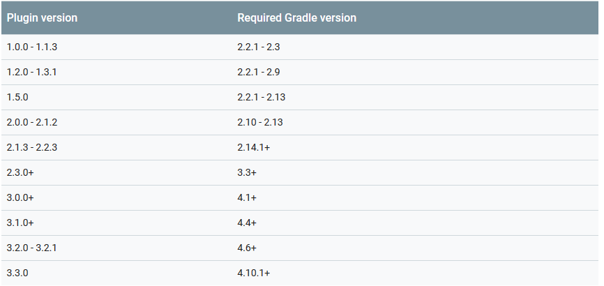

## Android plugin Version 和 Gradle version区别
Gradle是一个独立运行的程序，不但可以与AndroidStudio协同工作还可以和Eclipse等IDE配合使用。 
但由于Gradle发展速度比较快，导致Gradle版本不一。
而Android Gradle Plugin是为了让Android Studio使用Gradle来进行构建的一个插件。 
Gradle 和Android Gradle Plugin插件经常由于版本冲突问题导致Gradle无法build。

Gradle与Android Gradle Plugin插件之间的匹配关系如下图

### 配置Gradle 和 Android Plugin for Gradle的路径 ###
- Gradle version默认下载路径：`C:\Users\Administrator.USER-20190120VS\.gradle\wrapper\dists`
- Android plugin version默认下载路径：`D:\Work\Android\Android Studio\gradle\m2repository\com\android\tools\build\gradle`

如下图所示，可以仅为当前Project配置专门的Gradle版本，也可对所有Project配置一个全局的Gradle版本

### Gradle 和 Android plugin for Gradle 版本的配置方式 ###
**1. 配置 Android Plugin for Gradle 的版本**
当更新 Android Studio 时，可能会收到一个提示，将 Gradle 的 Android 插件自动更新为最新版本。可以选择接受更新，也可以根据项目的构建要求手动指定版本。

配置方式一：可以在 Android Studio 中的 File > Project Structure > Project 菜单中的 Android Plugin Version条目中配置

配置方式二：在Project项目的 build.gradle 文件中指定 Android Plugin 的版本。该Plugin版本适用于该 Android Studio 项目中内置的所有模块Module。以下示例将 Gradle 的 Android 插件从 build.gradle 文件设置为2.3.3版本：

> 注意：不应该在版本号中使用动态依赖关系，例如 'com.android.tools.build:gradle:2.+'。使用此功能可能导致意外的版本更新和难以解决的版本差异。
>如果指定的插件版本尚未下载，则在下次构建项目时，或当点击 Android Studio 菜单栏中的 Tools > Android > Sync Project with Gradle Files 时，插件版本将会下载（能翻则翻）。

**2. 配置 Gradle 的版本**

配置方式一： 可以在 Android Studio 中的 File > Project Structure > Project 菜单中的Gradle version条目中配置指定 Gradle 版本。

配置方式二： 也可以通过在 gradle/wrapper/gradle-wrapper.properties 文件中编辑 Gradle 分布引用。

> 基于国内某些不明原因，可能会一直下载编译中，这时，**可通过 https://services.gradle.org/distributions/ 直接下载所需的 Gradle 版本，解压到Gradle version默认下载路径 C:\Users\Administrator.USER-20190120VS\.gradle\wrapper\dists目录下，然后再通过上面的两种方法修改指定版本号为已下载解压的版本号。**【亲测有效】

----
Gradle是Android Studio使用的构建系统，类似于Eclipse上的Maven（貌似新版的Eclipse也有支持Gradle的插件了），有了Gradle就可以很好的帮我们解决库依赖的问题了，而且也不要我们自己手动从网上下载。Gradle支持JCenter，Maven等中央仓库，关于JCenter与Maven的区别这里有篇文章。Gradle对下载下来的jar包进行统一管理，避免了一个jar包到处拷贝，搞得每个项目里面都有。

----

Gradle支持从maven中央仓库和JCenter上获取构件，那这两者有什么区别呢？

maven中央仓库（http://repo1.maven.org/maven2/）是由Sonatype公司提供的服务，它是Apache Maven、SBT和其他构建系统的默认仓库，并能很容易被Apache Ant/Ivy、Gradle和其他工具所使用。开源组织例如Apache软件基金会、Eclipse基金会、JBoss和很多个人开源项目都将构件发布到中央仓库。 maven中央仓库已经将内容浏览功能禁掉了，可在http://search.maven.org/查询构件。

https://jcenter.bintray.com ）是由JFrog公司提供的Bintray中的Java仓库。它是当前世界上最大的Java和Android开源软件构件仓库。 所有内容都通过内容分发网络（CDN）使用加密https连接获取。JCenter是Goovy Grape内的默认仓库，Gradle内建支持（jcenter()仓库），非常易于在（可能除了Maven之外的）其他构建工具内进行配置。

JCenter相比mavenCenter构件更多，性能也更好。但还是有些构件仅存在mavenCenter中。

----

做软件开发你可能需要依赖各种不同的jar,library.你当然可以通过将.jar/library工程下载到本地再copy到你的工程中,但不知你是否听说过国外有个叫中央仓库的东西,在这个仓库里你可以找到所有你能想到以及你从来没听说过的jar,aar...The Central Repository Search Engine 这里可以找到所有你需要的依赖,而你需要的只是指定一个坐标,如下:implementation 'com.android.support:appcompat-v7:28.0.0'
剩下的依赖的寻找,下载,添加到classpath等你都不需要去关心,通过这种方式来维护依赖的好处有以下几点:剩下的依赖的寻找,下载,添加到classpath等你都不需要去关心,通过这种方式来维护依赖的好处有以下几点:依赖不会进入到你的版本控制仓库中(默认会缓存到~/.gradle/下)方便卸载装载依赖(只是一条坐标依赖,不需要删除即可)方便的版本管理,如上图中的2.3.3既是picasso的版本号,若改为+就表示从中央仓库中下载最新的版本不同工程的相同依赖不会存在重复副本(只在~/.gradle下存在一份)

----
## Android关于buildToolVersion与CompileSdkVersion的区别 ##
CompileSdkVersion:是告诉gradle 用哪个SDK版本来编译，和运行时要求的版本号没有关系；使用任何新添加的 API 就需要使用对应 Level 的 Android SDK。

buildToolsVersion: android构建工具的版本,在SDK Manager中安装选择版本，buildToolsVersion的版本需要>=CompileSdkVersion; 高版本的build-tools 可以构建低版本编译的android程序。这个版本号一般是API-LEVEL.0.0。 例如I/O2014大会上发布了API20对应的build-tool的版本就是20.0.0，在这之间可能有小版本，例如20.0.1等等。

