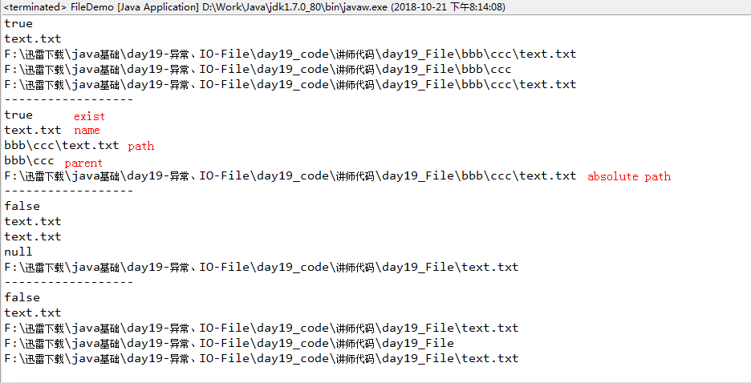
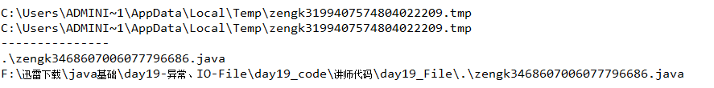

## 绝对路径和相对路径、路径分隔符
1. Windows中绝对路径以盘符开头；Linux中绝对路径以斜线`/`开头；
2. 不以盘符和斜线`/`开头的路径就是相对路径。默认情况下，系统总是依据用户的工作路径来解释相对路径，这个路径由系统属性`user.dir`指定，通常也就是运行java虚拟机时所在的路径。
3. Windows的路径分隔符使用反斜线`\`(Linux中使用斜线`/`)，而Java程序中的反斜线表示转义字符，所以如果需要在Windows的路径中包括反斜线，则应该使用两条反斜线`\\`，如：`C:\\adb\\text.txt`。
4. Java程序支持将斜线`/`当成平台无关的路径分隔符，所以Java程序中表示Windows系统的路径分隔符`\\`可以用斜线`/`代替。

## Java的IO（输入、输出）——File类介绍
- java.io.File代表与平台无关的文件或目录。也就是说可以通过File类在Java程序中操作文件或目录。
- File类只能用来操作文件或目录（包括新建、删除、重命名文件和目录等操作），但不能用来访问文件中的内容。
- 如果需要访问文件中的内容，则需要使用输入/输出流。

## File类相关API ##

### 一、File类的构造方法
1. `public File(String pathname)`：根据指定的路径(可以是绝对路径或相对路径)创建File对象。
2. `public File(String parent, String child)`：根据指定的父文件夹和子文件或者子文件夹创建File对象
3. `public File(File parent, String child)`：根据指定的父文件夹对象和子文件或者子文件夹创建File对象
4. `public File(URI uri)`：根据URI表示的文件或目录的路径创建对象，如`file:/F:/迅雷下载/test.txt`

### 二、File类其他成员方法

#### 访问文件或目录的名称和路径的方法
1. `public String getName()`: 返回File构造方法中传入路径表示的文件名或目录名（如果是目录名则是最后一级子目录名）
2. `public String getPath()`： 返回File构造方法中传入的路径名
3. `public String getParent()`：返回File构造方法中传入文件或目录路径的父目录，如果传入路径没有父目录，则返回null
4. `public String getAbsolutePath()`： 返回File对象表示的文件或目录的绝对路径名
5. `public File getAbsoluteFile()`： 返回一个通过此File对象表示的文件或目录的绝对路径名重新new出来的一个File对象

	- 即使File对象表示的文件或目录不存在，也不影响上述方法获取File对象表示的文件或目录的名称和路径。

			File f2 = new File("F:/迅雷下载/java基础/day19-异常、IO-File/day19_code/讲师代码/day19_File/bbb/ccc/text.txt");
			System.out.println(f2.exists());
			System.out.println(f2.getName());
			System.out.println(f2.getPath());
			System.out.println(f2.getParent());
			System.out.println(f2.getAbsolutePath());
			
			System.out.println("------------------");
			File f3 = new File("bbb/ccc/text.txt");
			System.out.println(f3.exists());
			System.out.println(f3.getName());
			System.out.println(f3.getPath());
			System.out.println(f3.getParent());
			System.out.println(f3.getAbsolutePath());
			
			System.out.println("------------------");
			File f4 = new File("text.txt");
			System.out.println(f4.exists());
			System.out.println(f4.getName());
			System.out.println(f4.getPath());
			System.out.println(f4.getParent());
			System.out.println(f4.getAbsolutePath());
	
			System.out.println("------------------");
			File absoluteFile = f4.getAbsoluteFile();
			System.out.println(absoluteFile.exists());
			System.out.println(absoluteFile.getName());
			System.out.println(absoluteFile.getPath());
			System.out.println(absoluteFile.getParent());
			System.out.println(absoluteFile.getAbsolutePath());

		

6. `public boolean renameTo(File dest)`: 重命名此File对象表示的文件或目录，重命名成功返回true，失败返回false。
	- 如果此File对象表示的文件或目录不存在，则重命名会失败；
	- 如果dest表示的文件或目录存在，则重命名失败；
	- 如果此File对象表示文件，则即使dest构造方法传入的是一个没有文件名后缀的目录路径，则重命名也成功，相当于将原来的带后缀扩展名的文件改成了不带后缀扩展名的文件。当然，重命名时，也可以将dest的传入路径改成其他后缀扩展名格式的文件名。
	- 如果此File对象表示目录，则即使dest构造方法传入的是一个带后缀扩展名的文件路径，那么重命名也成功，相当于将后缀扩展名也当成是目录名的一部分。
	- 如果dest构造方法传入的文件或文件夹的路径跟此File对象表示的文件或文件夹不在同一级目录下，则相当于移动原文件或目录到dest表示的路径中去。
	- 重命名成功后，此File对象表示的文件或目录不再存在；而由于将原文件或目录移动到dest表示的路径中去了，所以dest表示文件或目录由不存在变为存在。
	
#### 文件或目录检测相关的方法
1. `public boolean exists()`： 判断此File对象表示的文件或目录是否存在
2. `public boolean canWrite()`：判断此File对象表示的文件或目录是否可写
3. `public boolean canRead()`：判断此File对象表示的文件或目录是否可读
4. `public boolean isFile()`：判断此File对象是否是表示文件，而非目录
5. `public boolean isDirectory()`：判断此File对象是否是表示目录，而非文件
6. `public boolean isAbsolute()`：判断此File对象的构造方法传入的路径是否是绝对路径

#### 获取常规文件信息的方法
1. `public long lastModified()`：返回文件的最后修改时间
2. `public long length()`：返回文件内容的长度

#### 文件或目录操作相关的方法
1. `public boolean createNewFile()`：创建一个此File对象所表示的文件，返回true则创建成功，false则失败。
	- 如果此File对象表示的文件存在，则创建失败；
	- 如果此File对象表示的是一个存在的目录，则创建失败；
	- 如果此File对象构造方法传入路径表示的文件不存在，则创建成功。即使此路径是一个不带文件后缀扩展名的目录路径，只要此路径目录不存在，也能创建成功，新建的文件名就是路径最后一级子目录名
	
2. `public boolean mkdir()`：创建一个此File对象表示的目录，返回true则创建成功，false则失败。

	- 如果此File对象表示的是一个存在的目录，则创建失败；
	- 如果表示的是一个存在的文件，则也创建失败；
	- 如果此File对象传入路径表示的目录不存在，则创建成功(其中如果传入路径包含父目录，则要保证父目录存在，否则也会创建失败)。另外，即使传入路径是一个带文件后缀名的文件路径，只要此路径文件不存在，也能创建成功，新建目录的最后一级子目录名就是包含后缀名的文件名。
3. `public boolean mkdirs()`：创建一个此File对象表示的目录，如果File对象构造方法的传入路径包括父目录，则当父目录不存在时，也会自动创建不存在的父目录。返回true创建成功，false则失败。

	- 如果此File对象表示一个存在的文件或目录，则创建失败；
	- 如果此File对象构造方法的传入路径只是一级目录路径（即不包含父目录），并且此路径表示的目录不存在，则也能创建成功；
	- 与`mkdir`方法相比较，只是多了一个当传入路径包含父目录，且此父目录不存在时，会自动创建父目录的功能。
	
4. `public boolean delete()`：删除此File对象表示的文件或目录，返回true则删除成功，false则失败。
 	- 如果此File对象表示的文件或目录不存在，则删除失败；
 	- 如果此File对象表示的是一个目录，则当此目录下存在子目录或文件时，需把此目录下的所有子目录和文件都删除后，才能将此目录删除成功。
 	- **Java程序的删除不走回收站！**
5. `public void deleteOnExit()`：注册一个删除钩子，指定当Java虚拟机退出时，删除此File对象表示的文件或目录。
6. `public static File createTempFile(String prefix, String suffix)`: 在默认的临时文件目录中创建一个临时的空文件，使用给定的前缀、系统生成的随机数、给定的后缀作为文件名。
	- 这是一个静态方法，可以直接通过File类来调用；
	- prefix字符串长度必须不少于3个字节，否则会报`java.lang.IllegalArgumentException: Prefix string too short`异常；
	- suffix参数可以为null，此时将使用默认的后缀".tmp"；

7. `public static File createTempFile(String prefix, String suffix, File directory)`：在directory指定的父目录中创建一个临时的空文件。

		try {
			File f2 = File.createTempFile("zengk", null);
			System.out.println(f2.getPath());
			System.out.println(f2.getAbsolutePath());
		} catch (IOException e) {
			e.printStackTrace();
		}

		System.out.println("---------------");		

		try {
			File f2 = File.createTempFile("zengk", ".java", new File("./"));
			System.out.println(f2.getPath());
			System.out.println(f2.getAbsolutePath());
		} catch (IOException e) {
			e.printStackTrace();
		}

	

#### 遍历文件或目录的方法
1. `public String[] list()`： 
	- 若此File对象表示已存在的目录，则返回此目录下的所有文件名（不包括子目录中的文件）和一级子目录名的字符串数组；若此目录为空，则返回一个空数组；
	- 若此File对象表示已存在的文件，则返回null；
	- 若此File对象表示的目录或文件不存在，则返回null。
	
2. `public File[] listFiles()`：作用同`list()`方法类似，只不过返回的数组元素是表示文件或目录的File对象。
3. `public static File[] listRoots()`：返回系统所有的根路径的File对象。Windows中返回的就是盘符。

#### 文件过滤器相关的方法
1. `public File[] listFiles(FilenameFilter filter)`：返回此File对象下通过FilenameFilter过滤器过滤后的所有文件和一级子目录
2. `public File[] listFiles(FileFilter filter)`：返回此File对象下通过FileFilter过滤器过滤后的所有文件和一级子目录

	- FilenameFilter和FileFilter过滤器的区别就是accept抽象方法接收的形参不同，FilenameFilter的accept方法接收文件的父目录dir和文件名name，一般是在accept方法重写时通过new File(dir, name)得到文件的File对象。而FileFilter的accept方法直接接收文件的File对象，较FilenameFilter省略了new一个File对象的步骤。

			//FilenameFilter类的定义
			package java.io;
			public interface FilenameFilter {
			    boolean accept(File dir, String name);
			}
	
			//FileFilter类的定义
			package java.io;
			public interface FileFilter {
			    boolean accept(File pathname);
			}
	
			//listFiles(FilenameFilter filter)方法的定义
			public File[] listFiles(FilenameFilter filter) {
		        String ss[] = list();
		        if (ss == null) return null;
		        ArrayList<File> files = new ArrayList<>();
		        for (String s : ss)
		            if ((filter == null) || filter.accept(this, s))
		                files.add(new File(s, this));
		        return files.toArray(new File[files.size()]);
	    	}
		
			//listFiles(FileFilter filter)方法的定义
			public File[] listFiles(FileFilter filter) {
		        String ss[] = list();
		        if (ss == null) return null;
		        ArrayList<File> files = new ArrayList<>();
		        for (String s : ss) {
		            File f = new File(s, this);
		            if ((filter == null) || filter.accept(f))
		                files.add(f);
		        }
		        return files.toArray(new File[files.size()]);
	   		}
	
			举例：
			File file = new File("d:\\");
			String[] strArray = file.list(new FilenameFilter() {
				@Override
				public boolean accept(File dir, String name) {
					// 判断是否是文件，是否是以.mp4结尾
					File file = new File(dir, name);
					return file.isFile() && name.endsWith(".mp4");
				}
			});
	
			File file = new File("d:\\");
			String[] strArray = file.list(new FileFilter() {
				@Override
				public boolean accept(File pathname) {
					// 判断是否是文件，是否是以.mp4结尾
					return pathname.isFile() && pathname.endsWith(".mp4");
				}
			});

#### 文件过滤器的应用
1. 删除目录下的所有文件(包括所有子目录下的文件)和所有子目录(需要用到递归)
		
		File file = new File("D:\\test");
		//删除test文件夹
		deleteFiles(file);

		private static void deleteFiles(File file) {
			File[] fileArray = file.listFiles();
			
			if (fileArray != null) {
				//如果封装的文件夹不为空,那么就进行遍历,获得每一个文件或文件夹
				for (File f : fileArray) {
					if (f.isDirectory()) {
						//如果被封装文件夹的子文件还是个文件夹,那么继续封装起来进行判断
						deleteFiles(f);
					} else {
						//如果被封装起来的子文件夹正好就是个文件,那么直接删除
						System.out.println(f.getName() + "***" + f.delete());
					}
				}
			} 
			System.out.println(file.getName() + "***" + file.delete());
		}

2. 遍历目录下的所有文件路径

		File file = new File("D:\\test");
		showFiles(file);
	
		private static void showFiles(File file) {
			// 获取该目录下的所有文件或者文件夹的File[]数组。
			File[] fileArray = file.listFiles();
	
			if(fileArray != null){
				// 遍历File[]数组，获取到每一个File对象
				for (File f : fileArray) {
					// 判断该File对数是否是目录
					if (f.isDirectory()) {
						showFiles(f);
					} else {
						// 输入文件路径
						System.out.println(f.getAbsolutePath());
					}
				}
			}
	
			System.out.println(file.getAbsolutePath());
		}