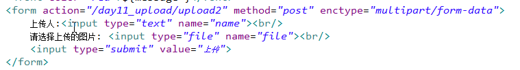
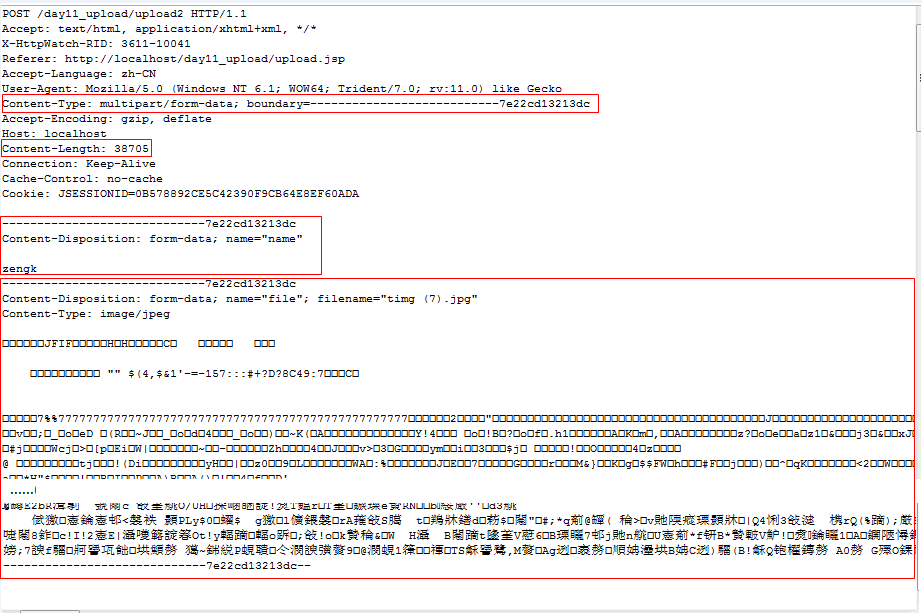

OkHttp 处理了很多网络疑难杂症：会从很多常用的连接问题中自动恢复。如果您的服务器配置了多个IP地址，当第一个IP连接失败的时候，OkHttp会自动尝试下一个IP。OkHttp还处理了代理服务器问题和SSL握手失败问题。

OkHttp支持Android 2.3及其以上版本。
对于Java, JDK1.7以上。

从Android 4.4版本开始，系统内置了OkHttp

Android SDK中包含了HttpClient。Android 6.0版本直接删除了HttpClient类库。如果仍想使用HttpClient，需在相应module下的build.gradle中加入：

android{
	useLibrary 'org.apache.http.legacy'
}

OkHttp内部依赖okio，导入OkHttp时，也需导入okio
https://github.com/square/okhttp
https://github.com/square/okio

在Android项目中导入OkHttp：
dependencies {
	compile 'com.squareup.okhttp3:okhttp:3.11.0'
	compile 'com.squareup.okio:okio:2.1.0'
}

**OkHttp开发建议是同一个APP，用同一个OkHttpClient对象,这是为了只有一个缓存文件访问入口**

onResponse回调的参数是response，一般情况下，比如我们希望获得返回的字符串，可以通过response.body().string()获取；如果希望获得返回的二进制字节数组，则调用response.body().bytes()；如果你想拿到返回的inputStream，则调用response.body().byteStream()

看到这，你可能会奇怪，竟然还能拿到返回的inputStream，看到这个最起码能意识到一点，这里支持大文件下载，有inputStream我们就可以通过IO的方式写文件。不过也说明一个问题，这个onResponse执行的线程并不是UI线程

我们这里是异步的方式去执行，当然也支持阻塞的方式，上面我们也说了Call有一个execute()方法，你也可以直接调用call.execute()通过返回一个Response。

----
## OkHttp基本用法

	private void init(Context context) {
        mClient = new OkHttpClient.Builder()
                        .build();
    }

	//异步GET请求
    public void asyncGet(String url){

        Request request = new Request.Builder()
                .method("GET", null)
                .url(url)
                .build();

        Call call = mClient.newCall(request);
        call.enqueue(new Callback() {
            @Override
            public void onFailure(Call call, IOException e) {
            }

            @Override
            public void onResponse(Call call, Response response) throws IOException {
            }
        });
    }

	//异步POST请求
    public void aysncPost(String url, Map<String, String> params){

        Set<Map.Entry<String, String>> entrySet = params.entrySet();

        FormBody.Builder builder = new FormBody.Builder();

        for (Map.Entry<String, String> entry: entrySet) {
            builder.add(entry.getKey(), entry.getValue());
        }

        RequestBody body = builder.build();

        Request request = new Request.Builder()
                .method("POST", body)
                .url(url)
                .build();

        Call call = mClient.newCall(request);
        call.enqueue(new Callback() {
            @Override
            public void onFailure(Call call, IOException e) {
            }

            @Override
            public void onResponse(Call call, Response response) throws IOException {
            }
        });
    }

----
##OkHttp使用POST请求通过MultipartBody上传表单

在HTML中，form标签通过设置属性enctype="multipart/form-data"，来设置http请求头的Content-Type字段（Content-Type：multipart/form-data; boundary=...   其中boundary是自动生成的），Http请求头中的Content-Type字段用于表示请求体内容类型是表单类型。在OkHttp中，通过调MultipartBody.Builder.setType(MediaType type)方法实现,如setType(MultipartBody.FORM)

在HTML表单中，type="text"的input项，可以通过OkHttp的MultipartBody.Builder.addFormDataPart(String name, String value)方法实现，
参数name的值就相当于input标签中属性name的值“name”，参数value就相当于此input标签的输入项“zengk”

type="file"的input项，可以通过OkHttp的MultipartBody.Builder.addFormDataPart(String name, @Nullable String filename, RequestBody body)方法实现。参数name的值就相当于input标签中属性name的值“file”，参数filename就是上传文件后，服务器收到的文件名（HTML中的input标签没有设置文件名，默认就是上传文件的文件名，而使用OkHttp就可以通过设置参数filename重命名文件），参数body用于构建此input标签要上传的文件，可通过RequestBody.create(final @Nullable MediaType contentType, final File file)方法实现。
如上图所示，当请求体表单内容存在文件时，除了请求行中用于描述整个请求体内容类型的Content-Type字段（Content-Type:multipart/form-data;boundary=...）外,在请求体表单内容的文件部分内，另外还有个Content-Type字段用于描述此文件类型（Content-Type=image/jpeg）。所以RequestBody.create方法中的contentType参数就是用于描述表单内容中文件部分的文件类型的，通过MediaType.parse(String string)方法实现，如
MediaType.parse("image/png")

	public void asyncFormPost(String url, String filepath){
        RequestBody body = new MultipartBody.Builder()
                .setType(MultipartBody.FORM)
                .addFormDataPart("name", "zengk")
                .addFormDataPart("file", "time(7).jpg", 
						RequestBody.create(MediaType.parse("image/jpeg"), new File(filepath)))
                .build();

        Request request = new Request.Builder()
                .method("POST", body)
                .url(url)
                .build();

        Call call = mClient.newCall(request);
        
        call.enqueue(new Callback() {
            @Override
            public void onFailure(Call call, IOException e) {

            }

            @Override
            public void onResponse(Call call, Response response) throws IOException {

            }
        });
    }

HttpURLConnection实现表单文件上传参考：https://blog.csdn.net/lmj623565791/article/details/23781773

----
##OkHttp缓存

使用缓存可以让我们的app不用长时间地显示令人厌烦的加载圈，提高了用户体验，而且还节省了流量，在数据更新不是很频繁的地方使用缓存就非常有必要了。想要加入缓存不需要我们自己来实现，**Okhttp已经内置了缓存，默认是不使用的**，如果想使用缓存我们需要手动设置。

Response的消息有两种类型，CacheResponse和NetworkResponse。CacheResponse代表从缓存取到的消息，NetworkResponse代表直接从服务端返回的消息。

其实控制缓存的消息头往往是服务端返回的信息中添加的如”Cache-Control:max-age=60”。所以，会有两种情况。
1. 客户端和服务端开发能够很好沟通，按照达成一致的协议，服务端按照规定添加缓存相关的消息头。
2. 客户端与服务端的开发根本就不是同一家公司，没有办法也不可能要求服务端按照客户端的意愿进行开发。

第一种办法当然很好，只要服务器在返回消息的时候添加好Cache-Control相关的消息便好。

第二种情况，就很麻烦，你真的无法左右别人的行为。怎么办呢？好在OKHTTP能够很轻易地处理这种情况。那就是定义一个拦截器，人为地添加Response中的消息头，然后再传递给用户，这样用户拿到的Response就有了我们理想当中的消息头Headers，从而达到控制缓存的意图，正所谓移花接木。 

**服务器支持缓存**

如果服务器支持缓存，请求返回的Response会带有这样的Header:Cache-Control, max-age=xxx,这种情况下我们只需要手动给okhttp设置缓存就可以让okhttp自动帮你缓存了。这里的max-age的值代表了缓存在你本地存放的时间，可以根据实际需要来设置其大小。

首先我们要提供了一个文件路径用来存放缓存，出于安全性的考虑，在Android中我们推荐使用Context.getCacheDir()来作为缓存的存放路径，另外还需要指定缓存的大小就可以创建一个缓存了

Cache cache = new Cache(context.getCacheDir(), 1024 * 1024 * 2);//2M
OkHttpClient mClient = new OkHttpClient.Builder()
                .cache(cache)
                .build();

**服务器不支持缓存**

如果服务器不支持缓存就可能没有指定这个头部，或者指定的值是如no-store等，但是我们还想在本地使用缓存的话要怎么办呢？这种情况下我们就需要使用Interceptor来重写Respose的头部信息，从而让okhttp支持缓存。
如下所示，我们重写的Response的Cache-Control字段

	public class CacheInterceptor implements Interceptor {
	    @Override
	    public Response intercept(Chain chain) throws IOException {
	        Request request = chain.request();
	        Response response = chain.proceed(request);
	        Response response1 = response.newBuilder()
	                .removeHeader("Pragma")
	                .removeHeader("Cache-Control")
	                //cache for 30 days
	                .header("Cache-Control", "max-age=" + 3600 * 24 * 30)
	                .build();
	        return response1;
	    }
	}

然后将该Intercepter作为一个NetworkInterceptor加入到okhttpClient中：

	OkHttpClient newClient = new OkHttpClient.Builder()
	        .addNetworkInterceptor(new CacheInterceptor())
	        .cache(cache)
	        .connectTimeout(20, TimeUnit.SECONDS)
	        .readTimeout(20, TimeUnit.SECONDS)
	        .build();

这样我们就可以在服务器不支持缓存的情况下使用缓存了。

**拦截器进行缓存的缺点**
用拦截器控制缓存有什么不好的地方呢？我们先看看下面的情况。
1. 网络访问请求的资源是文本信息，如新闻列表，这类信息经常变动，一天更新好几次，它们用的缓存时间应该就很短。
2. 网络访问请求的资源是图片或者视频，它们变动很少，或者是长期不变动，那么它们用的缓存时间就应该很长。

那么，问题来了。
因为OkHttp开发建议是同一个APP，用同一个OkHttpClient对象,这是为了只有一个缓存文件访问入口。这个很容易理解，单例模式嘛。但是问题拦截器是在OKHttpClient.Builder当中添加的。如果在拦截器中定义缓存的方法会导致图片的缓存和新闻列表的缓存时间是一样的，这显然是不合理的，真实的情况不应该是图片请求有它的缓存时间，新闻列表请求有它的缓存时间，应该是每一个Request有它的缓存时间。
那么，有解决的方案吗？
有的，okhttp官方有建议的方法。

okhttp中建议用CacheControl这个类来进行缓存策略的制定。 

不同于拦截器设置缓存，CacheControl是针对Request的，所以它可以针对每个请求设置不同的缓存策略。比如图片和新闻列表。

	OkHttpClient client = new OkHttpClient.Builder()
	 .cache(cache)
	 .build(); 
	
	//设置缓存时间为60秒
	CacheControl cacheControl = new CacheControl.Builder()
	 .maxAge(60, TimeUnit.SECONDS)
	 .build(); 
	
	Request request = new Request.Builder()
	 .url("http://blog.csdn.net/briblue")
	 .cacheControl(cacheControl)
	 .build();

强制使用缓存

	Request request = new Request.Builder()
	 .url("http://blog.csdn.net/briblue")
	 .cacheControl(Cache.FORCE_CACHE)
	 .build();

	如果缓存不符合条件会返回504.这个时候我们要根据情况再进行编码，如缓存不行就再进行一次网络请求。

	Response forceCacheResponse = client.newCall(request).execute();
	if (forceCacheResponse.code() != 504) {
	 // 资源已经缓存了，可以直接使用 
	} else {
	 // 资源没有缓存，或者是缓存不符合条件了。
	} 

不使用缓存

	Request request = new Request.Builder()
	 .url("http://blog.csdn.net/briblue")
	 .cacheControl(Cache.FORCE_NETWORK)
	 .build();
	
	还有一种情况将maxAge设置为0，也不会取缓存，直接走网络。
	Request request = new Request.Builder()
	            .url("http://blog.csdn.net/briblue")
	            .cacheControl(new CacheControl.Builder()
	            .maxAge(0, TimeUnit.SECONDS).build())
	            .build();

----
##OkHttp相关API
**OkHttpClient**
public OkHttpClient()
public Builder newBuilder()
public Call newCall(Request request)

**OkHttpClient.Builder**
public Builder()
public Builder connectTimeout(long timeout, TimeUnit unit)
public Builder readTimeout(long timeout, TimeUnit unit)
public Builder writeTimeout(long timeout, TimeUnit unit)
public Builder cache(@Nullable Cache cache)
public OkHttpClient build()

**RealCall （implements Call）**
public void enqueue(Callback responseCallback)
public Response execute()
public void cancel()

**Request**

**Request.Builder**
public Builder()
public Builder url(String url)
public Builder cacheControl(CacheControl cacheControl)
public Builder header(String name, String value)
public Builder addHeader(String name, String value)
public Builder removeHeader(String name)
public Builder method(String method, @Nullable RequestBody body)
public Builder post(RequestBody body)
public Builder get()
public Request build()

**RequestBody**
public static RequestBody create(@Nullable MediaType contentType, String content)
public static RequestBody create(final @Nullable MediaType contentType, final File file)
public static RequestBody create(final @Nullable MediaType contentType, 
					final byte[] content, final int offset, final int byteCount)

**FormBody (extends RequestBody)**
private static final MediaType CONTENT_TYPE = MediaType.get("application/x-www-form-urlencoded");

**FormBody.Builder**
public Builder()
public Builder(Charset charset)
public Builder add(String name, String value)
public Builder addEncoded(String name, String value)
public FormBody build()

**MediaType**
public static MediaType get(String string)
public static @Nullable MediaType parse(String string)

	public static @Nullable MediaType parse(String string) {
	    try {
	      return get(string);
	    } catch (IllegalArgumentException ignored) {
	      return null;
	    }
	}

**MultipartBody (extends RequestBody)**
public static final MediaType FORM = MediaType.get("multipart/form-data");

**MultipartBody.Builder**
public Builder() //通过调UUID.randomUUID()生成http请求体内容的分隔符boundary
public Builder setType(MediaType type)
public Builder addFormDataPart(String name, String value) //createFormData(name, null, RequestBody.create(null, value))
public Builder addFormDataPart(String name, @Nullable String filename, RequestBody body) //createFormData(name, filename, body)

	//okhttp3.MultipartBody.Part, 参数name，filename是为了构建Content-Disposition字段
	public static Part createFormData(String name, @Nullable String filename, RequestBody body) {
	  if (name == null) {
	    throw new NullPointerException("name == null");
	  }
	  StringBuilder disposition = new StringBuilder("form-data; name=");
	  appendQuotedString(disposition, name);
	
	  if (filename != null) {
	    disposition.append("; filename=");
	    appendQuotedString(disposition, filename);
	  }
	
	  return create(Headers.of("Content-Disposition", disposition.toString()), body);
	}

public MultipartBody build()

**Response**
public @Nullable ResponseBody body()
public @Nullable Response cacheResponse()
public @Nullable Response networkResponse()
public Builder newBuilder()

**Response.Builder**
public Builder removeHeader(String name)
public Builder header(String name, String value)
public Builder addHeader(String name, String value)
public Response build()

**ResponseBody**
public final String string()
public final byte[] bytes() 
public final InputStream byteStream()

**Cache**
public Cache(File directory, long maxSize)

**CacheControl**
//强制使用网络请求
public static final CacheControl FORCE_NETWORK = new Builder().noCache().build();

//强制性使用本地缓存，如果本地缓存不满足条件，则会返回code为504
public static final CacheControl FORCE_CACHE = new Builder()
													.onlyIfCached()
													.maxStale(Integer.MAX_VALUE,TimeUnit.SECONDS)
													.build();

**CacheControl.Builder**
public Builder()
public Builder noCache()//不使用缓存，用网络请求
public Builder noStore()//不使用缓存，也不存储缓存
public Builder onlyIfCached()//只使用缓存
public Builder noTransform()//禁止转码
public Builder maxAge(int maxAge, TimeUnit timeUnit)//设置超时时间为maxAge。
public Builder maxStale(int maxStale, TimeUnit timeUnit)//超时之外的仍然有效时间为maxStale
public Builder minFresh(int minFresh, TimeUnit timeUnit)//超时时间为当前时间加上minFresh。
public CacheControl build()

