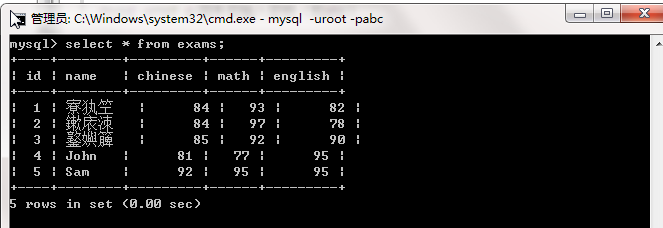

## MySQL数据库的安装、卸载 ##
### 卸载 ###

### 安装 ###

### cmd命令行进入MySQL数据库 ###
> mysql -uroot -p 回车后输入密码（如abc）

### 可视化MySQL界面 ###

> 使用MySQL-Front_Setup

### 解决MySQL在cmd命令行显示的表记录中的中文乱码，并且在命令行中insert无法插入带中文字符的记录 ###
a. MySQL在安装时设置的是utf8编码格式，而cmd命令行显示的是GBK格式，编码格式不同所以出现了乱码
>查询一下自己系统上MySQL数据库的编码情况`show variables like '%character%';`
>

>查看cmd命令行显示的编码格式
>

>编码格式不同，所以出现如下错误, 1. select查询记录中文乱码；2. insert无法插入带中文字符的字段(ERROR 1366 (HY000): Incorrect string value)
>
>
>

b. 解决方案：通过`set names gbk`设置下MySQL的编码为GBK，设置后结果如下（此方式只是在当前mysql环境下起作用，退出mysql再进入则恢复成utf8）：
>
>
>可以看到，client，connection和result的编码已经设置为gbk了，但server，database，system的编码还是utf-8！这就是说，虽然数据是使用utf-8编码存储的，但是客户端以及返回的结果集是gbk的，而此时cmd窗口的编码正好是gbk，因此该结果集能正确显示了。
>

## SQL语句(windows中不区分大小写,语句后要加分号) ##

### 标准的SQL语句类型 ###
查询语句： 主要有select关键字完成
DML语句（Data Manipulation Language，数据操作语言）： 主要有insert、update、delete三个关键字完成
DDL语句 （Data Definition Language， 数据定义语言）： 主要有create、drop、alter、truncate四个关键字完成。
DCL语句 （Data Control Language， 数据控制语言）： 主要由grant、revoke两个关键字完成
事务控制语句： 主要由commit、rollback、savepoint三个关键字完成。

### 一、 DDL（数据定义语言） -- 对数据库的操作 ###
对数据库的操作有如下几种：创建、删除指定数据库；显示指定数据库的创建信息；显示所有已创建的数据库;
修改数据库;切换当前使用的数据库；查看当前使用的数据库。

	1. 创建指定数据库: create database 数据库名称 [character set 字符集名称] [collate collate名称];
	   字符集名称和校验规则名称可省略不写
	   eg: create database mydb3 character set utf8 collate utf8_general_ci;

	2. 删除指定数据库： drop database  [if exists]  db_name;

	3. 显示指定数据库的创建信息： show create database db_name;

	4. 显示所有已创建的数据库: show databases;

	5. 修改数据库： alter database 数据库的名称 要更新的值;
	   eg： alter database mydb2 character set gbk; （将数据库mydb2的字符集改为gbk）

	6. 切换当前使用的数据库： use db_name;

	7. 查看当前使用的数据库： select database();

### 二、 DDL（数据定义语言） -- 对表的操作
表存在数据库中，所以在操作表时，要先切换到表所在的数据库

#### 创建表： ####

①. 基本语法和值类型

	a.语法如下：
		create table 表名(
		   列名称1 列名称1值类型,
		   列名称2 列名称2值类型,
		   列名称3 列名称3值类型,
		   列名称4 列名称4值类型
		);

	b. 其中值类型有如下几种：

		字符串型 ----------String 
		VARCHAR、CHAR
		eg: varchar(30), char(30)

		大数据类型--------------字节流, 字符流
		BLOB、TEXT
		
		数值型--------------------- 数值类型 (bit ,byte,short,int, long, float,double,)
		TINYINT 、SMALLINT、INT、BIGINT、FLOAT、DOUBLE
		
		逻辑性 
		BIT
		
		日期型
		DATE(只有日期)、TIME(只有时间)、DATETIME(日期和时间)、TIMESTAMP(日期和时间,时间戳)

	举例：创建一个员工表 employee

	字段	属性   
	id	        整形 int 
	name	    字符型 varchar(30)
	gender	    字符型 varchar(10)
	birthday	日期型 date
	entry_date	日期型 date
	job	        字符型 varchar(50)
	salary	    小数型 double
	resume	    大文本型 varchar(255)
	
	create table employee(
	   id int,
	   name varchar(30),
	   gender varchar(10),
	   birthday date,
	   entry_date date,
	   job varchar(50),
	   salary double,
	   resume varchar(255)
	);

② 定义单表字段的约束 （为了保证数据的有效性和完整性）

	a. 定义主键约束(唯一,并且非空)
	   primary key 

	   如果列的类型是数值,并且声明为主键,那么通常会加上  auto_increment,表示自动增长
	
	b. 唯一约束(不能重复,可以为空 ):
	   unique 
	
	c. 非空约束(可以重复,不能为空):
	   not null 
	
	举例：
	create table employee2(
	   id int primary key auto_increment,
	   name varchar(30) not null,
	   gender varchar(10) not null,
	   birthday date,
	   entry_date date,
	   job varchar(50),
	   salary double not null,
	   resume varchar(255) unique
	);

#### 查看已创建的表的结构 ####

	desc 表名;

#### 查看当前数据库已创建的所有表的名称 ####

	show tables; 

#### 修改表 ####

	语法:
	alter table 表名 具体的功能关键字;
	
	eg：
	a. 在上面员工表的基本上增加一个image列。
	   alter table employee add image blob;
	
	b. 修改job列，使其长度为60。
	   alter table employee modify job varchar(60);
	
	c. 删除gender列。
	   alter table employee drop gender;
	
	d. 表名改为user。
	   rename table employee to user;
	
	e. 修改表的字符集为utf8
	   alter table user character set utf8;
	
	f. 列名name修改为username
	   alter table user change name username varchar(40);

### 三、DML（数据库操作语言） -- insert增加 ###

	a. 语法：
	   insert into 表名(字段名集合) values(字段值集合);
	   insert into 表名 values(所有字段值集合);
	
	b. 举例：
	create table employee2(
	   id int primary key auto_increment,
	   name varchar(30) not null,
	   gender varchar(10) not null,
	   birthday date,
	   entry_date date,
	   job varchar(50),
	   salary double not null,
	   resume varchar(255) unique
	);
	
	  全写字段:
	  insert into employee2(id,name,gender,birthday,entry_date,job,salary,resume) values(1,'zs','female','1995-09-09','2015-12-09','developer',15000,'a good developer');

	  只写部分字段:
	  insert into employee2 (id,name,gender,salary,resume) values(null,'chenhaojie','male',17000,'a hansome boy');
	
	  不写字段名称,只写字段值,但是所有的字段值都要写:
	  insert into employee2 values(null,'linpeng','male','1994-09-09','2015-12-22','programmer',16000,'a lady killer');

	c.注意项：
	  字符和日期型数据应包含在单引号中。
	  插入空值：不指定或insert into table value(null)

### 四、DML（数据库操作语言） -- update更新

	a. 语法:
	   update 表名 set 列名=列名值,列名=列名值 [where 从句];
	
	b. 举例：
	   将所有员工薪水修改为5000元。
	   update employee2 set salary=5000;
	
	   将姓名为zs的员工薪水修改为3000元。
	   update employee2 set salary=3000 where name='zs';
	 
	   将姓名为zhangsan的员工薪水修改为6000元,job改为ccc。
	   update employee2 set salary=6000, job='ccc' where name='zhangsan';
	
	   将lisi的薪水在原有基础上增加1000元。
	   update employee2 set salary=salary+1000 where name='lisi';

	c. 注意项：
	   WHERE子句指定应更新哪些行。如没有WHERE子句，则更新所有的行。

### 五、DML（数据库操作语言） -- delete删除

	a. 语法:
	   delete from 表名 [where从句];
	
	b. 举例：
	   删除表中名称为zs的记录。
	   delete from employee2 where name='zs';
	 
	   删除表中所有记录(DML语句)。
	   delete from employee2;
	
	   使用truncate删除表中记录。(先将表摧毁,然后再创建, 属于DDL语句)
	   truncate employee2;

	c. 注意项：
	   1. 如果不使用where子句，将删除表中所有数据。
	   2. Delete语句不能删除某一列的值（可使用update）
	   3. 使用delete语句仅删除记录，不删除表本身。如要删除表，使用drop table语句。
	   4. 同insert和update一样，从一个表中删除记录将引起其它表的参照完整性问题，
		  在修改数据库数据时，头脑中应该始终不要忘记这个潜在的问题--外键约束。

### 六、DQL（数据库查询语言） ---select
**0. 准备一张select操作的表**

	create table exams(
	    id int primary key auto_increment,
	    name varchar(20),
	    chinese double,
	    math double,
	    english double
	);
	
	insert into exams values(null,'张三',84,93,82);
	insert into exams values(null,'李四',84,97,78);
	insert into exams values(null,'王五',85,92,90);
	insert into exams values(null,'John',81,77,95);
	insert into exams values(null,'Sam',92,95,95);

**1. select 语句(1)**

	a. 查询表中所有学生的信息。
	   select * from exams;
	
	b. 查询表中所有学生的姓名和对应的英语成绩。
	   select name,english from exams;
	
	c. 过滤表中重复数据。（distinct指显示结果时，是否剔除重复数据）
	   select distinct chinese from exams; 

**2. select 语句(2)**

	a. 通过as 起别名
	
	b. 举例：
	   在所有学生分数上加5分特长分。
	   select chinese+5,math+5,english+5 from exams ;
	
	   统计每个学生的总分。
	   select name,chinese+math+english from exams;
	   select name,chinese+math+english as 总分 from exams;
	
	   使用别名表示学生分数。
	   select name as 姓名, chinese as 语文, math as 数学, english as 英语 from exams;
	   select name 姓名, chinese 语文, math 数学, english 英语 from exams;

**3. Select 语句(3)**

	a. 使用where子句，进行过滤查询。

	b. 举例：
		查询姓名为张三的学生成绩
		select * from exams where name='张三';
		
		查询英语成绩大于90分的同学
		select * from exams where english>90;
		
		查询总分大于265分的所有同学
		select * from exams where chinese+math+english>265;

**4. Select 语句(4)**

	a. between-and, and, or, in，like在where子句中的使用

	b. 举例：
		查询英语分数在 80－90之间的同学。
		select * from exams where english>=80 and english<=90;
		select * from exams where english between 80 and 90;
		
		查询数学分数为92,93,95的同学。
		select * from exams where math in(92,93,95);
		
		查询所有姓张的学生成绩。
		select * from exams where name like '张%';
		select * from exams where name like '张_';
		
		查询数学分>90，语文分>90的同学。
		select * from exams where math>90 and chinese>90;
	
	c.注意项
		1. and 多个条件同时成立
		   or 多个条件任一成立
		
		2. and 先执行, or 后执行 
	
		3. % 代表零个或多个任意字符， _ 代表一个字符

**5. Select 语句(5)**

	a. 使用order by 关键字对查询的结果进行排序输出
	   其中 desc 表示降序, asc 表示升序
	
	b. 举例：
		对数学成绩降序排序后输出。
		select math from exams order by math desc;
		
		对总分排序按从高到低的顺序输出
		select * from exams order by chinese+math+english desc;
		
		对姓张的学生成绩排序输出
		select * from exams where name like '张%' order by chinese+math+english desc;

	c. 注意项：
		order by子句总是位于select语句的结尾。

**6. select语句中使用聚合函数**

	a. count: 用于统计具体的行数
	
	   举例：
		统计一个班级共有多少学生？
		select count(*) from exams;
		
		统计数学成绩大于90的学生有多少个？
		select count(math) from exams where math>90;
		
		统计总分大于275的人数有多少？
		select count(*) from exams where chinese+math+english>275;
	
	
	b. sum:求和运算
	
	   举例：
		统计一个班级数学总成绩？
		select sum(math) 数学总分 from exams;
		
		统计一个班级语文、英语、数学各科的总成绩
		select sum(chinese) as 语文总分, sum(english) as 英语总分, sum(math) as 数学总分 from exams;
		 
		统计一个班级语文、英语、数学的成绩总和
		select sum(chinese)+sum(math)+sum(english) from exams;

		统计一个班级语文成绩平均分
		select sum(chinese)/count(*) from exams;

	   注意项:
		1. 没有sum(*)这种语法！
	
	
	c. avg: 求平均值
	
	   练习：
		求一个班级数学平均分
		select avg(math) from exams;
		
		求一个班级总分平均分
		select sum(chinese+math+english)/count(*) from exams;
		
		select avg(chinese+math+english) from exams;
	
	d. max/min: 求最大值/最小值
	
	   练习：
		求班级最高分和最低分（数值范围在统计中特别有用）
		select max(chinese+math+english) 最高分, min(chinese+math+english) 最低分 from exams;

**7. Select 语句(6)**

	a. group by用于完成分组功能, 分组后,就可以进行一些特殊的运算。
       可以使用 having 对分组后的结果进行运算。
	
	b. 举例：
		create table orders(
			id int,
			product varchar(20),
			price float
		);
		
		insert into orders(id,product,price) values(1,'电视',900);
		insert into orders(id,product,price) values(2,'洗衣机',100);
		insert into orders(id,product,price) values(3,'洗衣粉',90);
		insert into orders(id,product,price) values(4,'桔子',9);
		insert into orders(id,product,price) values(5,'洗衣粉',90);
		
		1.对订单表中商品归类后，显示每一类商品的总价
		  select product,sum(price) from orders group by product;
		
		2.查询购买了几类商品，并且每类总价大于100的商品
		  select product,sum(price) from orders group by product having sum(price)>100;

**8. Select语句注意项**

	a. where筛选与 having 筛选的区别?
	   1.where是在分组前筛选, having是在分组后进行筛选. 
	   2.having 筛选的时候,可以接聚合函数, 而where后面不行. 
	
	b. 对select 语句的关键字小结:
		书写顺序:
			s...f....w....g....h....o
		解析顺序:
			f...w....g....h....s....o

###多表设计
1. 多表设计的原则
	
		多表表设计时,为了保证数据的有效性和完整性,建表原则如下：
		根据现实生活中, 实体之间的关系:
		
		a. 一对多:
		   为了准确描述这种关系, 那么会在建表时, 在多方建一个外键约束字段,
		   这个外键约束字段的值来自于一方的主键字段的值
		
		b. 多对多:
		   需要引入第三张关系表,将两张表的主键拿过来当作外键约束,这样关系表就有了多个外键了. 
		
		c. 一对一:
		   通常完全可以将两张表的数据合并到一起

2. 多表设计的方式--添加外键约束

		a. 首先创建两个表emp和dept
			create table emp(
			  id int primary key auto_increment,
			  name varchar(30),
			  job varchar(30),
			  salary double
			);
			
			insert into emp values(null,'张三','程序猿',15000);
			insert into emp values(null,'李四','项目经理',20000);
			insert into emp values(null,'王五','人力资源师',5000);
			insert into emp values(null,'John','财务经理',20000);
			insert into emp values(null,'Sam','HR经理',12000);
			
			create table dept(
			   id int primary key auto_increment,
			   name varchar(30)
			);
			
			insert into dept values(null,'研发部');
			insert into dept values(null,'人力资源部');
			insert into dept values(null,'财务部');	
		
		b. 在多方表中增加外键约束字段
			alter table emp add dept_id int;	
			
			update emp set dept_id=1 where name='张三';
			update emp set dept_id=1 where name='李四';
			update emp set dept_id=2 where name='王五';
			update emp set dept_id=3 where name='John';
			update emp set dept_id=2 where name='Sam';
	
		c. 在两个表之间建立外键约束关系
		    alter table emp add foreign key(dept_id) references dept(id);

		d. 在建立了外键约束关系后，如果想删除表dept中'研发部'对应的记录，则需要先删除表emp中跟表dept的'研发部'记录有约束关系的
		   记录，否则无法删除dept表中的'研发部'记录。

3. 多表查询--笛卡尔积(多表查询时,组合的乘积)

	>笛卡尔积数据不是都是有效的数据,那么要从 笛卡尔积中筛选出有效的数据

		create table A(A_ID int primary key auto_increment,A_NAME varchar(20) not null);
		insert into A values(1,'Apple');
		insert into A values(2,'Orange');
		insert into A values(3,'Peach');
		
		create table B(A_ID int primary key auto_increment,B_PRICE double);
		insert into B values(1,2.30);
		insert into B values(2,3.50);
		insert into B values(4,null);
		
		筛选出有效的数据
		select * from a,b where a.a_id=b.a_id;
		
		筛选出 价格大于 2.5元的有哪些?
		select * from a,b where a.a_id=b.a_id and b.b_price>2.5;
			
		筛选出 价格大于 2.5元的有几个? 
		select count(*) from a,b where a.a_id=b.a_id and b.b_price>2.5;