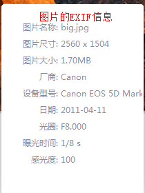
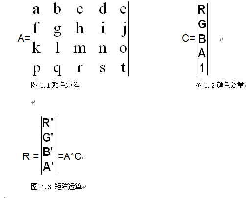

##位图
1. 由许多点组成的点阵图。构成位图的点称为像素。
2. 图像分辨率：即指单位长度（或面积）的像素数.
	> 若位图的分辨率为200*200，则表示此位图有40000个像素点

3. 色彩深度：位图所能达到的最大颜色数，称为色彩深度。（对于黑白两种颜色的图象来说一个像素点可用一个二进制位来表示，如0表示黑色、1表示白色。 若不止黑白两种颜色，则一个像素点需用多个bit位表示）
	> 位图格式有单色位图（1bit），16色位图（4bit），256色位图（8bit），24位位图（24bit），32位位图（32bit）等
	> 
	> （*.bmp,*.dib后缀的图片为位图格式）
	> 
	> 安卓中的图片是位图格式

4. 一张位图的大小 = 构成的位图的总像素点数目 * 表示一个像素点的bit位数 + 位图文件的其他信息（EXIF信息，如创建时间，使用工具，格式类型等）;单位是bit
	 

5. 位图的缺陷
	> 1. 位图放大和缩小都会引起像素的增加和减小，出现失真；出现"锯齿形"

	> 2. 位图得另一个缺点就是占用内存太大，如：长和宽分别为1024像素和768像素得24位色彩深度的图象就需要（1024×768×24÷8）=2304K个字节存储文件

##矢量图形
1. 矢量图形是通过计算机将一串线条和图形转换为一系列指令，在计算机中只存储这些指令，而不是像素。

2. 矢量图形看起来没有位图图像真实，但矢量图形的存储空间比位图图像要小得多，而且矢量图形通过拉伸、移动、放大等操作，图形不会产生实真。

##Android显示大图片导致内存溢出的原因
1. 如显示一个1.69M的jgp格式图片，分辨率是2560*1504；因为分辨率是2560*1504，所有此图片一共有3850240个像素点（385万像素）。
   又因为Android系统计算位图的时候，使用32位去表示（argb ：  8 + 8 + 8 + 8 =32），即每个像素点占4个字节，
   所以一张1.69M的图片转成位图时所占的内存大小为3850240 * 4 = 15400960 byte = 14.6875M；而一个app运行时所占的内存空间
   大概是16M左右（VM Heap）,所以14.6875M的图片在16M运行空间的app中很可能会导致内存溢出。

2. 解决方式：
	>调`public static Bitmap decodeFile(String pathName, Options opts)`通过给`Options`设置采样比例减小图片的分辨率
	
		Options opts = new Options();
		//4表示  （2560/4）*（1504/4）= 3850240/16，即原图片转成位图后的大小减小16倍
		opts.inSampleSize = 4;
		Bitmap bitmap = BitmapFactory.decodeFile("/mnt/sdcard/big.jpg", opts);

		//一般采样比例inSampleSize不会直接编写，而是取当前图片的分辨率和屏幕的分辨率的宽高比例
		
		//取屏幕宽高：
		WindowManager manager = (WindowManager) getSystemService(WINDOW_SERVICE);
        Display display = manager.getDefaultDisplay();
        int height =  display.getHeight();
        int width = display.getWidth();

		//取图片宽高，通过图片文件中的EXIF信息获取
		String imgWidth  = null;
		String imgHeight  = null;
        try {
			//获取到文件里面保存的头额外信息
			ExifInterface exif = new ExifInterface("/mnt/sdcard/big.jpg");
			imgHeight =  exif.getAttribute(ExifInterface.TAG_IMAGE_LENGTH) ; //获取到图片的高度
			imgWidth = exif.getAttribute(ExifInterface.TAG_IMAGE_WIDTH) ; //获取到图片的宽度 
		} catch (IOException e) {
			// TODO Auto-generated catch block
			e.printStackTrace();
		}
		int w =  Integer.parseInt(imgWidth) / width ;
		int h =  Integer.parseInt(imgHeight) / height ;

		//一般取宽高比例的中间值，或者取最大的那一个值
        opts.inSampleSize = Math.max(w, h) ;//取宽比例和高比例中的最大值

##操作位图图片的步骤
1. 创建一份原图的拷贝

		//a.创建一份原图的拷贝 --根据原图得到一份空白的位图拷贝
		//举个例子：八骏图，要做一付赝品， 宽高必须与之一样，否则人家一眼就看穿了。
		Bitmap copyBitmap = Bitmap.createBitmap(bitmap.getWidth(), bitmap.getHeight(), bitmap.getConfig());
2. 定义画板，指定使用的空白纸张

		//b.定义出来一个画板 、画架 ,里面摆放着原来的空白纸张，表名要在这张纸上作画了
		Canvas canvas = new Canvas(copyBitmap);
3. 定义画笔

		//c. 创建一个画笔
		Paint paint = new Paint();
4. 定义矩阵

		//d.创建矩阵  ：1：1的比例图片
		Matrix matrix = new Matrix();
		//设置图像的缩放比率，宽度是原来的20% ，高度是原来的80%
		matrix.setScale(0.2f, 0.8f);
5. 开始作画

		//e.开始作画： 参照哪一付图开始作画
		canvas.drawBitmap(bitmap, matrix, paint);
6. 显示画好的图片

		//如果以上几个步骤都已经走完了，那么代表着空白纸张上已经有图像
		iv_target.setImageBitmap(copyBitmap);

##位图的操作方式：
1. 图像的缩放

		Matrix matrix = new Matrix();
		//matrix.setScale(0.2f, 0.8f);//宽度是原图的20% ，高度是原图的80%
		matrix.setScale(2f, 2f);//宽度是原图的2倍 ，高度是原图的2倍
		canvas.drawBitmap(bitmap, matrix, paint);// bitmap是原图，目标图是new Canvas时传递的形参Bitmap

2. 图像的平移

		Matrix matrix = new Matrix();
		matrix.setTranslate(50, 50);		

3. 图像的旋转

		Matrix matrix = new Matrix();
		//以图片的中心为旋转点，旋转90度
		matrix.setRotate(90 , copyBitmap.getWidth()/2 ,copyBitmap.getHeight()/2);

4. 图像的镜面效果

		Matrix matrix = new Matrix();
		//把水平的坐标，全部变成负数，纵坐标不许要更改。
		matrix.setScale(-1, 1);
		
		// 由于横坐标都变成了负数，所以图片就跑到屏幕的左边去了，必须移动回来。
		//不过，注意：移动的时候，不能使用setXXX这种方式移动。这种setXXX它并不会在原来的图片修改基础上再执行。
		matrix.postTranslate(copyBitmap.getWidth(), 0);

5. 图像的倒影效果

		Matrix matrix = new Matrix();
		//把纵坐标，全部变成负数，横坐标不许要更改。
		matrix.setScale(1, -1);
		
		// 由于纵坐标都变成了负数，所以图片就跑到屏幕的下边去了，必须移动回来。
		//不过，注意：移动的时候，不能使用setXXX这种方式移动。这种setXXX它并不会在原来的图片修改基础上再执行。
		matrix.postTranslate(0, copyBitmap.getHeight());

##颜色矩阵
1. 概述
	>android中可以通过颜色矩阵（ColorMatrix类）方面的操作颜色，颜色矩阵是一个5x4 的矩阵（如图1.1）可以用来方面的修改图片中RGBA各分量的值，颜色矩阵以一维数组的方式存储如下：
	>
	>[ a, b, c, d, e, f, g, h, i, j, k, l, m, n, o, p, q, r, s, t ]
	>
	>通过RGBA四个通道来直接操作对应颜色，如果会使用Photoshop就会知道有时处理图片通过控制RGBA各颜色通道来做出特殊的效果。这个矩阵对颜色的作用计算方式如1.3示
	>
	>

	>矩阵的运算规则是矩阵A的一行乘以矩阵C的一列作为矩阵R的一行，
	>C矩阵是图片中包含的ARGB信息，R矩阵是用颜色矩阵应用于C之后的新的颜色分量，运算结果如下：
	
		R' = a*R + b*G + c*B + d*A + e;
		G' = f*R + g*G + h*B + i*A + j;
		B' = k*R + l*G + m*B + n*A + o;
		A' = p*R + q*G + r*B + s*A + t;

	>颜色矩阵并不是看上去那么深奥，其实需要使用的参数很少，而且很有规律第一行决定红色第二行决定绿色
	>第三行决定蓝色，第四行决定了透明度，第五列是颜色的偏移量。

2. Android中使用颜色矩阵

		//定义颜色矩阵
		ColorMatrix cm = new ColorMatrix();
		cm.set(new float[] {
		1*number, 0, 0, 0, 0, //操作红色  青红
		0, 1, 0, 0, 0, //绿色  紫绿
		0, 0, 1, 0, 0,//蓝色 黄蓝
		0, 0, 0, 1, 0 //透明度
		});

		//给画笔添加颜色矩阵
		paint.setColorFilter(new ColorMatrixColorFilter(cm));
		
		//在画板上再次作画，这次作画将会带上颜色矩阵
		canvas.drawBitmap(srcBitmap, matrix, paint);