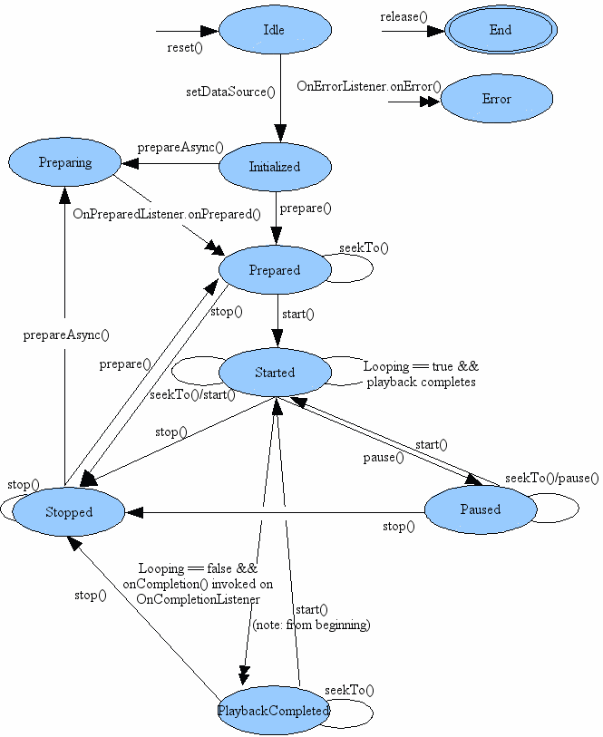

##播放音频的API
1. **MediaPlayer**
	>**MediaPlayer状态图解：**
	
	

	>**播放本地音乐：**

		public void play(View v) {
			String path = et_path.getText().toString();
			
			//1.判空操作，2，判断是否真的存在这个文件，有可能用户输入的是非法的文件路径
			
			try {
				//1，创建一个多媒体播放器
				mediaPlayer = new MediaPlayer();
				//2.设置播放资源
				mediaPlayer.setDataSource(path);
				//设置播放错误监听--一般是音频文件损坏了。。
			/*	mediaPlayer.setOnErrorListener(new OnErrorListener() {
					
					@Override
					public boolean onError(MediaPlayer mp, int what, int extra) {
						return false;
					}
				});*/
				
				//3.准备一下
				mediaPlayer.prepare();
				
				//4. 开始播放
				mediaPlayer.start();
				
				//播放完毕的监听，如果已经播放完毕，那么可以播放下一首歌，或者继续播放当前的这首歌
				mediaPlayer.setOnCompletionListener(new OnCompletionListener() {
					
					@Override
					public void onCompletion(MediaPlayer mp) {
						mediaPlayer.seekTo(0);
						mediaPlayer.start();
					}
				});
			} catch (Exception e) {
				e.printStackTrace();
			}
		}

		public void pause(View v) {
			
			if(mediaPlayer.isPlaying()){
				mediaPlayer.pause();
			}else{
				mediaPlayer.start();
			}
		}
	
		public void stop(View v) {
			
			if(mediaPlayer.isPlaying()){
				mediaPlayer.stop(); //停止音乐播放
				mediaPlayer.release();//释放资源 ---> end
			}
		}

	>**播放网络音乐：**

		public void play(View v) {
			String path = et_path.getText().toString();
			
			//1.判空操作，2，判断是否真的存在这个文件，有可能用户输入的是非法的文件路径
			
			
			try {
				//1，创建一个多媒体播放器
				mediaPlayer = new MediaPlayer();
				//2.设置播放资源
				mediaPlayer.setDataSource(path);
				//设置播放错误监听--一般是音频文件损坏了。。
			/*	mediaPlayer.setOnErrorListener(new OnErrorListener() {
					
					@Override
					public boolean onError(MediaPlayer mp, int what, int extra) {
						return false;
					}
				});*/
				
				//3.准备一下 ，这是在主线程准备的。
				//mediaPlayer.prepare();
				//开始异步缓冲，在子线程里面准备
				mediaPlayer.prepareAsync(); 
				
				//注册一个缓冲可以播放的监听器
				mediaPlayer.setOnPreparedListener(new OnPreparedListener() {
					
					@Override
					public void onPrepared(MediaPlayer mp) {
						dialog.dismiss();
						//4. 开始播放
						mediaPlayer.start();
						
						//播放完毕的监听，如果已经播放完毕，那么可以播放下一首歌，或者继续播放当前的这首歌
						mediaPlayer.setOnCompletionListener(new OnCompletionListener() {
							
							@Override
							public void onCompletion(MediaPlayer mp) {
								mediaPlayer.seekTo(0);
								mediaPlayer.start();
							}
						});
					}
				});
				
				
			} catch (Exception e) {
				e.printStackTrace();
			}
		}
	
		public void pause(View v) {
			
			if(mediaPlayer.isPlaying()){
				mediaPlayer.pause();
			}else{
				mediaPlayer.start();
			}
		}
	
		public void stop(View v) {
			
			if(mediaPlayer.isPlaying()){
				mediaPlayer.stop(); //停止音乐播放
				mediaPlayer.release();//释放资源 ---> end
			}
		}

2. **SoundPool(声音池)**

		int id ; 
		SoundPool pool ; 
	
		public void init() {
			pool = new SoundPool(
					3,  //最多能放多少道音频文件
					AudioManager.STREAM_MUSIC,  // 存储的流类型是什么类型
					0); //没有生命影响，给0
			
			//加载音频文件到池子里面。
			id = pool.load(this, R.raw.shoot, 1);
		}
		
		/**
		* @param soundID a soundID returned by the load() function
	    * @param leftVolume left volume value (range = 0.0 to 1.0)
	    * @param rightVolume right volume value (range = 0.0 to 1.0)
	    * @param priority stream priority (0 = lowest priority)
	    * @param loop loop mode (0 = no loop, -1 = loop forever)
	    * @param rate playback rate (1.0 = normal playback, range 0.5 to 2.0) 播放速率
	    * @return non-zero streamID if successful, zero if failed
	    * /
		public void shoot(View v){
			pool.play(id,
					   1,
					   1,
					   0,
					   0,
					   1.0f);
		}

3. MediaPlayer较为笨重，播放前都需要做下准备工作(prepare(),prepareAync())，所以不适合短时间内播放大量的音频文件；SoundPool则主要用来短时间内播放大量密集的音频，并且音频的时间比较短(如按键音，射击游戏的枪声)

##播放视频的API
1. **VideoView，MediaController**

		//1.找到播放视频的控件
		VideoView vv = (VideoView) findViewById(R.id.vv);
		
		//2.指定播放的视频源
		vv.setVideoPath("/mnt/sdcard/oppo.3gp");
		
		MediaController controller = new MediaController(this);
		controller.setAnchorView(vv);
		
		//设置视频的控制器  暂停、播放、快进、快退
		vv.setMediaController(controller);
		
		//3.开始播放
		vv.start();

2. **SurfaceView + MediaPlay播放视频**

	> **SurfaceView介绍**
	>
	> a. surfaceView内部使用的是双缓冲机制，可以单位时间内大量的渲染、显示不同的画面
	>
	> 线程0： 显示画面---计算数据 ---显示画面
	>
	> 线程1： 计算数据----显示画面---计算数据
	>
	> b. surfaceView是一个比较耗费内存的控件，系统不会一开始上来就渲染这个控件，而是等界面能够看到的时候才去渲染这个控件，才去显示它。
	> 
	> c. SurfaceView可见时调`public void surfaceCreated(final SurfaceHolder holder)`；SurfaceView不可见时调`public void surfaceDestroyed(SurfaceHolder holder)`;如果在SurfaceView不可见时调`holder.lockCanvas()`，则得到的canvas为null。

		sv	= (SurfaceView) findViewById(R.id.sv);
		
		//1.得到surfaceView的控制器
		SurfaceHolder holder = sv.getHolder();
		
		holder.addCallback(new Callback() {
			
			//当surfaceView销毁的时候调用
			@Override
			public void surfaceDestroyed(SurfaceHolder holder) {
				System.out.println("---surfaceDestroyed--");
			}
			
			//当surfaceView创建的时候调用
			@Override
			public void surfaceCreated(final SurfaceHolder holder) {
				//此方法在主线程调用
				System.out.println("---surfaceCreated--"+Thread.currentThread().getName());
				//获取到surfaceview的控制器
				//SurfaceHolder holder = sv.getHolder();
				
				new Thread(){//可以在子线程更新SurfaceView控件
					public void run() {
						int radius = 5; 
						for (int i = 0; i < 10; i++) {
							//由于界面没显示，所以画布是空的。
							Canvas canvas = holder.lockCanvas();
							canvas.drawColor(Color.BLACK);
							Paint paint = new Paint();
							paint.setColor(Color.RED);
							radius +=i;
							canvas.drawCircle(100, 100, radius, paint);
							//解锁画布
							holder.unlockCanvasAndPost(canvas);
							SystemClock.sleep(100);
						}
					};
				}.start();
			}
			
			//当surfaceView发生改变的时候调用
			@Override
			public void surfaceChanged(SurfaceHolder holder, int format, int width,
					int height) {
				System.out.println("---surfaceChanged--");
				
			}
		});

	>**SurfaceView + MediaPlayer播放视频**
	>
	>MediaPlayer只能播放出音频，包括视频文件中的音频；而视频中的画面MediaPlayer通过提供接口`public void setDisplay(SurfaceHolder sh)`交给了SurfaceHolder处理。

		sp = getSharedPreferences("config", 0);
		SurfaceView sv = (SurfaceView) findViewById(R.id.sv);
		
		sv.getHolder().addCallback(new Callback() {
			
			@Override
			public void surfaceDestroyed(SurfaceHolder holder) {
				if(mediaPlayer != null){
					//获取到当前的播放位置，下次播放时recovery
					int position = mediaPlayer.getCurrentPosition();
					Editor editor = sp.edit();
					editor.putInt("position", position);
					editor.commit();
					mediaPlayer.release();
					mediaPlayer = null;
				}
			}
			
			@Override
			public void surfaceCreated(SurfaceHolder holder) {
				//应该在这个地方去播放视频了。
				try {
					int position = sp.getInt("position", 0);
					mediaPlayer = new MediaPlayer();
					mediaPlayer.setDataSource("/mnt/sdcard/oppo.3gp");
					mediaPlayer.prepare();
					//指定播放的画面显示到holder里面去，实际上就是显示到surfaceView里面去
					mediaPlayer.setDisplay(holder);
					mediaPlayer.seekTo(position);//跳转到指定位置播放
					mediaPlayer.start();
				} catch (Exception e) {
					e.printStackTrace();
				}
			}
			
			@Override
			public void surfaceChanged(SurfaceHolder holder, int format, int width,
					int height) {
				
			}
		});

##Notice
1. 可以在子线程里面更新UI的控件：
	* SurfaceView 
	* ProgressBar 进度条